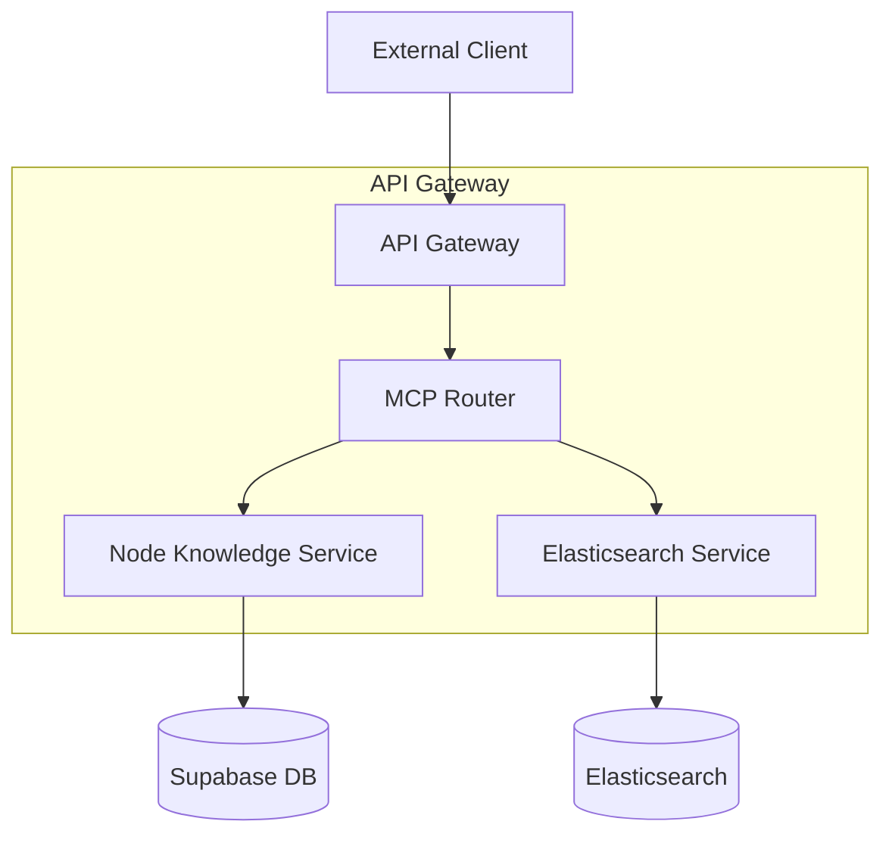

# Design Document

## Overview

The MCP Service Integration feature adds Model Context Protocol endpoints to the existing FastAPI-based API Gateway. This integration provides a standardized interface for external systems to discover and invoke available tools, specifically focusing on node knowledge retrieval and Elasticsearch search capabilities.

The design follows the existing FastAPI patterns in the codebase, utilizing structured logging, proper error handling, and dependency injection patterns already established in the workflow router.

## Architecture

### High-Level Architecture



### Component Integration

The MCP service will be integrated into the existing API Gateway structure:

1. **MCP Router** (`routers/mcp.py`) - New FastAPI router handling MCP endpoints
2. **MCP Service** (`services/mcp_service.py`) - Business logic for tool discovery and invocation
3. **Node Knowledge Client** (`clients/node_knowledge_client.py`) - Interface to existing node knowledge system
4. **Elasticsearch Client** (`clients/elasticsearch_client.py`) - Interface to Elasticsearch (future implementation)

## Components and Interfaces

### MCP Router (`routers/mcp.py`)

**Endpoints:**

- `GET /mcp/tools` - Returns available tools list
- `POST /mcp/invoke` - Invokes specified tool with parameters

**Request/Response Models:**

```python
class MCPToolSchema(BaseModel):
    name: str
    description: str
    parameters: Dict[str, Any]

class MCPToolsResponse(BaseModel):
    tools: List[MCPToolSchema]

class MCPInvokeRequest(BaseModel):
    tool_name: str
    params: Dict[str, Any]

class MCPInvokeResponse(BaseModel):
    success: bool
    result: Optional[Dict[str, Any]] = None
    error: Optional[str] = None
```

### MCP Service (`services/mcp_service.py`)

**Core Methods:**

- `get_available_tools()` - Returns tool registry
- `invoke_tool(tool_name: str, params: Dict)` - Routes tool invocation
- `validate_tool_params(tool_name: str, params: Dict)` - Parameter validation

**Tool Registry:**
The service maintains a registry of available tools with their schemas, enabling dynamic tool discovery and validation.

### Node Knowledge Client (`clients/node_knowledge_client.py`)

**Integration with Existing System:**

- Leverages the existing Supabase integration from the node-knowledge-uploader
- Reuses the vector search functionality (`match_node_knowledge` RPC)
- Maintains compatibility with existing data structures

**Methods:**

- `retrieve_node_knowledge(node_names: List[str], include_metadata: bool)` - Main retrieval method
- `_query_supabase(node_name: str)` - Internal Supabase query method

### Configuration Updates

**Environment Variables:**

```python
# MCP Service settings
MCP_ENABLED: bool = True
MCP_MAX_RESULTS_PER_TOOL: int = 100

# Node Knowledge settings
NODE_KNOWLEDGE_SUPABASE_URL: str
NODE_KNOWLEDGE_SUPABASE_KEY: str
NODE_KNOWLEDGE_DEFAULT_THRESHOLD: float = 0.3

# Elasticsearch settings (future)
ELASTICSEARCH_HOST: str = "localhost"
ELASTICSEARCH_PORT: int = 9200
```

## Data Models

### Tool Schema Definition

```python
TOOL_REGISTRY = {
    "node_knowledge_retriever": {
        "name": "node_knowledge_retriever",
        "description": "根据节点名称列表检索节点知识信息",
        "parameters": {
            "type": "object",
            "properties": {
                "node_names": {
                    "type": "array",
                    "items": {"type": "string"},
                    "description": "需要检索知识的节点名称列表"
                },
                "include_metadata": {
                    "type": "boolean",
                    "description": "是否包含节点元数据信息",
                    "default": False
                }
            },
            "required": ["node_names"]
        }
    },
    "elasticsearch": {
        "name": "elasticsearch",
        "description": "Elasticsearch搜索工具",
        "parameters": {
            "type": "object",
            "properties": {
                "index": {
                    "type": "string",
                    "description": "索引名"
                },
                "query": {
                    "type": "object",
                    "description": "查询条件"
                }
            },
            "required": ["index", "query"]
        }
    }
}
```

### Node Knowledge Response Format

```python
class NodeKnowledgeResult(BaseModel):
    node_name: str
    knowledge: str
    metadata: Dict[str, Any] = {}
    similarity_score: Optional[float] = None

class NodeKnowledgeResponse(BaseModel):
    success: bool
    results: List[NodeKnowledgeResult]
    total_nodes: int
    processing_time_ms: int
```

## Error Handling

### Error Classification

Following the pattern from the existing node-knowledge-uploader:

```python
class MCPErrorType(Enum):
    VALIDATION_ERROR = "VALIDATION_ERROR"
    TOOL_NOT_FOUND = "TOOL_NOT_FOUND"
    PARAMETER_ERROR = "PARAMETER_ERROR"
    SERVICE_ERROR = "SERVICE_ERROR"
    DATABASE_ERROR = "DATABASE_ERROR"
    INTERNAL_ERROR = "INTERNAL_ERROR"

class MCPError(Exception):
    def __init__(self, error_type: MCPErrorType, message: str, user_message: str):
        self.error_type = error_type
        self.message = message
        self.user_message = user_message
        super().__init__(message)
```

### Error Response Format

```python
class MCPErrorResponse(BaseModel):
    success: bool = False
    error: str
    error_type: str
    details: Optional[Dict[str, Any]] = None
```

### HTTP Status Code Mapping

- `400 Bad Request` - Validation errors, missing parameters, unknown tools
- `404 Not Found` - Tool not found
- `500 Internal Server Error` - Service errors, database errors
- `503 Service Unavailable` - External service unavailable (Supabase, Elasticsearch)

## Testing Strategy

### Unit Tests

1. **Router Tests** (`tests/test_mcp_router.py`)

   - Test tool discovery endpoint
   - Test tool invocation endpoint
   - Test error handling and validation

2. **Service Tests** (`tests/test_mcp_service.py`)

   - Test tool registry functionality
   - Test parameter validation
   - Test tool invocation routing

3. **Client Tests** (`tests/test_node_knowledge_client.py`)
   - Test Supabase integration
   - Test data transformation
   - Test error handling

### Integration Tests

1. **End-to-End Tests** (`tests/test_mcp_integration.py`)
   - Test complete tool discovery and invocation flow
   - Test with real Supabase connection (test database)
   - Test error scenarios

### Mock Strategy

- Mock Supabase client for unit tests
- Mock Elasticsearch client for unit tests
- Use test database for integration tests
- Mock external API calls in CI/CD environment

## Security Considerations

### Input Validation

- Strict parameter validation using Pydantic models
- SQL injection prevention through parameterized queries
- Input sanitization for search queries

### Rate Limiting

- Implement rate limiting on MCP endpoints
- Use existing FastAPI middleware patterns
- Configure reasonable limits for tool invocation

### Authentication & Authorization

- Leverage existing API Gateway authentication if present
- Consider API key authentication for MCP endpoints
- Implement proper CORS configuration

## Performance Considerations

### Caching Strategy

- Cache tool registry in memory
- Cache frequent node knowledge queries
- Implement TTL-based cache invalidation

### Connection Pooling

- Reuse existing Supabase client connection pooling
- Implement connection pooling for Elasticsearch
- Monitor connection usage and performance

### Monitoring

- Add structured logging for all MCP operations
- Track tool invocation metrics
- Monitor response times and error rates
- Integrate with existing logging infrastructure
