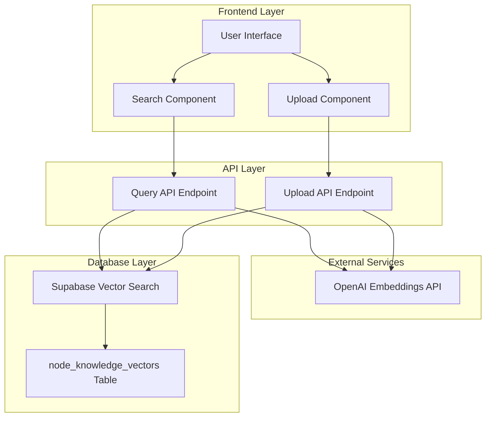

# Design Document

## Overview

The RAG Query Feature extends the existing node-knowledge-uploader application by adding semantic search capabilities. Users can input natural language queries to retrieve relevant node knowledge using vector similarity search. The design leverages the existing OpenAI embeddings infrastructure and pgvector database setup, creating a unified knowledge management system.

The feature integrates seamlessly with the current upload functionality, transforming the application from a write-only tool into a comprehensive knowledge base with both contribution and consumption capabilities.

## Architecture

### High-Level Architecture



### Component Architecture

The design follows the existing Next.js App Router pattern with these key components:

1. **Search Interface Component**: New React component for query input and results display
2. **Query API Route**: New API endpoint `/api/query` for handling search requests
3. **Database Integration**: Utilizes existing Supabase client and pgvector functions
4. **Shared Utilities**: Reuses existing OpenAI embedding generation logic

## Components and Interfaces

### Frontend Components

#### SearchInterface Component

```typescript
interface SearchInterfaceProps {
  initialQuery?: string;
}

interface SearchResult {
  id: string;
  node_type: string;
  node_subtype: string | null;
  title: string;
  description: string;
  content: string;
  similarity: number;
  metadata: Record<string, any>;
}

interface SearchState {
  query: string;
  results: SearchResult[];
  loading: boolean;
  error: string | null;
  recentQueries: string[];
  expandedResults: Set<string>;
}
```

#### TabNavigation Component

```typescript
interface TabNavigationProps {
  activeTab: "upload" | "search";
  onTabChange: (tab: "upload" | "search") => void;
  searchResultsCount?: number;
  databaseCount?: number;
}
```

### API Interfaces

#### Query API Endpoint (`/api/query`)

```typescript
// Request
interface QueryRequest {
  query: string;
  limit?: number;
  threshold?: number;
  nodeTypeFilter?: string;
}

// Response
interface QueryResponse {
  success: boolean;
  results: SearchResult[];
  query: string;
  processingTime: number;
  totalCount: number;
  error?: string;
}
```

### Database Integration

The design leverages the existing `match_node_knowledge` function in the database:

```sql
SELECT * FROM match_node_knowledge(
  query_embedding := $1,
  match_threshold := $2,
  match_count := $3,
  node_type_filter := $4
);
```

## Data Models

### Search Result Model

```typescript
interface SearchResult {
  id: string;
  node_type: string;
  node_subtype: string | null;
  title: string;
  description: string;
  content: string;
  similarity: number; // 0-1 score from vector similarity
  metadata: {
    capabilities?: string[];
    examples?: string[];
    [key: string]: any;
  };
}
```

### Query History Model

```typescript
interface QueryHistory {
  queries: Array<{
    query: string;
    timestamp: number;
    resultCount: number;
  }>;
}
```

## Error Handling

### API Error Handling

- **Invalid Query**: Return 400 with descriptive error message
- **OpenAI API Failures**: Return 503 with retry suggestion
- **Database Connection Issues**: Return 500 with generic error message
- **Rate Limiting**: Implement exponential backoff for OpenAI requests

### Frontend Error Handling

- **Network Errors**: Display retry button with error message
- **Empty Results**: Show helpful suggestions for query refinement
- **Loading States**: Provide clear feedback during processing
- **Validation Errors**: Real-time input validation with helpful hints

### Error Recovery Strategies

```typescript
interface ErrorRecovery {
  retryableErrors: string[]; // OpenAI rate limits, network timeouts
  fallbackBehavior: "showCached" | "showSuggestions" | "showError";
  maxRetries: number;
  retryDelay: number;
}
```

## Testing Strategy

### Unit Tests

- **Query Processing Logic**: Test embedding generation and similarity calculations
- **Component Rendering**: Test search interface states and user interactions
- **API Endpoint Logic**: Test request/response handling and error scenarios
- **Utility Functions**: Test query validation and result formatting

### Integration Tests

- **End-to-End Search Flow**: Test complete query-to-results pipeline
- **Database Integration**: Test vector search functionality with real data
- **OpenAI Integration**: Test embedding generation with mock responses
- **Error Scenarios**: Test handling of various failure modes

### Performance Tests

- **Query Response Time**: Ensure sub-2-second response times for typical queries
- **Concurrent Requests**: Test handling of multiple simultaneous searches
- **Large Result Sets**: Test performance with extensive knowledge base
- **Memory Usage**: Monitor client-side memory consumption during extended use

### Test Data Strategy

```typescript
interface TestDataSet {
  sampleQueries: string[];
  expectedResults: SearchResult[];
  edgeCases: {
    emptyQuery: string;
    veryLongQuery: string;
    specialCharacters: string;
    nonEnglishQuery: string;
  };
}
```

## User Experience Design

### Interface Layout

- **Tabbed Interface**: Clean separation between Upload and Search functionality
- **Search-First Design**: Prominent search bar with auto-focus
- **Progressive Disclosure**: Expandable results with summary-to-detail flow
- **Visual Hierarchy**: Clear distinction between result types and similarity scores

### Interaction Patterns

- **Real-time Feedback**: Loading states and progress indicators
- **Query Suggestions**: Recent queries and example searches
- **Keyboard Navigation**: Support for arrow keys and enter to search
- **Mobile Responsive**: Touch-friendly interface for mobile devices

### Performance Considerations

- **Debounced Input**: Prevent excessive API calls during typing
- **Result Caching**: Cache recent queries in browser storage
- **Lazy Loading**: Load detailed content only when expanded
- **Optimistic Updates**: Show loading states immediately on user action

## Security Considerations

### Input Validation

- **Query Sanitization**: Prevent injection attacks in search queries
- **Rate Limiting**: Implement per-user query limits to prevent abuse
- **Input Length Limits**: Restrict query length to reasonable bounds

### API Security

- **Authentication**: Leverage existing Supabase RLS policies
- **CORS Configuration**: Restrict API access to authorized domains
- **Error Message Sanitization**: Avoid exposing sensitive system information

### Data Privacy

- **Query Logging**: Implement privacy-conscious logging practices
- **User Data**: Ensure search history remains client-side only
- **Embedding Security**: Protect OpenAI API keys and usage patterns

## Implementation Phases

### Phase 1: Core Search Functionality

- Implement basic query API endpoint
- Create search interface component
- Add vector similarity search logic
- Basic error handling and loading states

### Phase 2: Enhanced User Experience

- Add query history and suggestions
- Implement result expansion and highlighting
- Add tabbed navigation between upload/search
- Mobile responsive design improvements

### Phase 3: Advanced Features

- Add filtering by node type
- Implement query refinement suggestions
- Add search analytics and usage tracking
- Performance optimizations and caching

### Phase 4: Integration and Polish

- Seamless integration with upload workflow
- Advanced error recovery mechanisms
- Comprehensive testing and documentation
- Production deployment and monitoring
