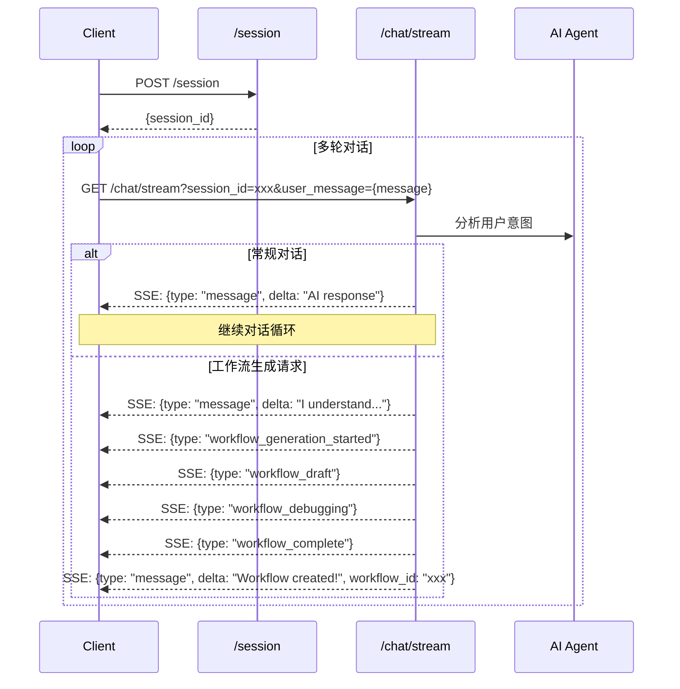

# Workflow Generation API Documentation

## 基础信息

- **Base URL**: `https://api.example.com/v1/api`
- **认证方式**: Cookie认证
- **Content-Type**: `application/json`（除SSE接口外）

## API 接口

### 0. 集成查询（Slack / Notion）

#### GET /api/v1/app/integrations/slack/channels
- **作用**：列出当前授权 Slack 工作区可用的频道（支持分页）
- **Query 参数**：
  - `types`（可选，默认 `public_channel,private_channel`）
  - `limit`（可选，1–1000）
  - `cursor`（可选，Slack 分页游标）
- **返回**：`
  {
    "success": true,
    "channels": [ { "id": "C123", "name": "general", ... } ],
    "next_cursor": "..."
  }
`

#### GET /api/v1/app/integrations/slack/users
- **作用**：列出 Slack 成员信息，用于 @user / 邀请配置
- **Query 参数**：`limit`（1–200）、`cursor`
- **返回**：`
  {
    "success": true,
    "users": [ { "id": "U123", "name": "alice", ... } ],
    "next_cursor": "..."
  }
`

#### GET /api/v1/app/integrations/notion/databases
- **作用**：列出当前授权 Notion 集成可访问的数据库
- **Query 参数**：
  - `query`（可选，模糊搜索）
  - `page_size`（1–100）
  - `cursor`（Notion start_cursor）
  - `sort_property`、`sort_direction`（可选，排序）
- **返回**：`
  {
    "success": true,
    "databases": [ { "id": "db1", "title": "Tasks", ... } ],
    "next_cursor": "...",
    "has_more": false
  }
`

#### GET /api/v1/app/integrations/notion/databases/{database_id}
- **作用**：获取单个数据库 schema（属性列表、描述等）
- **路径参数**：`database_id`
- **返回**：`
  {
    "success": true,
    "database": { "id": "...", "properties": [ ... ] }
  }
`

#### GET /api/v1/app/integrations/notion/users
- **作用**：列出 Notion 工作区用户，辅助 People 属性填写
- **Query 参数**：`page_size`（1–100）、`cursor`
- **返回**：`
  {
    "success": true,
    "users": [ { "id": "...", "name": "..." } ],
    "next_cursor": "..."
  }
`

### 1. POST /session
创建新会话

**请求**
action:
- `create` 从头创建新的 workflow
- `edit` 编辑自己的某个 workflow
- `copy` copy from a public / template workflow

```json
{
  "action": "",
  "workflow_id": ""
}
```

**响应**
```json
{
  "session_id": "550e8400-e29b-41d4-a716-446655440000",
  "created_at": "2024-01-20T10:30:00Z",
}
```

### 2. GET /chat/stream?session_id=xxxx&user_message=yyy
发送聊天消息，返回AI流式响应（包含集成的工作流生成）

**响应（SSE流）**
使用业界标准增量模式 (OpenAI/Claude风格):

**常规聊天响应**
```
Content-Type: text/event-stream

data: {"type": "message", "delta": "1. 我将为你监控"}
data: {"type": "message", "delta": " BestBuy, Amazon"}
data: {"type": "message", "delta": " 的实时货源"}
```

**工作流生成响应**（当消息包含workflow相关关键词时）
```
Content-Type: text/event-stream

data: {"type": "message", "delta": "I understand you want to create a workflow..."}

data: {"type": "workflow_generation_started", "workflow_id": "wf_abc123", "data": {"message": "Starting workflow generation...", "session_id": "xxx"}, "timestamp": "1703001234567"}

data: {"type": "workflow_draft", "workflow_id": "wf_abc123", "data": {"message": "Generating workflow draft...", "session_id": "xxx"}, "timestamp": "1703001235567"}

data: {"type": "workflow_debugging", "workflow_id": "wf_abc123", "data": {"message": "Debugging and optimizing workflow...", "session_id": "xxx"}, "timestamp": "1703001236567"}

data: {"type": "workflow_complete", "workflow_id": "wf_abc123", "data": {"message": "Workflow generation completed!", "session_id": "xxx"}, "timestamp": "1703001237567"}

data: {"type": "message", "delta": "Your workflow has been successfully created!", "workflow_id": "wf_abc123"}
```

**事件类型**
- `type: "message"` - AI回复消息或工作流相关文本
  - `delta`: 增量内容，前端需要累积拼接
  - `workflow_id`: (可选) 关联的工作流ID
- `type: "workflow_generation_started"` - 开始生成工作流
- `type: "workflow_draft"` - 生成工作流草稿
- `type: "workflow_debugging"` - 调试优化工作流
- `type: "workflow_complete"` - 工作流生成完成

### 3. GET /chat/{session_id}/messages
获取会话的聊天历史

**响应**
```json
{
  "session_id": "550e8400-e29b-41d4-a716-446655440000",
  "messages": [
    {
      "id": "msg_123",
      "message_type": "user",
      "content": "Create a workflow for email monitoring",
      "sequence_number": 1,
      "created_at": "2024-01-20T10:30:00Z"
    },
    {
      "id": "msg_124",
      "message_type": "assistant",
      "content": "I'll help you create an email monitoring workflow...",
      "sequence_number": 2,
      "created_at": "2024-01-20T10:30:05Z"
    }
  ],
  "total_count": 2
}
```

## 错误响应

所有API错误响应格式：
```json
{
  "error": "error_type",
  "message": "错误描述"
}
```

**HTTP状态码**
- 400 - 请求参数错误
- 401 - 未认证（Cookie无效）
- 404 - 资源不存在
- 500 - 服务器错误

## 交互流程



## 工作流生成触发条件

以下关键词会触发工作流生成流程：
- `workflow`
- `automation`
- `create`
- `generate`
- `build`

当用户消息包含这些关键词时，系统会自动进入工作流生成模式，在聊天流中返回相应的进度事件。

## 前端集成建议

1. **监听事件类型**: 根据 `type` 字段处理不同类型的事件
2. **累积消息内容**: 对于 `type: "message"` 事件，累积 `delta` 字段构建完整消息
3. **进度显示**: 对于工作流相关事件，显示相应的进度指示器
4. **工作流ID**: 保存 `workflow_id` 用于后续操作
