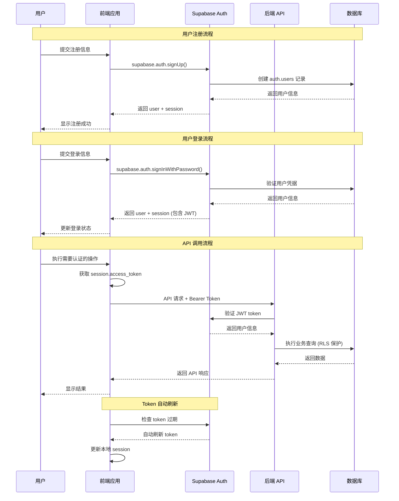

```mermaid
sequenceDiagram
    participant User as 用户
    participant Frontend as 前端应用
    participant Supabase as Supabase Auth
    participant Backend as 后端 API
    participant DB as 数据库
    
    Note over User, DB: 用户注册流程
    User->>Frontend: 提交注册信息
    Frontend->>Supabase: supabase.auth.signUp()
    Supabase->>DB: 创建 auth.users 记录
    DB-->>Supabase: 返回用户信息
    Supabase-->>Frontend: 返回 user + session
    Frontend-->>User: 显示注册成功
    
    Note over User, DB: 用户登录流程
    User->>Frontend: 提交登录信息
    Frontend->>Supabase: supabase.auth.signInWithPassword()
    Supabase->>DB: 验证用户凭据
    DB-->>Supabase: 返回用户信息
    Supabase-->>Frontend: 返回 user + session (包含 JWT)
    Frontend-->>User: 更新登录状态
    
    Note over User, DB: API 调用流程
    User->>Frontend: 执行需要认证的操作
    Frontend->>Frontend: 获取 session.access_token
    Frontend->>Backend: API 请求 + Bearer Token
    Backend->>Supabase: 验证 JWT token
    Supabase-->>Backend: 返回用户信息
    Backend->>DB: 执行业务查询 (RLS 保护)
    DB-->>Backend: 返回数据
    Backend-->>Frontend: 返回 API 响应
    Frontend-->>User: 显示结果
    
    Note over Frontend, Supabase: Token 自动刷新
    Frontend->>Supabase: 检查 token 过期
    Supabase-->>Frontend: 自动刷新 token
    Frontend->>Frontend: 更新本地 session
```