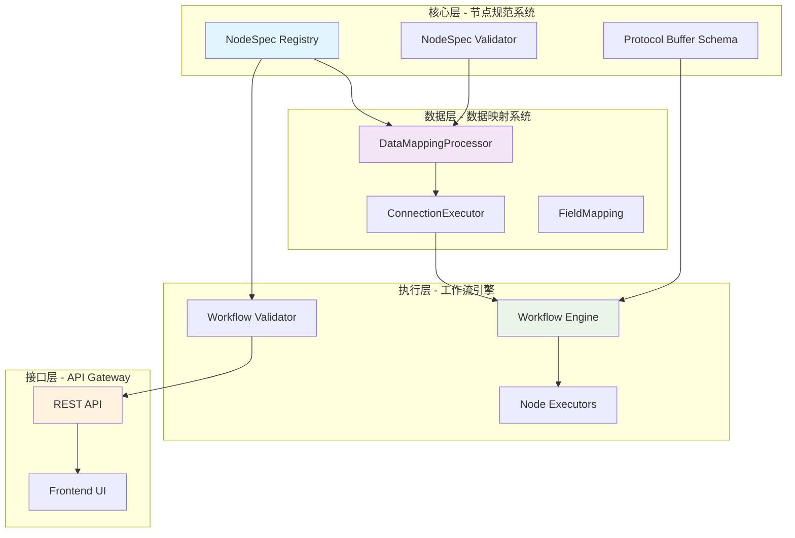

# 节点规范与数据映射系统实施计划

## 📋 概述

本文档整合了原有的三个独立设计文档，提供统一的实施计划：
- **节点规范系统** (`node_spec.md`) - 核心架构，定义节点类型、参数、端口规范
- **数据映射系统** (`data_mapping_system.md`) - 基于节点规范的数据转换层
- ~~**端口定义计划** (`NODE_PORT_DEFINITION_PLAN.md`)~~ - 已整合到节点规范系统

## 🚨 4天紧急实施模式

**总时间**: 4天 (96小时)
**实施模式**: 紧急开发，优先核心功能，最小可行产品(MVP)
**团队**: 需要2-3名全职开发者并行工作

## 🏗️ 统一架构设计

### 系统层次结构



### 核心依赖关系

1. **节点规范系统** 是基础层，定义：
   - 节点类型和子类型的规范结构
   - 输入输出端口的类型和验证规则
   - 参数定义和验证逻辑
   - 数据格式要求

2. **数据映射系统** 依赖节点规范：
   - 使用端口规范验证连接兼容性
   - 基于数据格式进行转换验证
   - 引用节点规范进行数据校验

3. **工作流引擎** 整合两个系统：
   - 使用节点规范验证节点配置
   - 使用数据映射处理节点间数据流转
   - 执行统一的工作流验证

## 📅 4天详细实施计划

### Day 1 (第1天) - 基础架构 [24小时]

#### 上午 (0-4小时): Protocol Buffer更新
**负责人**: Backend Developer 1
- [ ] **0-1h**: 更新 `workflow.proto` 添加端口定义消息
- [ ] **1-2h**: 添加数据映射相关消息定义
- [ ] **2-3h**: 重新生成Python protobuf文件
- [ ] **3-4h**: 验证生成文件，修复编译错误

**Protocol Buffer Schema**:
```protobuf
// 端口定义
message InputPort {
  string name = 1;
  string type = 2;           // ConnectionType
  bool required = 3;
  string description = 4;
  int32 max_connections = 5;
  string validation_schema = 6; // JSON Schema
}

message OutputPort {
  string name = 1;
  string type = 2;
  string description = 3;
  int32 max_connections = 4;
  string validation_schema = 5;
}

// 增强的节点定义
message Node {
  string id = 1;
  string name = 2;
  NodeType type = 3;
  NodeSubtype subtype = 4;
  // ... 其他现有字段 ...

  // 新增：端口定义（基于NodeSpec自动生成）
  repeated InputPort input_ports = 14;
  repeated OutputPort output_ports = 15;
}

// 增强的连接定义
message Connection {
  string node = 1;
  ConnectionType type = 2;
  int32 index = 3;              // 向后兼容
  string source_port = 4;       // 基于NodeSpec验证
  string target_port = 5;       // 基于NodeSpec验证
  DataMapping data_mapping = 6; // 数据映射规则
}

// 数据映射系统
message DataMapping {
  MappingType type = 1;
  repeated FieldMapping field_mappings = 2;
  string transform_script = 3;
  map<string, string> static_values = 4;
  string description = 5;
}

enum MappingType {
  DIRECT = 0;
  FIELD_MAPPING = 1;
  TEMPLATE = 2;
  TRANSFORM = 3;
}

message FieldMapping {
  string source_field = 1;
  string target_field = 2;
  FieldTransform transform = 3;
  bool required = 4;
  string default_value = 5;
}

message FieldTransform {
  TransformType type = 1;
  string transform_value = 2;
  map<string, string> options = 3;
}

enum TransformType {
  NONE = 0;
  STRING_FORMAT = 1;
  JSON_PATH = 2;
  REGEX = 3;
  FUNCTION = 4;
  CONDITION = 5;
}
```

#### 上午-下午 (4-12小时): 节点规范核心系统
**负责人**: Backend Developer 2
- [ ] **4-6h**: 创建 `shared/node_specs/base.py` 基础数据结构
- [ ] **6-8h**: 实现 `shared/node_specs/registry.py` 注册器核心功能
- [ ] **8-10h**: 实现 `shared/node_specs/validator.py` 基础验证
- [ ] **10-12h**: 创建基础单元测试

**目录结构**:
```
shared/node_specs/
├── __init__.py
├── base.py                 # 核心数据结构
├── registry.py             # 节点规范注册器
├── validator.py            # 统一验证器
└── definitions/
    ├── __init__.py
    ├── trigger_nodes.py    # 触发器节点规范
    ├── ai_agent_nodes.py   # AI代理节点规范
    ├── action_nodes.py     # 动作节点规范
    ├── flow_nodes.py       # 流程控制节点规范
    ├── tool_nodes.py       # 工具节点规范
    ├── memory_nodes.py     # 记忆节点规范
    └── human_loop_nodes.py # 人机交互节点规范
```

#### 下午-晚上 (12-20小时): 数据映射核心
**负责人**: Backend Developer 1 (并行)
- [ ] **12-14h**: 创建 `DataMappingProcessor` 基础框架
- [ ] **14-16h**: 实现 DIRECT 和 FIELD_MAPPING 类型
- [ ] **16-18h**: 实现 JSONPath 字段提取
- [ ] **18-20h**: 集成节点规范验证

**数据映射目录结构**:
```
workflow_engine/data_mapping/
├── __init__.py
├── processor.py            # 数据映射处理器
├── executors.py            # 连接执行器
├── validators.py           # 映射验证器
└── engines/
    ├── template_engine.py  # 模板引擎
    ├── script_engine.py    # 脚本引擎
    └── function_registry.py # 函数注册器
```

#### 晚上 (20-24小时): 测试和集成
**负责人**: 两人协作
- [ ] **20-22h**: 集成测试节点规范和数据映射
- [ ] **22-24h**: 修复集成问题，准备第二天工作

### Day 2 (第2天) - 核心节点规范定义 [24小时]

#### 上午 (24-32小时): 高优先级节点规范
**负责人**: Backend Developer 2
- [ ] **24-26h**: 定义 `AI_AGENT_NODE` 所有子类型规范
- [ ] **26-28h**: 定义 `TRIGGER_NODE` 所有子类型规范
- [ ] **28-30h**: 定义 `FLOW_NODE` 基础子类型规范
- [ ] **30-32h**: 注册所有定义的规范到注册器

**节点规范示例**:
```python
# 示例：AI路由代理规范
ROUTER_AGENT_SPEC = NodeSpec(
    node_type="AI_AGENT_NODE",
    subtype="ROUTER_AGENT",
    description="智能路由代理，根据输入决定下一步操作",
    parameters=[
        ParameterDef(
            name="prompt",
            type=ParameterType.STRING,
            required=True,
            description="路由决策的系统提示词"
        ),
        ParameterDef(
            name="routing_options",
            type=ParameterType.JSON,
            required=True,
            description="可选的路由选项配置"
        )
    ],
    input_ports=[
        InputPortSpec(
            name="main",
            type="MAIN",
            required=True,
            description="待路由的输入数据",
            validation_schema='{"type": "object", "properties": {"user_message": {"type": "string"}}, "required": ["user_message"]}'
        ),
        InputPortSpec(
            name="language_model",
            type="AI_LANGUAGE_MODEL",
            required=True,
            description="语言模型连接"
        )
    ],
    output_ports=[
        OutputPortSpec(
            name="main",
            type="MAIN",
            description="路由决策结果",
            validation_schema='{"type": "object", "properties": {"route": {"type": "string"}, "confidence": {"type": "number"}}, "required": ["route", "confidence"]}'
        ),
        OutputPortSpec(
            name="error",
            type="MAIN",
            description="路由失败时的错误信息"
        )
    ]
)
```

#### 上午-下午 (32-40小时): 数据映射高级功能
**负责人**: Backend Developer 1
- [ ] **32-34h**: 实现 TEMPLATE 转换类型
- [ ] **34-36h**: 实现基础的 TRANSFORM 脚本执行
- [ ] **36-38h**: 实现静态值注入功能
- [ ] **38-40h**: 添加错误处理和日志记录

#### 下午-晚上 (40-46小时): 工作流引擎集成
**负责人**: Backend Developer 2
- [ ] **40-42h**: 更新 `BaseNodeExecutor` 集成节点规范
- [ ] **42-44h**: 更新 2-3个核心节点执行器作为示例
- [ ] **44-46h**: 更新 `WorkflowValidator` 支持新验证

**BaseNodeExecutor增强**:
```python
class BaseNodeExecutor(ABC):
    def __init__(self):
        self.logger = logging.getLogger(self.__class__.__name__)
        self.spec = self._get_node_spec()
        self.data_mapper = DataMappingProcessor()

    def _get_node_spec(self) -> Optional[NodeSpec]:
        """获取此执行器的规范"""
        return None

    def validate(self, node: Any) -> List[str]:
        """根据规范验证节点"""
        if self.spec:
            return node_spec_registry.validate_node(node)
        return []

    def get_input_port_specs(self) -> List[InputPortSpec]:
        """获取输入端口规范"""
        return self.spec.input_ports if self.spec else []

    def get_output_port_specs(self) -> List[OutputPortSpec]:
        """获取输出端口规范"""
        return self.spec.output_ports if self.spec else []

    def validate_input_data(self, port_name: str, data: Dict[str, Any]) -> List[str]:
        """验证输入端口数据"""
        if not self.spec:
            return []

        port_spec = None
        for port in self.spec.input_ports:
            if port.name == port_name:
                port_spec = port
                break

        if not port_spec:
            return [f"未知输入端口: {port_name}"]

        return NodeSpecValidator.validate_port_data(port_spec, data)
```

#### 晚上 (46-48小时): ConnectionExecutor实现
**负责人**: Backend Developer 1
- [ ] **46-48h**: 实现新的 `ConnectionExecutor` 支持数据映射

### Day 3 (第3天) - API和验证完善 [24小时]

#### 上午 (48-56小时): API端点开发
**负责人**: Backend Developer 1
- [ ] **48-50h**: 实现节点规范查询API
- [ ] **50-52h**: 实现工作流验证API
- [ ] **52-54h**: 实现连接验证API
- [ ] **54-56h**: 实现数据映射测试API

**API端点增强**:
```python
# 节点规范相关API
@router.get("/node-types")
async def get_node_types():
    """获取所有节点类型和子类型"""
    # 从节点规范注册器获取

@router.get("/node-types/{node_type}/{subtype}/spec")
async def get_node_spec(node_type: str, subtype: str):
    """获取特定节点的详细规范"""
    # 返回完整的参数、端口、验证规则

@router.post("/workflows/{workflow_id}/validate")
async def validate_workflow(workflow_id: str, workflow_data: dict):
    """验证工作流配置"""
    # 使用统一的工作流验证器

@router.post("/connections/validate")
async def validate_connection(connection_config: dict):
    """验证端口连接兼容性"""
    # 验证两个节点的端口是否可以连接

@router.post("/data-mapping/test")
async def test_data_mapping(mapping_config: dict, sample_data: dict):
    """测试数据映射转换"""
    # 允许前端测试数据映射规则
```

#### 上午-下午 (56-64小时): 剩余节点规范
**负责人**: Backend Developer 2
- [ ] **56-58h**: 定义 `ACTION_NODE` 基础子类型
- [ ] **58-60h**: 定义 `TOOL_NODE` 基础子类型
- [ ] **60-62h**: 定义 `MEMORY_NODE` 基础子类型
- [ ] **62-64h**: 注册并测试所有节点规范

#### 下午-晚上 (64-70小时): 向后兼容性
**负责人**: 两人协作
- [ ] **64-66h**: 实现index-based连接的兼容性支持
- [ ] **66-68h**: 创建简单的迁移工具
- [ ] **68-70h**: 测试现有工作流的兼容性

#### 晚上 (70-72小时): 性能优化
**负责人**: Backend Developer 1
- [ ] **70-72h**: 添加缓存机制，优化关键路径性能

### Day 4 (第4天) - 测试、调试、部署 [24小时]

#### 上午 (72-80小时): 全面测试
**负责人**: 两人协作
- [ ] **72-74h**: 端到端集成测试
- [ ] **74-76h**: 性能测试和瓶颈识别
- [ ] **76-78h**: 边界情况和错误处理测试
- [ ] **78-80h**: API功能完整性测试

#### 上午-下午 (80-88小时): 问题修复
**负责人**: 根据测试结果分工
- [ ] **80-84h**: 修复发现的关键问题
- [ ] **84-88h**: 再次回归测试确保稳定性

#### 下午-晚上 (88-96小时): 部署准备
**负责人**: 两人协作
- [ ] **88-90h**: 准备部署脚本和数据库迁移
- [ ] **90-92h**: 在测试环境完整部署测试
- [ ] **92-94h**: 准备生产环境部署
- [ ] **94-96h**: 文档更新和交接准备

## 🎯 MVP功能范围

### 必须实现 (P0)
- [ ] 基础节点规范系统 (注册器、验证器)
- [ ] 5个核心节点类型的规范定义 (AI_AGENT, TRIGGER, FLOW, ACTION, TOOL)
- [ ] 数据映射的 DIRECT 和 FIELD_MAPPING 类型
- [ ] 基本的端口连接验证
- [ ] 核心API端点 (规范查询、工作流验证)
- [ ] 向后兼容性支持

### 应该实现 (P1)
- [ ] TEMPLATE 和 TRANSFORM 数据映射类型
- [ ] 完整的节点规范覆盖
- [ ] 性能优化和缓存
- [ ] 详细的错误信息和调试功能

### 可以推迟 (P2)
- [ ] 高级数据映射功能 (复杂转换函数)
- [ ] 可视化编辑器支持API
- [ ] 完整的迁移工具
- [ ] 详细的监控和指标

## ⚠️ 风险管理

### 高风险项目
1. **Protocol Buffer兼容性** - 可能破坏现有系统
   - **缓解**: 先在feature branch测试，确保向后兼容
2. **性能影响** - 新的验证逻辑可能影响性能
   - **缓解**: 实现基础缓存，性能测试验证
3. **集成复杂性** - 多个系统同时修改
   - **缓解**: 小步骤迭代，频繁集成测试

### 应急预案
- **Day 1结束**: 如果基础架构有问题，Day 2上午专门修复
- **Day 2结束**: 如果节点规范不完整，专注核心5个类型
- **Day 3结束**: 如果API有问题，简化功能确保基本可用
- **Day 4**: 如果有严重问题，准备回滚方案

## 🔧 开发环境设置

### 必需工具
- [ ] Protocol Buffer 编译器
- [ ] Python 3.8+ 环境
- [ ] Redis (用于缓存测试)
- [ ] PostgreSQL (用于集成测试)

### 代码分支策略
```bash
# 主开发分支
git checkout -b feature/unified-node-specs

# 各子功能分支 (可并行开发)
git checkout -b feature/protobuf-updates
git checkout -b feature/node-specs-core
git checkout -b feature/data-mapping-core
git checkout -b feature/api-endpoints
```

### 每日同步
- **每天9:00**: 站会，确认进度和依赖
- **每天18:00**: 代码合并和集成测试
- **每天22:00**: 问题回顾和第二天计划调整

## 📊 成功标准

### Day 1 完成标准
- [ ] Protocol Buffer文件编译成功
- [ ] 节点规范注册器可以注册和查询规范
- [ ] 数据映射处理器可以处理DIRECT类型
- [ ] 基础单元测试通过

### Day 2 完成标准
- [ ] 至少5个核心节点类型有完整规范定义
- [ ] 数据映射支持FIELD_MAPPING和TEMPLATE
- [ ] BaseNodeExecutor成功集成节点规范
- [ ] 至少1个现有节点执行器完成升级

### Day 3 完成标准
- [ ] 核心API端点可以正常工作
- [ ] 工作流验证包含新的端口和数据映射检查
- [ ] 现有工作流保持兼容性
- [ ] 性能满足基本要求 (少于500ms验证时间)

### Day 4 完成标准
- [ ] 所有核心功能端到端测试通过
- [ ] 在测试环境成功部署
- [ ] 准备好生产部署脚本
- [ ] 基础文档和交接材料完成

## 🔄 向后兼容性策略

### 兼容性保证
1. **现有工作流**: 继续使用 index-based 连接方式
2. **API接口**: 保持现有API的响应格式
3. **节点执行器**: 逐步迁移，支持两种模式并存

### 迁移路径
1. **Phase 1**: 部署新系统，默认关闭新功能
2. **Phase 2**: 为新创建的工作流启用端口和数据映射
3. **Phase 3**: 提供迁移工具将旧工作流转换为新格式
4. **Phase 4**: 逐步弃用旧的连接方式

### 迁移工具
```python
class WorkflowMigrationTool:
    def migrate_workflow_to_port_based(self, old_workflow: dict) -> dict:
        """将基于索引的连接迁移为基于端口的连接"""
        # 自动推断端口名称并生成数据映射配置
        pass

    def generate_node_ports_from_spec(self, node: dict) -> dict:
        """基于节点规范为现有节点生成端口定义"""
        # 查询节点规范并生成相应的端口配置
        pass
```

## 👥 团队协作

### 代码审查
- **即时审查**: 关键代码实时配对编程
- **每日审查**: 晚上18:00统一代码审查
- **快速决策**: 设计问题30分钟内必须决定

### 沟通机制
- **紧急问题**: 立即语音/视频沟通
- **进度更新**: 每4小时在群里更新进度
- **技术决策**: 记录在shared文档，所有人可见

## 📈 最终成功指标

### 技术指标
- [ ] 100% 覆盖所有现有节点类型的规范定义
- [ ] 少于100ms 节点规范查询性能
- [ ] 少于500ms 数据映射处理性能
- [ ] 大于95% 向后兼容性测试通过率

### 用户体验指标
- [ ] 节点配置错误减少80%+
- [ ] 工作流创建时间减少50%+
- [ ] 前端自动生成表单覆盖100%节点类型
- [ ] 开发者上手时间减少60%+

### 业务指标
- [ ] 工作流执行成功率提升10%+
- [ ] 支持更复杂的业务场景配置
- [ ] 减少客户因配置错误导致的支持请求

## 🎯 总结

这个4天紧急实施计划将三个原本独立的系统整合为一个协调工作的整体：

1. **节点规范系统** 作为基础架构，提供类型安全和验证能力
2. **数据映射系统** 基于节点规范构建，提供强大的数据转换能力
3. **端口系统** 整合到节点规范中，提供清晰的数据流定义

通过4天的高强度并行开发、功能优先级划分和持续集成，确保在极短时间内交付核心功能，同时保持系统稳定性和向后兼容性。

---

**文档版本**: 2.0
**创建时间**: 2025-01-28
**作者**: Claude Code
**状态**: 紧急实施计划
**预计完成**: 2025-02-01 (4天后)
