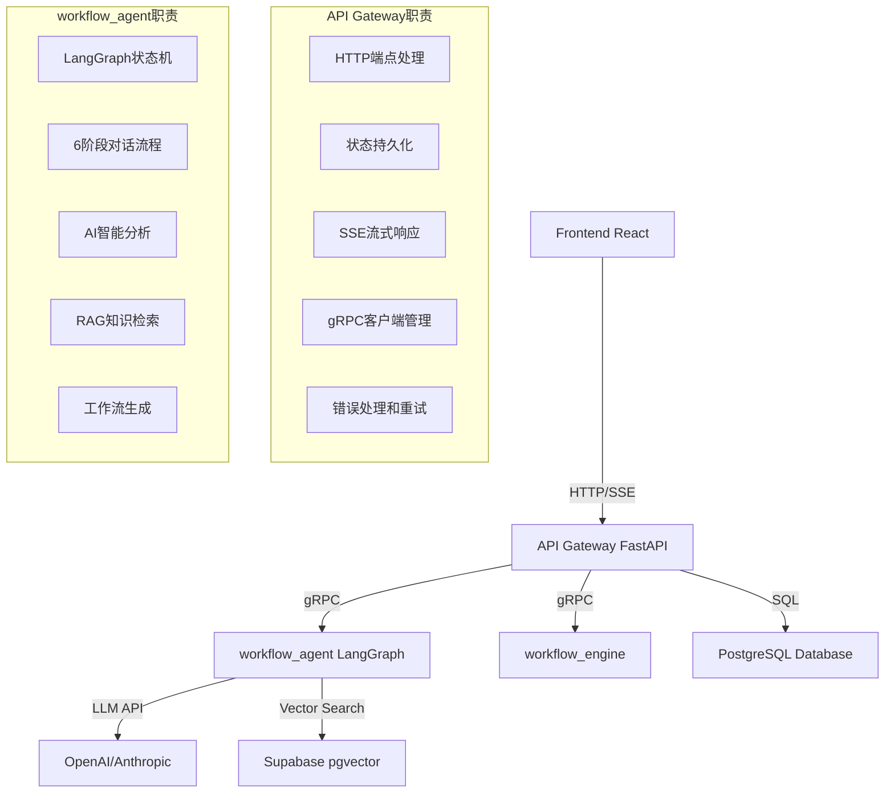
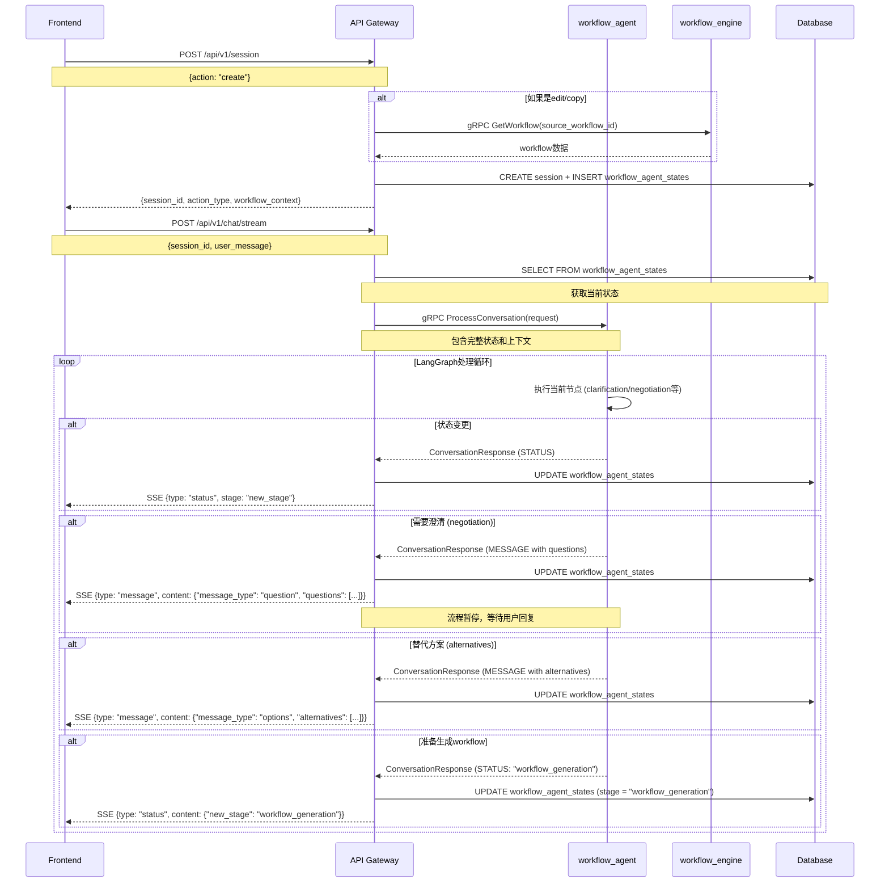
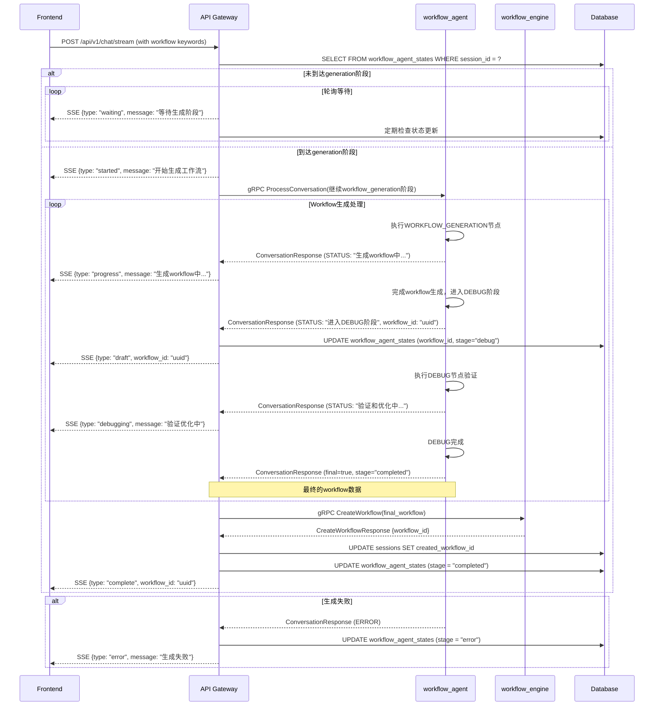
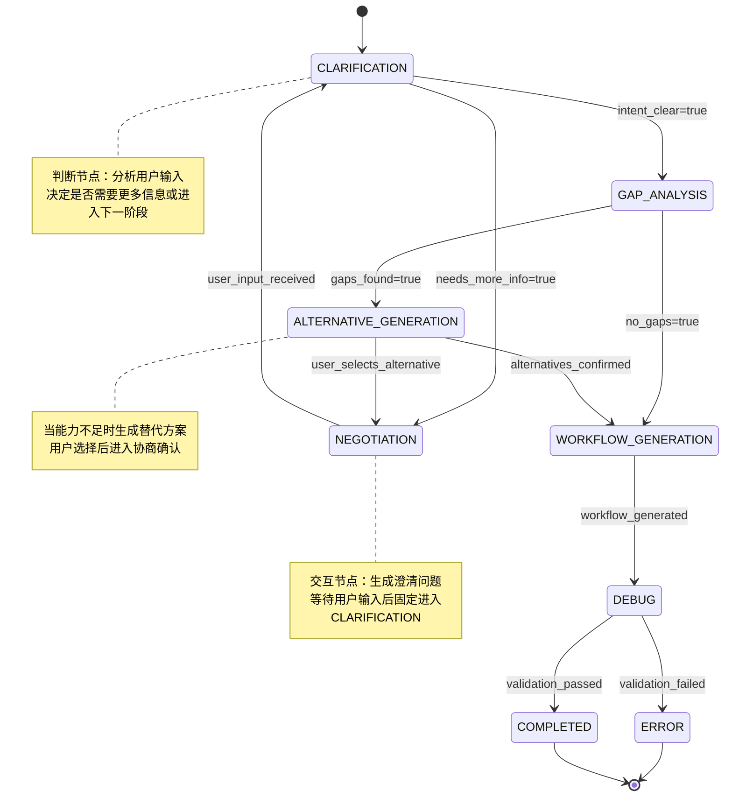

# Workflow Agent 完整技术设计方案

## 目录
1. [架构概述](#1-架构概述)
2. [gRPC接口设计](#2-grpc接口设计)
3. [数据库Schema设计](#3-数据库schema设计)
4. [API Gateway接口设计](#4-api-gateway接口设计)
5. [详细交互流程](#5-详细交互流程)
6. [实施计划](#6-实施计划)
7. [测试与验收](#7-测试与验收)

---

## 1. 架构概述

### 1.1 整体架构图



### 1.2 核心设计原则

#### 1.2.1 职责分离
- **API Gateway**: 状态管理、HTTP协议适配、SSE流控制、workflow_engine集成
- **workflow_agent**: 业务逻辑、AI分析、工作流生成、保持stateless

#### 1.2.2 状态管理策略
- **Stateless转Stateful**: API Gateway负责状态持久化，workflow_agent每次调用携带完整状态
- **状态一致性**: 每次gRPC调用后立即保存更新的状态
- **状态恢复**: 支持会话中断后的状态恢复

#### 1.2.3 6阶段对话流程
1. **CLARIFICATION**: 意图澄清
2. **NEGOTIATION**: 需求协商（支持循环）
3. **GAP_ANALYSIS**: 能力差距分析
4. **ALTERNATIVE_GENERATION**: 替代方案生成
5. **WORKFLOW_GENERATION**: 工作流生成
6. **DEBUG**: 调试验证 → **COMPLETED**: 完成

---

## 2. gRPC接口设计

### 2.1 服务定义

```protobuf
syntax = "proto3";
package workflow_agent;

service WorkflowAgent {
  // 唯一的核心接口 - 处理所有6阶段的对话流程和workflow生成, 删除原来其他接口
  rpc ProcessConversation(ConversationRequest) returns (stream ConversationResponse);
}

// 设计原则：
// - 职责清晰：API Gateway管理状态和协议适配，workflow_agent专注业务逻辑
// - 接口统一：所有对话流程都通过ProcessConversation处理
// - 避免重复：一个接口处理所有阶段，避免功能重叠
```

### 2.2 核心消息定义

#### 2.2.1 对话相关消息

```protobuf
// 对话请求
message ConversationRequest {
  string session_id = 1;
  string user_id = 2;
  string user_message = 3;
  AgentState current_state = 4;           // 状态恢复
  WorkflowContext workflow_context = 5;   // edit/copy时需要
  ConversationConfig config = 6;          // 对话配置
}

// 对话响应流
message ConversationResponse {
  string session_id = 1;
  ResponseType type = 2;
  
  oneof content {
    MessageContent message = 3;           // 消息内容（包括问题、选项等）
    StatusContent status = 4;             // 状态更新
    ErrorContent error = 5;               // 错误信息
  }
  
  AgentState updated_state = 8;           // 更新后的状态
  int64 timestamp = 9;
  bool is_final = 10;                     // 是否为最终响应
}

enum ResponseType {
  MESSAGE = 0;           // 消息（包括普通消息、问题、选项等）
  STATUS = 1;            // 状态更新
  ERROR = 2;             // 错误信息
}
```

#### 2.2.2 状态定义

```protobuf
// Agent状态 - 简化但完整
message AgentState {
  string session_id = 1;
  string user_id = 2;
  WorkflowStage stage = 3;
  
  // 对话历史和意图
  repeated Conversation conversations = 4;
  string intent_summary = 5;
  
  // 分析结果
  repeated string gaps = 6;
  repeated AlternativeOption alternatives = 7;
  
  // 工作流数据
  string workflow_id = 8;           // 关联workflow表，不保存重复数据
  int32 debug_loop_count = 9;
  
  // 上下文信息
  ClarificationContext clarification_context = 10;
  WorkflowContext workflow_context = 11;
  
  // 时间戳
  int64 created_at = 12;
  int64 updated_at = 13;
}

enum WorkflowStage {
  CLARIFICATION = 0;
  NEGOTIATION = 1;
  GAP_ANALYSIS = 2;
  ALTERNATIVE_GENERATION = 3;
  WORKFLOW_GENERATION = 4;
  DEBUG = 5;
  COMPLETED = 6;
  ERROR = 7;
}
```

#### 2.2.3 完整消息定义补充

```protobuf
// 对话记录
message Conversation {
  string role = 1;      // user, assistant, system
  string text = 2;
  int64 timestamp = 3;
  map<string, string> metadata = 4;
}

// 澄清问题
message ClarificationQuestion {
  string id = 1;
  string question = 2;
  string category = 3;    // input, output, trigger, logic
  bool is_required = 4;
  repeated string options = 5;  // 预设选项
}

// 替代方案选项
message AlternativeOption {
  string id = 1;
  string title = 2;
  string description = 3;
  string approach = 4;        // 技术方案描述
  repeated string trade_offs = 5;  // 权衡说明
  string complexity = 6;      // simple, medium, complex
}

// 澄清上下文
message ClarificationContext {
  string purpose = 1;         // initial_intent, template_modification, gap_resolution
  map<string, string> collected_info = 2;
  repeated string pending_questions = 3;
  string origin = 4;          // create, edit, copy
}

// 工作流上下文
message WorkflowContext {
  string origin = 1;          // create, edit, copy
  string source_workflow_id = 2;
  string modification_intent = 3;
}

// 注意：WorkflowData结构等待同事确认IDL定义，暂时不包含具体字段

// 对话配置
message ConversationConfig {
  bool enable_streaming = 1;
  int32 max_turns = 2;
  int32 timeout_seconds = 3;
  string language = 4;          // zh, en
  bool enable_rag = 5;
  map<string, string> preferences = 6;
}

// 响应内容类型
message MessageContent {
  string text = 1;
  string role = 2;  // assistant, system  
  string message_type = 3;  // "text", "question", "options"
  map<string, string> metadata = 4;
  
  // 可选字段：当message_type为"question"时使用
  repeated ClarificationQuestion questions = 5;
  
  // 可选字段：当message_type为"options"时使用  
  repeated AlternativeOption alternatives = 6;
}

message StatusContent {
  WorkflowStage new_stage = 1;
  WorkflowStage previous_stage = 2;
  string stage_description = 3;
  repeated string pending_actions = 4;
}

message ErrorContent {
  string error_code = 1;
  string message = 2;
  string details = 3;
  bool is_recoverable = 4;
}
```

---

## 3. 数据库Schema设计

### 3.1 核心状态表

```sql
-- workflow_agent_states表 - 简化但完整
CREATE TABLE workflow_agent_states (
    -- 主键和关系
    id UUID PRIMARY KEY DEFAULT gen_random_uuid(),
    session_id UUID NOT NULL REFERENCES sessions(id) ON DELETE CASCADE,
    user_id UUID NOT NULL,
    
    -- 核心状态字段（10个关键字段）
    stage VARCHAR(50) NOT NULL CHECK (stage IN (
        'clarification', 'negotiation', 'gap_analysis', 
        'alternative_generation', 'workflow_generation', 
        'debug', 'completed', 'error'
    )),
    
    -- 对话和意图数据 (JSONB存储)
    conversations JSONB DEFAULT '[]' NOT NULL,
    intent_summary TEXT DEFAULT '',
    
    -- 分析结果
    gaps JSONB DEFAULT '[]' NOT NULL,
    alternatives JSONB DEFAULT '[]' NOT NULL,
    
    -- 工作流数据
    workflow_id UUID REFERENCES workflows(id) ON DELETE SET NULL,
    debug_loop_count INTEGER DEFAULT 0,
    
    -- 上下文信息
    clarification_context JSONB DEFAULT '{}' NOT NULL,
    workflow_context JSONB DEFAULT '{}' NOT NULL,
    
    -- 时间戳
    created_at TIMESTAMP WITH TIME ZONE DEFAULT NOW(),
    updated_at TIMESTAMP WITH TIME ZONE DEFAULT NOW(),
    
    -- 约束
    CONSTRAINT unique_session_state UNIQUE(session_id),
    CONSTRAINT valid_debug_count CHECK (debug_loop_count >= 0)
);

-- 索引设计
CREATE INDEX idx_agent_states_session ON workflow_agent_states(session_id);
CREATE INDEX idx_agent_states_user ON workflow_agent_states(user_id);
CREATE INDEX idx_agent_states_stage ON workflow_agent_states(stage);
CREATE INDEX idx_agent_states_updated ON workflow_agent_states(updated_at DESC);

-- JSONB字段的GIN索引 (用于复杂查询)
CREATE INDEX idx_agent_states_conversations_gin ON workflow_agent_states USING GIN (conversations);

-- workflow_id索引
CREATE INDEX idx_agent_states_workflow_id ON workflow_agent_states(workflow_id);
```

### 3.2 JSONB字段结构定义

```json
// conversations字段结构
[
  {
    "role": "user|assistant|system",
    "text": "对话内容",
    "timestamp": 1703001234567,
    "metadata": {"key": "value"}
  }
]

// alternatives字段结构
[
  {
    "id": "alt_1",
    "title": "简化邮件处理方案",
    "description": "使用基础IMAP接口替代Gmail API",
    "approach": "technical implementation details",
    "trade_offs": ["限制功能但实现简单", "兼容性更好"],
    "complexity": "simple"
  }
]

// clarification_context字段结构
{
  "purpose": "initial_intent|template_modification|gap_resolution",
  "collected_info": {
    "input_source": "Gmail",
    "output_destination": "Slack",
    "trigger_type": "email_received"
  },
  "pending_questions": ["question1", "question2"],
  "origin": "create|edit|copy"
}

// workflow_id字段：直接存储workflow表的主键
// 通过JOIN查询获取完整的workflow数据，避免数据重复存储
```

### 3.3 支持表扩展

```sql
-- 扩展现有sessions表
ALTER TABLE sessions ADD COLUMN IF NOT EXISTS action_type VARCHAR(20) DEFAULT 'create' 
    CHECK (action_type IN ('create', 'edit', 'copy'));
ALTER TABLE sessions ADD COLUMN IF NOT EXISTS source_workflow_id UUID 
    REFERENCES workflows(id) ON DELETE SET NULL;
ALTER TABLE sessions ADD COLUMN IF NOT EXISTS agent_stage VARCHAR(50);

-- 索引优化
CREATE INDEX IF NOT EXISTS idx_sessions_action_type ON sessions(action_type);
CREATE INDEX IF NOT EXISTS idx_sessions_source_workflow ON sessions(source_workflow_id);
```

---

## 4. API Gateway接口设计

### 4.1 HTTP端点定义

#### 4.1.1 会话管理

```
POST /api/v1/session
创建新的workflow agent会话

Request:
{
  "action": "create|edit|copy",
  "workflow_id": "uuid (仅edit/copy时必需)"
}

Response:
{
  "session_id": "uuid",
  "action_type": "create|edit|copy",  
  "workflow_context": {会话上下文},
  "message": "会话创建状态"
}
```

```
GET /api/v1/session/{session_id}
获取会话信息和当前状态

Response:
{
  "session_id": "uuid",
  "stage": "当前阶段",
  "intent_summary": "意图总结",
  "last_updated": "更新时间",
  "conversation_turns": "对话轮数",
  "has_workflow": "是否有工作流"
}
```

#### 4.1.2 对话交互

```
POST /api/v1/chat/stream
流式对话接口 (改为POST，符合HTTP语义)

Request:
{
  "session_id": "uuid",
  "user_message": "用户输入"
}

SSE Response:
data: {"type": "message", "content": {"text": "...", "message_type": "text"}, "is_final": false}
data: {"type": "status", "content": {"new_stage": "negotiation"}, "is_final": false}  
data: {"type": "message", "content": {"text": "请提供以下信息", "message_type": "question", "questions": [...]}, "is_final": true}
```

```
GET /api/v1/chat/history/{session_id}
获取对话历史

Response:
{
  "session_id": "uuid",
  "conversations": [对话记录],
  "intent_summary": "意图总结",
  "current_stage": "当前阶段",
  "total_turns": "对话轮数"
}
```

#### 4.1.3 工作流生成集成（已删除独立端点）

工作流生成现已集成到 `/api/v1/chat/stream` 中：

```
POST /api/v1/chat/stream
当用户消息包含工作流相关关键词时，自动触发工作流生成

SSE Response:
data: {"type": "message", "delta": "I understand you want to create a workflow..."}
data: {"type": "workflow_generation_started", "workflow_id": "uuid", "data": {...}}
data: {"type": "workflow_draft", "workflow_id": "uuid", "data": {...}}
data: {"type": "workflow_debugging", "workflow_id": "uuid", "data": {...}}
data: {"type": "workflow_complete", "workflow_id": "uuid", "data": {...}}
data: {"type": "message", "delta": "Workflow created!", "workflow_id": "uuid"}
```

```
GET /api/v1/workflow/{session_id}/status
获取工作流生成状态

Response:
{
  "session_id": "uuid",
  "stage": "当前阶段",
  "has_workflow": "是否有工作流",
  "workflow_id": "uuid (如果有workflow)",
  "workflow_data": {workflow完整数据} (如果有workflow),
  "debug_loop_count": "调试次数",
  "last_updated": "更新时间"
}
```

### 4.2 状态管理接口

```
StateManager接口设计:

- get_state(session_id, access_token) -> Dict
- save_state(session_id, state_dict, access_token) -> bool
- delete_state(session_id, access_token) -> bool
- get_active_sessions(user_id, limit) -> List[Dict]
```

---

## 5. 详细交互流程

### 5.1 完整对话交互流程



### 5.2 工作流生成流程（已集成到聊天流程）



### 5.3 状态机转换图



---

## 6. 实施计划

### 6.1 Phase 1: 基础gRPC接口 (2天)

**目标**: 实现基础的stateful对话能力

**任务**:
- [ ] 设计和实现简化的protobuf定义（仅ProcessConversation接口）
- [ ] 重新生成gRPC代码 
- [ ] 实现workflow_agent的ProcessConversation接口
- [ ] 仍然保存原先定义的LangGraph workflow，只是接入gRPC接口。
- [ ] gRPC接口需要支持流式返回，每次LangGraph运行到一个新的节点时，gRPC接口返回这个state给api-gateway，api-gateway通过/chat/stream推送给前端，通知状态的变更以及状态相关信息。
- [ ] 基本的流式对话测试

**交付物**:
- `workflow_agent.proto` 简化定义
- workflow_agent服务的完整gRPC实现
- 6阶段流程的基础demo

**验收标准**:
- gRPC接口可以正常建立连接
- ProcessConversation能处理所有6个阶段
- 状态可以在请求间传递
- workflow生成阶段能正常工作

### 6.2 Phase 2: 状态持久化 (1天)

**目标**: 实现完整的状态管理机制

**任务**:
- [ ] 执行数据库schema迁移
- [ ] 实现api-gateway的状态管理器
- [ ] 状态序列化/反序列化逻辑

**交付物**:
- 数据库迁移脚本
- StateManager完整实现
- 状态一致性测试

**验收标准**:
- 状态能在数据库中正确保存和读取
- 会话中断后可以恢复状态
- 状态更新具有事务性

### 6.3 Phase 3: LangGraph集成 (1天)

**目标**: 实现6阶段对话流程

**任务**:
- [ ] 更新LangGraph节点支持流式输出
- [ ] 实现clarification↔negotiation循环
- [ ] 实现gap analysis和alternative generation
- [ ] 完整的6阶段状态机测试

**交付物**:
- 更新的LangGraph节点实现
- 6阶段流程的端到端测试

**验收标准**:
- 6个阶段都能正常运行
- clarification/negotiation循环工作正常
- 状态转换逻辑正确

### 6.4 Phase 4: API Gateway集成 (1天)

**目标**: 完整的HTTP到gRPC适配

**任务**:
- [ ] 实现所有HTTP端点
- [ ] 简化的gRPC客户端实现（仅ProcessConversation调用）
- [ ] SSE流式响应处理（workflow生成集成到/chat/stream）
- [ ] workflow_engine集成(create workflow)

**交付物**:
- 完整的API Gateway实现
- 所有HTTP端点的集成测试

**验收标准**:
- 所有HTTP端点正常工作
- SSE流能正确传输数据
- workflow生成能在/chat/stream中正确工作
- workflow生成后能正确创建到workflow_engine

### 6.5 Phase 5: 端到端测试 (1天)

**目标**: 完整流程验证和优化

**任务**:
- [ ] 完整的create/edit/copy流程测试
- [ ] 错误处理和边界情况测试
- [ ] 性能测试和优化
- [ ] 文档更新

**交付物**:
- 完整的测试报告
- 性能优化建议
- 部署文档

**验收标准**:
- 所有核心功能正常工作
- 错误情况有合理的降级处理
- 满足基本性能要求

**总预估时间: 6天**

### 6.2 风险评估

| 风险 | 概率 | 影响 | 缓解策略 |
|------|------|------|----------|
| gRPC流式接口复杂度 | 中 | 高 | 先实现基础接口，再逐步完善流式功能 |
| 状态一致性问题 | 中 | 高 | 严格的事务控制，完善的测试用例 |
| LangGraph状态序列化 | 低 | 中 | 简化状态结构，增加容错机制 |
| workflow_engine集成 | 低 | 中 | 提前验证接口兼容性 |

---

## 7. 测试与验收

### 7.1 功能测试

#### 7.1.1 核心功能测试
- [ ] 6阶段对话流程完整性测试
- [ ] clarification↔negotiation循环测试
- [ ] gap analysis和alternative generation测试
- [ ] workflow生成和debug流程测试
- [ ] create/edit/copy三种模式测试

#### 7.1.2 集成测试
- [ ] API Gateway与workflow_agent集成
- [ ] workflow_agent与workflow_engine集成
- [ ] 数据库状态持久化测试
- [ ] SSE流式响应测试

### 7.2 性能测试

#### 7.2.1 性能指标
- 对话响应时间 < 3秒 (95%分位)
- 状态保存时间 < 500ms (平均)
- gRPC连接建立时间 < 1秒
- workflow生成时间 < 30秒 (复杂workflow)

#### 7.2.2 并发测试
- 支持10个并发会话
- 数据库连接池正常工作
- gRPC连接复用有效

### 7.3 错误处理测试

#### 7.3.1 网络异常
- [ ] gRPC连接中断恢复
- [ ] 数据库连接异常处理
- [ ] LLM API调用失败降级

#### 7.3.2 数据异常
- [ ] 状态数据损坏恢复
- [ ] 无效用户输入处理
- [ ] 会话超时清理

### 7.4 验收标准

#### 7.4.1 功能验收
- [ ] 所有API端点返回正确响应
- [ ] 6阶段流程无卡死或错误状态
- [ ] 状态在会话间正确持久化
- [ ] workflow生成结果符合预期

#### 7.4.2 质量验收
- [ ] 代码通过所有单元测试
- [ ] 集成测试覆盖率 > 80%
- [ ] 错误日志清晰可读
- [ ] API文档完整准确

#### 7.4.3 性能验收
- [ ] 满足所有性能指标要求
- [ ] 内存使用合理，无明显泄漏
- [ ] 数据库查询优化，无慢查询
- [ ] gRPC连接稳定，重连机制有效

这个技术设计提供了从架构到实施的完整方案，开发团队可以基于此文档进行详细的技术实现。