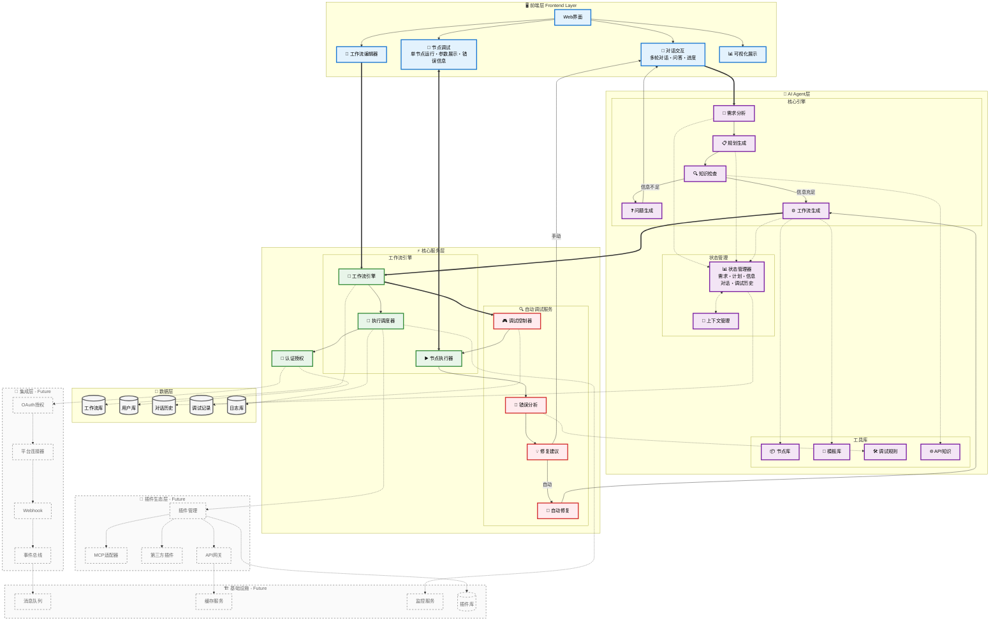
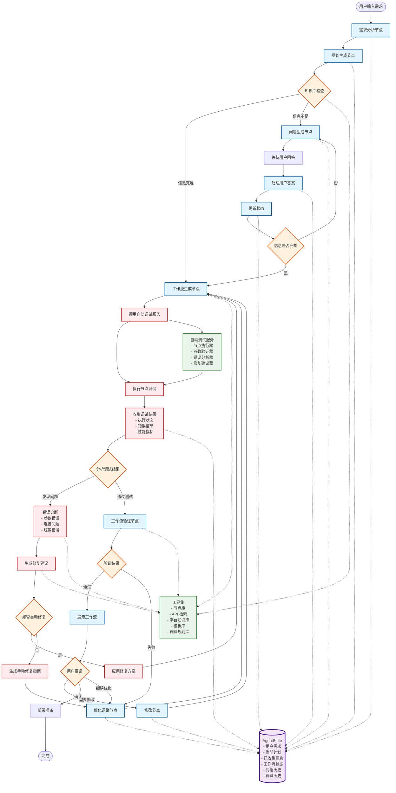

# 自然语言生成工作流程产品 MVP 规划

## 项目概述

### 产品目标

构建一个支持自然语言生成工作流程的网页端产品，让用户能够通过自然语言描述创建、调试和运行工作流程。

### 核心功能

1. **自然语言输入**: 用户提供粗糙的 prompt，系统理解并生成工作流程
2. **智能引导**: Agent 引导用户提供更完整的上下文信息
3. **平台授权**: 支持第三方平台的授权和集成
4. **自动调试**: 自动生成工作流程并进行调试
5. **手动编辑**: 支持手动创建和编辑工作流程
6. **工作流程执行**: 支持工作流程的实际运行
7. **插件和 MCP 插件生态**：引入第三方插件和 MCP 工具，拓展平台能力

### 团队配置

- 4 名后端工程师：

  - Jingwei: 技术架构师，需要全程把控项目，攻克难点，经常加班工作！
  - Jian: 技术架构师，擅长拆解规划，把控技术全局
  - Daming: 执行力超强，人型打字机，完整交付产品
  - Ganyuan: 很有技术热情，有想象力，善于用 AI 编程工具

- 1 名前端工程师：
  - Bohua: 对技术充满热情，开发效率非常高
- 总开发时间: 3 周

## 系统架构设计

### 技术栈

- **前端**: React 18, TypeScript, Tailwind CSS, React Flow, Vite
- **后端**: Python, FastAPI, PostgreSQL, Redis
- **AI 服务**: LangChain + LangGraph, OpenAI GPT-4, Claude API
- **消息队列**: Celery + Redis
- **部署**: Docker, Docker Compose

### 架构图

#### 整体架构



#### AI Agent 详细架构



## AI Agent 层和核心服务层技术设计

### 一、AI Agent 层技术架构设计（基于 LangGraph）

#### 1. 整体架构概述

AI Agent 层基于**LangGraph**构建，这是一个专门用于构建有状态、多步骤 AI 应用的框架。我们将利用 LangGraph 的图结构来实现 Agent 的决策流程。

##### 1.1 核心设计理念

- **图驱动的对话流程**：将 Agent 的决策过程建模为有向图
- **状态持久化**：每个节点的输入输出都通过 State 对象传递
- **条件分支**：根据用户输入和当前状态动态选择执行路径
- **可中断和恢复**：支持在任意节点暂停并等待用户输入

#### 2. LangGraph 实现架构

##### 2.1 Graph 结构设计

```
用户输入 → 需求分析 → 知识检查 → [分支判断]
                                    ↓
                              信息充足 → 工作流生成 → 自动调试
                                    ↓                    ↓
                              信息不足 → 问题生成    错误分析
                                    ↓                    ↓
                              等待用户回答 ←────── 修复建议
```

##### 2.2 AgentState 管理

```python
class AgentState(TypedDict):
    user_input: str
    requirements: Dict[str, Any]
    current_plan: Optional[Dict]
    collected_info: Dict[str, Any]
    messages: List[Dict]
    workflow: Optional[Dict]
    debug_results: Optional[Dict]
    current_step: str
```

### 二、核心服务层技术架构设计

#### 1. 工作流定义方案

**推荐 JSON 格式**：

- 易于理解和扩展
- 工具支持好
- 序列化简单

#### 2. 节点系统设计

基于数据结构定义的 8 大核心节点类型：

- **TRIGGER_NODE** - 触发器节点
- **AI_AGENT_NODE** - AI 代理节点
- **EXTERNAL_ACTION_NODE** - 外部动作节点
- **ACTION_NODE** - 动作节点
- **FLOW_NODE** - 流程控制节点
- **HUMAN_IN_THE_LOOP_NODE** - 人机交互节点
- **TOOL_NODE** - 工具节点
- **MEMORY_NODE** - 记忆节点

#### 3. 执行引擎设计

**基于图的执行**：

- 构建执行 DAG（有向无环图）
- 识别可并行的分支
- 动态调度节点执行

#### 4. 调试服务设计

**单节点调试**：

- 独立执行任意节点
- 手动输入测试数据
- 查看输出结果和执行日志

**断点调试**：

- 在节点前后设置断点
- 查看当前数据状态
- 支持继续执行或终止

## 任务分解与分配

基于新的技术架构，重新分配任务：

### 第 1 周 (Week 1)

#### Jingwei - LangGraph AI Agent 层核心架构

**任务**: 基于 LangGraph 构建 AI Agent 核心框架

- **Day 1-2**: LangGraph 框架搭建

  - 设置 Python + FastAPI + LangGraph 项目结构
  - 配置 PostgreSQL 数据库连接和迁移
  - 实现基础的 Graph State 管理
  - 创建 Agent 节点基础类

- **Day 3-5**: AI Agent 核心流程实现
  - 实现需求分析节点（analyze_requirement）
  - 实现知识检查节点（check_knowledge）
  - 实现条件分支节点（should_generate）
  - 实现问题生成节点（generate_questions）
  - 实现工作流生成节点（generate_workflow）

**交付物**:

- LangGraph AI Agent 框架
- 核心决策流程图
- Agent State 管理系统

#### Jian（技术架构师）- 工作流引擎核心架构

**任务**: 工作流引擎和执行系统

- **Day 1-2**: 工作流数据模型实现

  - 基于 protobuf 定义实现 Workflow 数据结构
  - 实现 8 大节点类型的基础框架
  - 设计节点执行器接口
  - 实现连接系统（ConnectionsMap）

- **Day 3-5**: 执行引擎核心
  - 实现工作流解析器（JSON 到执行图）
  - 创建节点执行调度器
  - 实现基础的错误处理和重试机制
  - 添加执行状态管理

**交付物**:

- 工作流数据模型
- 节点执行框架
- 执行调度系统

#### Daming - 自动调试服务

**任务**: 自动调试系统实现

- **Day 1-2**: 调试框架搭建

  - 实现调试控制器（DEBUG_CTRL）
  - 创建节点执行器测试环境
  - 实现执行结果收集系统
  - 设计调试日志记录

- **Day 3-5**: 调试分析和修复
  - 实现错误分析器（ERROR_ANALYZER）
  - 创建修复建议生成器（FIX_SUGGESTER）
  - 实现自动修复器（AUTO_FIXER）
  - 添加调试规则库

**交付物**:

- 自动调试系统
- 错误分析引擎
- 修复建议系统

#### Ganyuan - 工具集成和 API 适配

**任务**: 第三方工具集成和 API 适配

- **Day 1-2**: 工具框架设计

  - 实现工具节点基础框架
  - 设计 API 调用适配器
  - 实现 OAuth2 授权框架
  - 创建凭证管理系统

- **Day 3-5**: 核心工具集成
  - 集成 Google Calendar API
  - 集成 GitHub API
  - 集成 Slack API
  - 实现通用 HTTP 请求工具

**交付物**:

- 工具集成框架
- API 适配器系统
- 核心工具集成

#### Bohua（前端开发）- 前端架构增强

**任务**: 增强现有前端界面，支持 AI Agent 交互

- **Day 1-2**: 现有代码重构

  - 优化 React Flow 工作流编辑器
  - 重构组件结构提升可维护性
  - 增强节点类型支持（8 大节点类型）
  - 改进用户交互体验

- **Day 3-5**: AI Agent 交互界面
  - 实现 AI 聊天对话界面
  - 创建智能引导问答系统
  - 实现节点调试界面
  - 添加工作流执行监控

**交付物**:

- 优化的工作流编辑器
- AI 聊天交互界面
- 节点调试界面

### 第 2 周 (Week 2)

#### Jingwei - AI Agent 优化和集成

**任务**: AI Agent 功能完善和系统集成

- **Day 1-3**: AI Agent 功能增强

  - 实现多轮对话管理和上下文保持
  - 优化自然语言解析准确性
  - 创建个性化推荐系统
  - 实现用户反馈收集和学习机制

- **Day 4-5**: 与调试服务集成
  - 完善工作流生成后的自动调试集成
  - 实现调试结果反馈到 Agent State
  - 优化错误处理和修复建议流程
  - 添加 Agent 性能监控

**交付物**:

- 完善的 AI Agent 系统
- 多轮对话管理
- 自动调试集成

#### Jian（技术架构师）- 执行引擎完善

**任务**: 工作流执行引擎完善和优化

- **Day 1-3**: 执行引擎增强

  - 实现复杂流程控制（Loop、Switch、Merge）
  - 优化并发执行和资源管理
  - 完善错误处理和重试机制
  - 添加执行性能监控

- **Day 4-5**: 执行监控和历史
  - 实现执行历史记录和查询
  - 添加实时执行状态监控
  - 创建执行日志系统
  - 实现执行结果存储和分析

**交付物**:

- 完善的工作流执行引擎
- 执行监控系统
- 日志和历史记录

#### Daming - 调试服务完善

**任务**: 调试服务功能完善和性能优化

- **Day 1-3**: 调试功能增强

  - 实现工作流语法验证
  - 添加连接性检查和循环依赖检测
  - 完善节点配置验证
  - 实现调试会话管理

- **Day 4-5**: 测试和模拟
  - 实现工作流模拟执行
  - 创建测试数据生成器
  - 添加性能分析工具
  - 实现调试报告生成

**交付物**:

- 完善的调试系统
- 测试和模拟功能
- 性能分析工具

#### Ganyuan - 工具生态扩展

**任务**: 扩展工具生态和 MCP 集成

- **Day 1-3**: 工具生态扩展

  - 集成 Trello API
  - 集成 Email 服务（SendGrid/Mailgun）
  - 集成 Notion API
  - 实现更多通用工具节点

- **Day 4-5**: MCP 集成准备
  - 设计 MCP（Model Context Protocol）适配器
  - 实现插件管理框架
  - 创建工具发现和注册机制
  - 添加工具性能监控

**交付物**:

- 扩展的工具生态
- MCP 适配器框架
- 插件管理系统

#### Bohua（前端开发）- 高级 UI 功能

**任务**: 高级功能界面开发

- **Day 1-3**: 执行监控界面

  - 实现工作流执行监控页面
  - 创建实时状态显示
  - 实现执行历史浏览
  - 添加错误诊断界面

- **Day 4-5**: 调试工具界面
  - 完善节点调试界面
  - 创建测试数据管理
  - 实现性能分析显示
  - 添加调试会话管理

**交付物**:

- 执行监控界面
- 调试工具界面
- 测试管理系统

### 第 3 周 (Week 3)

#### Jingwei - 系统集成和性能优化

**任务**: 系统整体集成和性能优化

- **Day 1-2**: 系统集成

  - 整合 AI Agent 层和核心服务层
  - 实现端到端的工作流生成和执行
  - 优化系统间通信和数据传递
  - 进行系统压力测试和性能调优

- **Day 3-5**: 性能优化和监控
  - 实现 Redis 缓存系统
  - 优化数据库查询性能
  - 添加系统监控和报警
  - 实现负载均衡和扩展性准备

**交付物**:

- 完整的系统集成
- 性能优化方案
- 监控和报警系统

#### Jingwei - 部署和 DevOps

**任务**: 部署配置和 CI/CD

- **Day 1-2**: 容器化部署

  - 创建 Docker 配置（Python FastAPI + PostgreSQL + Redis）
  - 实现 Docker Compose 部署
  - 配置环境变量管理
  - 设置数据库迁移和初始化

- **Day 3-5**: CI/CD 流程
  - 配置 GitHub Actions
  - 实现自动化测试（单元测试、集成测试）
  - 创建部署脚本
  - 设置环境隔离和版本管理

**交付物**:

- Docker 配置
- CI/CD 流程
- 部署脚本

#### Daming - API 文档和测试

**任务**: API 文档和自动化测试

- **Day 1-2**: API 文档

  - 使用 FastAPI 自动生成 API 文档
  - 创建 API 使用示例和 SDK
  - 实现 API 版本管理
  - 添加 API 限流和安全文档

- **Day 3-5**: 自动化测试
  - 实现单元测试覆盖核心功能
  - 创建集成测试
  - 实现 API 端到端测试
  - 添加性能测试和基准测试

**交付物**:

- 完整 API 文档
- 自动化测试套件
- 性能测试报告

#### Jian（技术架构师）- 系统集成和端到端测试

**任务**: 系统整体集成和端到端测试

- **Day 1-3**: 系统集成测试

  - 整合所有模块的端到端测试
  - 验证 AI Agent -> 工作流引擎 -> 执行器的完整流程
  - 测试工具集成的稳定性和准确性
  - 验证前后端数据传递的完整性

- **Day 4-5**: 性能测试和优化
  - 进行系统负载测试
  - 分析性能瓶颈并优化
  - 验证并发场景下的系统稳定性
  - 优化数据库查询和 API 响应时间

**交付物**:

- 端到端测试套件
- 系统集成验证报告
- 性能测试报告和优化方案

#### Ganyuan - Bug 修复和用户体验优化

**任务**: 系统 Bug 修复和 MVP 体验优化

- **Day 1-3**: Bug 修复和稳定性提升

  - 收集和修复各模块发现的 Bug
  - 优化错误处理和用户提示
  - 改进工作流生成的准确性
  - 完善异常情况的处理逻辑

- **Day 4-5**: 用户体验优化
  - 优化 AI 生成工作流的响应速度
  - 改进自然语言理解的准确性
  - 完善用户交互流程和反馈机制
  - 添加基础的使用帮助和引导

**交付物**:

- Bug 修复报告
- 用户体验优化方案
- 系统稳定性提升总结

#### Bohua（前端开发）- 最终优化和发布

**任务**: 前端最终优化和发布准备

- **Day 1-2**: UI/UX 优化

  - 优化用户体验流程
  - 实现响应式设计
  - 添加加载状态和错误处理
  - 优化性能和打包

- **Day 3-5**: 发布准备
  - 实现生产环境配置
  - 添加用户帮助和文档
  - 创建用户引导流程
  - 实现错误报告系统

**交付物**:

- 优化的前端应用
- 用户帮助系统
- 生产环境配置

## 数据库设计

### 核心表结构

基于 protobuf 数据结构定义，数据库设计如下：

```sql
-- 用户表
CREATE TABLE users (
    id UUID PRIMARY KEY DEFAULT gen_random_uuid(),
    email VARCHAR(255) UNIQUE NOT NULL,
    name VARCHAR(255) NOT NULL,
    created_at TIMESTAMP DEFAULT CURRENT_TIMESTAMP,
    updated_at TIMESTAMP DEFAULT CURRENT_TIMESTAMP
);

-- 工作流程表（基于Workflow数据结构）
CREATE TABLE workflows (
    id UUID PRIMARY KEY DEFAULT gen_random_uuid(),
    user_id UUID REFERENCES users(id),
    name VARCHAR(255) NOT NULL,
    description TEXT,
    active BOOLEAN DEFAULT true,
    workflow_data JSONB NOT NULL,  -- 存储完整的Workflow protobuf JSON
    settings JSONB,                -- WorkflowSettings
    static_data JSONB,             -- 静态数据
    pin_data JSONB,                -- 调试数据
    created_at BIGINT NOT NULL,    -- Unix timestamp
    updated_at BIGINT NOT NULL,    -- Unix timestamp
    version VARCHAR(50) DEFAULT '1.0.0',
    tags TEXT[]
);

-- 执行历史表（基于ExecutionData数据结构）
CREATE TABLE workflow_executions (
    id UUID PRIMARY KEY DEFAULT gen_random_uuid(),
    execution_id VARCHAR(255) UNIQUE NOT NULL,
    workflow_id UUID REFERENCES workflows(id),
    status VARCHAR(50) NOT NULL,  -- NEW, RUNNING, SUCCESS, ERROR, CANCELED, WAITING
    mode VARCHAR(50) NOT NULL,    -- MANUAL, TRIGGER, WEBHOOK, RETRY
    triggered_by VARCHAR(255),
    start_time BIGINT,
    end_time BIGINT,
    run_data JSONB,              -- RunData protobuf JSON
    metadata JSONB,
    created_at TIMESTAMP DEFAULT CURRENT_TIMESTAMP
);

-- AI生成历史表 (MVP简化版)
CREATE TABLE ai_generation_history (
    id UUID PRIMARY KEY DEFAULT gen_random_uuid(),
    user_id UUID REFERENCES users(id),
    description TEXT NOT NULL,      -- 用户的自然语言描述
    generated_workflow JSONB,       -- 生成的工作流
    feedback TEXT,                  -- 用户反馈
    iteration_count INTEGER DEFAULT 1,
    created_at TIMESTAMP DEFAULT CURRENT_TIMESTAMP
);

-- 第三方授权表（基于Integration数据结构）
CREATE TABLE oauth_tokens (
    id UUID PRIMARY KEY DEFAULT gen_random_uuid(),
    user_id UUID REFERENCES users(id),
    integration_id VARCHAR(255) NOT NULL,
    provider VARCHAR(100) NOT NULL,
    access_token TEXT NOT NULL,
    refresh_token TEXT,
    expires_at TIMESTAMP,
    credential_data JSONB,
    created_at TIMESTAMP DEFAULT CURRENT_TIMESTAMP
);

-- 工具集成表
CREATE TABLE integrations (
    id UUID PRIMARY KEY DEFAULT gen_random_uuid(),
    integration_id VARCHAR(255) UNIQUE NOT NULL,
    integration_type VARCHAR(100) NOT NULL,
    name VARCHAR(255) NOT NULL,
    version VARCHAR(50) NOT NULL,
    configuration JSONB,
    supported_operations TEXT[],
    active BOOLEAN DEFAULT true,
    created_at TIMESTAMP DEFAULT CURRENT_TIMESTAMP
);

-- 调试记录表 (MVP简化版)
CREATE TABLE validation_logs (
    id UUID PRIMARY KEY DEFAULT gen_random_uuid(),
    workflow_id UUID REFERENCES workflows(id),
    user_id UUID REFERENCES users(id),
    validation_type VARCHAR(50) NOT NULL,  -- 'workflow' or 'node'
    validation_result JSONB,               -- 验证结果
    errors JSONB,                         -- 错误信息
    created_at TIMESTAMP DEFAULT CURRENT_TIMESTAMP
);
```

## API 设计

基于 FastAPI 和新的技术架构，API 设计如下：

## MVP AI Agent API 详细设计

### POST /api/agent/generate

**功能**: 从自然语言描述生成完整的工作流程

**请求体**:

```json
{
  "description": "用户的自然语言描述",
  "context": {
    "preferred_tools": ["google_calendar", "slack"], // 可选：用户偏好的工具
    "constraints": ["no_email", "working_hours_only"] // 可选：约束条件
  }
}
```

**响应**:

```json
{
  "success": true,
  "workflow": {
    // 完整的工作流JSON结构
  },
  "suggestions": ["建议添加错误处理节点", "可以考虑添加用户确认步骤"],
  "missing_info": ["需要确认Google Calendar的具体操作权限"]
}
```

### POST /api/agent/refine

**功能**: 根据用户反馈优化现有工作流程

**请求体**:

```json
{
  "workflow_id": "uuid",
  "feedback": "需要添加邮件通知功能",
  "original_workflow": {
    // 当前工作流JSON
  }
}
```

**响应**:

```json
{
  "success": true,
  "updated_workflow": {
    // 优化后的工作流JSON
  },
  "changes": ["添加了Email节点", "修改了流程连接"]
}
```

### MVP 设计理念

1. **简化状态管理**: 无需复杂的对话状态，每次请求都是独立的
2. **一次性生成**: 用户输入描述，系统直接返回完整工作流
3. **迭代优化**: 通过 refine 接口支持工作流的迭代改进
4. **最小化 API**: 只保留核心功能，减少实现复杂度

## 工作流程相关

POST /api/workflows - 创建工作流程

GET /api/workflows - 获取工作流程列表

`GET /api/workflows/{id}` - 获取特定工作流程

`PUT /api/workflows/{id}` - 更新工作流程

`DELETE /api/workflows/{id}` - 删除工作流程

`POST /api/workflows/{id}/validate` - 验证工作流程

## 执行相关

`POST /api/workflows/{id}/execute` - 执行工作流程

`GET /api/workflows/{id}/executions` - 获取执行历史

`GET /api/executions/{execution_id}` - 获取执行详情

`POST /api/executions/{execution_id}/cancel` - 取消执行

## 调试相关 (MVP 简化版)

POST /api/debug/validate - 验证工作流程

POST /api/debug/test-node - 测试单个节点

## 工具集成相关 (MVP 简化版)

GET /api/integrations - 获取可用工具集成

`POST /api/integrations/{integration_id}/auth` - 授权工具

## 用户相关

POST /api/auth/login - 用户登录

GET /api/users/me - 获取当前用户信息

## MVP 成功标准

### 核心功能完成度

- [ ] 用户可以通过自然语言一次性生成工作流程
- [ ] 支持基础的工作流程优化和调整
- [ ] 工作流程能够成功执行和监控
- [ ] 支持基本的调试和验证
- [ ] 端到端系统集成测试通过
- [ ] 主要 Bug 已修复，系统运行稳定

### 质量和性能指标

- 工作流程生成时间 < 15s
- 基本工作流程执行成功率 > 85%
- 支持并发用户数 > 20
- 系统整体稳定性 > 95%
- 端到端测试用例通过率 > 90%

### MVP 用户体验

- 自然语言生成准确率 > 70%
- 生成的工作流程可用性 > 80%
- 用户交互流程顺畅，错误提示清晰
- 基础帮助文档和引导完整

## 与完整版本的差异

### MVP 版本移除的功能

1. **复杂的对话状态管理** - 简化为无状态 API
2. **多轮智能引导** - 改为一次性生成 + 迭代优化
3. **高级调试功能** - 只保留基本验证
4. **完整的工具生态** - 只集成核心工具
5. **详细的执行监控** - 只保留基本状态查询

### MVP 专注的核心价值

1. **快速原型验证** - 验证 AI 生成工作流的技术可行性
2. **用户体验测试** - 测试自然语言交互的效果
3. **技术架构验证** - 验证 LangGraph + FastAPI 的架构
4. **质量保证** - 确保系统稳定性和基本可用性
5. **端到端验证** - 验证完整用户流程的可行性

---

_此 MVP 规划将帮助团队在 3 周内交付核心功能，验证产品概念的可行性。_
