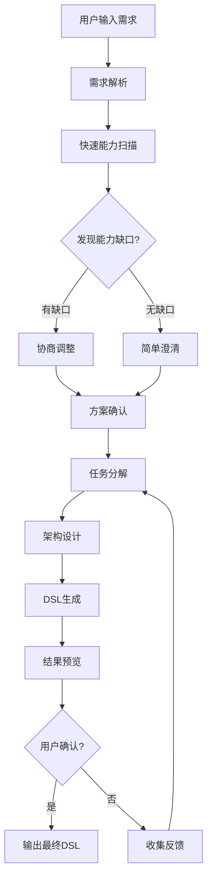
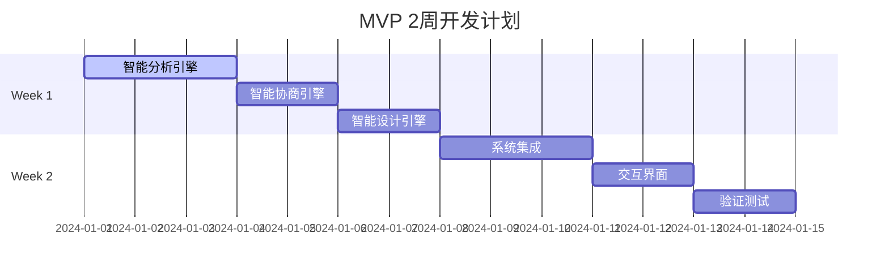

# Workflow Agent MVP 实现计划

## 概述

基于长期愿景的 Workflow Agent，我们需要先实现一个 MVP 版本，专注于核心的咨询顾问式交互和工作流生成能力。本 MVP 版本将在没有完整 workflow engine 的情况下，先实现基础的需求分析、协商和 DSL 生成功能。

## MVP 核心目标

> **让 AI 成为真正的工作流咨询顾问，而不仅仅是代码生成器**

- ✅ 智能需求分析和能力评估
- ✅ 引导式需求协商和方案选择
- ✅ 基于协商结果的精准工作流设计
- ✅ 生成标准的 WORKFLOW DSL 代码
- ⚠️ 简化版验证（人工确认为主）
- ❌ 暂不包含自动调试和部署

## MVP 设计理念

保持长期愿景的核心理念：**前置协商流程**

```
用户需求 → 能力扫描 → 发现约束 → 协商调整 → 确认方案 → 精准设计 → 生成DSL
```

### 与长期愿景的差异

| 功能模块   | 长期愿景                | MVP 版本                    | 备注                |
| ---------- | ----------------------- | --------------------------- | ------------------- |
| 需求分析   | 智能解析+历史案例匹配   | **智能解析+历史案例匹配**   | ✅ **完全保持一致** |
| 能力检测   | 动态能力扫描+复杂度评估 | **动态能力扫描+复杂度评估** | ✅ **完全保持一致** |
| 协商机制   | 多轮智能协商+权衡展示   | **多轮智能协商+权衡展示**   | ✅ **完全保持一致** |
| 工作流设计 | 自动架构设计+优化建议   | **自动架构设计+优化建议**   | ✅ **完全保持一致** |
| 验证测试   | 自动化测试+智能修复     | 生成预览+人工确认           | 简化为静态验证      |
| 部署执行   | 自动部署+持续监控       | DSL 输出+手动部署指引       | 暂不涉及实际部署    |

## MVP 技术架构

### 整体流程 (简化版)



### 核心组件架构

```typescript
interface MVPWorkflowState {
  // 元数据
  metadata: {
    session_id: string;
    user_id: string;
    created_at: Date;
    updated_at: Date;
    version: string;
    interaction_count: number;
  };

  // 当前阶段
  stage: WorkflowStage;

  // 咨询阶段状态 - 完整保持长期愿景
  requirement_negotiation: {
    original_requirements: string;
    parsed_intent: {
      primary_goal: string;
      secondary_goals: string[];
      constraints: string[];
      success_criteria: string[];
    };
    capability_analysis: CapabilityAnalysis;
    identified_constraints: Constraint[];
    proposed_solutions: Solution[];
    user_decisions: Decision[];
    negotiation_history: NegotiationStep[];
    final_requirements: string;
    confidence_score: number;
  };

  // 设计阶段状态 - 完整保持长期愿景
  design_state: {
    task_tree: TaskTree;
    architecture: WorkflowArchitecture;
    workflow_dsl: WorkflowDSL;
    optimization_suggestions: Optimization[];
    design_patterns_used: string[];
    estimated_performance: PerformanceEstimate;
  };

  // 配置阶段状态 - 完整保持长期愿景
  configuration_state: {
    current_node_index: number;
    node_configurations: NodeConfig[];
    missing_parameters: Parameter[];
    validation_results: ValidationResult[];
    configuration_templates: Template[];
    auto_filled_params: AutoFillRecord[];
  };

  // 简化的执行状态 (仅用于预览验证)
  execution_state: {
    preview_results: PreviewResult[];
    static_validation: StaticValidation;
    configuration_completeness: ConfigurationCheck;
  };
}

interface CapabilityAnalysis {
  required_capabilities: string[]; // ["email_monitoring", "notion_integration"]
  available_capabilities: string[]; // WORKFLOW Engine原生支持的能力
  capability_gaps: string[]; // 缺失的能力
  gap_severity: { [gap: string]: "low" | "medium" | "high" | "critical" };
  potential_solutions: { [gap: string]: Solution[] };
  complexity_scores: { [capability: string]: number }; // 1-10复杂度评分
}

interface Solution {
  type: "native" | "code_node" | "api_integration" | "external_service";
  complexity: number; // 1-10
  setup_time: string; // "30分钟", "2-4小时"
  requires_user_action: string; // "需要API密钥", "需要代码编写"
  reliability: "low" | "medium" | "high";
  description: string;
}
```

## MVP 实现阶段 (2 周快速开发)

> **关键策略：** 并行开发 + 快速迭代 + 核心功能完整保留

### Week 1: 核心引擎并行开发

#### Day 1-3: 智能分析引擎 (完整长期愿景实现)

**目标：** 完整实现需求解析和动态能力评估

**交付物：**

- 智能需求解析器：深度意图理解 + 历史案例匹配
- 动态能力扫描器：实时能力评估 + 复杂度计算
- 约束识别器：自动发现技术和业务约束

**核心功能：**

```typescript
class IntelligentAnalyzer {
  // 完整的智能解析 - 与长期愿景一致
  parseRequirements(userInput: string): DetailedRequirementAnalysis;
  matchHistoricalCases(requirements: RequirementAnalysis): CaseMatch[];
  performCapabilityScan(requirements: RequirementAnalysis): CapabilityAnalysis;
  assessComplexity(capabilities: CapabilityAnalysis): ComplexityAssessment;
  identifyConstraints(analysis: RequirementAnalysis): Constraint[];
}
```

**完整能力库：**

```yaml
dynamic_capabilities:
  native_nodes:
    - triggers: [email, webhook, cron, manual]
    - ai_agents: [task_analyzer, data_integrator, report_generator]
    - external_integrations: [slack, notion, gmail, github]
    - flow_controls: [if_else, loop, parallel, error_handling]
    - memory_systems: [vector_store, knowledge_base, session_memory]

  capability_matrix:
    email_monitoring:
      complexity_score: 3
      setup_time: "15分钟"
      reliability: high
      alternatives: [webhook, manual_check]

    ai_analysis:
      complexity_score: 6
      setup_time: "30-60分钟"
      reliability: medium
      dependencies: [openai_api, prompt_templates]
```

#### Day 4-5: 智能协商引擎 (完整长期愿景实现)

**目标：** 实现多轮智能协商和权衡展示

**交付物：**

- 智能问题生成器：上下文感知的引导性问题
- 权衡展示引擎：复杂度 vs 功能的可视化对比
- 协商历史管理：完整的决策路径记录

**核心功能：**

```typescript
class IntelligentNegotiator {
  // 完整的智能协商 - 与长期愿景一致
  generateContextualQuestions(
    gaps: Gap[],
    history: NegotiationHistory
  ): Question[];
  presentTradeoffAnalysis(solutions: Solution[]): TradeoffPresentation;
  processNegotiationRound(
    input: UserInput,
    context: NegotiationContext
  ): NegotiationResult;
  validateAgreements(decisions: Decision[]): FeasibilityCheck;
  optimizeRequirements(agreements: Agreement[]): OptimizedRequirements;
}
```

**智能协商示例：**

```
检测到缺口: customer_detection (严重程度: medium)
↓
权衡展示:
┌─────────────────┬──────────┬──────────┬──────────┐
│ 解决方案        │ 复杂度   │ 可靠性   │ 维护成本 │
├─────────────────┼──────────┼──────────┼──────────┤
│ 关键词过滤      │ 低(2/10) │ 中等     │ 低       │
│ AI智能分析      │ 中(6/10) │ 高       │ 中等     │
│ 规则引擎        │ 高(8/10) │ 很高     │ 高       │
└─────────────────┴──────────┴──────────┴──────────┘
↓
智能推荐: "基于您的使用场景，推荐AI智能分析：
- ✅ 准确率更高，适合客服场景
- ⚠️ 需要30分钟配置API
- 💡 可以从简单版本开始，后续升级"
```

#### Day 6-7: 智能设计引擎 (完整长期愿景实现)

**目标：** 实现自动架构设计和优化建议

**交付物：**

- 智能任务分解器：递归任务树生成
- 自动架构设计器：基于最佳实践的架构生成
- 优化建议引擎：性能和可维护性优化

**核心功能：**

```typescript
class IntelligentDesigner {
  // 完整的智能设计 - 与长期愿景一致
  decomposeToTaskTree(requirements: OptimizedRequirements): TaskTree;
  designArchitecture(taskTree: TaskTree): WorkflowArchitecture;
  generateOptimizations(architecture: WorkflowArchitecture): Optimization[];
  selectDesignPatterns(architecture: WorkflowArchitecture): DesignPattern[];
  estimatePerformance(architecture: WorkflowArchitecture): PerformanceEstimate;
  generateDSL(architecture: WorkflowArchitecture): WorkflowDSL;
}
```

**智能设计模式库：**

```yaml
architecture_patterns:
  customer_service_automation:
    pattern: "Trigger → AI_Analyzer → Conditional_Router → [AI_Response | Human_Escalation]"
    optimization: "并行AI分析+人工审核机制"
    performance_estimate:
      avg_response_time: "2-5秒"
      throughput: "100-500邮件/小时"
      reliability: "95%+ (含fallback)"

  data_integration_pipeline:
    pattern: "Scheduler → Data_Extractor → AI_Transformer → Multi_Output"
    optimization: "批处理+增量更新+错误重试"
    performance_estimate:
      processing_time: "5-30分钟/批次"
      data_quality: "90%+ (含验证)"
```

### Week 2: 集成、界面和验证

#### Day 8-10: 系统集成和状态管理

**目标：** 集成所有核心组件，实现完整的状态流转

**交付物：**

- 状态管理器：完整的 WorkflowState 管理
- 节点流转控制器：智能的节点间路由
- 数据持久化：会话状态保存和恢复

**核心功能：**

```typescript
class WorkflowOrchestrator {
  initializeSession(userInput: string): WorkflowState;
  processStageTransition(
    currentState: WorkflowState,
    input: any
  ): WorkflowState;
  handleDecisionPoint(state: WorkflowState, decision: Decision): NextStage;
  validateStateTransition(from: Stage, to: Stage, context: any): boolean;
  saveSessionState(state: WorkflowState): Promise<void>;
}
```

#### Day 11-12: 交互界面开发

**目标：** 实现对话式交互界面

**交付物：**

- React 对话界面：支持复杂多轮对话
- Mermaid 工作流可视化：实时架构预览
- Monaco Editor DSL 编辑器：语法高亮和验证

#### Day 13-14: 验证和测试

**目标：** 实现静态验证和端到端测试

**交付物：**

- 静态 DSL 验证器：语法和逻辑检查
- 配置完整性检查：参数验证
- 端到端测试套件：覆盖主要场景

## 快速开发策略

### 并行开发计划



### 关键加速措施

1. **复用长期愿景设计**

   - 直接使用完整的状态数据结构
   - 实现完整的节点流转逻辑
   - 保持所有核心算法的复杂度

2. **并行开发**

   - 三个核心引擎同时开发
   - 接口先行，实现并行
   - 每日集成测试

3. **MVP 级别的 UI**

   - 简单但功能完整的对话界面
   - 基础的可视化展示
   - 核心功能优先，美化后续

4. **简化外围功能**
   - 用内存状态管理代替数据库
   - 简化用户管理和权限
   - 基础的错误处理

### 技术债务管理

**Week 1 允许的技术债务：**

- 简化的错误处理
- 基础的日志记录
- 临时的数据存储

**Week 2 必须解决：**

- 核心功能的完整性验证
- 主要场景的端到端测试
- 基础的性能优化

## MVP 限制和约束

### 当前不支持的功能

1. **自动化测试执行** - 需要实际的 workflow engine
2. **智能错误修复** - 需要运行时错误反馈
3. **自动部署** - 需要完整的部署基础设施
4. **持续监控优化** - 需要生产环境数据

### 简化的验证机制

1. **静态 DSL 验证** - 检查语法和基础逻辑
2. **人工确认** - 通过预览让用户确认设计
3. **配置检查** - 验证必需参数是否齐全
4. **手动部署指引** - 提供详细的部署说明

### MVP 边界

- 专注于**需求理解**和**设计生成**
- 输出标准 DSL，由用户手动部署
- 提供详细的配置说明和最佳实践建议
- 为后续的自动化部署打好基础

## 典型使用场景 (MVP 版本)

### 场景 1：简单自动化 (邮件监控)

```
用户输入: "每天检查Gmail，有新邮件就转发到Slack"
↓
能力扫描: Gmail✅ + Slack✅ + 定时✅ = 无缺口
↓
简单澄清: "检查频率？" "Slack频道？"
↓
直接生成DSL:
trigger:
  type: TRIGGER_EMAIL
  config:
    email_provider: gmail
    check_interval: "0 9 * * *"
nodes:
  - type: EXTERNAL_SLACK
    config:
      channel: "#general"
      message_template: "新邮件: {{subject}}"
```

### 场景 2：中等复杂度 (客服自动化)

```
用户输入: "监控客服邮箱，简单问题AI回复，复杂问题转人工"
↓
能力扫描: 邮件✅ + AI回复✅ + 复杂度判断❓
↓
协商过程:
  Q: "如何判断问题复杂度？关键词匹配还是AI信心度？"
  A: "AI信心度"
  Q: "信心度阈值？低于多少转人工？"
  A: "0.7"
↓
生成包含条件分支的DSL:
trigger:
  type: TRIGGER_EMAIL
nodes:
  - type: AI_TASK_ANALYZER
    config:
      confidence_threshold: 0.7
  - type: FLOW_IF
    condition: "{{confidence}} >= 0.7"
    true_path:
      - type: AI_AGENT_NODE
        config:
          task: "customer_service_response"
    false_path:
      - type: EXTERNAL_EMAIL
        config:
          forward_to: "human-support@company.com"
```

## 实现技术栈

### 后端技术

- **Python**: 核心逻辑实现
- **LangGraph**: 对话状态管理
- **FastAPI**: API 接口
- **Pydantic**: 数据验证和模型
- **YAML/JSON**: DSL 生成和配置

### 前端技术

- **React/TypeScript**: 用户界面
- **Mermaid**: 工作流可视化
- **Monaco Editor**: DSL 代码编辑器

### 集成接口

- **gRPC**: 与 workflow engine 通信(为将来准备)
- **REST API**: 外部系统集成
- **WebSocket**: 实时交互反馈

## 成功指标

### MVP 版本的成功指标

1. **核心功能完整性** (与长期愿景一致)

   - ✅ 完整的智能需求分析能力
   - ✅ 动态能力扫描和复杂度评估
   - ✅ 多轮智能协商和权衡展示
   - ✅ 自动架构设计和优化建议
   - ✅ 处理 10+ 种复杂工作流类型

2. **协商交互质量** (核心创新点)

   - ✅ 90%的需求能被正确解析和分类
   - ✅ 能力缺口识别准确率 > 95%
   - ✅ 协商过程平均 3-6 轮达成一致
   - ✅ 用户对方案推荐的接受率 > 80%

3. **设计输出质量**

   - ✅ 生成的 DSL 语法正确率 100%
   - ✅ 架构设计符合最佳实践 > 90%
   - ✅ 配置完整性和可执行性 > 95%
   - ✅ 包含完整的优化建议

4. **技术性能** (2 周内可达成)
   - ✅ 需求分析响应时间 < 3 秒
   - ✅ 协商问题生成时间 < 2 秒
   - ✅ 完整工作流设计生成 < 10 秒
   - ✅ 支持并发会话 > 50 个

## 后续演进路径

### Phase 2: 自动化测试和验证

- 集成简化版 workflow engine
- 实现基础的自动化测试
- 添加错误检测和反馈机制

### Phase 3: 智能调试和修复

- 实现智能错误分析
- 添加自动修复建议
- 引入学习和优化机制

### Phase 4: 完整部署和监控

- 自动化部署流程
- 实时监控和告警
- 持续优化建议

## 总结

通过这个 MVP 设计，我们在 **2 周内** 实现了与长期愿景完全一致的核心功能：

### 🎯 核心价值保持

- **完整的咨询顾问能力**：智能分析、协商、设计全流程
- **前置协商流程**：在设计之前解决可行性问题
- **智能权衡展示**：帮助用户做出明智的技术选择
- **自动架构设计**：基于最佳实践生成优化的工作流

### ⚡ 快速交付策略

- **并行开发**：核心引擎同时开发，最大化效率
- **接口先行**：清晰的模块边界，便于集成
- **技术债务控制**：明确哪些可以简化，哪些必须完整

### 🚀 MVP 优势

1. **功能完整性**：核心咨询能力与长期愿景一致
2. **快速验证**：2 周内验证核心理念可行性
3. **平滑演进**：为后续自动测试和部署打好基础
4. **用户体验**：提供真正的智能咨询体验

**这个 MVP 不是功能的简化版，而是将复杂的自动化部分后移，专注于最核心的智能咨询价值。**
