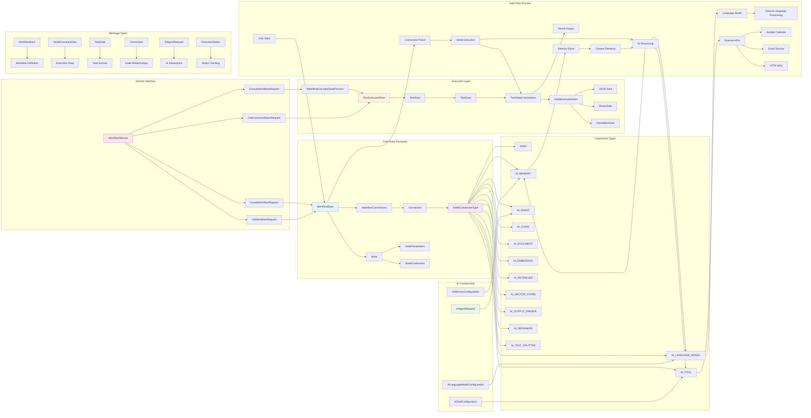
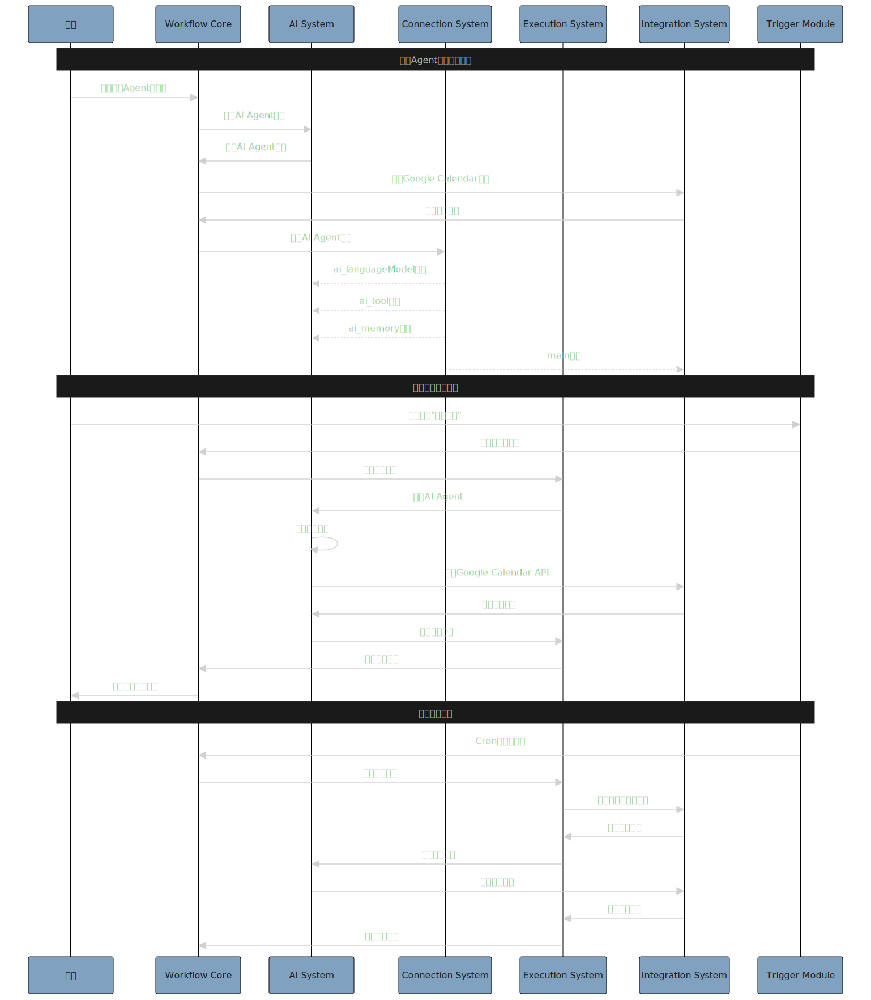
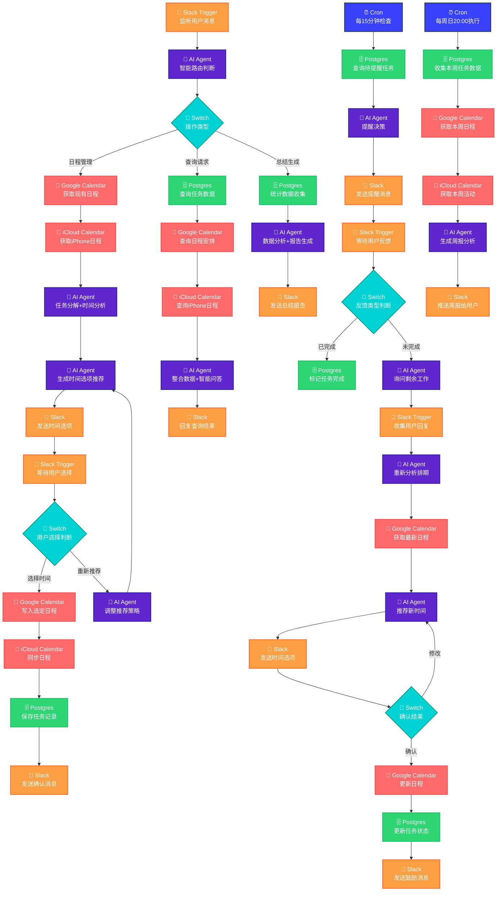

# [MVP] Workflow 节点的数据结构定义

## 📚 目录

- [🏗️ 模块定义](#模块定义)
  - [模块定义 & 解释](#模块定义--解释)
  - [模块工作流](#模块工作流)
- [🎯 UseCase - 秘书 Agent](#usecase---秘书-agent)
  - [时序图](#时序图)
  - [工作流](#工作流)
  - [🏗️ 总体架构](#总体架构)
    - [🔧 核心模块详解](#核心模块详解)
    - [⏰ 智能定时任务系统](#智能定时任务系统)
    - [🔄 数据流转逻辑](#数据流转逻辑)
    - [🎯 系统价值](#系统价值)
- [💻 Example Workflow JSON](#example-workflow-json秘书-agent---个人助理专家)

---

## 🏗️ 模块定义

### 模块定义 & 解释



#### 1️⃣ 工作流核心模块 (Workflow Core Module)

> **核心功能**：工作流的整体定义和管理

**模块职责**

- 🔄 **Workflow** - 工作流定义，包含节点、连接、设置等
- ⚙️ **WorkflowSettings** - 工作流配置，包含错误策略、超时等
- 📍 **Position** - 节点位置信息

**关键特性**

- 工作流整体生成和调度
- 分布式节点管理
- 统一配置管理

```protobuf
// ============================================================================
// 工作流核心模块 (Workflow Core Module)
// ============================================================================

// 工作流定义
message Workflow {
  string id = 1;
  string name = 2;
  bool active = 3;
  repeated Node nodes = 4;
  ConnectionsMap connections = 5;
  WorkflowSettings settings = 6;
  map<string, string> static_data = 7;
  map<string, string> pin_data = 8;
  int64 created_at = 9;
  int64 updated_at = 10;
  string version = 11;
  repeated string tags = 12;
}

// 工作流设置
message WorkflowSettings {
  map<string, string> timezone = 1;
  bool save_execution_progress = 2;
  bool save_manual_executions = 3;
  int32 timeout = 4;
  ErrorPolicy error_policy = 5;
  CallerPolicy caller_policy = 6;
}

// 错误处理策略
enum ErrorPolicy {
  STOP_WORKFLOW = 0;
  CONTINUE_REGULAR_OUTPUT = 1;
  CONTINUE_ERROR_OUTPUT = 2;
}

// 调用者策略
enum CallerPolicy {
  WORKFLOW_MAIN = 0;
  WORKFLOW_SUB = 1;
}

```

#### 2️⃣ 节点模块 (Node Module)

> **核心功能**：定义工作流中的执行单元

```protobuf
// ============================================================================
// 节点模块 (Node Module)
// ============================================================================

// 节点类型枚举 - 8大核心节点类型
enum NodeType {
  TRIGGER_NODE = 0;           // 触发器节点 - Semi-rounded box
  AI_AGENT_NODE = 1;          // AI代理节点 - Rectangle with connection points
  EXTERNAL_ACTION_NODE = 2;   // 外部动作节点 - Square
  ACTION_NODE = 3;            // 动作节点 - Square
  FLOW_NODE = 4;              // 流程控制节点 - Rectangle
  HUMAN_IN_THE_LOOP_NODE = 5; // 人机交互节点 - Human interaction required
  TOOL_NODE = 6;              // 工具节点 - Circle
  MEMORY_NODE = 7;            // 记忆节点 - Circle (包含Buffer/Knowledge/Vector子类型)
}

// 节点子类型枚举 - 具体实现类型 (待细化)
enum NodeSubtype {
  // 触发器子类型
  TRIGGER_CHAT = 0;
  TRIGGER_WEBHOOK = 1;
  TRIGGER_CRON = 2;
  TRIGGER_MANUAL = 3;
  TRIGGER_EMAIL = 4;
  TRIGGER_FORM = 5;
  TRIGGER_CALENDAR = 6;

  // AI Agent子类型
  AI_AGENT = 10;
  AI_CLASSIFIER = 11;

  // 外部动作子类型
  EXTERNAL_GITHUB = 20;
  EXTERNAL_GOOGLE_CALENDAR = 21;
  EXTERNAL_TRELLO = 22;
  EXTERNAL_EMAIL = 23;
  EXTERNAL_SLACK = 24;
  EXTERNAL_API_CALL = 25;
  EXTERNAL_WEBHOOK = 26;
  EXTERNAL_NOTIFICATION = 27;

  // 动作子类型
  ACTION_RUN_CODE = 30;
  ACTION_SEND_HTTP_REQUEST = 31;
  ACTION_PARSE_IMAGE = 32;
  ACTION_WEB_SEARCH = 33;
  ACTION_DATABASE_OPERATION = 34;
  ACTION_FILE_OPERATION = 35;
  ACTION_DATA_TRANSFORMATION = 36;

  // 流程控制子类型
  FLOW_IF = 40;
  FLOW_FILTER = 41;
  FLOW_LOOP = 42;
  FLOW_MERGE = 43;
  FLOW_SWITCH = 44;
  FLOW_WAIT = 45;

  // 人机交互子类型
  HUMAN_GMAIL = 50;
  HUMAN_SLACK = 51;
  HUMAN_DISCORD = 52;
  HUMAN_TELEGRAM = 53;
  HUMAN_APP = 54;

  // 工具子类型
  TOOL_GOOGLE_CALENDAR_MCP = 60;
  TOOL_NOTION_MCP = 61;
  TOOL_CALENDAR = 62;
  TOOL_EMAIL = 63;
  TOOL_HTTP = 64;
  TOOL_CODE_EXECUTION = 65;

  // 记忆子类型
  MEMORY_SIMPLE = 70;
  MEMORY_BUFFER = 71;
  MEMORY_KNOWLEDGE = 72;
  MEMORY_VECTOR_STORE = 73;
  MEMORY_DOCUMENT = 74;
  MEMORY_EMBEDDING = 75;
}

message Node {
  string id = 1;
  string name = 2;
  NodeType type = 3;              // 使用枚举类型替代字符串
  NodeSubtype subtype = 4;
  int32 type_version = 5;
  Position position = 6;
  bool disabled = 7;
  map<string, string> parameters = 8;
  map<string, string> credentials = 9;
  ErrorHandling on_error = 10;
  RetryPolicy retry_policy = 11;
  map<string, string> notes = 12;
  repeated string webhooks = 13;
}

// 节点位置
message Position {
  float x = 1;
  float y = 2;
}

// 错误处理方式
enum ErrorHandling {
  STOP_WORKFLOW_ON_ERROR = 0;
  CONTINUE_REGULAR_OUTPUT_ON_ERROR = 1;
  CONTINUE_ERROR_OUTPUT_ON_ERROR = 2;
}

// 重试策略
message RetryPolicy {
  int32 max_tries = 1;
  int32 wait_between_tries = 2;
}
```

**核心组件**

- 🏷️ **NodeType** - 节点类型枚举，定义 8 种核心节点类型及其 UI 形状
- 🔖 **NodeSubtype** - 节点子类型枚举，具体实现分类（可扩展）
- 🔧 **Node** - 节点定义，包含类型、子类型、参数、位置、错误处理等
- 🔄 **RetryPolicy** - 重试策略配置
- ⚠️ **ErrorHandling** - 错误处理方式枚举

**🆕 新增节点类型说明**

- 🤝 **Human-In-The-Loop Node** - 人机交互节点，用于需要人工干预、确认或输入的场景
  - 支持多种交互渠道：Gmail、Slack、Discord、Telegram、App 等
  - 实现异步人工反馈收集和处理
  - 提供灵活的用户界面集成方案

#### 3️⃣ 连接系统模块 (Connection System Module)

> **核心功能**：负责节点间的数据流和控制流

```protobuf
// ============================================================================
// 连接系统模块 (Connection System Module)
// ============================================================================

// 连接映射 (nodeName -> connectionType -> connections)
message ConnectionsMap {
  map<string, NodeConnections> connections = 1;
}

// 节点连接定义
message NodeConnections {
  map<string, ConnectionArray> connection_types = 1;
}

// 连接数组
message ConnectionArray {
  repeated Connection connections = 1;
}

// 单个连接定义
message Connection {
  string node = 1;              // 目标节点名
  ConnectionType type = 2;      // 连接类型
  int32 index = 3;             // 端口索引
}

// 连接类型枚举
enum ConnectionType {
  MAIN = 0;
  AI_AGENT = 1;
  AI_CHAIN = 2;
  AI_DOCUMENT = 3;
  AI_EMBEDDING = 4;
  AI_LANGUAGE_MODEL = 5;
  AI_MEMORY = 6;
  AI_OUTPUT_PARSER = 7;
  AI_RETRIEVER = 8;
  AI_RERANKER = 9;
  AI_TEXT_SPLITTER = 10;
  AI_TOOL = 11;
  AI_VECTOR_STORE = 12;
}

```

**核心组件**

- 🗺️ **ConnectionsMap** - 连接映射，核心的数据流控制
- 🔗 **Connection** - 单个连接定义
- 🏷️ **ConnectionType** - 12 种连接类型，包括 main、ai_tool、ai_memory 等

#### 4️⃣ 执行系统模块 (Execution System Module)

> **核心功能**：管理工作流的执行状态和过程

```protobuf
// ============================================================================
// 执行系统模块 (Execution System Module)
// ============================================================================

// 执行数据
message ExecutionData {
  string execution_id = 1;
  string workflow_id = 2;
  ExecutionStatus status = 3;
  int64 start_time = 4;
  int64 end_time = 5;
  RunData run_data = 6;
  ExecutionMode mode = 7;
  string triggered_by = 8;
  map<string, string> metadata = 9;
}

// 执行状态
enum ExecutionStatus {
  NEW = 0;
  RUNNING = 1;
  SUCCESS = 2;
  ERROR = 3;
  CANCELED = 4;
  WAITING = 5;
}

// 执行模式
enum ExecutionMode {
  MANUAL = 0;
  TRIGGER = 1;
  WEBHOOK = 2;
  RETRY = 3;
}

// 运行数据
message RunData {
  map<string, NodeRunData> node_data = 1;
}

// 节点运行数据
message NodeRunData {
  repeated TaskData tasks = 1;
}

// 任务数据
message TaskData {
  int64 start_time = 1;
  int64 execution_time = 2;
  string source = 3;
  repeated NodeExecutionData data = 4;
  map<string, string> execution_status = 5;
  ErrorData error = 6;
}

// 节点执行数据
message NodeExecutionData {
  repeated DataItem data = 1;
  map<string, string> metadata = 2;
}

// 数据项
message DataItem {
  map<string, string> json_data = 1;
  repeated BinaryData binary_data = 2;
  bool paused = 3;
  map<string, string> metadata = 4;
}

// 二进制数据
message BinaryData {
  string property_name = 1;
  bytes data = 2;
  string mime_type = 3;
  string file_name = 4;
  int64 file_size = 5;
}

// 错误数据
message ErrorData {
  string message = 1;
  string stack = 2;
  string name = 3;
  int32 line_number = 4;
  map<string, string> context = 5;
}
```

**核心组件**

- 📊 **ExecutionData** - 执行数据，包含状态、时间、结果等
- 🔄 **RunData** - 运行数据，按节点组织
- 📝 **TaskData** - 任务数据，包含执行时间、状态等

#### 5️⃣ AI 系统模块 (AI System Module)

> **核心功能**：AI Agent 和相关组件

```protobuf
// ============================================================================
// AI系统模块 (AI System Module)
// ============================================================================

// AI Agent 配置
message AIAgentConfig {
  string agent_type = 1;
  string prompt = 2;
  AILanguageModel language_model = 3;
  repeated AITool tools = 4;
  AIMemory memory = 5;
  map<string, string> parameters = 6;
}

// AI 语言模型
message AILanguageModel {
  string model_type = 1;
  string model_name = 2;
  float temperature = 3;
  int32 max_tokens = 4;
  map<string, string> parameters = 5;
}

// AI 工具
message AITool {
  string tool_type = 1;
  string tool_name = 2;
  string description = 3;
  map<string, string> parameters = 4;
}

// AI 记忆
message AIMemory {
  string memory_type = 1;
  int32 max_tokens = 2;
  map<string, string> parameters = 3;
}

```

**核心组件**

- 🤖 **AIAgentConfig** - AI Agent 配置
- 🧠 **AILanguageModel** - AI 语言模型配置
- 🛠️ **AITool** - AI 工具定义
- 💭 **AIMemory** - AI 记忆系统

#### 6️⃣ 触发器模块 (Trigger Module)

> **核心功能**：工作流触发和调度管理

```protobuf
// ============================================================================
// 触发器模块 (Trigger Module)
// ============================================================================

// 触发器定义
message Trigger {
  string trigger_id = 1;
  TriggerType type = 2;
  string node_name = 3;
  map<string, string> configuration = 4;
  bool active = 5;
  Schedule schedule = 6;
}

// 触发器类型
enum TriggerType {
  WEBHOOK = 0;
  CRON = 1;
  MANUAL = 2;
  EMAIL = 3;
  FORM = 4;
  CALENDAR = 5;
}

// 调度配置
message Schedule {
  string cron_expression = 1;
  string timezone = 2;
  int64 next_execution = 3;
}
```

**核心组件**

- 🚀 **Trigger** - 触发器定义
- 📅 **Schedule** - 调度配置

#### 7️⃣ 集成系统模块 (Integration System Module)

> **核心功能**：第三方系统集成和凭证管理

```protobuf
// ============================================================================
// 集成系统模块 (Integration System Module)
// ============================================================================

// 第三方集成
message Integration {
  string integration_id = 1;
  string integration_type = 2;
  string name = 3;
  string version = 4;
  map<string, string> configuration = 5;
  CredentialConfig credentials = 6;
  repeated string supported_operations = 7;
}

// 凭证配置
message CredentialConfig {
  string credential_type = 1;
  string credential_id = 2;
  map<string, string> credential_data = 3;
}
```

**核心组件**

- 🔌 **Integration** - 第三方集成定义
- 🔐 **CredentialConfig** - 凭证配置管理

### 🔄 模块工作流



## 🎯 UseCase - 秘书 Agent

### 📊 时序图



### 🔄 工作流图

```mermaid
graph TB
    subgraph "Secretary Agent Workflow"
        UserReq[User Request: Schedule Meeting]
        UserReq --> SecAgent[Secretary AI Agent Node]

        SecAgent --> LM[Language Model Connection]
        SecAgent --> Tools[Tool Connections]
        SecAgent --> Memory[Memory Connection]
        SecAgent --> MainOut[Main Output]

        LM --> OpenAI[OpenAI GPT-4]

        Tools --> GCTool[Google Calendar Tool]
        Tools --> EmailTool[Email Send Tool]
        Tools --> HTTPTool[HTTP Request Tool]
        Tools --> CodeTool[Code Execution Tool]

        Memory --> BufferMem[Buffer Memory]
        Memory --> UserPrefs[User Preferences]

        MainOut --> NextActions[Next Actions]
    end

    subgraph "External Integrations"
        GCTool --> GCal[Google Calendar API]
        GCal --> FreeBusy[FreeBusy Query]
        GCal --> CreateEvent[Create Calendar Event]
        GCal --> SetReminder[Set Reminder]

        EmailTool --> SMTP[SMTP Server]
        SMTP --> Notification[Email Notification]

        HTTPTool --> iCloud[iCloud Calendar]
        iCloud --> CalDAV[CalDAV Protocol]
    end

    subgraph "Workflow Execution Flow"
        WF[Workflow Definition]
        WF --> Connections[WorkflowConnections]
        WF --> Nodes[Node Array]

        Connections --> SecAgentConn[Secretary Agent Connections]
        SecAgentConn --> MainConn[main connections]
        SecAgentConn --> AILMConn[ai_languageModel connections]
        SecAgentConn --> AIToolConn[ai_tool connections]
        SecAgentConn --> AIMemConn[ai_memory connections]

        Nodes --> SecAgentNode[Secretary Agent Node]
        Nodes --> OpenAINode[OpenAI Model Node]
        Nodes --> GCalNode[Google Calendar Node]
        Nodes --> EmailNode[Email Send Node]

        SecAgentNode --> NodeParams[Node Parameters]
        NodeParams --> AgentType[agent: toolsAgent]
        NodeParams --> Prompt[System Prompt]
        NodeParams --> Tools[Available Tools]
    end

    subgraph "Execution Data Flow"
        ExecProcess[WorkflowExecutionDataProcess]
        ExecProcess --> RunExecData[RunExecutionData]
        RunExecData --> RunData[RunData]

        RunData --> SecAgentTask[Secretary Agent TaskData]
        RunData --> GCalTask[Google Calendar TaskData]
        RunData --> EmailTask[Email Send TaskData]

        SecAgentTask --> TaskDataConn[TaskDataConnections]
        TaskDataConn --> MainData[main data]
        TaskDataConn --> AIData[ai_tool data]

        MainData --> NodeExecData[NodeExecutionData]
        NodeExecData --> JSONData[JSON: meeting request]
        NodeExecData --> BinaryData[Binary: attachments]

        AIData --> ToolResults[Tool Execution Results]
        ToolResults --> CalendarData[Calendar API Response]
        ToolResults --> EmailData[Email Send Response]
    end

    subgraph "Scheduling Triggers"
        CronTrigger[Cron Trigger: Daily 9AM]
        CronTrigger --> DailyCheck[Daily Schedule Check]

        CalTrigger[Google Calendar Trigger]
        CalTrigger --> EventCreated[Event Created]
        CalTrigger --> EventUpdated[Event Updated]
        CalTrigger --> EventStarting[Event Starting Soon]

        DailyCheck --> TaskPriority[Task Priority Analysis]
        EventStarting --> ReminderFlow[Reminder Workflow]

        TaskPriority --> SecAgent
        ReminderFlow --> EmailTool
    end

    subgraph "Data Storage"
        WF --> StaticData[Static Data]
        StaticData --> UserSettings[User Preferences]
        StaticData --> TaskHistory[Task History]
        StaticData --> PriorityRules[Priority Rules]

        WF --> PinData[Pin Data]
        PinData --> TestData[Test Calendar Data]
        PinData --> MockResponses[Mock API Responses]

        RunExecData --> Metadata[Execution Metadata]
        Metadata --> Performance[Performance Metrics]
        Metadata --> ErrorLogs[Error Logs]
    end

    subgraph "AI Agent Architecture"
        SecAgent --> AgentCore[Agent Core Logic]
        AgentCore --> Planning[Task Planning]
        AgentCore --> Execution[Tool Execution]
        AgentCore --> Response[Response Generation]

        Planning --> TimeAnalysis[Available Time Analysis]
        Planning --> ConflictCheck[Conflict Detection]
        Planning --> Optimization[Schedule Optimization]

        Execution --> APICall[External API Calls]
        Execution --> DataTransform[Data Transformation]
        Execution --> ErrorHandle[Error Handling]

        Response --> NLGeneration[Natural Language Generation]
        Response --> ActionSummary[Action Summary]
        Response --> UserFeedback[User Feedback]
    end

    style SecAgent fill:#e1f5fe
    style GCTool fill:#f3e5f5
    style Memory fill:#fff3e0
    style CronTrigger fill:#e8f5e8
    style StaticData fill:#fce4ec
```



---

## 💻 Example Workflow JSON：秘书 Agent - 个人助理专家

### 系统概览

本个人秘书工作流程采用**模块化设计**，包含 **5 个核心功能模块** 和 **2 个智能定时任务系统**。所有用户交互通过 **Slack** 统一处理，实现自然语言驱动的智能时间管理。

系统由 5 个核心模块组成，实现完整的 AI 驱动时间管理流程：

**1️⃣ 用户交互入口模块** - 通过 Slack 接收用户消息，AI Agent 智能解析意图并路由到相应模块

**2️⃣ 日程管理模块** - 整合 Google Calendar 和 iCloud Calendar 数据，AI 智能分解任务并生成多个时间选项供用户选择，支持双日历同步

**3️⃣ 查询处理模块** - 实时整合 Postgres 任务数据和日历信息，AI 生成智能回答，支持日程查询、任务状态和空闲时间查询

**4️⃣ 总结生成模块** - 基于历史数据生成工作总结报告，包含任务完成统计、时间分配分析和效率指标计算

**5️⃣ 任务延期处理模块** - 智能处理未完成任务，AI 重新分析排期并推荐新时间选项，支持人性化交互和状态跟踪



```json
{
  "id": "workflow-personal-secretary-001",
  "name": "Personal Secretary Agent Workflow",
  "active": true,
  "nodes": [
    {
      "id": "node-slack-trigger",
      "name": "Slack Trigger",
      "type": "trigger",
      "type_version": 1,
      "position": { "x": 100, "y": 100 },
      "disabled": false,
      "parameters": {
        "trigger_type": "slack",
        "channel": "#personal-assistant",
        "listen_for": "user_messages"
      },
      "credentials": { "slack_token": "SLACK_BOT_TOKEN" },
      "on_error": "STOP_WORKFLOW_ON_ERROR",
      "retry_policy": { "max_tries": 1, "wait_between_tries": 0 },
      "notes": {},
      "webhooks": []
    },
    {
      "id": "node-ai-router",
      "name": "AI Router Agent",
      "type": "ai_agent",
      "type_version": 1,
      "position": { "x": 300, "y": 100 },
      "disabled": false,
      "parameters": {
        "agent_type": "router",
        "prompt": "分析用户意图并路由到相应模块：日程管理、查询请求、总结生成",
        "tools": "[]",
        "memory": "BufferMemory"
      },
      "credentials": {},
      "on_error": "CONTINUE_REGULAR_OUTPUT_ON_ERROR",
      "retry_policy": { "max_tries": 2, "wait_between_tries": 5 },
      "notes": {},
      "webhooks": []
    },
    {
      "id": "node-operation-switch",
      "name": "Operation Switch",
      "type": "switch",
      "type_version": 1,
      "position": { "x": 500, "y": 100 },
      "disabled": false,
      "parameters": {
        "switch_type": "operation_type",
        "conditions": [
          { "type": "schedule_management", "value": "日程管理" },
          { "type": "query_request", "value": "查询请求" },
          { "type": "summary_generation", "value": "总结生成" }
        ]
      },
      "credentials": {},
      "on_error": "CONTINUE_REGULAR_OUTPUT_ON_ERROR",
      "retry_policy": { "max_tries": 1, "wait_between_tries": 0 },
      "notes": {},
      "webhooks": []
    },
    {
      "id": "node-google-calendar-get",
      "name": "Google Calendar Get",
      "type": "ai_tool",
      "type_version": 1,
      "position": { "x": 700, "y": 50 },
      "disabled": false,
      "parameters": {
        "tool_type": "calendar",
        "tool_name": "GoogleCalendarTool",
        "action": "get_events"
      },
      "credentials": { "oauth_token": "GOOGLE_OAUTH_TOKEN" },
      "on_error": "CONTINUE_ERROR_OUTPUT_ON_ERROR",
      "retry_policy": { "max_tries": 2, "wait_between_tries": 10 },
      "notes": {},
      "webhooks": []
    },
    {
      "id": "node-icloud-calendar-get",
      "name": "iCloud Calendar Get",
      "type": "ai_tool",
      "type_version": 1,
      "position": { "x": 900, "y": 50 },
      "disabled": false,
      "parameters": {
        "tool_type": "calendar",
        "tool_name": "iCloudCalendarTool",
        "action": "get_events"
      },
      "credentials": {
        "apple_id": "APPLE_ID",
        "app_specific_password": "APP_SPECIFIC_PASSWORD"
      },
      "on_error": "CONTINUE_ERROR_OUTPUT_ON_ERROR",
      "retry_policy": { "max_tries": 2, "wait_between_tries": 10 },
      "notes": {},
      "webhooks": []
    },
    {
      "id": "node-task-analyzer",
      "name": "Task Analyzer AI",
      "type": "ai_agent",
      "type_version": 1,
      "position": { "x": 1100, "y": 50 },
      "disabled": false,
      "parameters": {
        "agent_type": "taskAnalyzer",
        "prompt": "任务分解+时间分析，生成多个时间选项推荐",
        "tools": "[]",
        "memory": "BufferMemory"
      },
      "credentials": {},
      "on_error": "CONTINUE_REGULAR_OUTPUT_ON_ERROR",
      "retry_policy": { "max_tries": 2, "wait_between_tries": 5 },
      "notes": {},
      "webhooks": []
    },
    {
      "id": "node-slack-send-options",
      "name": "Slack Send Options",
      "type": "ai_tool",
      "type_version": 1,
      "position": { "x": 1300, "y": 50 },
      "disabled": false,
      "parameters": {
        "tool_type": "notification",
        "tool_name": "SlackNotificationTool",
        "channel": "#personal-assistant",
        "action": "send_options",
        "template": "时间选项推荐"
      },
      "credentials": { "slack_token": "SLACK_BOT_TOKEN" },
      "on_error": "CONTINUE_ERROR_OUTPUT_ON_ERROR",
      "retry_policy": { "max_tries": 2, "wait_between_tries": 10 },
      "notes": {},
      "webhooks": []
    },
    {
      "id": "node-slack-wait-choice",
      "name": "Slack Wait User Choice",
      "type": "trigger",
      "type_version": 1,
      "position": { "x": 1500, "y": 50 },
      "disabled": false,
      "parameters": {
        "trigger_type": "slack",
        "channel": "#personal-assistant",
        "listen_for": "user_choice",
        "timeout": 300
      },
      "credentials": { "slack_token": "SLACK_BOT_TOKEN" },
      "on_error": "CONTINUE_ERROR_OUTPUT_ON_ERROR",
      "retry_policy": { "max_tries": 1, "wait_between_tries": 0 },
      "notes": {},
      "webhooks": []
    },
    {
      "id": "node-choice-switch",
      "name": "User Choice Switch",
      "type": "switch",
      "type_version": 1,
      "position": { "x": 1700, "y": 50 },
      "disabled": false,
      "parameters": {
        "switch_type": "user_choice",
        "conditions": [
          { "type": "select_time", "value": "选择时间" },
          { "type": "regenerate", "value": "重新推荐" }
        ]
      },
      "credentials": {},
      "on_error": "CONTINUE_REGULAR_OUTPUT_ON_ERROR",
      "retry_policy": { "max_tries": 1, "wait_between_tries": 0 },
      "notes": {},
      "webhooks": []
    },
    {
      "id": "node-google-calendar-write",
      "name": "Google Calendar Write",
      "type": "ai_tool",
      "type_version": 1,
      "position": { "x": 1900, "y": 50 },
      "disabled": false,
      "parameters": {
        "tool_type": "calendar",
        "tool_name": "GoogleCalendarTool",
        "action": "create_event"
      },
      "credentials": { "oauth_token": "GOOGLE_OAUTH_TOKEN" },
      "on_error": "CONTINUE_ERROR_OUTPUT_ON_ERROR",
      "retry_policy": { "max_tries": 2, "wait_between_tries": 10 },
      "notes": {},
      "webhooks": []
    },
    {
      "id": "node-icloud-calendar-sync",
      "name": "iCloud Calendar Sync",
      "type": "ai_tool",
      "type_version": 1,
      "position": { "x": 2100, "y": 50 },
      "disabled": false,
      "parameters": {
        "tool_type": "calendar",
        "tool_name": "iCloudCalendarTool",
        "action": "sync_event"
      },
      "credentials": {
        "apple_id": "APPLE_ID",
        "app_specific_password": "APP_SPECIFIC_PASSWORD"
      },
      "on_error": "CONTINUE_ERROR_OUTPUT_ON_ERROR",
      "retry_policy": { "max_tries": 2, "wait_between_tries": 10 },
      "notes": {},
      "webhooks": []
    },
    {
      "id": "node-postgres-save",
      "name": "Postgres Save Task",
      "type": "database",
      "type_version": 1,
      "position": { "x": 2300, "y": 50 },
      "disabled": false,
      "parameters": {
        "db_type": "postgresql",
        "action": "insert",
        "table": "tasks"
      },
      "credentials": { "postgres_connection": "POSTGRES_CONNECTION_STRING" },
      "on_error": "CONTINUE_ERROR_OUTPUT_ON_ERROR",
      "retry_policy": { "max_tries": 2, "wait_between_tries": 10 },
      "notes": {},
      "webhooks": []
    },
    {
      "id": "node-slack-confirm",
      "name": "Slack Confirm",
      "type": "ai_tool",
      "type_version": 1,
      "position": { "x": 2500, "y": 50 },
      "disabled": false,
      "parameters": {
        "tool_type": "notification",
        "tool_name": "SlackNotificationTool",
        "channel": "#personal-assistant",
        "action": "send_confirmation"
      },
      "credentials": { "slack_token": "SLACK_BOT_TOKEN" },
      "on_error": "CONTINUE_ERROR_OUTPUT_ON_ERROR",
      "retry_policy": { "max_tries": 2, "wait_between_tries": 10 },
      "notes": {},
      "webhooks": []
    },
    {
      "id": "node-postgres-query-tasks",
      "name": "Postgres Query Tasks",
      "type": "database",
      "type_version": 1,
      "position": { "x": 700, "y": 150 },
      "disabled": false,
      "parameters": {
        "db_type": "postgresql",
        "action": "query",
        "table": "tasks"
      },
      "credentials": { "postgres_connection": "POSTGRES_CONNECTION_STRING" },
      "on_error": "CONTINUE_ERROR_OUTPUT_ON_ERROR",
      "retry_policy": { "max_tries": 2, "wait_between_tries": 10 },
      "notes": {},
      "webhooks": []
    },
    {
      "id": "node-google-calendar-query",
      "name": "Google Calendar Query",
      "type": "ai_tool",
      "type_version": 1,
      "position": { "x": 900, "y": 150 },
      "disabled": false,
      "parameters": {
        "tool_type": "calendar",
        "tool_name": "GoogleCalendarTool",
        "action": "query_schedule"
      },
      "credentials": { "oauth_token": "GOOGLE_OAUTH_TOKEN" },
      "on_error": "CONTINUE_ERROR_OUTPUT_ON_ERROR",
      "retry_policy": { "max_tries": 2, "wait_between_tries": 10 },
      "notes": {},
      "webhooks": []
    },
    {
      "id": "node-icloud-calendar-query",
      "name": "iCloud Calendar Query",
      "type": "ai_tool",
      "type_version": 1,
      "position": { "x": 1100, "y": 150 },
      "disabled": false,
      "parameters": {
        "tool_type": "calendar",
        "tool_name": "iCloudCalendarTool",
        "action": "query_activities"
      },
      "credentials": {
        "apple_id": "APPLE_ID",
        "app_specific_password": "APP_SPECIFIC_PASSWORD"
      },
      "on_error": "CONTINUE_ERROR_OUTPUT_ON_ERROR",
      "retry_policy": { "max_tries": 2, "wait_between_tries": 10 },
      "notes": {},
      "webhooks": []
    },
    {
      "id": "node-data-integrator",
      "name": "Data Integrator AI",
      "type": "ai_agent",
      "type_version": 1,
      "position": { "x": 1300, "y": 150 },
      "disabled": false,
      "parameters": {
        "agent_type": "dataIntegrator",
        "prompt": "整合任务数据和双日历信息，生成智能回答",
        "tools": "[]",
        "memory": "BufferMemory"
      },
      "credentials": {},
      "on_error": "CONTINUE_REGULAR_OUTPUT_ON_ERROR",
      "retry_policy": { "max_tries": 2, "wait_between_tries": 5 },
      "notes": {},
      "webhooks": []
    },
    {
      "id": "node-slack-reply-query",
      "name": "Slack Reply Query",
      "type": "ai_tool",
      "type_version": 1,
      "position": { "x": 1500, "y": 150 },
      "disabled": false,
      "parameters": {
        "tool_type": "notification",
        "tool_name": "SlackNotificationTool",
        "channel": "#personal-assistant",
        "action": "reply_query_result"
      },
      "credentials": { "slack_token": "SLACK_BOT_TOKEN" },
      "on_error": "CONTINUE_ERROR_OUTPUT_ON_ERROR",
      "retry_policy": { "max_tries": 2, "wait_between_tries": 10 },
      "notes": {},
      "webhooks": []
    },
    {
      "id": "node-postgres-stats",
      "name": "Postgres Statistics",
      "type": "database",
      "type_version": 1,
      "position": { "x": 700, "y": 250 },
      "disabled": false,
      "parameters": {
        "db_type": "postgresql",
        "action": "statistics",
        "table": "tasks"
      },
      "credentials": { "postgres_connection": "POSTGRES_CONNECTION_STRING" },
      "on_error": "CONTINUE_ERROR_OUTPUT_ON_ERROR",
      "retry_policy": { "max_tries": 2, "wait_between_tries": 10 },
      "notes": {},
      "webhooks": []
    },
    {
      "id": "node-report-generator",
      "name": "Report Generator AI",
      "type": "ai_agent",
      "type_version": 1,
      "position": { "x": 900, "y": 250 },
      "disabled": false,
      "parameters": {
        "agent_type": "reportGenerator",
        "prompt": "数据分析+报告生成",
        "tools": "[]",
        "memory": "BufferMemory"
      },
      "credentials": {},
      "on_error": "CONTINUE_REGULAR_OUTPUT_ON_ERROR",
      "retry_policy": { "max_tries": 2, "wait_between_tries": 5 },
      "notes": {},
      "webhooks": []
    },
    {
      "id": "node-slack-send-report",
      "name": "Slack Send Report",
      "type": "ai_tool",
      "type_version": 1,
      "position": { "x": 1100, "y": 250 },
      "disabled": false,
      "parameters": {
        "tool_type": "notification",
        "tool_name": "SlackNotificationTool",
        "channel": "#personal-assistant",
        "action": "send_summary_report"
      },
      "credentials": { "slack_token": "SLACK_BOT_TOKEN" },
      "on_error": "CONTINUE_ERROR_OUTPUT_ON_ERROR",
      "retry_policy": { "max_tries": 2, "wait_between_tries": 10 },
      "notes": {},
      "webhooks": []
    },
    {
      "id": "node-reminder-cron",
      "name": "Reminder Cron",
      "type": "trigger",
      "type_version": 1,
      "position": { "x": 100, "y": 350 },
      "disabled": false,
      "parameters": {
        "trigger_type": "cron",
        "cron_expression": "*/15 * * * *",
        "timezone": "Asia/Shanghai"
      },
      "credentials": {},
      "on_error": "CONTINUE_REGULAR_OUTPUT_ON_ERROR",
      "retry_policy": { "max_tries": 1, "wait_between_tries": 0 },
      "notes": {},
      "webhooks": []
    },
    {
      "id": "node-postgres-remind-query",
      "name": "Postgres Reminder Query",
      "type": "database",
      "type_version": 1,
      "position": { "x": 300, "y": 350 },
      "disabled": false,
      "parameters": {
        "db_type": "postgresql",
        "action": "query_pending_reminders",
        "table": "tasks"
      },
      "credentials": { "postgres_connection": "POSTGRES_CONNECTION_STRING" },
      "on_error": "CONTINUE_ERROR_OUTPUT_ON_ERROR",
      "retry_policy": { "max_tries": 2, "wait_between_tries": 10 },
      "notes": {},
      "webhooks": []
    },
    {
      "id": "node-remind-decision-ai",
      "name": "Reminder Decision AI",
      "type": "ai_agent",
      "type_version": 1,
      "position": { "x": 500, "y": 350 },
      "disabled": false,
      "parameters": {
        "agent_type": "reminderDecision",
        "prompt": "智能提醒决策：重要性权重+防骚扰+日程感知",
        "tools": "[]",
        "memory": "BufferMemory"
      },
      "credentials": {},
      "on_error": "CONTINUE_REGULAR_OUTPUT_ON_ERROR",
      "retry_policy": { "max_tries": 2, "wait_between_tries": 5 },
      "notes": {},
      "webhooks": []
    },
    {
      "id": "node-slack-send-reminder",
      "name": "Slack Send Reminder",
      "type": "ai_tool",
      "type_version": 1,
      "position": { "x": 700, "y": 350 },
      "disabled": false,
      "parameters": {
        "tool_type": "notification",
        "tool_name": "SlackNotificationTool",
        "channel": "#personal-assistant",
        "action": "send_reminder"
      },
      "credentials": { "slack_token": "SLACK_BOT_TOKEN" },
      "on_error": "CONTINUE_ERROR_OUTPUT_ON_ERROR",
      "retry_policy": { "max_tries": 2, "wait_between_tries": 10 },
      "notes": {},
      "webhooks": []
    },
    {
      "id": "node-weekly-cron",
      "name": "Weekly Report Cron",
      "type": "trigger",
      "type_version": 1,
      "position": { "x": 100, "y": 450 },
      "disabled": false,
      "parameters": {
        "trigger_type": "cron",
        "cron_expression": "0 20 * * 0",
        "timezone": "Asia/Shanghai"
      },
      "credentials": {},
      "on_error": "CONTINUE_REGULAR_OUTPUT_ON_ERROR",
      "retry_policy": { "max_tries": 1, "wait_between_tries": 0 },
      "notes": {},
      "webhooks": []
    },
    {
      "id": "node-postgres-weekly-data",
      "name": "Postgres Weekly Data",
      "type": "database",
      "type_version": 1,
      "position": { "x": 300, "y": 450 },
      "disabled": false,
      "parameters": {
        "db_type": "postgresql",
        "action": "collect_weekly_data",
        "table": "tasks"
      },
      "credentials": { "postgres_connection": "POSTGRES_CONNECTION_STRING" },
      "on_error": "CONTINUE_ERROR_OUTPUT_ON_ERROR",
      "retry_policy": { "max_tries": 2, "wait_between_tries": 10 },
      "notes": {},
      "webhooks": []
    },
    {
      "id": "node-google-calendar-weekly",
      "name": "Google Calendar Weekly",
      "type": "ai_tool",
      "type_version": 1,
      "position": { "x": 500, "y": 450 },
      "disabled": false,
      "parameters": {
        "tool_type": "calendar",
        "tool_name": "GoogleCalendarTool",
        "action": "get_weekly_schedule"
      },
      "credentials": { "oauth_token": "GOOGLE_OAUTH_TOKEN" },
      "on_error": "CONTINUE_ERROR_OUTPUT_ON_ERROR",
      "retry_policy": { "max_tries": 2, "wait_between_tries": 10 },
      "notes": {},
      "webhooks": []
    },
    {
      "id": "node-icloud-calendar-weekly",
      "name": "iCloud Calendar Weekly",
      "type": "ai_tool",
      "type_version": 1,
      "position": { "x": 700, "y": 450 },
      "disabled": false,
      "parameters": {
        "tool_type": "calendar",
        "tool_name": "iCloudCalendarTool",
        "action": "get_weekly_activities"
      },
      "credentials": {
        "apple_id": "APPLE_ID",
        "app_specific_password": "APP_SPECIFIC_PASSWORD"
      },
      "on_error": "CONTINUE_ERROR_OUTPUT_ON_ERROR",
      "retry_policy": { "max_tries": 2, "wait_between_tries": 10 },
      "notes": {},
      "webhooks": []
    },
    {
      "id": "node-weekly-report-ai",
      "name": "Weekly Report AI",
      "type": "ai_agent",
      "type_version": 1,
      "position": { "x": 900, "y": 450 },
      "disabled": false,
      "parameters": {
        "agent_type": "weeklyReportGenerator",
        "prompt": "生成周报分析：任务统计+时间分析+效率趋势+问题识别+下周重点",
        "tools": "[]",
        "memory": "BufferMemory"
      },
      "credentials": {},
      "on_error": "CONTINUE_REGULAR_OUTPUT_ON_ERROR",
      "retry_policy": { "max_tries": 2, "wait_between_tries": 5 },
      "notes": {},
      "webhooks": []
    },
    {
      "id": "node-slack-push-weekly",
      "name": "Slack Push Weekly Report",
      "type": "ai_tool",
      "type_version": 1,
      "position": { "x": 1100, "y": 450 },
      "disabled": false,
      "parameters": {
        "tool_type": "notification",
        "tool_name": "SlackNotificationTool",
        "channel": "#personal-assistant",
        "action": "push_weekly_report"
      },
      "credentials": { "slack_token": "SLACK_BOT_TOKEN" },
      "on_error": "CONTINUE_ERROR_OUTPUT_ON_ERROR",
      "retry_policy": { "max_tries": 2, "wait_between_tries": 10 },
      "notes": {},
      "webhooks": []
    }
  ],
  "connections": {
    "connections": {
      "Slack Trigger": {
        "main": {
          "connections": [
            { "node": "AI Router Agent", "type": "MAIN", "index": 0 }
          ]
        }
      },
      "AI Router Agent": {
        "main": {
          "connections": [
            { "node": "Operation Switch", "type": "MAIN", "index": 0 }
          ]
        }
      },
      "Operation Switch": {
        "schedule_management": {
          "connections": [
            { "node": "Google Calendar Get", "type": "MAIN", "index": 0 }
          ]
        },
        "query_request": {
          "connections": [
            { "node": "Postgres Query Tasks", "type": "MAIN", "index": 0 }
          ]
        },
        "summary_generation": {
          "connections": [
            { "node": "Postgres Statistics", "type": "MAIN", "index": 0 }
          ]
        }
      },
      "Google Calendar Get": {
        "main": {
          "connections": [
            { "node": "iCloud Calendar Get", "type": "MAIN", "index": 0 }
          ]
        }
      },
      "iCloud Calendar Get": {
        "main": {
          "connections": [
            { "node": "Task Analyzer AI", "type": "MAIN", "index": 0 }
          ]
        }
      },
      "Task Analyzer AI": {
        "main": {
          "connections": [
            { "node": "Slack Send Options", "type": "MAIN", "index": 0 }
          ]
        }
      },
      "Slack Send Options": {
        "main": {
          "connections": [
            { "node": "Slack Wait User Choice", "type": "MAIN", "index": 0 }
          ]
        }
      },
      "Slack Wait User Choice": {
        "main": {
          "connections": [
            { "node": "User Choice Switch", "type": "MAIN", "index": 0 }
          ]
        }
      },
      "User Choice Switch": {
        "select_time": {
          "connections": [
            { "node": "Google Calendar Write", "type": "MAIN", "index": 0 }
          ]
        },
        "regenerate": {
          "connections": [
            { "node": "Task Analyzer AI", "type": "MAIN", "index": 0 }
          ]
        }
      },
      "Google Calendar Write": {
        "main": {
          "connections": [
            { "node": "iCloud Calendar Sync", "type": "MAIN", "index": 0 }
          ]
        }
      },
      "iCloud Calendar Sync": {
        "main": {
          "connections": [
            { "node": "Postgres Save Task", "type": "MAIN", "index": 0 }
          ]
        }
      },
      "Postgres Save Task": {
        "main": {
          "connections": [
            { "node": "Slack Confirm", "type": "MAIN", "index": 0 }
          ]
        }
      },
      "Postgres Query Tasks": {
        "main": {
          "connections": [
            { "node": "Google Calendar Query", "type": "MAIN", "index": 0 }
          ]
        }
      },
      "Google Calendar Query": {
        "main": {
          "connections": [
            { "node": "iCloud Calendar Query", "type": "MAIN", "index": 0 }
          ]
        }
      },
      "iCloud Calendar Query": {
        "main": {
          "connections": [
            { "node": "Data Integrator AI", "type": "MAIN", "index": 0 }
          ]
        }
      },
      "Data Integrator AI": {
        "main": {
          "connections": [
            { "node": "Slack Reply Query", "type": "MAIN", "index": 0 }
          ]
        }
      },
      "Postgres Statistics": {
        "main": {
          "connections": [
            { "node": "Report Generator AI", "type": "MAIN", "index": 0 }
          ]
        }
      },
      "Report Generator AI": {
        "main": {
          "connections": [
            { "node": "Slack Send Report", "type": "MAIN", "index": 0 }
          ]
        }
      },
      "Reminder Cron": {
        "main": {
          "connections": [
            { "node": "Postgres Reminder Query", "type": "MAIN", "index": 0 }
          ]
        }
      },
      "Postgres Reminder Query": {
        "main": {
          "connections": [
            { "node": "Reminder Decision AI", "type": "MAIN", "index": 0 }
          ]
        }
      },
      "Reminder Decision AI": {
        "main": {
          "connections": [
            { "node": "Slack Send Reminder", "type": "MAIN", "index": 0 }
          ]
        }
      },
      "Weekly Report Cron": {
        "main": {
          "connections": [
            { "node": "Postgres Weekly Data", "type": "MAIN", "index": 0 }
          ]
        }
      },
      "Postgres Weekly Data": {
        "main": {
          "connections": [
            { "node": "Google Calendar Weekly", "type": "MAIN", "index": 0 }
          ]
        }
      },
      "Google Calendar Weekly": {
        "main": {
          "connections": [
            { "node": "iCloud Calendar Weekly", "type": "MAIN", "index": 0 }
          ]
        }
      },
      "iCloud Calendar Weekly": {
        "main": {
          "connections": [
            { "node": "Weekly Report AI", "type": "MAIN", "index": 0 }
          ]
        }
      },
      "Weekly Report AI": {
        "main": {
          "connections": [
            { "node": "Slack Push Weekly Report", "type": "MAIN", "index": 0 }
          ]
        }
      }
    }
  },
  "settings": {
    "timezone": { "default": "Asia/Shanghai" },
    "save_execution_progress": true,
    "save_manual_executions": true,
    "timeout": 600,
    "error_policy": "CONTINUE_REGULAR_OUTPUT",
    "caller_policy": "WORKFLOW_MAIN"
  },
  "static_data": {
    "reminder_strategies": {
      "importance_weights": {
        "high": 30,
        "medium": 60,
        "low": 120
      },
      "anti_spam_rules": {
        "max_reminders_per_hour": 2,
        "min_interval_minutes": 15
      },
      "schedule_awareness": {
        "avoid_busy_periods": true,
        "respect_working_hours": true
      }
    },
    "user_preferences": {
      "timezone": "Asia/Shanghai",
      "working_hours": {
        "start": "09:00",
        "end": "18:00"
      },
      "notification_channels": ["#personal-assistant"],
      "calendar_sync": ["google", "icloud"]
    },
    "task_priority_rules": {
      "deadline_weight": 0.4,
      "importance_weight": 0.3,
      "complexity_weight": 0.2,
      "user_preference_weight": 0.1
    }
  },
  "pin_data": {},
  "created_at": 1719990000,
  "updated_at": 1719990000,
  "version": "1.2.0",
  "tags": [
    "secretary",
    "ai-agent",
    "google-calendar",
    "icloud-calendar",
    "smart-reminder",
    "weekly-report",
    "task-management",
    "slack-integration",
    "cron-scheduler",
    "postgresql",
    "user-confirmation",
    "delay-handling",
    "data-integration",
    "intelligent-routing"
  ]
}
```
