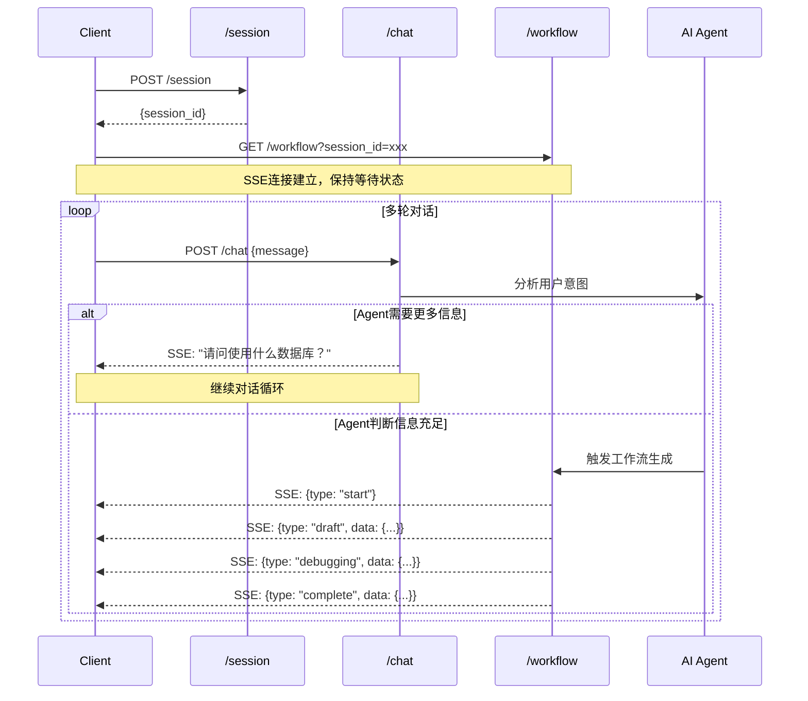

# Workflow Generation API Documentation

## 基础信息

- **Base URL**: `https://api.example.com/v1`
- **认证方式**: Cookie认证
- **Content-Type**: `application/json`（除SSE接口外）

## API 接口

### 1. POST /session
创建新会话

**请求**
```json
{
  "metadata": {}  // 可选，会话元数据
}
```

**响应**
```json
{
  "session_id": "550e8400-e29b-41d4-a716-446655440000",
  "created_at": "2024-01-20T10:30:00Z",
}
```

### 2. POST /chat
发送聊天消息，返回AI流式响应

**请求**
```json
{
  "session_id": "550e8400-e29b-41d4-a716-446655440000",
  "message": "帮我抢购一张5090，有货时通知我"
}
```

**响应（SSE流）**
```
Content-Type: text/event-stream

data: {"type": "message", "content": "1. 我将为你监控 BestBuy, Amazon 的实时货源，有其他需要监控的网站吗？"}

data: {"type": "message", "content": "2. 发现有货后我会通过邮件通知你，你还有其他需要我通知的渠道吗？"}
```

**事件类型**
- `type: "message"` - AI回复消息

### 3. GET /workflow
监听工作流生成进度

**请求**
```
GET /workflow?session_id=550e8400-e29b-41d4-a716-446655440000
```

**响应（SSE流）**
```
Content-Type: text/event-stream

data: {"type": "waiting"}

data: {"type": "start", "workflow_id": "wf_abc123"}

data: {"type": "draft", "workflow_id": "wf_abc123", "data": {...}}

data: {"type": "debugging", "workflow_id": "wf_abc123", "data": {...}}

data: {"type": "complete", "workflow_id": "wf_abc123", "data": {...}}
```

**事件类型**
- `type: "waiting"` - 等待开始
- `type: "start"` - 开始生成
- `type: "draft"` - 生成草稿
- `type: "debugging"` - 系统自动调试中
- `type: "complete"` - 生成完成，包含workflow数据
- `type: "error"` - 生成失败

## 错误响应

所有API错误响应格式：
```json
{
  "error": "error_type",
  "message": "错误描述"
}
```

**HTTP状态码**
- 400 - 请求参数错误
- 401 - 未认证（Cookie无效）
- 404 - 资源不存在
- 500 - 服务器错误

## 交互流程


