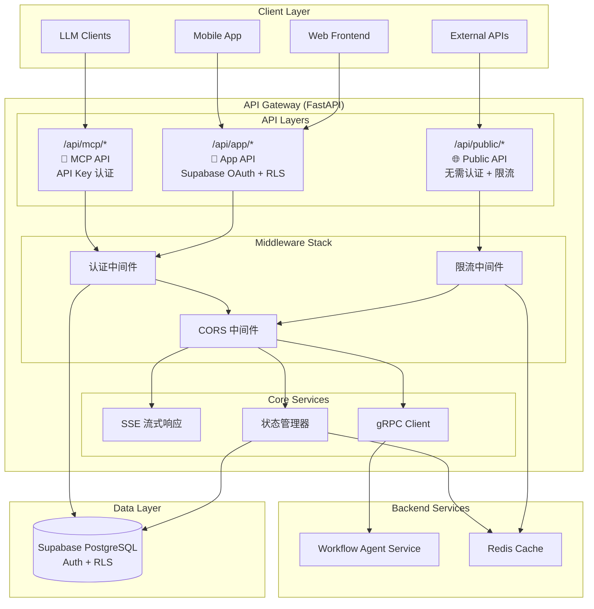
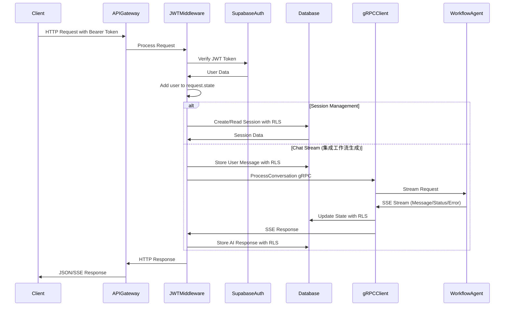

# API Gateway 技术架构设计

## 概述

API Gateway 是 Workflow Agent Team 系统的统一网关服务，提供三层 API 架构：**Public API**（公开接口）、**App API**（应用接口）和 **MCP API**（LLM工具接口）。基于 FastAPI 构建，支持多种认证方式和安全策略，为不同类型的客户端提供统一的访问入口。

## 架构图



## 三层 API 架构设计

### API 层级划分

| API 层级 | 路由前缀 | 认证方式 | 目标客户端 | 主要功能 |
|---------|----------|----------|------------|----------|
| **Public API** | `/api/public/*` | 无需认证 + 限流 | 外部系统、公开接口 | 健康检查、文档、公开信息 |
| **App API** | `/api/app/*` | Supabase OAuth + RLS | Web/Mobile 应用 | 用户会话、聊天、工作流管理 |
| **MCP API** | `/api/mcp/*` | API Key / 签名认证 | LLM 客户端 | 工具调用、模型集成 |

### 1. Public API 层

**设计原则**:
- 无需认证，但有严格限流
- 提供系统状态和基础信息
- 防止恶意访问和资源滥用

**端点设计**:
```
/api/public/
├── health                    # GET - 系统健康检查
├── status                    # GET - 服务状态信息
├── docs                      # GET - API 文档重定向
├── metrics                   # GET - 公开指标（可选）
└── info                      # GET - 系统基础信息
```

**限流策略**:
```python
# 每IP每分钟限制
PUBLIC_RATE_LIMITS = {
    "default": "100/minute",
    "/api/public/health": "1000/minute",  # 健康检查更宽松
    "/api/public/docs": "10/minute"       # 文档访问限制
}
```

### 2. App API 层

**设计原则**:
- Supabase OAuth 认证 + JWT 验证
- RLS 确保用户数据隔离
- 支持实时功能（SSE）

**端点设计**:
```
/api/app/
├── auth/
│   ├── profile               # GET - 用户信息
│   └── sessions              # GET - 用户会话列表
├── sessions/
│   ├── POST /                # 创建会话
│   ├── GET /{id}             # 获取会话详情
│   ├── PUT /{id}             # 更新会话
│   └── DELETE /{id}          # 删除会话
├── chat/
│   ├── POST /stream          # 流式聊天
│   └── GET /{session_id}/messages # 聊天历史
├── workflows/
│   ├── GET /                 # 用户工作流列表
│   ├── POST /                # 创建工作流
│   ├── GET /{workflow_id}    # 获取工作流详情
│   ├── PUT /{workflow_id}    # 更新工作流
│   ├── DELETE /{workflow_id} # 删除工作流
│   ├── POST /{workflow_id}/execute # 执行工作流
│   └── GET /{workflow_id}/history  # 工作流执行历史
├── executions/
│   ├── GET /{execution_id}   # 获取执行状态
│   └── POST /{execution_id}/cancel # 取消执行
└── files/                    # 文件上传/下载 (预留)
```

**认证流程**:
```python
@app.middleware("http")
async def app_auth_middleware(request: Request, call_next):
    """App API 认证中间件"""
    if request.url.path.startswith("/api/app/"):
        # 验证 Supabase JWT Token
        token = extract_bearer_token(request)
        user_data = await verify_supabase_token(token)

        if not user_data:
            return JSONResponse(status_code=401, content={"error": "unauthorized"})

        # 添加用户信息到请求状态
        request.state.user = user_data
        request.state.access_token = token

    return await call_next(request)
```

### 3. MCP API 层

**设计原则**:
- API Key 或签名认证
- 专为 LLM 客户端优化
- 高性能、低延迟

**端点设计**:
```
/api/mcp/
├── GET /tools                # 获取所有可用工具列表
├── POST /invoke              # 调用指定工具
├── GET /tools/{tool_name}    # 获取特定工具详细信息
└── GET /health               # MCP 服务健康检查
```

**API Key 认证**:
```python
@app.middleware("http")
async def mcp_auth_middleware(request: Request, call_next):
    """MCP API 认证中间件"""
    if request.url.path.startswith("/api/mcp/"):
        # 验证 API Key
        api_key = request.headers.get("X-API-Key")
        if not api_key or not verify_mcp_api_key(api_key):
            return JSONResponse(status_code=401, content={"error": "invalid_api_key"})

        # 添加客户端信息到请求状态
        client_info = get_client_by_api_key(api_key)
        request.state.client = client_info

    return await call_next(request)
```

## 核心组件

### 1. FastAPI 应用框架

**文件位置**: `apps/backend/api-gateway/app/main.py`

**三层架构配置**:
```python
app = FastAPI(
    title="Workflow Agent API Gateway",
    description="三层API架构：Public, App, MCP",
    version="2.0.0",
    lifespan=lifespan
)

# 路由注册
app.include_router(public_router, prefix="/api/public", tags=["public"])
app.include_router(app_router, prefix="/api/app", tags=["app"])
app.include_router(mcp_router, prefix="/api/mcp", tags=["mcp"])

# 中间件栈
app.add_middleware(CORSMiddleware, **cors_config)
app.add_middleware(RateLimitMiddleware)  # 限流
app.add_middleware(AuthMiddleware)       # 认证
app.add_middleware(LoggingMiddleware)    # 日志
```

### 2. 多层认证和授权系统

**文件位置**: `apps/backend/api-gateway/app/middleware/`

#### 2.1 统一认证中间件

```python
@app.middleware("http")
async def unified_auth_middleware(request: Request, call_next):
    """统一认证中间件 - 根据路径选择认证策略"""
    path = request.url.path

    # Public API - 无需认证，仅限流
    if path.startswith("/api/public/"):
        # 应用限流策略
        if not await check_rate_limit(request):
            return JSONResponse(status_code=429, content={"error": "rate_limit_exceeded"})

    # App API - Supabase OAuth 认证
    elif path.startswith("/api/app/"):
        auth_result = await authenticate_supabase_user(request)
        if not auth_result.success:
            return JSONResponse(status_code=401, content={"error": auth_result.error})

        # 添加用户信息到请求状态
        request.state.user = auth_result.user
        request.state.access_token = auth_result.token
        request.state.auth_type = "supabase"

    # MCP API - API Key 认证
    elif path.startswith("/api/mcp/"):
        auth_result = await authenticate_mcp_client(request)
        if not auth_result.success:
            return JSONResponse(status_code=401, content={"error": auth_result.error})

        # 添加客户端信息到请求状态
        request.state.client = auth_result.client
        request.state.auth_type = "api_key"

    return await call_next(request)
```

#### 2.2 限流策略

**文件位置**: `apps/backend/api-gateway/app/middleware/rate_limit.py`

```python
class RateLimitConfig:
    """限流配置"""

    # Public API 限流配置
    PUBLIC_LIMITS = {
        "global": "1000/hour",           # 全局限制
        "/api/public/health": "100/minute", # 健康检查
        "/api/public/info": "60/minute",    # 系统信息
        "/api/public/docs": "10/minute"     # 文档访问
    }

    # App API 用户限流配置
    APP_LIMITS = {
        "authenticated_user": "10000/hour",      # 认证用户全局限制
        "/api/app/chat/stream": "100/hour",      # 聊天流式接口
        "/api/app/sessions": "1000/hour",        # 会话操作
        "/api/app/workflows": "500/hour",        # 工作流 CRUD 操作
        "/api/app/workflows/execute": "100/hour", # 工作流执行
        "/api/app/executions": "200/hour"        # 执行状态查询
    }

    # MCP API 客户端限流配置
    MCP_LIMITS = {
        "api_client": "50000/hour",      # API 客户端全局限制
        "/api/mcp/invoke": "1000/hour",  # 工具调用
        "/api/mcp/tools": "5000/hour"    # 工具列表查询
    }

async def check_rate_limit(request: Request) -> bool:
    """检查请求是否超过限流"""
    path = request.url.path
    client_id = get_client_identifier(request)

    # 获取限流配置
    if path.startswith("/api/public/"):
        limits = RateLimitConfig.PUBLIC_LIMITS
        identifier = get_ip_address(request)
    elif path.startswith("/api/app/"):
        limits = RateLimitConfig.APP_LIMITS
        identifier = request.state.user.get("sub") if hasattr(request.state, "user") else get_ip_address(request)
    elif path.startswith("/api/mcp/"):
        limits = RateLimitConfig.MCP_LIMITS
        identifier = request.state.client.get("id") if hasattr(request.state, "client") else get_ip_address(request)
    else:
        return True

    # 检查特定路径限制
    specific_limit = limits.get(path)
    if specific_limit and not await redis_check_limit(f"{identifier}:{path}", specific_limit):
        return False

    # 检查全局限制
    global_key = next(iter(limits.keys()))
    global_limit = limits[global_key]
    return await redis_check_limit(f"{identifier}:global", global_limit)
```

#### 2.3 Supabase OAuth 认证

```python
async def authenticate_supabase_user(request: Request) -> AuthResult:
    """Supabase OAuth 用户认证"""
    try:
        # 提取 Bearer Token
        auth_header = request.headers.get("Authorization")
        if not auth_header or not auth_header.startswith("Bearer "):
            return AuthResult(success=False, error="missing_token")

        token = auth_header.split(" ")[1]

        # 验证 JWT Token
        user_data = await verify_supabase_token(token)
        if not user_data:
            return AuthResult(success=False, error="invalid_token")

        # 检查用户状态
        if not user_data.get("email_confirmed", False):
            return AuthResult(success=False, error="email_not_confirmed")

        return AuthResult(
            success=True,
            user=user_data,
            token=token
        )

    except Exception as e:
        log_error(f"Supabase auth error: {e}")
        return AuthResult(success=False, error="auth_failed")
```

#### 2.4 MCP API Key 认证

```python
async def authenticate_mcp_client(request: Request) -> AuthResult:
    """MCP API Key 客户端认证"""
    try:
        # 支持多种认证方式
        api_key = request.headers.get("X-API-Key")
        if not api_key:
            # 尝试从查询参数获取
            api_key = request.query_params.get("api_key")

        if not api_key:
            return AuthResult(success=False, error="missing_api_key")

        # 验证 API Key
        client_info = await verify_mcp_api_key(api_key)
        if not client_info:
            return AuthResult(success=False, error="invalid_api_key")

        # 检查客户端状态
        if not client_info.get("active", True):
            return AuthResult(success=False, error="client_disabled")

        # 检查权限范围
        required_scopes = get_required_scopes(request.url.path)
        if not has_required_scopes(client_info.get("scopes", []), required_scopes):
            return AuthResult(success=False, error="insufficient_scope")

        return AuthResult(
            success=True,
            client=client_info
        )

    except Exception as e:
        log_error(f"MCP auth error: {e}")
        return AuthResult(success=False, error="auth_failed")

class MCPApiKey(BaseModel):
    """MCP API Key 模型"""
    id: str
    client_name: str
    scopes: List[str]  # 权限范围
    rate_limit_tier: str  # 限流等级
    active: bool
    created_at: datetime
    expires_at: Optional[datetime] = None

# API Key 权限范围定义
MCP_SCOPES = {
    "tools:read": ["GET /api/mcp/tools", "GET /api/mcp/tools/{tool_name}"],
    "tools:execute": ["POST /api/mcp/invoke"],
    "health:check": ["GET /api/mcp/health"]
}
```

### 3. 路由系统重构

**新的文件结构**:
```
app/api/
├── __init__.py
├── public/                    # Public API 路由
│   ├── __init__.py
│   ├── health.py             # 健康检查
│   ├── info.py               # 系统信息
│   └── docs.py               # 文档路由
├── app/                      # App API 路由
│   ├── __init__.py
│   ├── auth.py               # 认证相关
│   ├── sessions.py           # 会话管理 (RLS)
│   ├── chat.py               # 聊天接口
│   ├── workflows.py          # 工作流管理
│   └── files.py              # 文件操作 (预留)
└── mcp/                      # MCP API 路由
    ├── __init__.py
    └── mcp.py                # MCP 工具调用服务
```

**请求/响应模型** (`app/models.py`):
```python
# 会话管理模型
class SessionCreate(BaseModel):
    action: str  # "create", "edit", "copy"
    workflow_id: Optional[str] = None
    meta_data: Dict[str, Any] = Field(default_factory=dict)

class SessionResponse(BaseModel):
    session_id: str
    created_at: str

# 聊天模型
class ChatRequest(BaseModel):
    session_id: str
    message: str

class MessageType(str, Enum):
    USER = "user"
    ASSISTANT = "assistant"
    SYSTEM = "system"

# SSE 流式响应格式
# {
#   "type": "message" | "status" | "error",
#   "session_id": str,
#   "content": Dict[str, Any],
#   "timestamp": int,
#   "is_final": bool
# }

# 工作流事件模型
class WorkflowEventType(str, Enum):
    WAITING = "waiting"
    START = "start"
    DRAFT = "draft"
    DEBUGGING = "debugging"
    COMPLETE = "complete"
    ERROR = "error"

# 健康检查模型
class HealthResponse(BaseModel):
    status: str
    version: str
```

### 3. gRPC 客户端

**文件位置**: `apps/backend/api-gateway/app/services/grpc_client.py`

**主要功能**:
- 与 Workflow Agent 服务的 gRPC 通信
- 协议缓冲区消息转换
- 状态管理集成
- 错误处理和重试机制
- 支持降级到模拟客户端

**统一 gRPC 客户端**:
```python
class WorkflowGRPCClient:
    def __init__(self):
        self.host = settings.WORKFLOW_SERVICE_HOST
        self.port = settings.WORKFLOW_SERVICE_PORT
        self.channel = None
        self.stub = None
        self.connected = False
        self.state_manager = get_state_manager()

    async def connect(self):
        """连接到 workflow 服务"""
        if GRPC_AVAILABLE:
            self.channel = grpc.aio.insecure_channel(f"{self.host}:{self.port}")
            self.stub = workflow_agent_pb2_grpc.WorkflowAgentStub(self.channel)
            # 测试连接
            await asyncio.wait_for(self.channel.channel_ready(), timeout=5.0)
            self.connected = True

    async def process_conversation_stream(
        self,
        session_id: str,
        user_message: str,
        user_id: str = "anonymous",
        workflow_context: Optional[Dict[str, Any]] = None,
        access_token: Optional[str] = None
    ) -> AsyncGenerator[Dict[str, Any], None]:
        """
        统一对话处理接口 - 使用 ProcessConversation gRPC 方法
        集成状态管理和工作流生成
        """
        # 获取当前状态
        current_state_data = self.state_manager.get_state_by_session(session_id, access_token)

        # 构建 gRPC 请求
        request = workflow_agent_pb2.ConversationRequest(
            session_id=session_id,
            user_id=user_id,
            user_message=user_message
        )

        # 设置工作流上下文
        if workflow_context:
            request.workflow_context.CopyFrom(self._dict_to_workflow_context(workflow_context))

        # 设置当前状态
        if current_state_data:
            request.current_state.CopyFrom(self._db_state_to_proto(current_state_data))

        # 流式处理对话
        async for response in self.stub.ProcessConversation(request):
            # 转换为字典格式
            response_dict = self._proto_response_to_dict(response)

            # 保存更新的状态
            if response.updated_state:
                updated_state = self._proto_state_to_dict(response.updated_state)
                self.state_manager.save_full_state(session_id, updated_state, access_token)

            yield response_dict

# 全局客户端实例
workflow_client = WorkflowGRPCClient()
```

### 4. 三层架构配置管理

**文件位置**: `apps/backend/api-gateway/app/config.py`

```python
class Settings(BaseSettings):
    # 应用配置
    APP_NAME: str = "Workflow Agent API Gateway"
    VERSION: str = "2.0.0"
    DEBUG: bool = True
    LOG_LEVEL: str = "DEBUG"
    LOG_FORMAT: str = "standard"  # standard, json, simple

    # 服务器配置
    HOST: str = "0.0.0.0"
    PORT: int = 8000
    RELOAD: bool = True

    # Supabase 配置
    SUPABASE_URL: str = Field(..., description="Supabase project URL")
    SUPABASE_SECRET_KEY: str = Field(..., description="Supabase service role key")
    SUPABASE_ANON_KEY: str = Field(..., description="Supabase anon key for RLS")

    # Redis 缓存配置
    REDIS_URL: str = "redis://localhost:6379/0"
    CACHE_TTL: int = 3600  # 缓存过期时间（秒）

    # gRPC 服务配置
    WORKFLOW_SERVICE_HOST: str = "localhost"
    WORKFLOW_SERVICE_PORT: int = 50051

    # Public API 配置
    PUBLIC_API_ENABLED: bool = True
    PUBLIC_RATE_LIMIT_ENABLED: bool = True

    # App API 配置
    APP_API_ENABLED: bool = True
    SUPABASE_AUTH_ENABLED: bool = True
    RLS_ENABLED: bool = True

    # MCP API 配置
    MCP_API_ENABLED: bool = True
    MCP_API_KEY_REQUIRED: bool = True

    # API Key 管理
    MCP_API_KEYS: Dict[str, Dict] = Field(default_factory=lambda: {
        "default": {
            "client_name": "Default Client",
            "scopes": ["tools:read", "tools:execute"],
            "rate_limit_tier": "standard",
            "active": True
        }
    })

    # CORS 配置
    CORS_ORIGINS: List[str] = ["*"]  # 生产环境需要限制
    CORS_ALLOW_CREDENTIALS: bool = True
    CORS_ALLOW_METHODS: List[str] = ["*"]
    CORS_ALLOW_HEADERS: List[str] = ["*"]

    # 安全配置
    API_SECRET_KEY: str = Field(..., description="API 签名密钥")
    JWT_SECRET_KEY: str = Field(..., description="JWT 签名密钥")
    ENCRYPTION_KEY: str = Field(..., description="数据加密密钥")

    # 限流配置
    RATE_LIMIT_STORAGE: str = "redis"  # redis, memory
    RATE_LIMIT_STRATEGY: str = "sliding_window"  # fixed_window, sliding_window

    # 监控配置
    METRICS_ENABLED: bool = True
    HEALTH_CHECK_ENABLED: bool = True

    # 环境变量自动加载
    class Config:
        env_file = ".env"
        case_sensitive = True
        env_file_encoding = "utf-8"

# 创建设置实例
settings = Settings()

# 按环境分层的配置
class EnvironmentConfig:
    """环境特定配置"""

    @staticmethod
    def get_config(env: str = "development"):
        if env == "production":
            return ProductionConfig()
        elif env == "staging":
            return StagingConfig()
        else:
            return DevelopmentConfig()

class DevelopmentConfig:
    """开发环境配置"""
    DEBUG = True
    LOG_LEVEL = "DEBUG"
    CORS_ORIGINS = ["http://localhost:3000", "http://localhost:8080"]
    PUBLIC_RATE_LIMIT_ENABLED = False
    METRICS_ENABLED = True

class StagingConfig:
    """测试环境配置"""
    DEBUG = False
    LOG_LEVEL = "INFO"
    CORS_ORIGINS = ["https://staging.example.com"]
    PUBLIC_RATE_LIMIT_ENABLED = True
    METRICS_ENABLED = True

class ProductionConfig:
    """生产环境配置"""
    DEBUG = False
    LOG_LEVEL = "WARNING"
    CORS_ORIGINS = ["https://example.com"]
    PUBLIC_RATE_LIMIT_ENABLED = True
    METRICS_ENABLED = True
    RELOAD = False
```

### 5. 数据模型扩展

**新增模型** (`app/models/`):

```python
# 认证相关模型
class AuthResult(BaseModel):
    """认证结果"""
    success: bool
    user: Optional[Dict[str, Any]] = None
    client: Optional[Dict[str, Any]] = None
    token: Optional[str] = None
    error: Optional[str] = None

class APIKeyInfo(BaseModel):
    """API Key 信息"""
    id: str
    client_name: str
    scopes: List[str]
    rate_limit_tier: str
    active: bool
    created_at: datetime
    last_used_at: Optional[datetime] = None

# Public API 模型
class SystemInfo(BaseModel):
    """系统信息"""
    name: str
    version: str
    status: str
    timestamp: datetime
    features: List[str]

class HealthStatus(BaseModel):
    """健康状态"""
    status: str  # healthy, degraded, unhealthy
    version: str
    checks: Dict[str, bool]
    timestamp: datetime

# MCP API 模型
class MCPInvokeRequest(BaseModel):
    """MCP 工具调用请求"""
    tool_name: str
    params: Dict[str, Any]

class MCPInvokeResponse(BaseModel):
    """MCP 工具调用响应"""
    success: bool
    result: Optional[Dict[str, Any]] = None
    error: Optional[str] = None

class MCPToolsResponse(BaseModel):
    """MCP 工具列表响应"""
    tools: List[Dict[str, Any]]

class MCPErrorResponse(BaseModel):
    """MCP 错误响应"""
    success: bool = False
    error: str
    error_type: str
    details: Dict[str, Any]
    error_id: str
    request_id: str
    retryable: bool
    retry_after: Optional[int] = None
    timestamp: str
    recovery_suggestions: List[str]
    support_info: Dict[str, Any]

# 工作流相关模型 (App API)
class WorkflowCreate(BaseModel):
    """创建工作流请求"""
    name: str
    description: Optional[str] = None
    nodes: List[Dict[str, Any]]
    connections: Dict[str, Any]

class WorkflowResponse(BaseModel):
    """工作流响应"""
    workflow_id: str
    name: str
    description: Optional[str]
    nodes: List[Dict[str, Any]]
    connections: Dict[str, Any]
    created_at: str
    updated_at: str

class WorkflowUpdate(BaseModel):
    """更新工作流请求"""
    name: Optional[str] = None
    description: Optional[str] = None
    nodes: Optional[List[Dict[str, Any]]] = None
    connections: Optional[Dict[str, Any]] = None

class WorkflowExecutionRequest(BaseModel):
    """工作流执行请求"""
    inputs: Dict[str, Any]

class WorkflowExecutionResponse(BaseModel):
    """工作流执行响应"""
    execution_id: str

class ExecutionStatusResponse(BaseModel):
    """执行状态响应"""
    status: str
    result: Optional[Dict[str, Any]] = None

class ExecutionHistoryResponse(BaseModel):
    """执行历史响应"""
    executions: List[Dict[str, Any]]
```

### 5. Supabase 集成

**文件位置**: `apps/backend/api-gateway/app/database.py`

**核心功能**:
- Row Level Security (RLS) 支持
- JWT 令牌转发
- 用户隔离
- 状态管理

**数据库架构**:
```python
class SupabaseRepository:
    """支持 RLS 的 Supabase 仓库基类"""

    def __init__(self, table_name: str):
        self.table_name = table_name
        self.client = get_supabase_client()  # 服务角色客户端
        self.anon_client = get_supabase_anon_client()  # RLS 客户端

    def create(self, data: dict, access_token: Optional[str] = None) -> Optional[dict]:
        """创建记录，支持 RLS"""
        if access_token:
            # 使用用户令牌进行 RLS 操作
            client = get_user_supabase_client(access_token)
            return client.table(self.table_name).insert(data).execute()
        else:
            # 使用服务角色进行管理操作
            return self.client.table(self.table_name).insert(data).execute()

# RLS 仓库实例
sessions_rls_repo = SupabaseRepository("sessions")
chats_rls_repo = SupabaseRepository("chats")
workflow_states_rls_repo = SupabaseRepository("workflow_states")
```

**认证服务** (`app/services/auth_service.py`):
```python
async def verify_supabase_token(token: str) -> Optional[Dict[str, Any]]:
    """验证 Supabase JWT 令牌"""
    try:
        # 使用 Supabase 客户端验证令牌
        user_response = supabase.auth.get_user(token)
        if user_response.user:
            return {
                "sub": user_response.user.id,
                "email": user_response.user.email,
                "email_confirmed": user_response.user.email_confirmed_at is not None,
                "created_at": user_response.user.created_at
            }
    except Exception as e:
        log_error(f"Token verification failed: {e}")
        return None
```

### 6. 状态管理

**文件位置**: `apps/backend/api-gateway/app/services/state_manager.py`

**主要功能**:
- 工作流状态持久化
- 与 gRPC 客户端集成
- 状态转换和序列化

```python
class StateManager:
    """工作流状态管理器"""

    def get_state_by_session(self, session_id: str, access_token: Optional[str] = None) -> Optional[Dict[str, Any]]:
        """根据会话ID获取状态"""
        return workflow_states_rls_repo.get_by_session_id(session_id, access_token)

    def save_full_state(self, session_id: str, state_data: Dict[str, Any], access_token: Optional[str] = None) -> bool:
        """保存完整状态"""
        return workflow_states_rls_repo.upsert_by_session_id(session_id, state_data, access_token)

    def create_state(self, session_id: str, user_id: str, **kwargs) -> str:
        """创建新状态"""
        state_data = {
            "session_id": session_id,
            "user_id": user_id,
            "stage": "clarification",
            **kwargs
        }
        result = workflow_states_rls_repo.create(state_data, kwargs.get("access_token"))
        return result["id"] if result else None
```

## 数据流处理

### 1. 认证和请求处理流程



### 2. SSE 流式响应

**文件位置**: `apps/backend/api-gateway/app/utils/sse.py`

**主要功能**:
- Server-Sent Events 实现
- 实时数据流传输
- 工作流生成进度推送

```python
def create_sse_response(event_generator):
    """创建 SSE 响应"""
    async def event_stream():
        try:
            async for event_data in event_generator:
                # 格式化 SSE 事件
                sse_event = f"data: {json.dumps(event_data, ensure_ascii=False)}\n\n"
                yield sse_event
        except Exception as e:
            # 发送错误事件
            error_event = {
                "type": "error",
                "error": {
                    "error_code": "STREAM_ERROR",
                    "message": str(e),
                    "is_recoverable": False
                },
                "timestamp": int(time.time() * 1000),
                "is_final": True
            }
            yield f"data: {json.dumps(error_event, ensure_ascii=False)}\n\n"

    return StreamingResponse(
        event_stream(),
        media_type="text/event-stream",
        headers={
            "Cache-Control": "no-cache",
            "Connection": "keep-alive",
            "Access-Control-Allow-Origin": "*",
            "Access-Control-Allow-Headers": "Cache-Control"
        }
    )
```

### 3. 错误处理机制

**错误类型**:
- 请求验证错误 (400 Bad Request)
- 认证失败 (401 Unauthorized)
- 权限不足 (403 Forbidden)
- 资源未找到 (404 Not Found)
- 内部服务错误 (500 Internal Server Error)
- gRPC 通信错误 (502 Bad Gateway)

**全局异常处理器** (`app/main.py`):
```python
@app.exception_handler(Exception)
async def global_exception_handler(request: Request, exc):
    """全局异常处理器"""
    path = request.url.path
    method = request.method

    log_exception(f"💥 {method} {path} - Unhandled exception: {type(exc).__name__}: {str(exc)}")

    return JSONResponse(
        status_code=500,
        content={
            "error": "internal_server_error",
            "message": "Internal server error occurred",
            "path": path
        }
    )
```

**错误响应格式**:
```python
{
    "error": "error_type",
    "message": "Human readable error message"
}
```

## 性能优化

### 1. 异步处理

- 使用 FastAPI 的原生异步支持
- gRPC 异步客户端 (grpc.aio)
- Supabase 异步客户端
- SSE 流式响应

### 2. 连接管理

```python
# 应用生命周期管理
@asynccontextmanager
async def lifespan(app: FastAPI):
    """应用生命周期事件管理"""
    # 启动时初始化
    try:
        # 初始化 Supabase 连接
        init_supabase()
        log_info("✅ Supabase client initialized")

        # 初始化 gRPC 客户端连接
        await workflow_client.connect()
        log_info("✅ gRPC client connected")

    except Exception as e:
        log_exception(f"❌ Failed to start API Gateway: {e}")
        raise

    yield

    # 关闭时清理连接
    try:
        await workflow_client.close()
        log_info("👋 API Gateway stopped")
    except Exception as e:
        log_exception(f"⚠️  Error during shutdown: {e}")
```

### 3. 日志和监控

**结构化日志** (`app/utils/logger.py`):
```python
# 支持多种日志格式
LOG_FORMATS = {
    "standard": "%(asctime)s - %(levelname)s - %(filename)s:%(lineno)d:%(funcName)s - %(message)s",
    "json": '{"timestamp": "%(asctime)s", "level": "%(levelname)s", "message": "%(message)s"}',
    "simple": "%(levelname)s - %(message)s"
}

# 表情符号日志指示器
# 📨 请求处理
# 🌐 公开端点访问
# 👤 访客会话
# 🔐 令牌验证
# ✅ 认证成功
# 🚫 认证失败
# ❌ 错误和异常
# 📤 响应日志
```

## 安全设计

### 1. 前端认证 + RLS 架构

**JWT 令牌验证**:
```python
@app.middleware("http")
async def jwt_auth_middleware(request: Request, call_next):
    """
    JWT 认证中间件 - 验证 Supabase 令牌
    """
    path = request.url.path

    # 跳过公开端点的认证
    public_paths = ["/health", "/", "/docs", "/openapi.json", "/redoc", "/api/v1/mcp"]

    if path in public_paths:
        return await call_next(request)

    # 提取和验证授权头
    auth_header = request.headers.get("Authorization")
    if not auth_header or not auth_header.startswith("Bearer "):
        return JSONResponse(status_code=401, content={"error": "unauthorized"})

    token = auth_header.replace("Bearer ", "")

    # 使用 Supabase 验证令牌
    user_data = await verify_supabase_token(token)
    if not user_data:
        return JSONResponse(status_code=401, content={"error": "unauthorized"})

    # 将用户数据和访问令牌添加到请求状态
    request.state.user = user_data
    request.state.user_id = user_data.get("sub")
    request.state.access_token = token

    return await call_next(request)
```

### 2. Row Level Security (RLS)

**用户数据隔离**:
- 所有数据库操作通过 RLS 策略隔离用户数据
- 用户只能访问自己创建的会话和消息
- 支持访客会话（匿名用户）
- 管理员操作使用服务角色绕过 RLS

**RLS 实现**:
```python
def get_by_id(self, record_id: str, access_token: Optional[str] = None) -> Optional[dict]:
    """使用 RLS 获取记录"""
    if access_token:
        # 使用用户令牌，启用 RLS
        client = get_user_supabase_client(access_token)
        result = client.table(self.table_name).select("*").eq("id", record_id).execute()
    else:
        # 使用服务角色，跳过 RLS
        result = self.client.table(self.table_name).select("*").eq("id", record_id).execute()

    return result.data[0] if result.data else None
```

### 3. 输入验证和安全防护

- **Pydantic 模型验证**: 自动验证请求数据类型和格式
- **SQL 注入防护**: 使用 Supabase 客户端，自动参数化查询
- **XSS 攻击防护**: JSON 响应自动转义
- **CORS 配置**: 生产环境需要限制允许的源

## 部署配置

### 1. 三层环境部署

#### 开发环境 (Development)

```bash
# 安装依赖
uv sync

# 启动开发服务器（所有 API 层启用）
uv run uvicorn app.main:app --host 0.0.0.0 --port 8000 --reload

# 启动时环境变量
export ENVIRONMENT=development
export DEBUG=true
export PUBLIC_RATE_LIMIT_ENABLED=false
```

#### 测试环境 (Staging)

```bash
# 启动测试服务器
uv run uvicorn app.main:app --host 0.0.0.0 --port 8000 --workers 2

# 环境变量
export ENVIRONMENT=staging
export DEBUG=false
export PUBLIC_RATE_LIMIT_ENABLED=true
export LOG_LEVEL=INFO
```

#### 生产环境 (Production)

```bash
# 启动生产服务器
uv run gunicorn app.main:app -w 4 -k uvicorn.workers.UvicornWorker -b 0.0.0.0:8000

# 环境变量
export ENVIRONMENT=production
export DEBUG=false
export PUBLIC_RATE_LIMIT_ENABLED=true
export LOG_LEVEL=WARNING
```

### 2. 完整环境变量配置

```bash
# 应用基础配置
APP_NAME="Workflow Agent API Gateway"
VERSION="2.0.0"
ENVIRONMENT=development
DEBUG=true
LOG_LEVEL=DEBUG
LOG_FORMAT=standard

# 服务器配置
HOST=0.0.0.0
PORT=8000
RELOAD=true

# Supabase 配置
SUPABASE_URL=https://your-project-id.supabase.co
SUPABASE_SECRET_KEY=your-service-role-key
SUPABASE_ANON_KEY=your-anon-key

# Redis 配置
REDIS_URL=redis://localhost:6379/0
CACHE_TTL=3600

# gRPC 服务配置
WORKFLOW_SERVICE_HOST=localhost
WORKFLOW_SERVICE_PORT=50051

# API 层控制
PUBLIC_API_ENABLED=true
APP_API_ENABLED=true
MCP_API_ENABLED=true

# 认证配置
SUPABASE_AUTH_ENABLED=true
RLS_ENABLED=true
MCP_API_KEY_REQUIRED=true

# 安全密钥
API_SECRET_KEY=your-api-secret-key
JWT_SECRET_KEY=your-jwt-secret-key
ENCRYPTION_KEY=your-encryption-key

# 限流配置
PUBLIC_RATE_LIMIT_ENABLED=true
RATE_LIMIT_STORAGE=redis
RATE_LIMIT_STRATEGY=sliding_window

# CORS 配置
CORS_ORIGINS=["http://localhost:3000"]
CORS_ALLOW_CREDENTIALS=true

# 监控配置
METRICS_ENABLED=true
HEALTH_CHECK_ENABLED=true

# MCP API Keys (JSON 格式)
MCP_API_KEYS='{
  "llm_client_1": {
    "client_name": "OpenAI GPT Client",
    "scopes": ["tools:read", "tools:execute", "health:check"],
    "rate_limit_tier": "premium",
    "active": true
  },
  "llm_client_2": {
    "client_name": "Anthropic Claude Client",
    "scopes": ["tools:read", "tools:execute"],
    "rate_limit_tier": "standard",
    "active": true
  }
}'
```

### 3. Docker 多层部署

**Dockerfile**:
```dockerfile
FROM python:3.11-slim as base

# 安装系统依赖
RUN apt-get update && apt-get install -y \
    curl \
    && rm -rf /var/lib/apt/lists/*

# 安装 uv 包管理器
RUN curl -LsSf https://astral.sh/uv/install.sh | sh
ENV PATH="/root/.cargo/bin:$PATH"

# 创建工作目录
WORKDIR /app

# 复制依赖文件
COPY pyproject.toml ./
RUN uv pip install --system -e .

# 复制应用代码
COPY app/ ./app/
COPY proto/ ./proto/

# 生产镜像
FROM base as production
ENV ENVIRONMENT=production
ENV DEBUG=false
EXPOSE 8000
CMD ["gunicorn", "app.main:app", "-w", "4", "-k", "uvicorn.workers.UvicornWorker", "-b", "0.0.0.0:8000"]

# 开发镜像
FROM base as development
ENV ENVIRONMENT=development
ENV DEBUG=true
EXPOSE 8000
CMD ["uvicorn", "app.main:app", "--host", "0.0.0.0", "--port", "8000", "--reload"]
```

**docker-compose.yml**:
```yaml
version: '3.8'
services:
  api-gateway:
    build:
      context: .
      target: ${BUILD_TARGET:-development}
    ports:
      - "8000:8000"
    environment:
      - ENVIRONMENT=${ENVIRONMENT:-development}
      - SUPABASE_URL=${SUPABASE_URL}
      - SUPABASE_SECRET_KEY=${SUPABASE_SECRET_KEY}
      - REDIS_URL=redis://redis:6379/0
      - WORKFLOW_SERVICE_HOST=workflow-agent
    depends_on:
      - redis
      - workflow-agent
    volumes:
      - ./app:/app/app:ro  # 开发时挂载代码

  redis:
    image: redis:7-alpine
    ports:
      - "6379:6379"
    volumes:
      - redis_data:/data

  workflow-agent:
    image: workflow-agent:latest
    ports:
      - "50051:50051"
    environment:
      - GRPC_PORT=50051

volumes:
  redis_data:
```

### 4. Kubernetes 部署

**deployment.yaml**:
```yaml
apiVersion: apps/v1
kind: Deployment
metadata:
  name: api-gateway
spec:
  replicas: 3
  selector:
    matchLabels:
      app: api-gateway
  template:
    metadata:
      labels:
        app: api-gateway
    spec:
      containers:
      - name: api-gateway
        image: api-gateway:production
        ports:
        - containerPort: 8000
        env:
        - name: ENVIRONMENT
          value: "production"
        - name: SUPABASE_URL
          valueFrom:
            secretKeyRef:
              name: api-secrets
              key: supabase-url
        - name: REDIS_URL
          value: "redis://redis-service:6379/0"
        livenessProbe:
          httpGet:
            path: /api/public/health
            port: 8000
          initialDelaySeconds: 30
          periodSeconds: 10
        readinessProbe:
          httpGet:
            path: /api/public/health
            port: 8000
          initialDelaySeconds: 5
          periodSeconds: 5

---
apiVersion: v1
kind: Service
metadata:
  name: api-gateway-service
spec:
  selector:
    app: api-gateway
  ports:
  - port: 80
    targetPort: 8000
  type: LoadBalancer
```

### 5. 监控和健康检查

**分层健康检查**:
```python
@app.get("/api/public/health", response_model=HealthStatus)
async def comprehensive_health_check():
    """全面健康检查"""
    checks = {
        "database": await check_supabase_connection(),
        "redis": await check_redis_connection(),
        "grpc": await check_workflow_service(),
        "public_api": settings.PUBLIC_API_ENABLED,
        "app_api": settings.APP_API_ENABLED,
        "mcp_api": settings.MCP_API_ENABLED
    }

    all_healthy = all(checks.values())
    status = "healthy" if all_healthy else "degraded"

    return HealthStatus(
        status=status,
        version=settings.VERSION,
        checks=checks,
        timestamp=datetime.now()
    )

@app.get("/api/public/status")
async def system_status():
    """系统状态信息"""
    return {
        "name": settings.APP_NAME,
        "version": settings.VERSION,
        "environment": os.getenv("ENVIRONMENT", "development"),
        "features": {
            "public_api": settings.PUBLIC_API_ENABLED,
            "app_api": settings.APP_API_ENABLED,
            "mcp_api": settings.MCP_API_ENABLED,
            "rate_limiting": settings.PUBLIC_RATE_LIMIT_ENABLED,
            "metrics": settings.METRICS_ENABLED
        },
        "timestamp": datetime.now().isoformat()
    }
```

## 三层 API 架构优势

### 1. 清晰的职责分离

**按客户端类型分层**:
- **Public API**: 面向外部系统，无需认证但有严格限流
- **App API**: 面向前端应用，使用 Supabase OAuth + RLS 保障数据安全
- **MCP API**: 面向 LLM 客户端，使用 API Key 认证，专为模型集成优化

**优势**:
- 不同客户端有不同的安全策略和限流政策
- 路由清晰，便于维护和调试
- 可以独立关闭或升级特定 API 层

### 2. 多种认证策略支持

**分层认证**:
- **无认证层** (Public): 依赖限流和 IP 防护
- **OAuth 认证层** (App): 用户级别的认证和数据隔离
- **API Key 认证层** (MCP): 客户端级别的认证和权限控制

**安全特性**:
- RLS 确保用户数据隔离
- API Key 支持细粒度权限控制 (scopes)
- 多层限流策略，防止资源滥用
- 支持不同等级的限流策略

### 3. 高度可配置和扩展

**环境适配**:
- 支持开发、测试、生产环境的不同配置
- 可以按需启用/禁用特定 API 层
- 支持多种部署方式 (Docker, K8s, 裸机)

**监控和可观测性**:
- 分层健康检查，细粒度状态监控
- 结构化日志，支持多种格式
- 完整的指标收集和性能监控

### 4. 开发者友好

**开发体验**:
- 清晰的 API 分层，便于理解和使用
- 完整的类型定义和文档生成
- 支持热重载和模拟客户端降级
- 详细的错误信息和调试工具

**运维便利**:
- 统一的配置管理和环境变量
- 容器化部署支持
- 自动化健康检查和故障恢复

## 重构后的项目结构

### 三层 API 项目组织

```
apps/backend/api-gateway/
├── app/                    # 主应用代码
│   ├── main.py            # FastAPI 应用入口，三层路由注册
│   ├── config.py          # 分层配置管理
│   ├── models/            # 数据模型
│   │   ├── __init__.py
│   │   ├── auth.py        # 认证相关模型
│   │   ├── public.py      # Public API 模型
│   │   ├── app.py         # App API 模型
│   │   └── mcp.py         # MCP API 模型
│   ├── api/               # 分层 API 路由
│   │   ├── __init__.py
│   │   ├── public/        # Public API 路由
│   │   │   ├── __init__.py
│   │   │   ├── health.py  # 健康检查
│   │   │   ├── info.py    # 系统信息
│   │   │   └── docs.py    # 文档路由
│   │   ├── app/           # App API 路由
│   │   │   ├── __init__.py
│   │   │   ├── auth.py    # 用户认证信息
│   │   │   ├── sessions.py # 会话管理 (RLS)
│   │   │   ├── chat.py    # 聊天接口
│   │   │   ├── workflows.py # 工作流 CRUD 管理
│   │   │   ├── executions.py # 工作流执行管理
│   │   │   └── files.py   # 文件操作 (预留)
│   │   └── mcp/           # MCP API 路由
│   │       ├── __init__.py
│   │       └── mcp.py     # MCP 工具调用服务
│   ├── middleware/        # 中间件
│   │   ├── __init__.py
│   │   ├── auth.py        # 统一认证中间件
│   │   ├── rate_limit.py  # 限流中间件
│   │   ├── cors.py        # CORS 中间件
│   │   └── logging.py     # 日志中间件
│   ├── services/          # 业务服务
│   │   ├── __init__.py
│   │   ├── auth/          # 认证服务
│   │   │   ├── __init__.py
│   │   │   ├── supabase.py # Supabase OAuth
│   │   │   └── api_key.py  # API Key 认证
│   │   ├── grpc_client.py # gRPC 客户端
│   │   ├── state_manager.py # 状态管理
│   │   └── cache.py       # 缓存服务
│   ├── database/          # 数据库相关
│   │   ├── __init__.py
│   │   ├── supabase.py    # Supabase 集成
│   │   ├── redis.py       # Redis 缓存
│   │   └── repositories/  # 数据仓库
│   │       ├── __init__.py
│   │       ├── sessions.py
│   │       ├── messages.py
│   │       └── api_keys.py
│   └── utils/             # 工具函数
│       ├── __init__.py
│       ├── logger.py      # 结构化日志
│       ├── sse.py         # SSE 响应
│       ├── security.py    # 安全工具
│       └── metrics.py     # 指标收集
├── tests/                 # 测试代码
│   ├── unit/              # 单元测试
│   │   ├── test_public_api.py
│   │   ├── test_app_api.py
│   │   └── test_mcp_api.py
│   ├── integration/       # 集成测试
│   │   ├── test_auth_flow.py
│   │   └── test_rate_limiting.py
│   └── fixtures/          # 测试数据
├── proto/                 # gRPC 协议定义
├── docs/                  # API 文档
│   ├── public_api.md
│   ├── app_api.md
│   └── mcp_api.md
├── scripts/               # 工具脚本
│   ├── generate_api_key.py
│   └── migrate_config.py
├── pyproject.toml         # 依赖管理 (uv)
├── docker-compose.yml     # 本地开发环境
├── Dockerfile             # Docker 构建
└── .env.example           # 环境变量示例
```

### 实施建议

**第一阶段：基础重构**
1. 创建新的目录结构
2. 实现统一认证中间件
3. 重构现有路由到 App API 层

**第二阶段：扩展功能**
1. 实现 Public API 层
2. 实现 MCP API 层和 API Key 认证
3. 添加限流和缓存功能

**第三阶段：优化部署**
1. 更新 Docker 和 K8s 配置
2. 完善监控和日志
3. 性能优化和压力测试

## 测试和调试

### 1. 快速测试

```bash
# 运行快速测试验证基本功能
uv run python quick_test.py

# 运行完整测试套件
uv run pytest tests/ -v

# 运行特定测试
uv run pytest tests/test_session_simple.py -v
```

### 2. 调试工具

- **健康检查**: `GET /health` - 验证服务状态
- **API 文档**: `GET /docs` - 交互式 API 文档
- **日志监控**: 支持表情符号指示器的结构化日志
- **错误跟踪**: 全局异常处理和详细错误信息

### 3. 开发最佳实践

- **认证测试**: 使用 Supabase 客户端获取有效 JWT 令牌
- **RLS 验证**: 确保用户只能访问自己的数据
- **SSE 测试**: 使用 EventSource 或 curl 测试流式响应
- **状态持久化**: 验证工作流状态正确保存和恢复

## 故障排除

### 常见问题

1. **gRPC 连接失败**
   - 检查 Workflow Agent 服务是否运行在 localhost:50051
   - 验证防火墙和网络配置
   - 查看 gRPC 客户端连接日志

2. **认证失败**
   - 验证 Supabase 配置 (URL, 密钥)
   - 检查 JWT 令牌格式和有效期
   - 确认前端传递正确的 Authorization 头

3. **RLS 权限问题**
   - 检查 Supabase RLS 策略设置
   - 验证用户令牌权限
   - 确认数据库表结构和权限

4. **SSE 流式响应问题**
   - 检查 CORS 配置
   - 验证客户端 EventSource 实现
   - 查看网络代理设置

### 调试步骤

1. **检查服务状态**: `curl http://localhost:8000/health`
2. **查看日志**: 观察控制台输出的表情符号日志
3. **测试认证**: 使用有效 JWT 令牌测试受保护端点
4. **验证数据**: 检查 Supabase 控制台中的数据表

## 目录结构优化建议

### 当前目录结构问题分析

通过分析现有的目录结构，发现以下问题：

1. **重复的服务目录**: 存在多个 `services/` 目录
2. **混合的客户端和核心代码**: `clients/` 和 `core/` 混合在根目录
3. **测试文件分散**: 测试文件既在 `tests/` 目录又散布在根目录
4. **配置文件重复**: `core/config.py` 和 `app/config.py` 重复
5. **模型定义分散**: `models/` 和 `app/models.py` 重复

### 优化后的目录结构

```
apps/backend/api-gateway/
├── app/                           # 主应用代码
│   ├── __init__.py
│   ├── main.py                    # FastAPI 应用入口
│   ├── config.py                  # 统一配置管理
│   │
│   ├── api/                       # 三层 API 路由
│   │   ├── __init__.py
│   │   ├── public/                # Public API 路由
│   │   │   ├── __init__.py
│   │   │   ├── health.py          # 健康检查
│   │   │   ├── status.py          # 系统状态
│   │   │   └── docs.py            # API 文档
│   │   ├── app/                   # App API 路由
│   │   │   ├── __init__.py
│   │   │   ├── auth.py            # 用户认证
│   │   │   ├── sessions.py        # 会话管理 (RLS)
│   │   │   ├── chat.py            # 聊天接口
│   │   │   ├── workflows.py       # 工作流 CRUD
│   │   │   ├── executions.py      # 工作流执行
│   │   │   └── files.py           # 文件操作
│   │   └── mcp/                   # MCP API 路由
│   │       ├── __init__.py
│   │       └── tools.py           # MCP 工具调用
│   │
│   ├── middleware/                # 中间件层
│   │   ├── __init__.py
│   │   ├── auth.py                # 统一认证中间件
│   │   ├── rate_limit.py          # 限流中间件
│   │   ├── cors.py                # CORS 中间件
│   │   ├── logging.py             # 日志中间件
│   │   └── error_handler.py       # 错误处理中间件
│   │
│   ├── services/                  # 业务服务层
│   │   ├── __init__.py
│   │   ├── auth/                  # 认证服务
│   │   │   ├── __init__.py
│   │   │   ├── supabase.py        # Supabase OAuth
│   │   │   ├── api_key.py         # API Key 认证
│   │   │   └── jwt.py             # JWT 处理
│   │   ├── grpc/                  # gRPC 服务
│   │   │   ├── __init__.py
│   │   │   ├── workflow_client.py # Workflow Agent 客户端
│   │   │   └── mock_client.py     # 模拟客户端
│   │   ├── mcp/                   # MCP 服务
│   │   │   ├── __init__.py
│   │   │   ├── service.py         # MCP 服务实现
│   │   │   └── exceptions.py      # MCP 异常处理
│   │   ├── state_manager.py       # 状态管理
│   │   └── cache.py               # 缓存服务
│   │
│   ├── database/                  # 数据库层
│   │   ├── __init__.py
│   │   ├── supabase.py            # Supabase 连接
│   │   ├── redis.py               # Redis 连接
│   │   └── repositories/          # 数据仓库模式
│   │       ├── __init__.py
│   │       ├── base.py            # 基础仓库类
│   │       ├── sessions.py        # 会话仓库
│   │       ├── messages.py        # 消息仓库
│   │       ├── workflows.py       # 工作流仓库
│   │       └── api_keys.py        # API Key 仓库
│   │
│   ├── models/                    # 数据模型
│   │   ├── __init__.py
│   │   ├── base.py                # 基础模型
│   │   ├── auth.py                # 认证模型
│   │   ├── public.py              # Public API 模型
│   │   ├── app.py                 # App API 模型
│   │   ├── mcp.py                 # MCP API 模型
│   │   └── workflow.py            # 工作流模型
│   │
│   └── utils/                     # 工具函数
│       ├── __init__.py
│       ├── logger.py              # 结构化日志
│       ├── sse.py                 # SSE 响应
│       ├── security.py            # 安全工具
│       ├── validation.py          # 数据验证
│       └── metrics.py             # 指标收集
│
├── proto/                         # gRPC 协议定义
│   ├── __init__.py
│   └── workflow_agent_pb2_grpc.py
│
├── tests/                         # 测试代码
│   ├── __init__.py
│   ├── conftest.py                # 测试配置
│   ├── unit/                      # 单元测试
│   │   ├── test_auth.py
│   │   ├── test_middleware.py
│   │   ├── test_services.py
│   │   └── test_models.py
│   ├── integration/               # 集成测试
│   │   ├── test_public_api.py
│   │   ├── test_app_api.py
│   │   ├── test_mcp_api.py
│   │   └── test_auth_flow.py
│   ├── e2e/                       # 端到端测试
│   │   └── test_full_workflow.py
│   └── fixtures/                  # 测试数据
│       ├── auth_fixtures.py
│       └── api_fixtures.py
│
├── docs/                          # 项目文档
│   ├── api/                       # API 文档
│   │   ├── public_api.md
│   │   ├── app_api.md
│   │   └── mcp_api.md
│   ├── deployment/                # 部署文档
│   │   ├── docker.md
│   │   └── kubernetes.md
│   └── development/               # 开发文档
│       ├── setup.md
│       └── testing.md
│
├── scripts/                       # 工具脚本
│   ├── __init__.py
│   ├── generate_api_key.py        # API Key 生成
│   ├── migrate_data.py            # 数据迁移
│   ├── health_check.py            # 健康检查脚本
│   └── load_test.py               # 压力测试
│
├── docker/                        # Docker 相关文件
│   ├── Dockerfile                 # 主 Dockerfile
│   ├── Dockerfile.dev             # 开发环境
│   └── docker-compose.yml         # 本地开发
│
├── k8s/                          # Kubernetes 配置
│   ├── deployment.yaml
│   ├── service.yaml
│   ├── configmap.yaml
│   └── secrets.yaml
│
├── .env.example                   # 环境变量示例
├── .gitignore                     # Git 忽略文件
├── pyproject.toml                 # 项目配置和依赖
├── CLAUDE.md                      # Claude 开发指南
├── README.md                      # 项目说明
└── CHANGELOG.md                   # 变更日志
```

### 迁移清理建议

**需要清理的冗余文件/目录：**

1. **删除重复目录：**
   ```bash
   rm -rf clients/          # 合并到 app/services/
   rm -rf core/             # 合并到 app/
   rm -rf services/         # 合并到 app/services/
   rm -rf models/           # 合并到 app/models/
   rm -rf routers/          # 已废弃，使用 app/api/
   ```

2. **删除散布的测试文件：**
   ```bash
   rm test_*.py             # 移动到 tests/ 目录
   rm quick_test.py         # 移动到 scripts/
   rm demo_startup_checks.py # 移动到 scripts/
   ```

3. **整理文档：**
   ```bash
   mkdir -p docs/api docs/deployment docs/development
   mv docs/*.md docs/development/  # 重新组织文档
   ```

### 重构优势

1. **清晰的分层架构**: 每个目录职责明确
2. **模块化设计**: 便于测试和维护
3. **标准化结构**: 符合 FastAPI 最佳实践
4. **易于扩展**: 新功能容易找到合适位置
5. **统一配置**: 避免配置文件重复和冲突

### 实施步骤

**阶段一：清理重复**
1. 备份现有代码
2. 删除重复目录和文件
3. 合并配置和模型定义

**阶段二：重新组织**
1. 按新结构创建目录
2. 移动现有代码到对应位置
3. 更新导入路径

**阶段三：完善功能**
1. 实现三层 API 路由
2. 添加中间件层
3. 完善测试覆盖

这个结构将为三层 API 架构提供清晰、可维护的代码组织方式。
