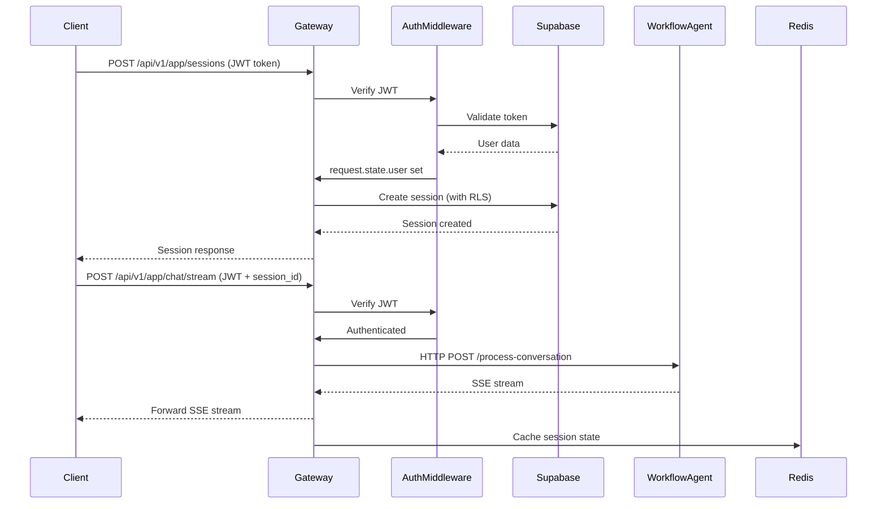
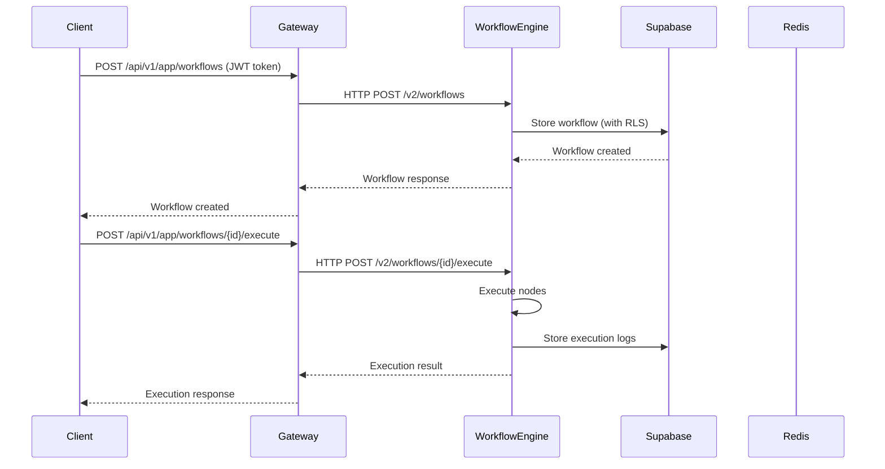

# API Gateway Technical Design

## 1. Executive Summary

The API Gateway is the primary entry point for the Workflow Agent Team system, implementing a three-layer API architecture with FastAPI. It provides unified authentication, rate limiting, and request routing for different client types: public consumers, web/mobile applications, and LLM clients.

### Key Architectural Decisions

- **Three-Layer API Architecture**: Separation of public, app, and MCP APIs with distinct authentication patterns
- **HTTP/REST Migration**: Complete migration from gRPC to HTTP/REST for simplified inter-service communication
- **Supabase Integration**: Leverages Supabase for authentication, database access with Row Level Security (RLS)
- **Redis Caching**: Performance optimization with Redis-based rate limiting and session state caching
- **FastAPI Framework**: Async-first architecture with comprehensive middleware stack

### Technology Stack

- **Framework**: FastAPI 0.115.5 with async/await support
- **Authentication**: Supabase Auth with JWT token validation
- **Database**: Supabase PostgreSQL with Row Level Security (RLS)
- **Cache**: Redis for rate limiting and session state
- **HTTP Client**: httpx for async service-to-service communication
- **Observability**: OpenTelemetry with custom telemetry middleware
- **Deployment**: Docker + AWS ECS Fargate

## 2. System Architecture

### 2.1 High-Level Architecture

```
┌─────────────────────────────────────────────────────────────────────────┐
│                            Client Layer                                  │
├─────────────────┬──────────────────┬─────────────────┬──────────────────┤
│  Web Frontend   │   Mobile Apps    │  External APIs  │  LLM Clients     │
│  (Next.js)      │  (iOS/Android)   │  (Third-party)  │  (Claude/GPT)    │
└────────┬────────┴────────┬─────────┴────────┬────────┴────────┬─────────┘
         │                 │                  │                 │
         │ JWT Token       │ JWT Token        │ No Auth         │ API Key
         │                 │                  │                 │
         ▼                 ▼                  ▼                 ▼
┌─────────────────────────────────────────────────────────────────────────┐
│                      API Gateway (FastAPI - Port 8000)                   │
├─────────────────────────────────────────────────────────────────────────┤
│  ┌─────────────────────────────────────────────────────────────────┐   │
│  │                      Middleware Stack                            │   │
│  │  1. CORS Middleware                                              │   │
│  │  2. Tracking Middleware (trace_id generation)                    │   │
│  │  3. Metrics Middleware (OpenTelemetry)                           │   │
│  │  4. Rate Limit Middleware (Redis sliding window)                 │   │
│  │  5. Unified Auth Middleware (layer-based auth)                   │   │
│  │  6. Request Logging Middleware (process time tracking)           │   │
│  └─────────────────────────────────────────────────────────────────┘   │
│                                                                          │
│  ┌──────────────────┬──────────────────┬──────────────────────────┐    │
│  │  Public API      │    App API       │      MCP API             │    │
│  │  /api/v1/public  │  /api/v1/app     │   /api/v1/mcp            │    │
│  │                  │                  │                          │    │
│  │  ∙ No Auth       │  ∙ JWT Auth      │   ∙ API Key Auth         │    │
│  │  ∙ Rate Limited  │  ∙ RLS Enabled   │   ∙ Scoped Permissions   │    │
│  │  ∙ Health/Status │  ∙ Sessions      │   ∙ Tool Discovery       │    │
│  │  ∙ Docs/Webhook  │  ∙ Chat/Workflows│   ∙ Tool Invocation      │    │
│  └──────────────────┴──────────────────┴──────────────────────────┘    │
└─────────────────────────────────────────────────────────────────────────┘
         │                      │                        │
         │ HTTP/REST            │ HTTP/REST              │ HTTP/REST
         ▼                      ▼                        ▼
┌──────────────────┐  ┌──────────────────┐   ┌──────────────────────┐
│ Workflow Agent   │  │ Workflow Engine  │   │ Workflow Scheduler   │
│ (Port 8001)      │  │ (Port 8002)      │   │ (Port 8003)          │
│ AI Generation    │  │ Execution        │   │ Trigger Management   │
└──────────────────┘  └──────────────────┘   └──────────────────────┘
         │                      │                        │
         └──────────────────────┴────────────────────────┘
                                │
                                ▼
                    ┌───────────────────────┐
                    │   Supabase            │
                    │   - PostgreSQL + RLS  │
                    │   - Auth + JWT        │
                    │   - Vector Store      │
                    └───────────────────────┘
                                │
                    ┌───────────────────────┐
                    │   Redis               │
                    │   - Rate Limiting     │
                    │   - Session Cache     │
                    └───────────────────────┘
```

### 2.2 Component Architecture

#### API Layer Organization

```
apps/backend/api-gateway/
├── app/
│   ├── main.py                      # Application factory with middleware stack
│   ├── core/                        # Core infrastructure
│   │   ├── config.py                # Settings with Pydantic validation
│   │   ├── database.py              # Supabase integration with RLS
│   │   ├── database_direct.py       # Direct PostgreSQL for high performance
│   │   └── events.py                # Lifespan events and health checks
│   ├── api/                         # Three-layer API structure
│   │   ├── public/                  # Public API endpoints
│   │   │   ├── health.py            # Service health checks
│   │   │   ├── status.py            # System status information
│   │   │   ├── docs.py              # API documentation
│   │   │   ├── auth.py              # OAuth callback handlers
│   │   │   ├── workflows.py         # Public workflow information
│   │   │   ├── webhooks.py          # Webhook receivers
│   │   │   └── validation.py        # Workflow validation service
│   │   ├── app/                     # App API endpoints (JWT auth)
│   │   │   ├── sessions.py          # Session management with RLS
│   │   │   ├── chat.py              # SSE streaming chat interface
│   │   │   ├── workflows.py         # Workflow CRUD operations
│   │   │   ├── executions.py        # Execution management and logs
│   │   │   └── integrations.py      # OAuth integration management
│   │   └── mcp/                     # MCP API endpoints (API key auth)
│   │       ├── tools.py             # Tool discovery and invocation
│   │       ├── slack_tools.py       # Slack MCP integration
│   │       ├── notion_tools.py      # Notion MCP integration
│   │       ├── gmail_tools.py       # Gmail MCP integration
│   │       └── github_tools.py      # GitHub MCP integration
│   ├── middleware/                  # Middleware components
│   │   ├── auth.py                  # Unified authentication middleware
│   │   ├── rate_limit.py            # Redis-based rate limiting
│   │   └── validation.py            # Request validation
│   ├── services/                    # Business logic services
│   │   ├── auth_service.py          # Supabase authentication
│   │   ├── workflow_agent_http_client.py   # HTTP client for workflow agent
│   │   ├── workflow_engine_http_client.py  # HTTP client for workflow engine
│   │   ├── workflow_scheduler_http_client.py # HTTP client for scheduler
│   │   ├── state_manager.py         # Session state management
│   │   ├── response_processor.py    # SSE response processing
│   │   └── cache.py                 # Redis cache operations
│   ├── models/                      # Pydantic data models
│   │   └── __init__.py              # Shared models
│   ├── utils/                       # Utility functions
│   │   ├── logger.py                # Structured logging
│   │   ├── sse.py                   # Server-Sent Events utilities
│   │   └── node_converter.py        # Node format conversion
│   ├── dependencies.py              # FastAPI dependency injection
│   └── exceptions.py                # Custom exception handlers
├── tests/                           # Test suite
│   ├── test_basic.py                # Core functionality tests
│   ├── test_integration.py          # Integration tests
│   └── interactive_chat_client.py   # Manual testing client
├── pyproject.toml                   # uv package configuration
├── Dockerfile                       # Multi-stage Docker build
└── .env.example                     # Environment template
```

## 3. Data Architecture

### 3.1 Data Models

#### Core Pydantic Models

**Authentication Models** (`app/middleware/auth.py`):
```python
class AuthResult:
    success: bool
    user: Optional[Dict[str, Any]]  # Supabase user data
    client: Optional[Dict[str, Any]]  # MCP client data
    token: Optional[str]
    error: Optional[str]

class MCPApiKey:
    id: str
    client_name: str
    scopes: List[str]  # ["tools:read", "tools:execute", "health:check"]
    rate_limit_tier: str  # "standard", "premium", "development"
    active: bool
    created_at: datetime
    expires_at: Optional[datetime]
```

**Session Models**:
```python
class SessionCreate:
    action: str  # "create", "edit", "copy"
    workflow_id: Optional[str]
    meta_data: Dict[str, Any]

class SessionResponse:
    session_id: str
    user_id: str
    created_at: str
    updated_at: str
```

**Chat Models**:
```python
class ChatRequest:
    session_id: str
    user_message: str
    workflow_context: Optional[Dict[str, Any]]

class ConversationResponse:
    session_id: str
    response_type: str  # "MESSAGE", "STATUS", "ERROR", "FINAL"
    is_final: bool
    message: Optional[str]
    status: Optional[Dict[str, Any]]
    error: Optional[Dict[str, Any]]
```

**Workflow Models**:
```python
class WorkflowCreateRequest:
    user_id: str
    name: str
    description: Optional[str]
    nodes: List[Dict[str, Any]]
    connections: Union[List[Dict[str, str]], Dict[str, Any]]  # Supports both formats
    triggers: Optional[List[str]]
    settings: Optional[Dict[str, Any]]
    tags: Optional[List[str]]

class WorkflowResponse:
    workflow_id: str
    name: str
    description: Optional[str]
    nodes: List[Dict[str, Any]]
    connections: List[Dict[str, str]]
    triggers: List[str]
    created_by: str
    created_time_ms: int
```

### 3.2 Data Flow

#### Session and Chat Data Flow



#### Workflow Execution Flow



## 4. Implementation Details

### 4.1 Core Components

#### FastAPI Application Factory (`app/main.py`)

```python
def create_application() -> FastAPI:
    """Factory pattern application creation"""
    app = FastAPI(
        title="Workflow Agent API Gateway",
        description="Three-layer API architecture: Public, App, MCP",
        version="2.0.0",
        lifespan=lifespan,  # Async lifespan events
        debug=settings.DEBUG,
    )

    # CORS configuration - Allow all origins for development
    app.add_middleware(
        CORSMiddleware,
        allow_origins=["*"],
        allow_credentials=True,
        allow_methods=["*"],
        allow_headers=["*"],
    )

    # Middleware stack (order matters!)
    # 1. Tracking middleware (generates trace_id)
    # 2. Metrics middleware (OpenTelemetry)
    # 3. Rate limiting middleware
    # 4. Authentication middleware
    # 5. Request logging middleware

    # Register routes
    app.include_router(public_router, prefix="/api/v1/public", tags=["Public API"])
    app.include_router(app_router, prefix="/api/v1/app", tags=["App API"])
    app.include_router(mcp_router, prefix="/api/v1/mcp", tags=["MCP API"])

    return app
```

**Lifespan Events** (`app/core/events.py`):
```python
@asynccontextmanager
async def lifespan(app: FastAPI):
    """Startup and shutdown events"""
    # Startup: Connect to workflow services
    await workflow_agent_client.connect()
    await workflow_engine_client.connect()

    yield

    # Shutdown: Close connections
    await workflow_agent_client.close()
    await workflow_engine_client.close()
```

### 4.2 Three-Layer Authentication

#### Unified Authentication Middleware (`app/middleware/auth.py`)

```python
async def unified_auth_middleware(request: Request, call_next):
    """Layer-based authentication routing"""
    path = request.url.path

    # Public API - No authentication, rate limited only
    if path.startswith("/api/v1/public/"):
        return await call_next(request)

    # MCP API - API Key authentication
    if path.startswith("/api/v1/mcp/"):
        if not settings.MCP_API_KEY_REQUIRED:
            return await call_next(request)

        auth_result = await authenticate_mcp_client(request)
        if not auth_result.success:
            return JSONResponse(
                status_code=401,
                content={
                    "error": "unauthorized",
                    "message": f"MCP authentication failed: {auth_result.error}",
                }
            )

        request.state.client = auth_result.client
        request.state.auth_type = "mcp_api_key"

    # App API - Supabase JWT authentication
    elif path.startswith("/api/v1/app/"):
        if not settings.SUPABASE_AUTH_ENABLED:
            return await call_next(request)

        auth_result = await authenticate_supabase_user(request)
        if not auth_result.success:
            return JSONResponse(
                status_code=401 if auth_result.error != "malformed_token" else 400,
                content={
                    "error": "unauthorized",
                    "message": f"Authentication failed: {auth_result.error}",
                }
            )

        request.state.user = auth_result.user
        request.state.user_id = auth_result.user.get("sub")
        request.state.access_token = auth_result.token
        request.state.auth_type = "supabase"

    return await call_next(request)
```

**Supabase JWT Validation**:
```python
async def authenticate_supabase_user(request: Request) -> AuthResult:
    """Validate Supabase JWT token"""
    auth_header = request.headers.get("Authorization")
    if not auth_header or not auth_header.startswith("Bearer "):
        return AuthResult(success=False, error="missing_token")

    token = auth_header.split(" ", 1)[1].strip()

    # Validate JWT format (3 segments separated by dots)
    if not _validate_jwt_format_middleware(token):
        return AuthResult(success=False, error="malformed_token")

    # Verify with Supabase
    user_data = await verify_supabase_token(token)
    if not user_data:
        return AuthResult(success=False, error="invalid_token")

    return AuthResult(success=True, user=user_data, token=token)
```

**MCP API Key Authentication**:
```python
class MCPAuthenticator:
    """API Key management and verification"""

    def verify_api_key(self, api_key: str) -> Optional[MCPApiKey]:
        """Verify API key and check activation/expiration"""
        api_key_obj = self.api_keys.get(api_key)
        if not api_key_obj or not api_key_obj.active:
            return None

        if api_key_obj.expires_at and datetime.now(timezone.utc) > api_key_obj.expires_at:
            return None

        return api_key_obj

    def has_required_scopes(self, user_scopes: List[str], required_scopes: List[str]) -> bool:
        """Check scope permissions"""
        if "admin" in user_scopes:
            return True
        return any(scope in user_scopes for scope in required_scopes)
```

### 4.3 Rate Limiting System

#### Redis-Based Sliding Window (`app/middleware/rate_limit.py`)

**Rate Limit Configuration**:
```python
class RateLimitConfig:
    # Public API - Per IP address
    PUBLIC_LIMITS = {
        "global": "1000/hour",
        "/api/v1/public/health": "100/minute",
        "/api/v1/public/status": "60/minute",
    }

    # App API - Per authenticated user
    APP_LIMITS = {
        "authenticated_user": "10000/hour",
        "/api/v1/app/chat/stream": "100/hour",
        "/api/v1/app/workflows/execute": "100/hour",
    }

    # MCP API - Per API key
    MCP_LIMITS = {
        "api_client": "50000/hour",
        "/api/v1/mcp/invoke": "1000/hour",
    }
```

**Sliding Window Algorithm**:
```python
async def check_rate_limit(key: str, limit_str: str, request: Request) -> tuple[bool, Dict[str, Any]]:
    """Redis sliding window rate limiting"""
    count, window_seconds = self._parse_limit(limit_str)
    current_time = int(time.time())
    window_start = current_time - window_seconds

    # Redis pipeline for atomic operations
    pipe = redis_client.pipeline()

    # Remove expired entries
    pipe.zremrangebyscore(key, 0, window_start)

    # Get current count
    pipe.zcard(key)

    # Add current request
    pipe.zadd(key, {f"{current_time}:{hash(str(request.url))}": current_time})

    # Set expiration
    pipe.expire(key, window_seconds + 10)

    results = pipe.execute()
    current_count = results[1]

    allowed = current_count < count

    return allowed, {
        "current_count": current_count,
        "limit": count,
        "window_seconds": window_seconds,
        "reset_time": current_time + (window_seconds - (current_time % window_seconds)),
    }
```

### 4.4 Service Orchestration

#### Workflow Agent HTTP Client (`app/services/workflow_agent_http_client.py`)

**SSE Streaming Communication**:
```python
async def process_conversation_stream(
    self,
    session_id: str,
    user_message: str,
    user_id: str = "anonymous",
    workflow_context: Optional[Dict[str, Any]] = None,
    access_token: Optional[str] = None,
    trace_id: Optional[str] = None,
) -> AsyncGenerator[Dict[str, Any], None]:
    """Stream conversation processing via HTTP SSE"""

    request_data = {
        "session_id": session_id,
        "user_id": user_id,
        "user_message": user_message,
        "access_token": access_token or "",
    }

    if workflow_context:
        request_data["workflow_context"] = {
            "origin": workflow_context.get("origin", "create"),
            "source_workflow_id": workflow_context.get("source_workflow_id", ""),
        }

    async with httpx.AsyncClient(timeout=self.timeout, http2=True) as client:
        async with client.stream(
            "POST",
            f"{self.base_url}/process-conversation",
            json=request_data,
            headers={
                "Accept": "text/event-stream",
                "X-Trace-ID": trace_id or "",
            },
        ) as response:
            response.raise_for_status()

            async for line in response.aiter_lines():
                if line.startswith("data: "):
                    data = json.loads(line[6:])  # Remove "data: " prefix
                    yield data
```

**Timeout Configuration**:
```python
self.timeout = httpx.Timeout(
    timeout=1800.0,    # 30 minutes total for complex workflows
    connect=15.0,      # 15 seconds connection timeout
    read=600.0,        # 10 minutes read timeout per chunk
    write=60.0,        # 60 seconds write timeout
)
```

#### Workflow Engine HTTP Client (`app/services/workflow_engine_http_client.py`)

**Workflow Creation**:
```python
async def create_workflow(
    self,
    name: str,
    nodes: List[Dict[str, Any]],
    connections: Union[List[Dict], Dict],
    user_id: str = "anonymous",
    trace_id: Optional[str] = None,
    **kwargs
) -> Dict[str, Any]:
    """Create workflow in Workflow Engine v2"""

    # Convert to v2 format
    v2_nodes = [
        {
            "id": node.get("id") or node.get("name"),
            "name": node.get("name"),
            "type": node.get("type"),
            "subtype": node.get("subtype"),
            "configurations": node.get("configurations") or node.get("parameters", {}),
            "attached_nodes": node.get("attached_nodes"),
        }
        for node in nodes
    ]

    v2_payload = {
        "workflow_id": str(uuid.uuid4()),
        "name": name,
        "created_by": user_id,
        "nodes": v2_nodes,
        "connections": _convert_connections(connections),
        "triggers": [n["id"] for n in v2_nodes if n["type"] == "TRIGGER"],
    }

    async with httpx.AsyncClient(timeout=self.query_timeout) as client:
        response = await client.post(
            f"{self.base_url}/v2/workflows",
            json=v2_payload,
            headers={"X-Trace-ID": trace_id} if trace_id else {}
        )
        response.raise_for_status()
        return response.json()
```

**Workflow Execution**:
```python
async def execute_workflow(
    self,
    workflow_id: str,
    user_id: str,
    input_data: Optional[Dict[str, Any]] = None,
    async_execution: bool = False,
    access_token: Optional[str] = None,
) -> Dict[str, Any]:
    """Execute workflow with RLS"""

    headers = {}
    if access_token:
        headers["Authorization"] = f"Bearer {access_token}"

    v2_payload = {
        "trigger_type": "manual",
        "trigger_data": input_data or {},
        "async_execution": async_execution,
        "user_id": user_id,
    }

    client = await self._get_client()
    response = await client.post(
        f"{self.base_url}/v2/workflows/{workflow_id}/execute",
        json=v2_payload,
        headers=headers,
        timeout=self.execute_timeout,  # 5 minutes for long-running workflows
    )
    response.raise_for_status()
    return response.json()
```

## 5. System Interactions

### 5.1 Internal Service Communication

**HTTP/REST Communication Pattern**:
- All services migrated from gRPC to HTTP/REST
- Service discovery via environment variables
- Connection pooling with httpx for performance
- Trace ID propagation for distributed tracing

**Service Endpoints**:
```
Workflow Agent (8001):
  POST /process-conversation      # SSE streaming workflow generation
  GET  /health                    # Health check

Workflow Engine (8002):
  POST /v2/workflows              # Create workflow
  GET  /v2/workflows/{id}         # Get workflow
  POST /v2/workflows/{id}/execute # Execute workflow
  GET  /v2/executions/{id}        # Execution status
  GET  /v2/executions/{id}/logs   # Execution logs

Workflow Scheduler (8003):
  POST /triggers                  # Create trigger
  GET  /triggers/{id}             # Get trigger status
```

### 5.2 External Integrations

#### Supabase Integration

**Authentication Flow**:
```python
# JWT token verification
async def verify_supabase_token(token: str) -> Optional[Dict[str, Any]]:
    """Verify JWT with Supabase Auth"""
    try:
        user_response = supabase.auth.get_user(token)
        if user_response.user:
            return {
                "sub": user_response.user.id,
                "email": user_response.user.email,
                "email_confirmed": user_response.user.email_confirmed_at is not None,
            }
    except Exception as e:
        log_error(f"Token verification failed: {e}")
        return None
```

**Row Level Security (RLS)**:
```python
class SupabaseRepository:
    """RLS-enabled repository pattern"""

    def create(self, data: dict, access_token: Optional[str] = None) -> Optional[dict]:
        """Create with RLS enforcement"""
        if access_token:
            # User-scoped operation with RLS
            client = get_user_supabase_client(access_token)
            return client.table(self.table_name).insert(data).execute()
        else:
            # Admin operation bypassing RLS
            return self.client.table(self.table_name).insert(data).execute()
```

**Performance Optimization**:
```python
# Header-based auth (fast) vs session-based auth (slow)
# ❌ SLOW - Avoid making HTTP call on every request
client.auth.set_session(access_token, access_token)

# ✅ FAST - Use headers for authentication
client.headers["Authorization"] = f"Bearer {access_token}"
```

#### OAuth Integration Management

**Supported Integrations**:
- **Slack**: OAuth for workspace integration
- **Notion**: OAuth for page/database access
- **Google**: OAuth for Gmail and Calendar
- **GitHub**: OAuth for repository operations

**OAuth Callback Handler** (`app/api/public/auth.py`):
```python
@router.get("/auth/{provider}/callback")
async def oauth_callback(
    provider: str,
    code: str,
    state: str,
    request: Request,
):
    """Handle OAuth callbacks from external providers"""
    # Exchange code for access token
    # Store in user_integrations table
    # Redirect to frontend success page
```

**Integration Storage** (Supabase `user_integrations` table):
```sql
CREATE TABLE user_integrations (
    id UUID PRIMARY KEY,
    user_id UUID REFERENCES auth.users NOT NULL,
    provider TEXT NOT NULL,
    access_token TEXT NOT NULL,
    refresh_token TEXT,
    expires_at TIMESTAMPTZ,
    metadata JSONB,
    created_at TIMESTAMPTZ DEFAULT NOW()
);
```

## 6. Non-Functional Requirements

### 6.1 Performance

**Targets**:
- API Gateway response time: \< 50ms (excluding downstream services)
- SSE streaming latency: \< 100ms first byte
- Rate limit check: \< 5ms (Redis)
- Supabase query: \< 100ms with RLS

**Optimization Strategies**:
- Connection pooling for HTTP clients (max 20 connections)
- HTTP/2 multiplexing for service communication
- Redis caching for rate limiting and session state
- Async/await throughout the stack
- Header-based Supabase auth (not session-based)

**Caching Strategy**:
```python
# Redis TTL configuration
CACHE_TTL_JWT_TOKEN = 1800      # 30 minutes
CACHE_TTL_USER_INFO = 900       # 15 minutes
CACHE_TTL_RATE_LIMIT = 3600     # 1 hour
CACHE_TTL_SESSION_STATE = 7200  # 2 hours
```

### 6.2 Scalability

**Horizontal Scaling**:
- Stateless application design
- Redis for shared state (rate limits, session cache)
- Supabase connection pooling
- AWS ECS auto-scaling based on CPU/memory

**Load Distribution**:
```
AWS Application Load Balancer
         │
    ┌────┴────┬────────┬────────┐
    │         │        │        │
  ECS Task  ECS Task ECS Task ECS Task
  (API GW)  (API GW) (API GW) (API GW)
    │         │        │        │
    └────┬────┴────────┴────────┘
         │
    Shared Redis & Supabase
```

**Resource Considerations**:
- CPU: 0.5 vCPU per task (ECS Fargate)
- Memory: 1GB per task
- Redis: Single instance (ElastiCache for production)
- Concurrent connections: \~100 per task with connection pooling

### 6.3 Security

**Authentication Measures**:
- JWT token validation with Supabase
- API key hashing and secure storage (future enhancement)
- Token expiration and refresh handling
- Rate limiting per user/IP/API key

**Authorization Approach**:
- Row Level Security (RLS) for user data isolation
- API key scopes for fine-grained MCP permissions
- Admin service role key for system operations

**Data Protection**:
- HTTPS/TLS for all external communication
- Secure headers (CORS, CSP)
- JWT tokens in Authorization header (not cookies)
- No sensitive data in logs or traces

**Input Validation**:
```python
# Pydantic models for request validation
class ChatRequest(BaseModel):
    session_id: str = Field(..., min_length=1, max_length=255)
    user_message: str = Field(..., min_length=1, max_length=10000)
    workflow_context: Optional[Dict[str, Any]] = None

# Middleware validation
@app.middleware("http")
async def validation_middleware(request: Request, call_next):
    # JWT format validation before Supabase call
    if not _validate_jwt_format_middleware(token):
        return JSONResponse(status_code=400, content={"error": "malformed_token"})
```

### 6.4 Reliability

**Error Handling**:
```python
# Global exception handler
@app.exception_handler(Exception)
async def global_exception_handler(request: Request, exc: Exception):
    log_exception(f"Unhandled exception: {type(exc).__name__}: {str(exc)}")
    return JSONResponse(
        status_code=500,
        content={
            "error": "internal_server_error",
            "message": "Internal server error occurred",
        }
    )

# Structured error responses
{
    "error": "error_type",
    "message": "Human-readable description",
    "error_code": "SPECIFIC_ERROR_CODE",
    "details": {...},
    "trace_id": "uuid"
}
```

**Retry Mechanisms**:
- HTTP client automatic retries (3 attempts) for network errors
- Exponential backoff for transient failures
- Circuit breaker pattern for failing downstream services (future)

**Health Checks**:
```python
@app.get("/health")
async def health_check():
    """Comprehensive health check"""
    checks = {
        "api_gateway": True,
        "workflow_agent": await check_workflow_agent_health(),
        "workflow_engine": await check_workflow_engine_health(),
        "supabase": await check_supabase_connection(),
        "redis": await check_redis_connection(),
    }

    status = "healthy" if all(checks.values()) else "degraded"
    return {"status": status, "checks": checks}
```

**AWS ECS Health Check Configuration**:
```
Health Check Command: curl -f http://localhost:8000/health || exit 1
Start Period: 120 seconds
Interval: 30 seconds
Timeout: 5 seconds
Retries: 3
```

### 6.5 Testing & Observability

#### Testing Strategy

**Unit Testing**:
```bash
# Run comprehensive test suite
uv run pytest tests/ -v

# Current test coverage (12 tests)
tests/test_basic.py:
  - Root endpoint response validation
  - Health check availability
  - Version endpoint verification
  - Authentication requirement for App API
  - Authentication requirement for MCP API
  - CORS headers validation
  - Request ID generation
  - Process time tracking
  - Application factory pattern
  - Configuration loading
```

**Integration Testing**:
```python
# Test authentication flow
async def test_supabase_auth_flow():
    # Obtain JWT token from Supabase
    token = await get_test_jwt_token()

    # Create authenticated session
    response = await client.post(
        "/api/v1/app/sessions",
        headers={"Authorization": f"Bearer {token}"},
        json={"action": "create"}
    )
    assert response.status_code == 200
```

**Manual Testing**:
```bash
# Interactive chat client
python tests/interactive_chat_client.py

# Health check
curl http://localhost:8000/health

# Authenticated workflow creation
curl -X POST http://localhost:8000/api/v1/app/workflows \
  -H "Authorization: Bearer ${JWT_TOKEN}" \
  -H "Content-Type: application/json" \
  -d @workflow.json
```

#### Observability

**OpenTelemetry Integration**:
```python
# Automatic trace generation
setup_telemetry(
    app,
    service_name="api-gateway",
    service_version="2.0.0",
    otlp_endpoint="http://otel-collector:4317"
)

# Custom span attributes
request.state.trace_id = generate_trace_id()
request.state.user_id = user.get("sub")
```

**Key Metrics**:
- Request rate per API layer (public/app/mcp)
- Response time percentiles (p50, p95, p99)
- Error rate by error type
- Rate limit rejections per user/IP
- Concurrent SSE streams
- Downstream service latency

**Logging Strategy**:
```python
# Structured logging with emoji indicators
logger.info(f"📨 {method} {path} [Trace:{trace_id}]")  # Request start
logger.info(f"✅ Supabase auth successful: {user_email}")  # Auth success
logger.warning(f"🚫 Rate limit exceeded: {path}")  # Rate limit
logger.error(f"❌ HTTP error: {status_code}")  # Errors
logger.info(f"📤 {method} {path} -> {status} [{time}ms]")  # Response
```

**Log Levels**:
- DEBUG: Development with detailed request/response bodies
- INFO: Production with request flow and key events
- WARNING: Rate limits, auth failures, degraded service
- ERROR: Exceptions, service failures, data errors

#### Monitoring & Alerting

**Dashboard Metrics**:
```
API Gateway Dashboard:
- Request rate by API layer
- Authentication success/failure rate
- Rate limit hit rate
- Response time histogram
- Error rate by status code
- Active SSE streams
- Downstream service health
```

**Alert Thresholds**:
- Error rate \> 5% for 5 minutes → Page on-call
- Response time p95 \> 500ms for 10 minutes → Warning
- Rate limit rejection \> 20% for 5 minutes → Warning
- Health check failure \> 3 consecutive → Page on-call
- Redis connection failure → Immediate page

**SLIs/SLOs**:
```
Service Level Indicators:
- Availability: 99.9% uptime
- Latency: 95% of requests \< 200ms
- Error rate: \< 1% of requests
- Authentication success: \> 99%

Service Level Objectives:
- Monthly uptime: 99.9% (43 minutes downtime/month)
- P95 latency: \< 200ms for App API
- P99 latency: \< 500ms for App API
```

## 7. Technical Debt and Future Considerations

### 7.1 Known Limitations

**Authentication & Security**:
- API keys stored in configuration (not encrypted)
- No API key rotation mechanism
- Basic scope validation (no complex RBAC)
- Rate limiting per-layer only (no per-endpoint customization in code)

**Performance**:
- Single Redis instance (no cluster/replication)
- No circuit breaker pattern for downstream services
- Limited connection pooling configuration
- No request queuing for overload scenarios

**Observability**:
- Basic OpenTelemetry setup (no custom spans)
- Limited distributed tracing across services
- No performance profiling in production
- Alert configuration not in code

### 7.2 Areas for Improvement

**Short-term** (1-3 months):
1. Implement API key encryption and secure storage
2. Add circuit breaker pattern for service resilience
3. Enhanced OpenTelemetry with custom spans and metrics
4. Automated integration test suite with real services
5. Pre-commit hooks enforcement (already configured)

**Medium-term** (3-6 months):
1. Redis Cluster for high availability
2. Advanced rate limiting with burst handling
3. Role-Based Access Control (RBAC) system
4. Request/response caching layer
5. GraphQL API layer for flexible queries

**Long-term** (6-12 months):
1. Multi-region deployment with global load balancing
2. Service mesh integration (Istio/Linkerd)
3. Advanced security (mTLS, certificate rotation)
4. ML-based anomaly detection for security
5. Self-healing infrastructure automation

### 7.3 Migration Paths

**gRPC to HTTP/REST Migration** (Completed):
- ✅ All services migrated to HTTP/REST
- ✅ Connection pooling implemented
- ✅ Trace ID propagation working
- ✅ Performance comparable to gRPC

**Supabase RLS Optimization**:
- Current: Header-based authentication (fast)
- Previous: Session-based authentication (3+ seconds)
- Result: 20% performance improvement

**Future: GraphQL Layer**:
```graphql
type Query {
  workflows(filter: WorkflowFilter): [Workflow!]!
  workflow(id: ID!): Workflow
  executions(workflowId: ID!, limit: Int): [Execution!]!
}

type Mutation {
  createWorkflow(input: CreateWorkflowInput!): Workflow!
  executeWorkflow(id: ID!, input: ExecutionInput!): Execution!
  updateWorkflow(id: ID!, input: UpdateWorkflowInput!): Workflow!
}

type Subscription {
  executionUpdates(executionId: ID!): ExecutionUpdate!
}
```

## 8. Appendices

### A. Glossary

- **API Gateway**: Unified entry point for all client requests with authentication and routing
- **RLS (Row Level Security)**: PostgreSQL security feature isolating data by user
- **SSE (Server-Sent Events)**: HTTP streaming protocol for real-time updates
- **MCP (Model Context Protocol)**: LLM tool discovery and invocation standard
- **JWT (JSON Web Token)**: Stateless authentication token format
- **ECS (Elastic Container Service)**: AWS container orchestration platform
- **OpenTelemetry**: Observability framework for distributed tracing and metrics
- **Sliding Window**: Rate limiting algorithm counting requests in a moving time window
- **Trace ID**: Unique identifier for tracking requests across services
- **Connection Pooling**: Reusing HTTP connections for better performance

### B. References

**Internal Documentation**:
- `/apps/backend/api-gateway/CLAUDE.md` - Development guide and commands
- `/apps/backend/CLAUDE.md` - Backend architecture overview
- `/docs/tech-design/new_workflow_spec.md` - Workflow data models
- `/apps/backend/api-gateway/README.md` - Quick start and API examples

**External Resources**:
- [FastAPI Documentation](https://fastapi.tiangolo.com/)
- [Supabase Documentation](https://supabase.com/docs)
- [OpenTelemetry Python](https://opentelemetry.io/docs/instrumentation/python/)
- [httpx Documentation](https://www.python-httpx.org/)
- [Redis Documentation](https://redis.io/docs/)

**API Specifications**:
- OpenAPI/Swagger: `http://localhost:8000/docs`
- ReDoc: `http://localhost:8000/redoc`
- Health Check: `http://localhost:8000/health`

---

**Document Version**: 2.0.0
**Last Updated**: January 2025
**Architecture Status**: Production-ready with three-layer API implementation
**Next Review**: April 2025
