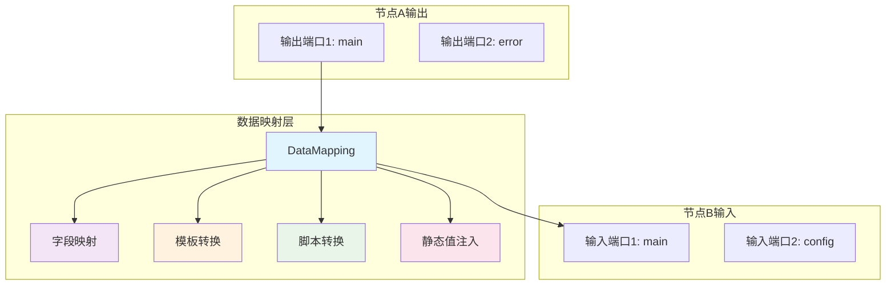

# 工作流数据映射系统设计

## 📋 概述

本文档描述了工作流引擎中数据映射系统的技术设计。该系统基于[节点规范系统](./node_spec.md)构建，解决了当前连接系统只能定义节点到节点的连接，但无法定义**数据如何从上游节点的输出端口转换到下游节点的输入端口**的问题。

**前置依赖**: 本系统依赖于节点规范系统中定义的端口规范(`InputPortSpec`/`OutputPortSpec`)和数据格式规范(`DataFormat`)。

## 🎯 问题描述

### 当前连接系统的局限性

#### ❌ **缺失的数据转换能力**
```protobuf
// 当前的连接定义
message Connection {
  string node = 1;              // 目标节点名
  ConnectionType type = 2;      // 连接类型
  int32 index = 3;             // 端口索引
}
```

这种定义只能表达"连接到哪个节点"，但无法描述：
1. **源端口选择**: 不知道从源节点的哪个输出端口获取数据
2. **数据转换**: 不知道如何将输出数据转换为目标节点需要的输入格式
3. **字段映射**: 不知道源数据的哪些字段对应目标数据的哪些字段
4. **数据验证**: 不知道转换后的数据是否符合目标节点的输入要求

#### 🤔 **实际场景中的数据转换需求**

**场景**: RouterAgent → TaskAnalyzer

```json
// RouterAgent的输出 (source_port: "main")
{
  "route": "schedule_meeting",
  "confidence": 0.95,
  "reasoning": "用户明确要求安排会议",
  "metadata": {
    "timestamp": "2025-01-28T10:30:00Z",
    "user_id": "user_123"
  }
}

// TaskAnalyzer需要的输入 (target_port: "main")
{
  "task_description": "schedule_meeting",     // 来自 route 字段
  "priority": "high",                         // 基于 confidence 计算
  "context": {                               // 重新组织的上下文
    "confidence": 0.95,
    "reasoning": "用户明确要求安排会议",
    "user_id": "user_123",
    "processed_at": "2025-01-28T10:30:05Z"
  }
}
```

当前系统无法处理这种**结构化的数据转换**需求。

## 🏗️ 解决方案架构

### 核心设计原则

1. **向后兼容**: 保留现有连接定义，渐进式增强
2. **类型安全**: 基于节点规范进行数据验证
3. **灵活转换**: 支持多种数据映射策略
4. **可视化友好**: 便于前端展示数据流转过程
5. **性能优化**: 高效的数据转换执行

### 整体架构图



## 🔧 数据结构设计

### 增强的连接定义

**注意**: 此连接定义已整合到[节点规范系统](./node_spec.md)的Protocol Buffer schema中。

```protobuf
// 增强的连接定义 - 来自节点规范系统
message Connection {
  string node = 1;                    // 目标节点名
  ConnectionType type = 2;            // 连接类型
  int32 index = 3;                   // 端口索引（向后兼容）

  // 端口级连接 - 基于NodeSpec中的端口定义
  string source_port = 4;            // 源端口名称，必须存在于源节点的OutputPortSpec中
  string target_port = 5;            // 目标端口名称，必须存在于目标节点的InputPortSpec中

  // 数据映射规则
  DataMapping data_mapping = 6;      // 数据转换规则
}

// 数据映射定义
message DataMapping {
  MappingType type = 1;                       // 映射类型
  repeated FieldMapping field_mappings = 2;  // 字段映射列表
  string transform_script = 3;               // 自定义转换脚本
  map<string, string> static_values = 4;     // 静态值注入
  string description = 5;                    // 映射描述
}

// 映射类型枚举
enum MappingType {
  DIRECT = 0;        // 直接传递（默认行为）
  FIELD_MAPPING = 1; // 字段级映射
  TEMPLATE = 2;      // 基于模板的转换
  TRANSFORM = 3;     // 自定义脚本转换
}

// 字段映射定义
message FieldMapping {
  string source_field = 1;          // 源字段路径，支持JSONPath
  string target_field = 2;          // 目标字段路径
  FieldTransform transform = 3;     // 字段级转换规则
  bool required = 4;                // 是否必需字段
  string default_value = 5;         // 默认值
}

// 字段转换定义
message FieldTransform {
  TransformType type = 1;           // 转换类型
  string transform_value = 2;       // 转换参数
  map<string, string> options = 3;  // 转换选项
}

// 字段转换类型
enum TransformType {
  NONE = 0;           // 无转换
  STRING_FORMAT = 1;  // 字符串格式化：sprintf风格
  JSON_PATH = 2;      // JSONPath表达式提取
  REGEX = 3;          // 正则表达式转换
  FUNCTION = 4;       // 内置函数调用
  CONDITION = 5;      // 条件判断转换
}
```

## 📝 映射类型详细说明

### 1. 直接传递 (DIRECT)

最简单的映射方式，直接将源数据传递给目标节点。

```json
{
  "data_mapping": {
    "type": "DIRECT"
  }
}
```

**执行效果**:
```javascript
// 源数据
input = {"result": "success", "data": [1, 2, 3]}

// 目标数据
output = {"result": "success", "data": [1, 2, 3]}  // 完全相同
```

### 2. 字段映射 (FIELD_MAPPING)

通过字段路径进行精确的数据映射和转换。

```json
{
  "data_mapping": {
    "type": "FIELD_MAPPING",
    "field_mappings": [
      {
        "source_field": "route",
        "target_field": "task_description",
        "required": true
      },
      {
        "source_field": "confidence",
        "target_field": "context.confidence"
      },
      {
        "source_field": "confidence",
        "target_field": "priority",
        "transform": {
          "type": "CONDITION",
          "transform_value": "{{value}} > 0.8 ? 'high' : 'normal'"
        }
      },
      {
        "source_field": "metadata.user_id",
        "target_field": "context.user_id"
      }
    ],
    "static_values": {
      "context.processed_at": "{{current_time}}",
      "context.workflow_id": "{{workflow_id}}"
    }
  }
}
```

**执行效果**:
```javascript
// 源数据
input = {
  "route": "schedule_meeting",
  "confidence": 0.95,
  "reasoning": "用户要安排会议",
  "metadata": {"user_id": "user_123"}
}

// 目标数据
output = {
  "task_description": "schedule_meeting",
  "priority": "high",  // 基于confidence > 0.8计算
  "context": {
    "confidence": 0.95,
    "user_id": "user_123",
    "processed_at": "2025-01-28T10:30:05Z",
    "workflow_id": "wf_456"
  }
}
```

### 3. 模板转换 (TEMPLATE)

使用类似Handlebars的模板语法进行数据转换。

```json
{
  "data_mapping": {
    "type": "TEMPLATE",
    "transform_script": `{
      "task_description": "{{route}}",
      "priority": "{{confidence > 0.8 ? 'high' : 'normal'}}",
      "context": {
        "original_request": {
          "route": "{{route}}",
          "confidence": {{confidence}},
          "reasoning": "{{reasoning}}"
        },
        "processing_info": {
          "processed_at": "{{current_time}}",
          "workflow_id": "{{workflow_id}}",
          "node_id": "{{node_id}}"
        },
        "user_context": {{metadata}}
      }
    }`
  }
}
```

### 4. 脚本转换 (TRANSFORM)

使用JavaScript或Python脚本进行复杂的数据转换。

```json
{
  "data_mapping": {
    "type": "TRANSFORM",
    "transform_script": `
      function transform(input, context) {
        // 复杂的业务逻辑处理
        const priority = calculatePriority(input.confidence, input.metadata);
        const enrichedContext = enrichContext(input, context);

        return {
          task_description: input.route,
          priority: priority,
          context: enrichedContext,
          validation: validateInput(input)
        };
      }

      function calculatePriority(confidence, metadata) {
        if (confidence > 0.9) return "urgent";
        if (confidence > 0.7) return "high";
        if (confidence > 0.5) return "normal";
        return "low";
      }

      function enrichContext(input, context) {
        return {
          ...input.metadata,
          confidence: input.confidence,
          reasoning: input.reasoning,
          processed_at: context.current_time,
          workflow_id: context.workflow_id
        };
      }

      function validateInput(input) {
        return {
          has_route: !!input.route,
          confidence_valid: input.confidence >= 0 && input.confidence <= 1,
          has_metadata: !!input.metadata
        };
      }
    `,
    "description": "智能路由结果转换为任务分析输入"
  }
}
```

## 🔍 字段路径表达式

### JSONPath支持

支持标准的JSONPath表达式进行字段提取：

```javascript
// 源数据
{
  "result": {
    "data": {
      "items": [
        {"name": "meeting1", "priority": "high"},
        {"name": "meeting2", "priority": "low"}
      ]
    }
  },
  "metadata": {
    "total": 2,
    "status": "success"
  }
}

// 字段路径示例
"result.data.items[0].name"           // "meeting1"
"result.data.items[*].priority"       // ["high", "low"]
"metadata.total"                      // 2
"$.result.data.items[?(@.priority=='high')].name"  // ["meeting1"]
```

### 字段转换函数

支持常用的内置转换函数：

```json
{
  "source_field": "timestamp",
  "target_field": "formatted_time",
  "transform": {
    "type": "FUNCTION",
    "transform_value": "date_format",
    "options": {
      "format": "YYYY-MM-DD HH:mm:ss",
      "timezone": "Asia/Shanghai"
    }
  }
}
```

**内置函数列表**:
- `date_format`: 日期格式化
- `string_upper`: 转大写
- `string_lower`: 转小写
- `json_stringify`: JSON序列化
- `json_parse`: JSON解析
- `array_join`: 数组连接
- `array_length`: 数组长度
- `math_round`: 数值四舍五入

## 🔧 实现架构

### 数据映射处理器

```python
from shared.node_specs.registry import node_spec_registry
from shared.node_specs.validator import NodeSpecValidator

class DataMappingProcessor:
    """数据映射处理器，负责执行各种数据转换"""

    def __init__(self):
        self.template_engine = TemplateEngine()
        self.script_engine = ScriptEngine()
        self.jsonpath_parser = JSONPathParser()
        self.function_registry = FunctionRegistry()
        self.node_registry = node_spec_registry  # 引用节点规范注册器
        self.validator = NodeSpecValidator()

    def transform_data(self,
                      source_data: Dict[str, Any],
                      mapping: DataMapping,
                      context: ExecutionContext,
                      source_node = None,
                      target_node = None,
                      source_port: str = "main",
                      target_port: str = "main") -> Dict[str, Any]:
        """根据映射规则转换数据"""

        try:
            # 验证源数据格式（基于节点规范）
            if source_node:
                source_port_spec = self.node_registry.get_port_spec(
                    source_node.type, source_node.subtype, source_port, "output"
                )
                if source_port_spec:
                    validation_errors = self.validator.validate_port_data(source_port_spec, source_data)
                    if validation_errors:
                        raise DataMappingError(f"Source data validation failed: {', '.join(validation_errors)}")

            # 执行数据转换
            if mapping.type == MappingType.DIRECT:
                transformed_data = source_data
            elif mapping.type == MappingType.FIELD_MAPPING:
                transformed_data = self._apply_field_mappings(source_data, mapping, context)
            elif mapping.type == MappingType.TEMPLATE:
                transformed_data = self._apply_template_transform(source_data, mapping, context)
            elif mapping.type == MappingType.TRANSFORM:
                transformed_data = self._apply_script_transform(source_data, mapping, context)
            else:
                raise ValueError(f"Unsupported mapping type: {mapping.type}")

            # 验证转换后数据格式（基于目标节点规范）
            if target_node:
                target_port_spec = self.node_registry.get_port_spec(
                    target_node.type, target_node.subtype, target_port, "input"
                )
                if target_port_spec:
                    validation_errors = self.validator.validate_port_data(target_port_spec, transformed_data)
                    if validation_errors:
                        raise DataMappingError(f"Target data validation failed: {', '.join(validation_errors)}")

            return transformed_data

        except Exception as e:
            self._log_mapping_error(mapping, source_data, e)
            raise DataMappingError(f"Data mapping failed: {str(e)}")

    def _apply_field_mappings(self,
                             source_data: Dict[str, Any],
                             mapping: DataMapping,
                             context: ExecutionContext) -> Dict[str, Any]:
        """应用字段映射"""
        result = {}

        # 处理字段映射
        for field_mapping in mapping.field_mappings:
            try:
                # 提取源字段值
                source_value = self._extract_field_value(
                    source_data,
                    field_mapping.source_field
                )

                # 检查必需字段
                if field_mapping.required and source_value is None:
                    if field_mapping.default_value:
                        source_value = field_mapping.default_value
                    else:
                        raise ValueError(f"Required field missing: {field_mapping.source_field}")

                # 应用字段级转换
                if field_mapping.transform:
                    source_value = self._apply_field_transform(
                        source_value,
                        field_mapping.transform,
                        context
                    )

                # 设置目标字段值
                self._set_field_value(result, field_mapping.target_field, source_value)

            except Exception as e:
                self._log_field_mapping_error(field_mapping, source_data, e)
                if field_mapping.required:
                    raise

        # 处理静态值注入
        for key, value_template in mapping.static_values.items():
            resolved_value = self._resolve_template_value(value_template, context)
            self._set_field_value(result, key, resolved_value)

        return result

    def _extract_field_value(self, data: Dict[str, Any], field_path: str) -> Any:
        """使用JSONPath提取字段值"""
        try:
            if field_path.startswith('$'):
                # 使用JSONPath表达式
                return self.jsonpath_parser.extract(data, field_path)
            else:
                # 使用简单的点分割路径
                return self._simple_field_access(data, field_path)
        except Exception as e:
            self.logger.warning(f"Field extraction failed for path '{field_path}': {e}")
            return None

    def _apply_field_transform(self,
                              value: Any,
                              transform: FieldTransform,
                              context: ExecutionContext) -> Any:
        """应用字段级转换"""

        if transform.type == TransformType.NONE:
            return value

        elif transform.type == TransformType.STRING_FORMAT:
            return transform.transform_value.format(value=value)

        elif transform.type == TransformType.FUNCTION:
            func = self.function_registry.get_function(transform.transform_value)
            return func(value, **transform.options)

        elif transform.type == TransformType.CONDITION:
            return self._evaluate_condition(value, transform.transform_value, context)

        elif transform.type == TransformType.REGEX:
            import re
            pattern = transform.transform_value
            replacement = transform.options.get('replacement', '')
            return re.sub(pattern, replacement, str(value))

        else:
            raise ValueError(f"Unsupported transform type: {transform.type}")

@dataclass
class ExecutionContext:
    """执行上下文，提供环境变量和运行时信息"""
    workflow_id: str
    execution_id: str
    node_id: str
    current_time: str
    user_id: Optional[str] = None
    session_id: Optional[str] = None
    environment: str = "production"

    def to_dict(self) -> Dict[str, Any]:
        return {
            "workflow_id": self.workflow_id,
            "execution_id": self.execution_id,
            "node_id": self.node_id,
            "current_time": self.current_time,
            "user_id": self.user_id,
            "session_id": self.session_id,
            "environment": self.environment
        }
```

### 连接执行引擎集成

```python
class ConnectionExecutor:
    """连接执行器，处理节点间的数据传递"""

    def __init__(self):
        self.data_mapper = DataMappingProcessor()
        self.node_registry = node_spec_registry  # 使用统一的节点规范注册器
        self.logger = logging.getLogger(__name__)

    def execute_connection(self,
                          source_node_result: NodeExecutionResult,
                          connection: Connection,
                          target_node: Node,
                          context: ExecutionContext) -> Dict[str, Any]:
        """执行连接，包含数据映射和验证"""

        # 1. 获取源端口数据
        source_data = self._get_port_data(
            source_node_result,
            connection.source_port or "main"
        )

        if source_data is None:
            self.logger.warning(f"No data from source port: {connection.source_port}")
            return {}

        # 2. 应用数据映射（包含节点规范验证）
        if connection.data_mapping:
            try:
                mapped_data = self.data_mapper.transform_data(
                    source_data,
                    connection.data_mapping,
                    context,
                    source_node=source_node_result.node,  # 传递节点信息用于验证
                    target_node=target_node,
                    source_port=connection.source_port or "main",
                    target_port=connection.target_port or "main"
                )
                self.logger.debug(f"Data mapping applied: {connection.data_mapping.type}")
            except Exception as e:
                self.logger.error(f"Data mapping failed: {e}")
                raise ConnectionExecutionError(f"Data mapping failed: {str(e)}")
        else:
            # 默认直接传递，但仍需验证格式兼容性
            try:
                mapped_data = self.data_mapper.transform_data(
                    source_data,
                    DataMapping(type=MappingType.DIRECT),  # 创建默认直接映射
                    context,
                    source_node=source_node_result.node,
                    target_node=target_node,
                    source_port=connection.source_port or "main",
                    target_port=connection.target_port or "main"
                )
            except Exception as e:
                self.logger.error(f"Direct data mapping validation failed: {e}")
                raise ConnectionExecutionError(f"Direct data mapping validation failed: {str(e)}")

        # 4. 记录数据流转日志
        self._log_data_flow(source_node_result.node_id, target_node.id, connection, mapped_data)

        return mapped_data

    def _get_port_data(self,
                      node_result: NodeExecutionResult,
                      port_name: str) -> Optional[Dict[str, Any]]:
        """从节点执行结果中获取指定端口的数据"""

        if port_name == "main":
            return node_result.output_data

        # 支持多端口输出
        if hasattr(node_result, 'port_outputs') and node_result.port_outputs:
            return node_result.port_outputs.get(port_name)

        return None

    def _log_data_flow(self,
                      source_node_id: str,
                      target_node_id: str,
                      connection: Connection,
                      data: Dict[str, Any]):
        """记录数据流转日志，用于调试和监控"""
        self.logger.info(f"Data flow: {source_node_id}[{connection.source_port}] "
                        f"-> {target_node_id}[{connection.target_port}], "
                        f"mapping: {connection.data_mapping.type if connection.data_mapping else 'DIRECT'}")
```

### 数据验证集成

**注意**: 数据验证功能已整合到[节点规范系统](./node_spec.md)的`NodeSpecValidator`中。数据映射系统直接使用节点规范进行验证，无需单独的验证器。

```python
# 数据映射系统使用节点规范系统的验证功能
from shared.node_specs.validator import NodeSpecValidator
from shared.node_specs.registry import node_spec_registry

class DataMappingValidator:
    """数据映射验证器，基于节点规范验证数据映射配置"""

    def __init__(self):
        self.spec_registry = node_spec_registry
        self.node_validator = NodeSpecValidator()

    def validate_mapping_configuration(self,
                                     source_node,
                                     target_node,
                                     connection: Connection) -> List[str]:
        """验证数据映射配置的合理性"""
        errors = []

        # 1. 验证端口存在性和兼容性
        port_errors = self.spec_registry.validate_connection(
            source_node, connection.source_port or "main",
            target_node, connection.target_port or "main"
        )
        errors.extend(port_errors)

        # 2. 验证数据映射规则
        if connection.data_mapping:
            mapping_errors = self._validate_data_mapping_rules(
                source_node, target_node, connection.data_mapping
            )
            errors.extend(mapping_errors)

        return errors

    def _validate_data_mapping_rules(self, source_node, target_node, mapping) -> List[str]:
        """验证数据映射规则的语法和逻辑"""
        errors = []

        if mapping.type == "FIELD_MAPPING":
            # 验证字段映射配置
            for field_mapping in mapping.field_mappings:
                if not field_mapping.source_field:
                    errors.append("Field mapping missing source_field")
                if not field_mapping.target_field:
                    errors.append("Field mapping missing target_field")

        elif mapping.type == "TEMPLATE":
            # 验证模板语法
            if not mapping.transform_script:
                errors.append("Template mapping missing transform_script")

        elif mapping.type == "TRANSFORM":
            # 验证转换脚本语法
            if not mapping.transform_script:
                errors.append("Transform mapping missing transform_script")
            else:
                # 这里可以添加JavaScript/Python语法检查
                pass

        return errors
```

## 🌟 使用示例

### 完整的工作流配置示例

```json
{
  "id": "customer-service-workflow",
  "name": "智能客服处理流程",
  "nodes": [
    {
      "id": "router",
      "name": "Router Agent",
      "type": "AI_AGENT_NODE",
      "subtype": "ROUTER_AGENT"
    },
    {
      "id": "task_analyzer",
      "name": "Task Analyzer",
      "type": "AI_AGENT_NODE",
      "subtype": "TASK_ANALYZER"
    },
    {
      "id": "priority_filter",
      "name": "Priority Filter",
      "type": "FLOW_NODE",
      "subtype": "IF"
    }
  ],
  "connections": {
    "connections": {
      "router": {
        "main": {
          "connections": [
            {
              "node": "task_analyzer",
              "source_port": "main",
              "target_port": "main",
              "data_mapping": {
                "type": "FIELD_MAPPING",
                "description": "路由结果转换为任务分析输入",
                "field_mappings": [
                  {
                    "source_field": "route",
                    "target_field": "task_description",
                    "required": true
                  },
                  {
                    "source_field": "confidence",
                    "target_field": "priority",
                    "transform": {
                      "type": "CONDITION",
                      "transform_value": "{{value}} > 0.8 ? 'high' : ({{value}} > 0.5 ? 'normal' : 'low')"
                    }
                  },
                  {
                    "source_field": "reasoning",
                    "target_field": "context.reasoning"
                  },
                  {
                    "source_field": "metadata.user_id",
                    "target_field": "context.user_id"
                  }
                ],
                "static_values": {
                  "context.source": "router_agent",
                  "context.processed_at": "{{current_time}}",
                  "context.workflow_id": "{{workflow_id}}"
                }
              }
            }
          ]
        }
      },
      "task_analyzer": {
        "main": {
          "connections": [
            {
              "node": "priority_filter",
              "source_port": "main",
              "target_port": "main",
              "data_mapping": {
                "type": "TEMPLATE",
                "description": "任务分析结果转换为优先级过滤输入",
                "transform_script": `{
                  "condition_data": {
                    "priority": "{{priority}}",
                    "complexity": {{complexity}},
                    "urgency": "{{urgency}}"
                  },
                  "original_task": {
                    "description": "{{task_description}}",
                    "subtasks": {{subtasks}},
                    "estimated_time": {{estimated_time}}
                  },
                  "metadata": {
                    "analyzed_at": "{{current_time}}",
                    "analyzer_confidence": {{confidence}},
                    "workflow_context": {{context}}
                  }
                }`
              }
            }
          ]
        }
      }
    }
  }
}
```

### 复杂脚本转换示例

```json
{
  "data_mapping": {
    "type": "TRANSFORM",
    "description": "客户服务请求智能处理转换",
    "transform_script": `
      function transform(input, context) {
        // 1. 解析客户请求
        const request = parseCustomerRequest(input);

        // 2. 计算处理优先级
        const priority = calculateServicePriority(request, context);

        // 3. 生成处理建议
        const suggestions = generateServiceSuggestions(request, priority);

        // 4. 构建输出数据
        return {
          customer_info: {
            id: request.customer_id,
            tier: request.customer_tier,
            history: request.interaction_history
          },
          request_analysis: {
            category: request.category,
            urgency: priority.urgency,
            complexity: priority.complexity,
            estimated_resolution_time: suggestions.estimated_time
          },
          recommended_actions: suggestions.actions,
          routing_decision: {
            department: suggestions.department,
            agent_type: suggestions.agent_type,
            escalation_required: priority.urgency === 'critical'
          },
          context: {
            analyzed_at: context.current_time,
            workflow_id: context.workflow_id,
            confidence_score: request.confidence || 0.8
          }
        };
      }

      function parseCustomerRequest(input) {
        return {
          customer_id: input.metadata?.customer_id || 'unknown',
          customer_tier: input.metadata?.tier || 'standard',
          category: classifyRequest(input.route),
          interaction_history: input.metadata?.history || [],
          confidence: input.confidence
        };
      }

      function calculateServicePriority(request, context) {
        let urgency = 'normal';
        let complexity = 'medium';

        // 基于客户等级调整优先级
        if (request.customer_tier === 'premium') {
          urgency = 'high';
        }

        // 基于问题类别调整复杂度
        if (['technical_issue', 'billing_dispute'].includes(request.category)) {
          complexity = 'high';
        }

        // 基于历史交互调整
        if (request.interaction_history.length > 3) {
          urgency = 'critical';
        }

        return { urgency, complexity };
      }

      function generateServiceSuggestions(request, priority) {
        const suggestions = {
          actions: [],
          department: 'general',
          agent_type: 'human',
          estimated_time: 30
        };

        // 根据类别生成建议
        switch (request.category) {
          case 'technical_issue':
            suggestions.department = 'technical';
            suggestions.actions = ['diagnose_issue', 'provide_solution', 'follow_up'];
            suggestions.estimated_time = 45;
            break;

          case 'billing_inquiry':
            suggestions.department = 'billing';
            suggestions.actions = ['verify_account', 'explain_charges', 'process_adjustment'];
            suggestions.estimated_time = 20;
            break;

          case 'general_inquiry':
            suggestions.agent_type = 'ai';
            suggestions.actions = ['provide_information', 'offer_resources'];
            suggestions.estimated_time = 15;
            break;
        }

        // 高优先级任务调整
        if (priority.urgency === 'critical') {
          suggestions.agent_type = 'senior_human';
          suggestions.estimated_time *= 1.5;
        }

        return suggestions;
      }

      function classifyRequest(route) {
        const categoryMap = {
          'technical_support': 'technical_issue',
          'billing_question': 'billing_inquiry',
          'general_help': 'general_inquiry',
          'complaint': 'complaint_handling'
        };

        return categoryMap[route] || 'general_inquiry';
      }
    `
  }
}
```

## 🧪 测试策略

### 单元测试

**注意**: 测试需要依赖节点规范系统提供的测试节点规范。

```python
import pytest
from workflow_engine.data_mapping import DataMappingProcessor, ExecutionContext
from shared.node_specs.registry import node_spec_registry
from shared.node_specs.definitions.test_specs import create_test_node_specs  # 测试专用规范

class TestDataMappingProcessor:

    def setup_method(self):
        # 设置测试节点规范
        create_test_node_specs()

        self.processor = DataMappingProcessor()
        self.context = ExecutionContext(
            workflow_id="test_wf_123",
            execution_id="test_exec_456",
            node_id="test_node",
            current_time="2025-01-28T10:30:00Z"
        )

        # 创建测试节点对象
        self.source_node = self._create_test_node("AI_AGENT_NODE", "ROUTER_AGENT")
        self.target_node = self._create_test_node("AI_AGENT_NODE", "TASK_ANALYZER")

    def _create_test_node(self, node_type: str, subtype: str):
        """创建测试节点对象"""
        return type('Node', (), {
            'type': node_type,
            'subtype': subtype,
            'id': f'test_{subtype.lower()}'
        })()

    def test_direct_mapping(self):
        """测试直接映射"""
        source_data = {"result": "success", "data": [1, 2, 3]}
        mapping = DataMapping(type=MappingType.DIRECT)

        result = self.processor.transform_data(
            source_data, mapping, self.context,
            source_node=self.source_node, target_node=self.target_node
        )

        assert result == source_data

    def test_field_mapping_basic(self):
        """测试基础字段映射"""
        source_data = {
            "route": "schedule_meeting",
            "confidence": 0.95,
            "metadata": {"user_id": "user_123"}
        }

        mapping = DataMapping(
            type=MappingType.FIELD_MAPPING,
            field_mappings=[
                FieldMapping(
                    source_field="route",
                    target_field="task_description",
                    required=True
                ),
                FieldMapping(
                    source_field="metadata.user_id",
                    target_field="context.user_id"
                )
            ],
            static_values={
                "context.workflow_id": "{{workflow_id}}"
            }
        )

        result = self.processor.transform_data(
            source_data, mapping, self.context,
            source_node=self.source_node, target_node=self.target_node
        )

        expected = {
            "task_description": "schedule_meeting",
            "context": {
                "user_id": "user_123",
                "workflow_id": "test_wf_123"
            }
        }

        assert result == expected

    def test_field_mapping_with_transform(self):
        """测试带转换的字段映射"""
        source_data = {"confidence": 0.85}

        mapping = DataMapping(
            type=MappingType.FIELD_MAPPING,
            field_mappings=[
                FieldMapping(
                    source_field="confidence",
                    target_field="priority",
                    transform=FieldTransform(
                        type=TransformType.CONDITION,
                        transform_value="{{value}} > 0.8 ? 'high' : 'normal'"
                    )
                )
            ]
        )

        result = self.processor.transform_data(source_data, mapping, self.context)

        assert result == {"priority": "high"}

    def test_template_mapping(self):
        """测试模板映射"""
        source_data = {
            "route": "schedule_meeting",
            "confidence": 0.95
        }

        mapping = DataMapping(
            type=MappingType.TEMPLATE,
            transform_script='''{
                "task": "{{route}}",
                "priority": "{{confidence > 0.8 ? 'high' : 'normal'}}",
                "processed_at": "{{current_time}}"
            }'''
        )

        result = self.processor.transform_data(source_data, mapping, self.context)

        expected = {
            "task": "schedule_meeting",
            "priority": "high",
            "processed_at": "2025-01-28T10:30:00Z"
        }

        assert result == expected

    def test_missing_required_field(self):
        """测试缺少必需字段的错误处理"""
        source_data = {"confidence": 0.95}  # 缺少route字段

        mapping = DataMapping(
            type=MappingType.FIELD_MAPPING,
            field_mappings=[
                FieldMapping(
                    source_field="route",
                    target_field="task_description",
                    required=True
                )
            ]
        )

        with pytest.raises(ValueError, match="Required field missing: route"):
            self.processor.transform_data(source_data, mapping, self.context)

    def test_jsonpath_extraction(self):
        """测试JSONPath字段提取"""
        source_data = {
            "result": {
                "data": {
                    "items": [
                        {"name": "item1", "value": 100},
                        {"name": "item2", "value": 200}
                    ]
                }
            }
        }

        mapping = DataMapping(
            type=MappingType.FIELD_MAPPING,
            field_mappings=[
                FieldMapping(
                    source_field="result.data.items[0].name",
                    target_field="first_item_name"
                ),
                FieldMapping(
                    source_field="result.data.items[*].value",
                    target_field="all_values"
                )
            ]
        )

        result = self.processor.transform_data(source_data, mapping, self.context)

        expected = {
            "first_item_name": "item1",
            "all_values": [100, 200]
        }

        assert result == expected
```

### 集成测试

```python
class TestConnectionExecution:

    def test_end_to_end_data_flow(self):
        """测试端到端的数据流转"""

        # 模拟源节点执行结果
        source_result = NodeExecutionResult(
            status=ExecutionStatus.SUCCESS,
            output_data={
                "route": "technical_support",
                "confidence": 0.92,
                "reasoning": "用户报告系统bug",
                "metadata": {
                    "user_id": "user_456",
                    "timestamp": "2025-01-28T10:25:00Z"
                }
            }
        )

        # 定义连接配置
        connection = Connection(
            node="task_analyzer",
            source_port="main",
            target_port="main",
            data_mapping=DataMapping(
                type=MappingType.FIELD_MAPPING,
                field_mappings=[
                    FieldMapping(
                        source_field="route",
                        target_field="task_description",
                        required=True
                    ),
                    FieldMapping(
                        source_field="confidence",
                        target_field="priority",
                        transform=FieldTransform(
                            type=TransformType.CONDITION,
                            transform_value="{{value}} > 0.9 ? 'urgent' : 'normal'"
                        )
                    ),
                    FieldMapping(
                        source_field="metadata.user_id",
                        target_field="context.user_id"
                    )
                ],
                static_values={
                    "context.processed_at": "{{current_time}}",
                    "context.source": "router_agent"
                }
            )
        )

        # 执行连接
        executor = ConnectionExecutor()
        context = ExecutionContext(
            workflow_id="wf_789",
            execution_id="exec_012",
            node_id="router",
            current_time="2025-01-28T10:30:00Z"
        )

        result = executor.execute_connection(
            source_result,
            connection,
            target_node,
            context
        )

        expected = {
            "task_description": "technical_support",
            "priority": "urgent",  # confidence > 0.9
            "context": {
                "user_id": "user_456",
                "processed_at": "2025-01-28T10:30:00Z",
                "source": "router_agent"
            }
        }

        assert result == expected
```

## 📈 性能优化

### 缓存策略

```python
class CachedDataMappingProcessor(DataMappingProcessor):
    """带缓存功能的数据映射处理器"""

    def __init__(self):
        super().__init__()
        self.template_cache = LRUCache(maxsize=1000)
        self.script_cache = LRUCache(maxsize=500)
        self.jsonpath_cache = LRUCache(maxsize=2000)

    def _apply_template_transform(self, source_data, mapping, context):
        """缓存模板编译结果"""
        cache_key = hash(mapping.transform_script)

        if cache_key not in self.template_cache:
            compiled_template = self.template_engine.compile(mapping.transform_script)
            self.template_cache[cache_key] = compiled_template
        else:
            compiled_template = self.template_cache[cache_key]

        return compiled_template.render(source=source_data, context=context.to_dict())

    def _extract_field_value(self, data, field_path):
        """缓存JSONPath编译结果"""
        if field_path.startswith('$'):
            cache_key = field_path

            if cache_key not in self.jsonpath_cache:
                compiled_path = self.jsonpath_parser.compile(field_path)
                self.jsonpath_cache[cache_key] = compiled_path
            else:
                compiled_path = self.jsonpath_cache[cache_key]

            return compiled_path.extract(data)

        return super()._extract_field_value(data, field_path)
```

### 并发处理

```python
import asyncio
from concurrent.futures import ThreadPoolExecutor

class AsyncDataMappingProcessor:
    """异步数据映射处理器，支持并发转换"""

    def __init__(self, max_workers=4):
        self.executor = ThreadPoolExecutor(max_workers=max_workers)
        self.sync_processor = DataMappingProcessor()

    async def transform_data_async(self, source_data, mapping, context):
        """异步执行数据转换"""
        loop = asyncio.get_event_loop()

        return await loop.run_in_executor(
            self.executor,
            self.sync_processor.transform_data,
            source_data,
            mapping,
            context
        )

    async def transform_multiple_connections(self, connections_data):
        """并发处理多个连接的数据转换"""
        tasks = []

        for source_data, mapping, context in connections_data:
            task = self.transform_data_async(source_data, mapping, context)
            tasks.append(task)

        results = await asyncio.gather(*tasks, return_exceptions=True)

        # 处理异常结果
        processed_results = []
        for i, result in enumerate(results):
            if isinstance(result, Exception):
                self.logger.error(f"Connection {i} mapping failed: {result}")
                processed_results.append({})
            else:
                processed_results.append(result)

        return processed_results
```

## 🎯 迁移策略

### 向后兼容性

1. **保留现有字段**: `index` 字段继续保留，用于向后兼容
2. **默认行为**: 没有 `data_mapping` 时默认使用 `DIRECT` 模式
3. **渐进式升级**: 新工作流使用新格式，老工作流继续工作

### 迁移工具

```python
class WorkflowMigrationTool:
    """工作流迁移工具，将旧格式转换为新格式"""

    def migrate_workflow(self, old_workflow: Dict[str, Any]) -> Dict[str, Any]:
        """迁移工作流定义"""
        new_workflow = old_workflow.copy()

        if 'connections' in new_workflow:
            new_workflow['connections'] = self._migrate_connections(
                old_workflow['connections']
            )

        return new_workflow

    def _migrate_connections(self, old_connections: Dict[str, Any]) -> Dict[str, Any]:
        """迁移连接定义"""
        new_connections = {"connections": {}}

        for node_name, node_conns in old_connections.get('connections', {}).items():
            new_node_conns = {"connection_types": {}}

            for conn_type, conn_array in node_conns.get('connection_types', {}).items():
                new_conn_array = {"connections": []}

                for connection in conn_array.get('connections', []):
                    new_connection = {
                        "node": connection.get("node"),
                        "type": connection.get("type", "MAIN"),
                        "index": connection.get("index", 0),
                        # 新增字段，使用默认值
                        "source_port": "main",
                        "target_port": "main"
                        # data_mapping 默认为空，使用DIRECT模式
                    }
                    new_conn_array["connections"].append(new_connection)

                new_node_conns["connection_types"][conn_type] = new_conn_array

            new_connections["connections"][node_name] = new_node_conns

        return new_connections
```

## 🔍 监控和调试

### 数据流转监控

```python
class DataFlowMonitor:
    """数据流转监控器"""

    def __init__(self):
        self.metrics_collector = MetricsCollector()
        self.trace_logger = TraceLogger()

    def record_data_mapping(self,
                           source_node: str,
                           target_node: str,
                           mapping_type: str,
                           execution_time: float,
                           data_size: int,
                           success: bool):
        """记录数据映射指标"""

        self.metrics_collector.increment('data_mapping_total', tags={
            'source_node': source_node,
            'target_node': target_node,
            'mapping_type': mapping_type,
            'success': str(success)
        })

        self.metrics_collector.histogram('data_mapping_duration', execution_time, tags={
            'mapping_type': mapping_type
        })

        self.metrics_collector.histogram('data_mapping_size', data_size, tags={
            'mapping_type': mapping_type
        })

    def trace_data_transformation(self,
                                execution_id: str,
                                source_data: Dict[str, Any],
                                target_data: Dict[str, Any],
                                mapping: DataMapping):
        """记录数据转换轨迹"""

        trace_record = {
            'execution_id': execution_id,
            'timestamp': datetime.now().isoformat(),
            'mapping_type': mapping.type,
            'source_data_hash': hash(str(source_data)),
            'target_data_hash': hash(str(target_data)),
            'source_fields': list(source_data.keys()) if isinstance(source_data, dict) else [],
            'target_fields': list(target_data.keys()) if isinstance(target_data, dict) else [],
            'mapping_description': mapping.description or ''
        }

        self.trace_logger.log_trace('data_transformation', trace_record)
```

### 调试工具

```python
class DataMappingDebugger:
    """数据映射调试工具"""

    def debug_mapping(self,
                     source_data: Dict[str, Any],
                     mapping: DataMapping,
                     context: ExecutionContext) -> Dict[str, Any]:
        """调试数据映射过程"""

        debug_info = {
            'input': {
                'source_data': source_data,
                'mapping_config': mapping.__dict__,
                'context': context.to_dict()
            },
            'steps': [],
            'output': None,
            'errors': []
        }

        try:
            processor = DataMappingProcessor()

            # 逐步执行并记录过程
            if mapping.type == MappingType.FIELD_MAPPING:
                debug_info['steps'] = self._debug_field_mapping(
                    source_data, mapping, context
                )

            # 执行完整转换
            result = processor.transform_data(source_data, mapping, context)
            debug_info['output'] = result

        except Exception as e:
            debug_info['errors'].append(str(e))
            debug_info['output'] = {}

        return debug_info

    def _debug_field_mapping(self, source_data, mapping, context):
        """调试字段映射过程"""
        steps = []

        for field_mapping in mapping.field_mappings:
            step = {
                'source_field': field_mapping.source_field,
                'target_field': field_mapping.target_field,
                'required': field_mapping.required
            }

            try:
                # 提取源字段值
                source_value = self._extract_field_for_debug(
                    source_data, field_mapping.source_field
                )
                step['source_value'] = source_value
                step['source_found'] = source_value is not None

                # 应用转换
                if field_mapping.transform:
                    transformed_value = self._apply_transform_for_debug(
                        source_value, field_mapping.transform, context
                    )
                    step['transformed_value'] = transformed_value
                    step['transform_applied'] = True
                else:
                    step['transformed_value'] = source_value
                    step['transform_applied'] = False

                step['success'] = True

            except Exception as e:
                step['error'] = str(e)
                step['success'] = False

            steps.append(step)

        return steps
```

## 📋 最佳实践

### 1. 映射设计原则

- **明确性**: 每个映射都应该有清晰的描述
- **幂等性**: 相同输入应该产生相同输出
- **错误处理**: 优雅处理缺失字段和类型错误
- **性能考虑**: 避免复杂的嵌套转换

### 2. 字段路径规范

```javascript
// 推荐的字段路径格式
"simple_field"                    // 简单字段
"nested.field.path"              // 嵌套字段
"array_field[0]"                 // 数组元素
"array_field[*]"                 // 所有数组元素
"$.complex.jsonpath.expression"   // 复杂JSONPath表达式
```

### 3. 转换脚本规范

```javascript
// 转换脚本模板
function transform(input, context) {
    // 1. 输入验证
    if (!input || typeof input !== 'object') {
        throw new Error('Invalid input data');
    }

    // 2. 数据处理逻辑
    const processedData = processInput(input);

    // 3. 构建输出
    const output = {
        // 结构化输出
    };

    // 4. 输出验证
    validateOutput(output);

    return output;
}

// 辅助函数
function processInput(input) { /* ... */ }
function validateOutput(output) { /* ... */ }
```

### 4. 错误处理策略

```python
# 错误处理最佳实践
class DataMappingError(Exception):
    """数据映射异常基类"""
    pass

class FieldExtractionError(DataMappingError):
    """字段提取异常"""
    pass

class TransformationError(DataMappingError):
    """数据转换异常"""
    pass

class ValidationError(DataMappingError):
    """数据验证异常"""
    pass

# 在映射处理器中使用
try:
    result = self.transform_data(source_data, mapping, context)
except FieldExtractionError as e:
    # 字段提取失败，使用默认值或跳过
    self.logger.warning(f"Field extraction failed: {e}")
    result = self._apply_default_mapping(source_data)
except TransformationError as e:
    # 转换失败，回退到直接映射
    self.logger.error(f"Transformation failed: {e}")
    result = source_data
except ValidationError as e:
    # 验证失败，抛出异常停止工作流
    self.logger.error(f"Output validation failed: {e}")
    raise
```

## 🎯 总结

数据映射系统的引入将彻底解决工作流中**数据转换**的问题：

### ✅ **解决的核心问题**
1. **数据格式不匹配**: 自动转换不同节点间的数据格式
2. **字段映射复杂**: 支持灵活的字段路径和转换规则
3. **缺乏类型安全**: 基于节点规范进行数据验证
4. **调试困难**: 完整的数据流转日志和调试工具

### 🚀 **带来的价值**
1. **开发效率**: 可视化的数据映射配置
2. **系统可靠性**: 强类型验证和错误处理
3. **运维友好**: 详细的监控和调试信息
4. **业务灵活性**: 支持复杂的业务数据转换逻辑

### 📈 **未来扩展**
1. **AI辅助映射**: 基于数据样本自动生成映射规则
2. **可视化编辑器**: 拖拽式的数据映射配置界面
3. **性能优化**: 并行处理和智能缓存
4. **更多转换类型**: 支持更多的数据转换模式

这个数据映射系统将成为工作流引擎的核心能力之一，为构建复杂的业务自动化流程提供强有力的基础支撑。

---

**文档版本**: 1.0
**创建时间**: 2025-01-28
**作者**: Claude Code
**状态**: 设计阶段
**下次审查**: 2025-02-04
