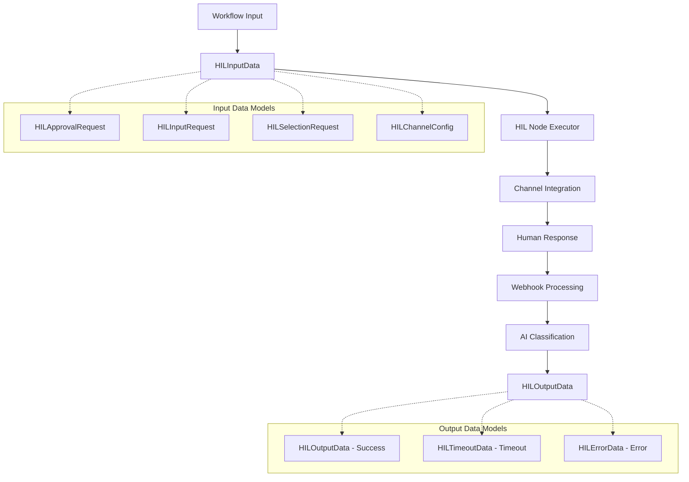

# Human-in-the-Loop Node Data Formats Specification

**Document Version**: 1.0
**Created**: 2025-01-15
**Author**: Claude Code
**Status**: Specification
**Related**: [HIL Node System Technical Design](./human-in-loop-node-system.md)

## 📋 Overview

This document defines the standard input and output data formats for Human-in-the-Loop (HIL) nodes in the workflow engine. These standardized formats ensure consistent data exchange between HIL nodes and other workflow components, enabling seamless integration and reliable operation.

## 🎯 Design Principles

### Consistency
- **Standardized Structure**: All HIL nodes use the same base input/output format
- **Predictable Behavior**: Consistent data shapes across different HIL interaction types
- **Type Safety**: Full Pydantic model validation with rich type hints

### Flexibility
- **Multiple Interaction Types**: Support approval, input, selection, and custom interactions
- **Channel Agnostic**: Works across Slack, email, in-app, webhook, and other channels
- **Extensible**: Easy to add new interaction types and channels

### Developer Experience
- **Rich Metadata**: Comprehensive context and debugging information
- **Clear Documentation**: Self-documenting models with detailed field descriptions
- **IDE Support**: Full autocomplete and type checking support

## 🏗️ Architecture Overview



## 📥 Input Data Sources and Flow

### Who Provides HIL Input?

HIL node input comes from **previous workflow nodes** during normal workflow execution:

1. **AI Agent Nodes** - Generate HIL requests based on context analysis
2. **Action Nodes** - Create approval gates for system operations
3. **External Action Nodes** - Request human validation before API calls
4. **Flow Control Nodes** - Route to human decision points
5. **Workflow Designer Templates** - Pre-configured HIL interactions

### Workflow Execution Flow

```
Previous Node → Generates HIL Input → HIL Node → PAUSE Workflow → Wait for Human → RESUME Workflow
```

The HIL node **pauses the entire workflow execution** and waits for:
- ✅ Valid human response matching the interaction type
- ⏰ Timeout reached (configurable behavior)
- ❌ Error condition (proper error handling)

### Core Input Model

```python
class HILInputData(BaseModel):
    """Standard input data format for HIL nodes."""

    interaction_type: HILInteractionType  # Required: approval, input, selection, etc.
    channel_config: HILChannelConfig      # Required: communication channel settings

    # Request-specific data (one will be populated based on interaction_type)
    approval_request: Optional[HILApprovalRequest] = None
    input_request: Optional[HILInputRequest] = None
    selection_request: Optional[HILSelectionRequest] = None
    custom_request: Optional[Dict[str, Any]] = None

    # Workflow execution control
    workflow_context: Optional[Dict[str, Any]] = None
    timeout_hours: int = 24                          # Timeout before workflow action
    continue_on_timeout: bool = True                 # Whether to continue or fail on timeout
    timeout_default_response: Optional[Dict[str, Any]] = None  # Default response for timeout

    # Configuration
    priority: HILPriority = HILPriority.NORMAL       # low, normal, high, critical

    # Metadata
    correlation_id: Optional[str] = None
    tags: Optional[List[str]] = None
```

## 🔄 Integration with HIL System Architecture

This data format specification integrates with the [HIL Node System Technical Design](./human-in-loop-node-system.md) as follows:

### Workflow Pause/Resume Cycle

1. **Input Reception**: Previous node provides `HILInputData`
2. **Workflow Pause**: HIL node executor pauses workflow execution
3. **Channel Communication**: Send request through configured channel
4. **Response Processing**: AI classifies incoming webhook responses
5. **Workflow Resume**: Continue with `HILOutputData` result

### Database Integration

- **`human_interactions` table** stores the interaction state
- **`hil_responses` table** captures all incoming HIL responses
- **`workflow_execution_pauses` table** tracks workflow pause state

### AI Response Classification

The HIL system uses Gemini 2.5 Flash Lite to filter and classify incoming webhook responses:

```python
class HILResponseClassifier:
    """AI-powered response classification for HIL interactions using Gemini."""

    def __init__(self):
        self.model = GoogleGeminiModel.GEMINI_2_5_FLASH_LITE

    async def classify_response(self,
                              interaction: HumanInteraction,
                              webhook_payload: Dict[str, Any]) -> ClassificationResult:
        """
        Uses Gemini 2.5 Flash Lite to determine if webhook response is relevant to the HIL interaction.
        Returns confidence score (0.0-1.0) and reasoning.

        Benefits of Gemini 2.5 Flash Lite:
        - Cost-effective: $0.10 input, $0.40 output per MTok
        - Fast response times for webhook processing
        - Built for scale and high-volume operations
        """
```

### Enhanced Workflow Execution Control

The updated HIL input format provides comprehensive control over workflow execution:

#### Timeout Behavior Configuration
- **`continue_on_timeout: True`** - Workflow continues with default response
- **`continue_on_timeout: False`** - Workflow fails with timeout error
- **`timeout_default_response`** - Specific response data to use when timeout occurs

#### Workflow Context Preservation
- **`workflow_context`** - Passes data from previous nodes to maintain execution state
- **`correlation_id`** - Enables tracking related HIL interactions across complex workflows

#### Example: Enhanced Timeout Handling
```json
{
  "interaction_type": "approval",
  "timeout_hours": 12,
  "continue_on_timeout": true,
  "timeout_default_response": {
    "approved": false,
    "approval_option": "Auto-Rejected",
    "reason": "Timeout after 12 hours - defaulted to rejection for safety"
  },
  "workflow_context": {
    "deployment_target": "production",
    "risk_level": "high",
    "previous_validation": "passed"
  }
}
```

This enhanced control ensures HIL nodes can handle complex approval workflows with predictable timeout behavior and proper workflow context management.

### Interaction Types

#### 1. Approval Request
For binary approve/reject decisions:

```python
class HILApprovalRequest(BaseModel):
    title: str                                    # "Approve Budget Request"
    description: str                              # Detailed explanation
    approval_options: List[str] = ["Approve", "Reject"]  # Customizable options
    approval_reason_required: bool = False        # Require reason for decision
    approval_data: Optional[Dict[str, Any]] = None  # Additional context data
```

**Example Input:**
```json
{
  "interaction_type": "approval",
  "channel_config": {
    "channel_type": "slack",
    "slack_channel": "#approvals"
  },
  "approval_request": {
    "title": "Marketing Campaign Budget Approval",
    "description": "Requesting approval for Q1 2025 marketing campaign budget of $50,000",
    "approval_options": ["Approve", "Reject", "Request Changes"],
    "approval_reason_required": true,
    "approval_data": {
      "budget_amount": 50000,
      "campaign_duration": "Q1 2025",
      "expected_roi": "150%"
    }
  },
  "workflow_context": {
    "previous_node_output": "Budget analysis completed",
    "campaign_id": "camp_2025_q1_001"
  },
  "timeout_hours": 48,
  "continue_on_timeout": false,
  "priority": "high",
  "correlation_id": "approval_req_12345"
}
```

#### 2. Input Request
For collecting specific data from humans:

```python
class HILInputRequest(BaseModel):
    title: str                                # "Provide Customer Details"
    description: str                          # What input is needed
    fields: List[HILInputField]              # Required input fields
    submit_button_text: str = "Submit"       # Customizable button text

class HILInputField(BaseModel):
    name: str                                # Field identifier
    label: str                               # Human-readable label
    field_type: str = "text"                # text, number, email, date, select
    required: bool = True                    # Whether field is mandatory
    options: Optional[List[str]] = None      # For select fields
    validation: Optional[Dict[str, Any]] = None  # Validation rules
    placeholder: Optional[str] = None        # Placeholder text
```

**Example Input:**
```json
{
  "interaction_type": "input",
  "channel_config": {
    "channel_type": "app",
    "app_notification_users": ["user_123", "user_456"]
  },
  "input_request": {
    "title": "Customer Onboarding Information",
    "description": "Please provide the following details for the new customer",
    "fields": [
      {
        "name": "company_name",
        "label": "Company Name",
        "field_type": "text",
        "required": true,
        "placeholder": "Enter company name"
      },
      {
        "name": "industry",
        "label": "Industry",
        "field_type": "select",
        "required": true,
        "options": ["Technology", "Healthcare", "Finance", "Manufacturing", "Other"]
      },
      {
        "name": "annual_revenue",
        "label": "Annual Revenue",
        "field_type": "number",
        "required": false,
        "validation": {"min": 0, "max": 10000000000}
      }
    ]
  },
  "timeout_hours": 72
}
```

#### 3. Selection Request
For choosing from multiple options:

```python
class HILSelectionRequest(BaseModel):
    title: str                               # "Choose Deployment Environment"
    description: str                         # What to select
    options: List[HILSelectionOption]        # Available options
    multiple_selection: bool = False         # Allow multiple selections
    min_selections: int = 1                  # Minimum required selections
    max_selections: Optional[int] = None     # Maximum allowed selections

class HILSelectionOption(BaseModel):
    value: str                               # Option value
    label: str                               # Human-readable label
    description: Optional[str] = None        # Detailed description
```

**Example Input:**
```json
{
  "interaction_type": "selection",
  "channel_config": {
    "channel_type": "email",
    "email_recipients": ["devops@company.com"],
    "email_subject": "Select Deployment Environment"
  },
  "selection_request": {
    "title": "Choose Deployment Environment",
    "description": "Select the environment(s) for deploying the new application version",
    "multiple_selection": true,
    "min_selections": 1,
    "max_selections": 3,
    "options": [
      {
        "value": "staging",
        "label": "Staging Environment",
        "description": "Safe environment for testing before production"
      },
      {
        "value": "prod-us",
        "label": "Production US",
        "description": "Production environment for US region"
      },
      {
        "value": "prod-eu",
        "label": "Production EU",
        "description": "Production environment for European region"
      }
    ]
  }
}
```

### Channel Configuration

```python
class HILChannelConfig(BaseModel):
    channel_type: HILChannelType             # slack, email, app, webhook, etc.

    # Slack configuration
    slack_channel: Optional[str] = None      # Channel ID or name
    slack_user_ids: Optional[List[str]] = None  # Specific users to notify

    # Email configuration
    email_recipients: Optional[List[str]] = None
    email_subject: Optional[str] = None

    # In-app configuration
    app_notification_users: Optional[List[str]] = None

    # Webhook configuration
    webhook_url: Optional[str] = None
    webhook_headers: Optional[Dict[str, str]] = None
```

## 📤 Output Data Format

HIL nodes have **three possible output types** based on the interaction outcome:

### 1. Success Output (HILOutputData)

```python
class HILOutputData(BaseModel):
    # Interaction metadata
    interaction_id: str                      # Unique interaction identifier
    interaction_type: HILInteractionType    # Type of interaction
    status: HILStatus = "responded"          # Final status

    # Response data
    response_data: HILResponseData           # Human response content
    responder: Optional[HILResponder] = None # Who responded

    # Timing information
    requested_at: datetime                   # When requested
    responded_at: Optional[datetime] = None  # When responded
    timeout_at: datetime                     # Timeout deadline
    processing_time_ms: Optional[int] = None # Processing time

    # Channel information
    channel_type: HILChannelType            # Channel used
    channel_metadata: Optional[Dict] = None # Channel-specific data

    # AI classification (for webhook responses)
    ai_confidence_score: Optional[float] = None  # 0.0-1.0
    ai_reasoning: Optional[str] = None       # AI explanation

    # Context preservation
    workflow_context: Optional[Dict] = None  # Original context
    correlation_id: Optional[str] = None
    tags: Optional[List[str]] = None
```

**Example Success Output:**
```json
{
  "interaction_id": "hil_12345678-1234-1234-1234-123456789012",
  "interaction_type": "approval",
  "status": "responded",
  "response_data": {
    "approval_response": {
      "approved": true,
      "approval_option": "Approve",
      "reason": "Budget allocation looks reasonable for expected ROI"
    }
  },
  "responder": {
    "user_id": "u_789",
    "username": "john.manager",
    "display_name": "John Manager",
    "email": "john@company.com",
    "platform": "slack",
    "platform_user_id": "U0123456789"
  },
  "requested_at": "2025-01-15T10:00:00Z",
  "responded_at": "2025-01-15T10:15:30Z",
  "timeout_at": "2025-01-17T10:00:00Z",
  "processing_time_ms": 1250,
  "channel_type": "slack",
  "ai_confidence_score": 0.95,
  "ai_reasoning": "Clear approval response matching original request context"
}
```

### 2. Timeout Output (HILTimeoutData)

```python
class HILTimeoutData(BaseModel):
    interaction_id: str                      # Interaction identifier
    interaction_type: HILInteractionType    # Type of interaction
    timeout: bool = True                     # Timeout indicator
    timeout_hours: float                     # Hours waited before timeout

    # Timing
    requested_at: datetime                   # When requested
    timeout_at: datetime                     # When timeout occurred

    # Channel information
    channel_type: HILChannelType            # Channel used

    # Context for reference
    original_request: Optional[Dict] = None  # Original request data
    correlation_id: Optional[str] = None
```

**Example Timeout Output:**
```json
{
  "interaction_id": "hil_87654321-4321-4321-4321-210987654321",
  "interaction_type": "approval",
  "timeout": true,
  "timeout_hours": 48.0,
  "requested_at": "2025-01-13T10:00:00Z",
  "timeout_at": "2025-01-15T10:00:00Z",
  "channel_type": "email",
  "original_request": {
    "title": "Marketing Campaign Budget Approval",
    "description": "Requesting approval for Q1 2025 marketing campaign"
  }
}
```

### 3. Error Output (HILErrorData)

```python
class HILErrorData(BaseModel):
    interaction_id: Optional[str] = None     # If available
    interaction_type: Optional[HILInteractionType] = None
    error: bool = True                       # Error indicator
    error_code: str                          # Error code
    error_message: str                       # Human-readable message
    error_details: Optional[Dict] = None     # Additional details

    # Context
    channel_type: Optional[HILChannelType] = None
    error_timestamp: datetime                # When error occurred
    correlation_id: Optional[str] = None
```

**Example Error Output:**
```json
{
  "interaction_id": "hil_11111111-1111-1111-1111-111111111111",
  "interaction_type": "approval",
  "error": true,
  "error_code": "CHANNEL_UNAVAILABLE",
  "error_message": "Slack channel #approvals is not accessible",
  "error_details": {
    "slack_error": "channel_not_found",
    "attempted_channel": "#approvals",
    "available_channels": ["#general", "#random"]
  },
  "channel_type": "slack",
  "error_timestamp": "2025-01-15T10:30:00Z"
}
```

## 🔀 Output Port Routing

HIL nodes have **multiple output ports** to route different outcomes:

### Port Configuration
```python
# From node specification
output_ports = [
    OutputPortSpec(
        name="approved",           # Approval granted
        type=ConnectionType.MAIN,
        description="Output when human approves the request"
    ),
    OutputPortSpec(
        name="rejected",           # Approval denied
        type=ConnectionType.MAIN,
        description="Output when human rejects the request"
    ),
    OutputPortSpec(
        name="completed",          # Input/selection completed
        type=ConnectionType.MAIN,
        description="Output when human completes input/selection"
    ),
    OutputPortSpec(
        name="timeout",            # Interaction timed out
        type=ConnectionType.ERROR,
        description="Output when timeout occurs without response"
    ),
    OutputPortSpec(
        name="filtered",           # Webhook message filtered out
        type=ConnectionType.MAIN,
        description="Output when incoming webhook is filtered as unrelated"
    )
]
```

### Port Routing Logic
```python
def determine_output_port(interaction_type: HILInteractionType,
                         response_data: HILResponseData,
                         status: HILStatus,
                         ai_relevance_score: Optional[float] = None) -> str:
    """Determine which output port to use based on response."""

    if status == HILStatus.TIMEOUT:
        return "timeout"

    # Handle webhook filtering results
    if ai_relevance_score is not None and ai_relevance_score < 0.7:
        # Low relevance - route to filtered port for handling
        return "filtered"

    # Process valid HIL responses
    if interaction_type == HILInteractionType.APPROVAL:
        if response_data.approval_response.approved:
            return "approved"
        else:
            return "rejected"

    # INPUT, SELECTION, REVIEW, CONFIRMATION, CUSTOM - all route to approved when completed
    return "approved"
```

### Simplified Filtering Workflow

When HIL node receives a webhook response:

1. **AI Classification**: Gemini 2.5 Flash Lite analyzes relevance (0.0-1.0 score)
2. **Routing Decision**:
   - **Score < 0.7**: Route to `filtered` port → Handle as unrelated message
   - **Score ≥ 0.7**: Process as valid HIL response → Route to `approved`/`rejected`
3. **Three Simple Outputs**: `approved`, `rejected`, or `filtered` - no complexity

## 🔗 Integration Examples

### Workflow Connection Examples

#### 1. HIL Node with Webhook Filtering

```json
{
  "workflow": {
    "nodes": [
      {
        "id": "hil_approval",
        "type": "HUMAN_IN_THE_LOOP",
        "subtype": "SLACK_INTERACTION",
        "parameters": {
          "interaction_type": "approval",
          "channel_config": {
            "channel_type": "slack",
            "slack_channel": "#approvals"
          },
          "approval_request": {
            "title": "Deploy to Production?",
            "description": "Review deployment request"
          }
        }
      },
      {
        "id": "deploy_approved",
        "type": "EXTERNAL_ACTION",
        "subtype": "KUBERNETES_DEPLOY"
      },
      {
        "id": "notify_rejection",
        "type": "EXTERNAL_ACTION",
        "subtype": "SLACK"
      },
      {
        "id": "handle_filtered_message",
        "type": "AI_AGENT",
        "subtype": "ANTHROPIC_CLAUDE",
        "parameters": {
          "system_prompt": "Handle unrelated messages from the approval channel"
        }
      },
    ],
    "connections": {
      "hil_approval": {
        "connection_types": {
          "approved": {
            "connections": [{"node": "deploy_approved", "type": "MAIN", "index": 0}]
          },
          "rejected": {
            "connections": [{"node": "notify_rejection", "type": "MAIN", "index": 0}]
          },
          "filtered": {
            "connections": [{"node": "handle_filtered_message", "type": "MAIN", "index": 0}]
          }
        }
      }
    }
  }
}
```

#### 2. Approval Gate in Deployment Pipeline
```json
{
  "workflow": {
    "nodes": [
      {
        "id": "build_app",
        "type": "ACTION",
        "subtype": "DOCKER_BUILD"
      },
      {
        "id": "approval_gate",
        "type": "HUMAN_IN_THE_LOOP",
        "subtype": "SLACK_INTERACTION",
        "parameters": {
          "interaction_type": "approval",
          "channel_config": {
            "channel_type": "slack",
            "slack_channel": "#deployments"
          },
          "approval_request": {
            "title": "Deploy to Production?",
            "description": "Build {{build_app.build_id}} is ready for production deployment"
          },
          "timeout_hours": 4
        }
      },
      {
        "id": "deploy_prod",
        "type": "EXTERNAL_ACTION",
        "subtype": "KUBERNETES_DEPLOY"
      },
      {
        "id": "notify_rejection",
        "type": "EXTERNAL_ACTION",
        "subtype": "SLACK"
      }
    ],
    "connections": {
      "build_app": {
        "connection_types": {
          "main": {
            "connections": [{"node": "approval_gate", "type": "MAIN", "index": 0}]
          }
        }
      },
      "approval_gate": {
        "connection_types": {
          "approved": {
            "connections": [{"node": "deploy_prod", "type": "MAIN", "index": 0}]
          },
          "rejected": {
            "connections": [{"node": "notify_rejection", "type": "MAIN", "index": 0}]
          }
        }
      }
    }
  }
}
```

#### 2. Data Collection for Customer Onboarding
```json
{
  "workflow": {
    "nodes": [
      {
        "id": "lead_qualified",
        "type": "TRIGGER",
        "subtype": "WEBHOOK"
      },
      {
        "id": "collect_details",
        "type": "HUMAN_IN_THE_LOOP",
        "subtype": "IN_APP_APPROVAL",
        "parameters": {
          "interaction_type": "input",
          "input_request": {
            "title": "Complete Customer Profile",
            "description": "Please provide additional details for {{lead_qualified.company_name}}",
            "fields": [
              {
                "name": "industry",
                "label": "Industry Sector",
                "field_type": "select",
                "required": true,
                "options": ["Technology", "Healthcare", "Finance", "Manufacturing"]
              },
              {
                "name": "company_size",
                "label": "Number of Employees",
                "field_type": "number",
                "required": true,
                "validation": {"min": 1, "max": 100000}
              }
            ]
          }
        }
      },
      {
        "id": "create_crm_record",
        "type": "EXTERNAL_ACTION",
        "subtype": "SALESFORCE"
      }
    ],
    "connections": {
      "lead_qualified": {
        "connection_types": {
          "main": {
            "connections": [{"node": "collect_details", "type": "MAIN", "index": 0}]
          }
        }
      },
      "collect_details": {
        "connection_types": {
          "completed": {
            "connections": [{"node": "create_crm_record", "type": "MAIN", "index": 0}]
          }
        }
      }
    }
  }
}
```

## 📊 Data Validation & Type Safety

### Pydantic Validation Features

```python
# Automatic validation of interaction type consistency
class HILInputData(BaseModel):
    interaction_type: HILInteractionType
    approval_request: Optional[HILApprovalRequest] = None
    input_request: Optional[HILInputRequest] = None

    @validator('interaction_type')
    def validate_request_data_consistency(cls, v, values):
        """Ensure appropriate request data is provided for interaction type."""
        if v == HILInteractionType.APPROVAL and not values.get('approval_request'):
            raise ValueError("approval_request required for approval interaction")
        if v == HILInteractionType.INPUT and not values.get('input_request'):
            raise ValueError("input_request required for input interaction")
        return v

# Field validation with rich constraints
class HILInputField(BaseModel):
    name: str = Field(..., regex=r'^[a-zA-Z_][a-zA-Z0-9_]*$')  # Valid identifier
    field_type: str = Field(..., regex=r'^(text|number|email|date|select)$')
    validation: Optional[Dict[str, Any]] = Field(default=None)

    @validator('validation')
    def validate_field_validation_rules(cls, v, values):
        """Validate field validation rules based on field type."""
        field_type = values.get('field_type')
        if field_type == 'number' and v:
            # Ensure min/max are numbers
            if 'min' in v and not isinstance(v['min'], (int, float)):
                raise ValueError("min validation must be a number")
            if 'max' in v and not isinstance(v['max'], (int, float)):
                raise ValueError("max validation must be a number")
        return v
```

### Runtime Type Checking

```python
def validate_hil_input(data: Dict[str, Any]) -> HILInputData:
    """Validate and parse HIL input data with comprehensive error reporting."""
    try:
        return HILInputData(**data)
    except ValidationError as e:
        # Convert Pydantic errors to user-friendly format
        error_details = []
        for error in e.errors():
            field_path = " -> ".join(str(loc) for loc in error['loc'])
            error_details.append(f"{field_path}: {error['msg']}")

        raise ValueError(f"HIL input validation failed:\\n" + "\\n".join(error_details))
```

## 🧪 Testing Examples

### Unit Test Examples

```python
import pytest
from shared.models import HILInputData, HILInteractionType, HILChannelType

def test_approval_request_validation():
    """Test approval request data validation."""
    valid_input = {
        "interaction_type": "approval",
        "channel_config": {
            "channel_type": "slack",
            "slack_channel": "#approvals"
        },
        "approval_request": {
            "title": "Test Approval",
            "description": "Test description",
            "approval_options": ["Approve", "Reject"]
        }
    }

    result = HILInputData(**valid_input)
    assert result.interaction_type == HILInteractionType.APPROVAL
    assert result.approval_request.title == "Test Approval"
    assert result.channel_config.channel_type == HILChannelType.SLACK

def test_missing_request_data_validation():
    """Test validation fails when request data is missing."""
    invalid_input = {
        "interaction_type": "approval",
        "channel_config": {"channel_type": "slack"}
        # Missing approval_request
    }

    with pytest.raises(ValidationError) as exc_info:
        HILInputData(**invalid_input)

    assert "approval_request required" in str(exc_info.value)

def test_input_field_validation():
    """Test input field validation rules."""
    field = HILInputField(
        name="valid_name",
        label="Valid Label",
        field_type="number",
        validation={"min": 0, "max": 100}
    )

    assert field.name == "valid_name"
    assert field.validation["min"] == 0

def test_invalid_field_name():
    """Test invalid field name validation."""
    with pytest.raises(ValidationError):
        HILInputField(
            name="123invalid",  # Cannot start with number
            label="Invalid",
            field_type="text"
        )
```

### Integration Test Examples

```python
async def test_end_to_end_approval_flow():
    """Test complete approval workflow."""

    # 1. Create HIL input
    hil_input = HILInputData(
        interaction_type=HILInteractionType.APPROVAL,
        channel_config=HILChannelConfig(
            channel_type=HILChannelType.SLACK,
            slack_channel="#test-approvals"
        ),
        approval_request=HILApprovalRequest(
            title="Test Approval",
            description="End-to-end test approval"
        ),
        timeout_hours=1
    )

    # 2. Execute HIL node
    context = create_test_execution_context(input_data=hil_input.dict())
    hil_executor = HumanLoopNodeExecutor(subtype="SLACK_INTERACTION")

    result = await hil_executor.execute(context)

    # 3. Verify workflow pause
    assert result.status == ExecutionStatus.WAITING
    assert result.metadata["pause_workflow"] == True

    # 4. Simulate human response
    interaction_id = result.output_data["human_interaction_id"]
    webhook_response = {
        "interaction_id": interaction_id,
        "response": {
            "approved": True,
            "approval_option": "Approve",
            "reason": "Test approval reason"
        }
    }

    # 5. Process webhook response
    await process_hil_webhook_response(webhook_response)

    # 6. Resume workflow and verify output
    resume_result = await hil_executor.execute(context)

    assert resume_result.status == ExecutionStatus.SUCCESS
    assert resume_result.output_port == "approved"
    assert resume_result.output_data["response_data"]["approval_response"]["approved"] == True
```

## 📚 Documentation & Examples

### Node Specification Updates

The HIL node specifications should reference these data formats:

```python
# In shared/node_specs/definitions/human_loop_nodes.py

SLACK_HUMAN_LOOP_SPEC = NodeSpec(
    node_type=NodeType.HUMAN_IN_THE_LOOP,
    subtype=HumanLoopSubtype.SLACK_INTERACTION,
    description="Send Slack message and wait for human response",
    input_ports=[
        InputPortSpec(
            name="main",
            type=ConnectionType.MAIN,
            required=True,
            description="HIL interaction request data",
            data_format=DataFormat(
                mime_type="application/json",
                schema="HILInputData",  # Reference to shared model
                examples=[
                    {
                        "interaction_type": "approval",
                        "channel_config": {
                            "channel_type": "slack",
                            "slack_channel": "#approvals"
                        },
                        "approval_request": {
                            "title": "Deploy to Production",
                            "description": "Approve deployment of version 1.2.3"
                        }
                    }
                ]
            )
        )
    ],
    output_ports=[
        OutputPortSpec(
            name="approved",
            type=ConnectionType.MAIN,
            description="Output when human approves",
            data_format=DataFormat(
                mime_type="application/json",
                schema="HILOutputData"  # Reference to shared model
            )
        ),
        OutputPortSpec(
            name="rejected",
            type=ConnectionType.MAIN,
            description="Output when human rejects",
            data_format=DataFormat(
                mime_type="application/json",
                schema="HILOutputData"
            )
        ),
        OutputPortSpec(
            name="timeout",
            type=ConnectionType.ERROR,
            description="Output when timeout occurs",
            data_format=DataFormat(
                mime_type="application/json",
                schema="HILTimeoutData"  # Specific timeout format
            )
        ),
        OutputPortSpec(
            name="error",
            type=ConnectionType.ERROR,
            description="Output when error occurs",
            data_format=DataFormat(
                mime_type="application/json",
                schema="HILErrorData"  # Specific error format
            )
        )
    ]
)
```

---

## ✅ Implementation Checklist

### Phase 1: Core Models (Week 1)
- [x] Create `shared/models/human_in_loop.py` with all data models
- [x] Add HIL models to `shared/models/__init__.py`
- [x] Create comprehensive documentation
- [ ] Add unit tests for all models
- [ ] Add validation tests for edge cases

### Phase 2: Node Spec Integration (Week 1)
- [ ] Update HIL node specifications to use new data formats
- [ ] Add schema references in node spec definitions
- [ ] Create example workflows using new formats
- [ ] Update node executor to use new models

### Phase 3: Testing & Integration (Week 2)
- [ ] Add integration tests
- [ ] Create end-to-end workflow examples
- [ ] Performance testing with large data sets

### Phase 4: Documentation & Training (Week 2)
- [ ] Create developer guide with examples
- [ ] Update API documentation
- [ ] Training materials for workflow designers

---

**Status**: ✅ Ready for Implementation
**Models Created**: 20+ comprehensive Pydantic models
**Coverage**: All HIL interaction types and channels
**Validation**: Full type safety and runtime validation
**Documentation**: Complete with examples and integration guides
