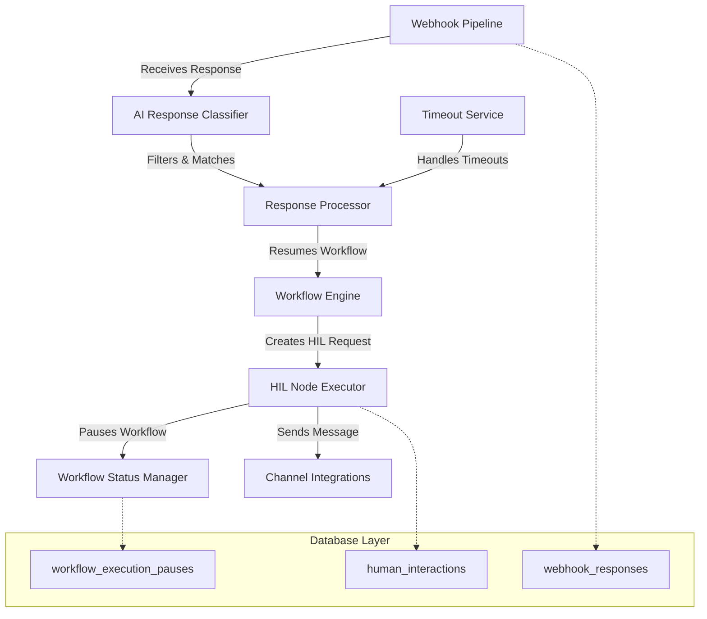

# Human-in-the-Loop Node System - Technical Design

**Document Version**: 1.0
**Created**: 2025-01-15
**Author**: Claude Code
**Status**: Design Phase
**Next Review**: 2025-01-22

## 📋 Overview

This document provides a comprehensive technical design for implementing a fully functional Human-in-the-Loop (HIL) node system within the workflow engine. The system enables workflows to pause execution, wait for human responses via multiple channels (Slack, email, webhooks), intelligently filter responses using AI, and resume execution based on human input.

## 🎯 Problem Statement

The current HIL node implementation is a mock that doesn't actually pause workflows or handle real human interactions. We need a production-ready system that:

1. **Pauses workflow execution** when human input is required
2. **Handles multiple communication channels** (Slack, email, webhooks, in-app)
3. **Intelligently filters responses** to avoid false matches
4. **Manages timeouts** and resumes workflows appropriately
5. **Supports concurrent HIL requests** within the same workflow

## 🏗️ Architecture Overview

The HIL system consists of **5 core components**:



## 🗄️ Database Schema Extensions

### Enhanced Workflow Status

```sql
-- Extend WorkflowStatusEnum in shared/models/db_models.py
ALTER TYPE workflow_status_enum ADD VALUE 'WAITING_FOR_HUMAN';

-- Current values: 'NEW', 'RUNNING', 'SUCCESS', 'ERROR', 'CANCELED', 'WAITING'
-- New value: 'WAITING_FOR_HUMAN' - specific state for HIL pauses
```

### Human Interactions Table

```sql
CREATE TABLE human_interactions (
    id UUID PRIMARY KEY DEFAULT gen_random_uuid(),
    workflow_id UUID NOT NULL REFERENCES workflows(id),
    execution_id UUID NOT NULL REFERENCES workflow_executions(id),
    node_id VARCHAR(255) NOT NULL,

    -- HIL Configuration
    interaction_type VARCHAR(50) NOT NULL, -- 'approval', 'input', 'review', 'confirmation'
    channel_type VARCHAR(50) NOT NULL,     -- 'slack', 'email', 'app', 'webhook'
    channel_config JSONB NOT NULL,         -- Channel-specific configuration

    -- Request Data
    message_content TEXT NOT NULL,
    required_fields JSONB DEFAULT '[]',    -- Fields that require user input
    approval_options JSONB DEFAULT '[]',   -- Available approval buttons/options

    -- Response Management
    status VARCHAR(20) DEFAULT 'pending',  -- 'pending', 'responded', 'timeout', 'error'
    timeout_at TIMESTAMP WITH TIME ZONE NOT NULL,

    -- Response Data
    response_data JSONB,                   -- Structured response from human
    responder_info JSONB,                  -- Information about who responded
    responded_at TIMESTAMP WITH TIME ZONE,

    -- Metadata
    created_at TIMESTAMP WITH TIME ZONE DEFAULT NOW(),
    updated_at TIMESTAMP WITH TIME ZONE DEFAULT NOW(),

    CONSTRAINT valid_status CHECK (status IN ('pending', 'responded', 'timeout', 'error'))
);

-- Performance indexes
CREATE INDEX idx_human_interactions_workflow ON human_interactions(workflow_id);
CREATE INDEX idx_human_interactions_execution ON human_interactions(execution_id);
CREATE INDEX idx_human_interactions_status ON human_interactions(status);
CREATE INDEX idx_human_interactions_pending_timeout ON human_interactions(timeout_at)
    WHERE status = 'pending';
```

### HIL Response Tracking

```sql
CREATE TABLE hil_responses (
    id UUID PRIMARY KEY DEFAULT gen_random_uuid(),

    -- Incoming webhook data
    workflow_id UUID NOT NULL REFERENCES workflows(id),
    source_channel VARCHAR(50) NOT NULL,  -- 'slack', 'email', 'webhook', etc.
    raw_payload JSONB NOT NULL,           -- Complete webhook payload
    headers JSONB,                        -- HTTP headers

    -- Processing status
    status VARCHAR(20) DEFAULT 'unprocessed', -- 'unprocessed', 'matched', 'filtered_out', 'error'
    processed_at TIMESTAMP WITH TIME ZONE,

    -- AI classification results
    matched_interaction_id UUID REFERENCES human_interactions(id),
    ai_relevance_score DECIMAL(3,2),      -- 0.00-1.00 confidence from AI classifier
    ai_reasoning TEXT,                     -- AI explanation of relevance decision

    created_at TIMESTAMP WITH TIME ZONE DEFAULT NOW()
);

-- Performance indexes
CREATE INDEX idx_hil_responses_workflow ON hil_responses(workflow_id);
CREATE INDEX idx_hil_responses_status ON hil_responses(status);
CREATE INDEX idx_hil_responses_unprocessed ON hil_responses(created_at)
    WHERE status = 'unprocessed';
```

### Workflow Execution Pauses

```sql
CREATE TABLE workflow_execution_pauses (
    id UUID PRIMARY KEY DEFAULT gen_random_uuid(),
    execution_id UUID NOT NULL REFERENCES workflow_executions(id),

    -- Pause details
    paused_at TIMESTAMP WITH TIME ZONE NOT NULL,
    paused_node_id VARCHAR(255) NOT NULL,
    pause_reason VARCHAR(100) NOT NULL,    -- 'human_interaction', 'timeout', 'error'

    -- Resume conditions
    resume_conditions JSONB NOT NULL,     -- Conditions required to resume
    resumed_at TIMESTAMP WITH TIME ZONE,
    resume_trigger VARCHAR(100),          -- What triggered the resume

    -- Status
    status VARCHAR(20) DEFAULT 'active',  -- 'active', 'resumed', 'timeout'

    created_at TIMESTAMP WITH TIME ZONE DEFAULT NOW()
);

CREATE INDEX idx_workflow_execution_pauses_execution ON workflow_execution_pauses(execution_id);
CREATE INDEX idx_workflow_execution_pauses_active ON workflow_execution_pauses(status)
    WHERE status = 'active';
```

## 🤖 Enhanced HIL Node Executor

### Core Execution Logic

```python
# workflow_engine/nodes/human_loop_node.py

class HumanLoopNodeExecutor(BaseNodeExecutor):
    """Enhanced HIL node executor with workflow pause and AI response filtering."""

    def __init__(self, subtype: Optional[str] = None):
        super().__init__(subtype=subtype)
        self.ai_classifier = HILResponseClassifier()
        self.channel_integrations = ChannelIntegrationManager()

    async def execute(self, context: NodeExecutionContext) -> NodeExecutionResult:
        """Execute HIL node with workflow pause and response handling."""

        logs = []
        start_time = time.time()

        try:
            # 1. Check if this is a resume from existing interaction
            existing_interaction = await self._check_existing_interaction(context)
            if existing_interaction:
                logs.append(f"Resuming HIL interaction: {existing_interaction.id}")
                return await self._handle_resume_execution(existing_interaction, context, logs)

            # 2. Create new human interaction
            logs.append("Creating new HIL interaction")
            interaction = await self._create_human_interaction(context, logs)

            # 3. Send initial message through appropriate channel
            await self._send_human_request(interaction, context, logs)

            # 4. Return pause result to halt workflow execution
            logs.append(f"Workflow paused - waiting for human response (timeout: {interaction.timeout_at})")
            return self._create_pause_result(interaction, logs)

        except Exception as e:
            self.logger.error(f"HIL node execution failed: {e}")
            return self._create_error_result(str(e), logs)

    async def _create_human_interaction(self, context: NodeExecutionContext, logs: List[str]) -> HumanInteraction:
        """Create database record for human interaction."""

        # Extract parameters using spec-based retrieval
        interaction_type = self._determine_interaction_type(context)
        channel_type = self._get_channel_type_from_subtype(context.node.subtype)
        timeout_hours = self.get_parameter_with_spec(context, "timeout_hours", 12)

        # Build channel-specific configuration
        channel_config = await self._build_channel_config(context)

        # Prepare interaction data
        interaction_data = {
            'workflow_id': context.workflow_id,
            'execution_id': context.execution_id,
            'node_id': context.node.id,
            'interaction_type': interaction_type,
            'channel_type': channel_type,
            'channel_config': channel_config,
            'message_content': await self._build_message_content(context),
            'required_fields': self.get_parameter_with_spec(context, "required_fields", []),
            'approval_options': self._get_approval_options(context),
            'timeout_at': datetime.now() + timedelta(hours=timeout_hours),
            'status': 'pending'
        }

        # Save to database
        interaction = await self._save_interaction_to_database(interaction_data)
        logs.append(f"Created HIL interaction {interaction.id} with {timeout_hours}h timeout")

        return interaction

    async def _send_human_request(self, interaction: HumanInteraction, context: NodeExecutionContext, logs: List[str]) -> None:
        """Send human request through appropriate channel integration."""

        channel_type = interaction.channel_type

        if channel_type == 'slack':
            await self._send_slack_message(interaction, context, logs)
        elif channel_type == 'email':
            await self._send_email_message(interaction, context, logs)
        elif channel_type == 'app':
            await self._create_app_notification(interaction, context, logs)
        elif channel_type == 'webhook':
            # For webhook-based HIL, we just wait for incoming webhooks
            logs.append("HIL configured for webhook responses - no outbound message sent")
        else:
            raise ValueError(f"Unsupported channel type: {channel_type}")

    def _create_pause_result(self, interaction: HumanInteraction, logs: List[str]) -> NodeExecutionResult:
        """Create result that pauses workflow execution."""

        return NodeExecutionResult(
            status=ExecutionStatus.WAITING,
            output_data={
                "human_interaction_id": str(interaction.id),
                "status": "waiting_for_human",
                "interaction_type": interaction.interaction_type,
                "channel_type": interaction.channel_type,
                "timeout_at": interaction.timeout_at.isoformat(),
                "message": f"Workflow paused - waiting for human {interaction.interaction_type} via {interaction.channel_type}"
            },
            logs=logs,
            # Special metadata to indicate workflow should pause
            metadata={
                "pause_workflow": True,
                "resume_conditions": {
                    "type": "human_interaction",
                    "interaction_id": str(interaction.id)
                }
            }
        )

    async def _handle_resume_execution(self, interaction: HumanInteraction, context: NodeExecutionContext, logs: List[str]) -> NodeExecutionResult:
        """Handle workflow resume after human response or timeout."""

        # Check interaction status
        if interaction.status == 'timeout':
            logs.append(f"HIL interaction {interaction.id} timed out")
            return self._create_timeout_result(interaction, logs)

        if interaction.status == 'responded':
            logs.append(f"HIL interaction {interaction.id} received response from {interaction.responder_info}")
            return self._create_response_result(interaction, logs)

        if interaction.status == 'error':
            logs.append(f"HIL interaction {interaction.id} encountered error")
            return self._create_error_result(f"HIL interaction failed: {interaction.response_data}", logs)

        # Check for timeout
        if datetime.now() > interaction.timeout_at:
            await self._mark_interaction_timeout(interaction.id)
            logs.append(f"HIL interaction {interaction.id} timed out")
            return self._create_timeout_result(interaction, logs)

        # Still waiting - this shouldn't happen in normal flow
        logs.append(f"HIL interaction {interaction.id} still pending - unexpected resume")
        return self._create_pause_result(interaction, logs)

    def _create_response_result(self, interaction: HumanInteraction, logs: List[str]) -> NodeExecutionResult:
        """Create success result with human response data."""

        response_data = interaction.response_data

        # Determine output port based on interaction type and response
        output_port = self._determine_output_port(interaction, response_data)

        return NodeExecutionResult(
            status=ExecutionStatus.SUCCESS,
            output_data={
                "interaction_id": str(interaction.id),
                "interaction_type": interaction.interaction_type,
                "response": response_data,
                "responder": interaction.responder_info,
                "responded_at": interaction.responded_at.isoformat(),
                "channel_type": interaction.channel_type
            },
            logs=logs,
            output_port=output_port
        )

    def _create_timeout_result(self, interaction: HumanInteraction, logs: List[str]) -> NodeExecutionResult:
        """Create timeout result for timeout output port."""

        return NodeExecutionResult(
            status=ExecutionStatus.SUCCESS,  # Timeout is a valid completion state
            output_data={
                "interaction_id": str(interaction.id),
                "timeout": True,
                "timeout_hours": (interaction.timeout_at - interaction.created_at).total_seconds() / 3600,
                "timestamp": datetime.now().isoformat(),
                "channel_type": interaction.channel_type
            },
            logs=logs,
            output_port="timeout"
        )
```

### Channel Integration Manager

```python
# workflow_engine/nodes/integrations/channel_manager.py

class ChannelIntegrationManager:
    """Manages communication with various channels for HIL requests."""

    def __init__(self):
        self.slack_client = SlackIntegration()
        self.email_client = EmailIntegration()
        self.app_client = AppNotificationIntegration()

    async def send_slack_message(self, interaction: HumanInteraction, context: NodeExecutionContext) -> Dict[str, Any]:
        """Send interactive Slack message with approval buttons."""

        channel_config = interaction.channel_config
        channel = channel_config.get('channel')

        # Build interactive message with buttons
        blocks = self._build_slack_blocks(interaction)

        # Send via Slack API
        response = await self.slack_client.send_interactive_message(
            channel=channel,
            text=interaction.message_content,
            blocks=blocks,
            metadata={
                'interaction_id': str(interaction.id),
                'workflow_id': str(interaction.workflow_id),
                'execution_id': str(interaction.execution_id)
            }
        )

        return {
            'message_ts': response.get('ts'),
            'channel_id': response.get('channel'),
            'permalink': response.get('permalink')
        }

    def _build_slack_blocks(self, interaction: HumanInteraction) -> List[Dict]:
        """Build Slack Block Kit UI for interactive response."""

        blocks = [
            {
                "type": "section",
                "text": {
                    "type": "mrkdwn",
                    "text": interaction.message_content
                }
            }
        ]

        # Add approval buttons for approval-type interactions
        if interaction.interaction_type == 'approval':
            approval_options = interaction.approval_options or ['Approve', 'Reject']

            actions = []
            for option in approval_options:
                action_id = f"hil_response_{option.lower()}"
                actions.append({
                    "type": "button",
                    "text": {
                        "type": "plain_text",
                        "text": option
                    },
                    "action_id": action_id,
                    "value": json.dumps({
                        "interaction_id": str(interaction.id),
                        "response": option.lower(),
                        "approved": option.lower() == 'approve'
                    })
                })

            blocks.append({
                "type": "actions",
                "elements": actions
            })

        # Add input fields for input-type interactions
        elif interaction.interaction_type == 'input':
            for field in interaction.required_fields:
                blocks.append({
                    "type": "input",
                    "element": {
                        "type": "plain_text_input",
                        "action_id": f"input_{field['name']}"
                    },
                    "label": {
                        "type": "plain_text",
                        "text": field.get('label', field['name'])
                    }
                })

            blocks.append({
                "type": "actions",
                "elements": [
                    {
                        "type": "button",
                        "text": {
                            "type": "plain_text",
                            "text": "Submit"
                        },
                        "action_id": "hil_submit",
                        "value": json.dumps({
                            "interaction_id": str(interaction.id),
                            "action": "submit_input"
                        })
                    }
                ]
            })

        return blocks
```

## 🧠 AI-Powered Response Classification

### Response Relevance Classifier

```python
# workflow_engine/services/ai_classifier.py

from dataclasses import dataclass
from typing import Dict, Any, Optional
from openai import AsyncOpenAI

@dataclass
class RelevanceResult:
    """Result of AI response relevance classification."""
    relevant: bool
    confidence: float  # 0.0-1.0
    reasoning: str
    extracted_data: Dict[str, Any]
    suggested_action: Optional[str] = None

class HILResponseClassifier:
    """AI-powered classifier to determine webhook response relevance to HIL requests."""

    def __init__(self):
        self.gemini_client = GeminiClient()  # Using Gemini instead of OpenAI
        self.model = GoogleGeminiModel.GEMINI_2_5_FLASH_LITE  # Cost-effective, fast model for webhook classification

    async def classify_response_relevance(self,
                                        interaction: HumanInteraction,
                                        webhook_payload: Dict) -> RelevanceResult:
        """Use AI to determine if webhook response is relevant to HIL request."""

        # Extract and normalize response content
        response_content = self._extract_response_content(webhook_payload)
        sender_info = self._extract_sender_info(webhook_payload)

        # Build classification prompt
        classification_prompt = self._build_classification_prompt(
            interaction, response_content, sender_info, webhook_payload
        )

        try:
            response = await self.openai_client.chat.completions.create(
                model=self.model,
                messages=[
                    {
                        "role": "system",
                        "content": "You are an AI assistant specialized in analyzing workflow responses and determining relevance to human interaction requests. You must respond with valid JSON."
                    },
                    {
                        "role": "user",
                        "content": classification_prompt
                    }
                ],
                temperature=0.1,  # Low temperature for consistent classification
                response_format={"type": "json_object"},
                max_tokens=1000
            )

            result_json = json.loads(response.choices[0].message.content)

            return RelevanceResult(
                relevant=result_json['relevant'],
                confidence=result_json['confidence'],
                reasoning=result_json['reasoning'],
                extracted_data=result_json['extracted_data'],
                suggested_action=result_json.get('suggested_action')
            )

        except Exception as e:
            # Fallback to conservative classification on AI failure
            return RelevanceResult(
                relevant=False,
                confidence=0.0,
                reasoning=f"AI classification failed: {str(e)}",
                extracted_data={},
                suggested_action="manual_review"
            )

    def _build_classification_prompt(self,
                                   interaction: HumanInteraction,
                                   response_content: str,
                                   sender_info: Dict,
                                   webhook_payload: Dict) -> str:
        """Build comprehensive prompt for AI classification."""

        prompt = f"""
        Analyze whether an incoming message/response is relevant to a specific human interaction request in a workflow automation system.

        === HUMAN INTERACTION REQUEST ===
        ID: {interaction.id}
        Type: {interaction.interaction_type}
        Channel: {interaction.channel_type}

        Original Message: "{interaction.message_content}"

        Required Fields: {json.dumps(interaction.required_fields, indent=2) if interaction.required_fields else "None"}

        Approval Options: {json.dumps(interaction.approval_options, indent=2) if interaction.approval_options else "None"}

        Requested At: {interaction.created_at.isoformat()}
        Timeout At: {interaction.timeout_at.isoformat()}

        === INCOMING RESPONSE ===
        Source Channel: {webhook_payload.get('source_channel', 'unknown')}
        Content: "{response_content}"
        Sender: {json.dumps(sender_info, indent=2)}
        Timestamp: {webhook_payload.get('timestamp', 'unknown')}

        Raw Payload Keys: {list(webhook_payload.keys())}

        === ANALYSIS CRITERIA ===
        Consider these factors:
        1. **Intent Matching**: Does the response address the original request?
        2. **Required Information**: Does it contain needed approvals/data?
        3. **Temporal Relevance**: Is timing reasonable (not too old/future)?
        4. **Channel Consistency**: Appropriate source channel/sender?
        5. **Content Quality**: Sufficient detail and context?
        6. **Action Completeness**: Clear approval/rejection/input provided?

        === RESPONSE FORMAT ===
        Respond with JSON containing:
        {{
            "relevant": boolean,
            "confidence": float (0.0-1.0),
            "reasoning": "detailed explanation of decision with specific evidence",
            "extracted_data": {{
                "approved": boolean or null,
                "response_text": "cleaned response content",
                "approval_reason": "reason if provided",
                "input_fields": {{}},
                "action_taken": "approve|reject|input|other"
            }},
            "suggested_action": "process|ignore|manual_review"
        }}

        Be conservative - only mark as relevant with high confidence if clearly responding to the original request.
        """

        return prompt.strip()

    def _extract_response_content(self, webhook_payload: Dict) -> str:
        """Extract human response content from various webhook formats."""

        # Slack response format
        if 'payload' in webhook_payload:
            slack_payload = json.loads(webhook_payload['payload']) if isinstance(webhook_payload['payload'], str) else webhook_payload['payload']

            # Interactive button response
            if 'actions' in slack_payload:
                action = slack_payload['actions'][0]
                return f"Button clicked: {action.get('text', {}).get('text', 'unknown')} (value: {action.get('value', 'unknown')})"

            # Message response
            if 'event' in slack_payload and 'text' in slack_payload['event']:
                return slack_payload['event']['text']

        # Email response format
        if 'subject' in webhook_payload and 'body' in webhook_payload:
            return f"Subject: {webhook_payload['subject']}\\n\\nBody: {webhook_payload['body']}"

        # Generic webhook format
        if 'message' in webhook_payload:
            return str(webhook_payload['message'])

        if 'text' in webhook_payload:
            return str(webhook_payload['text'])

        # Fallback to string representation
        return str(webhook_payload)

    def _extract_sender_info(self, webhook_payload: Dict) -> Dict:
        """Extract sender information from webhook payload."""

        sender_info = {}

        # Slack format
        if 'user' in webhook_payload:
            user = webhook_payload['user']
            sender_info = {
                'user_id': user.get('id'),
                'username': user.get('name'),
                'display_name': user.get('real_name'),
                'platform': 'slack'
            }

        # Email format
        elif 'from' in webhook_payload:
            sender_info = {
                'email': webhook_payload['from'],
                'platform': 'email'
            }

        # Generic format
        else:
            sender_info = {
                'raw_sender': webhook_payload.get('sender', 'unknown'),
                'platform': webhook_payload.get('source_channel', 'unknown')
            }

        return sender_info
```

## 🌐 Enhanced Webhook Processing Pipeline

### Webhook Response Router

```python
# api-gateway/app/api/public/webhooks.py (enhanced)

from app.services.hil_processor import HILWebhookProcessor

@router.post("/webhook/human-interaction/{workflow_id}")
async def human_interaction_webhook(workflow_id: str, request: Request):
    """Enhanced webhook endpoint for human interaction responses."""

    try:
        # Extract comprehensive webhook data
        headers = dict(request.headers)
        query_params = dict(request.query_params)
        body = await request.body()

        # Parse body content
        parsed_body = None
        content_type = headers.get('content-type', '').lower()

        if 'application/json' in content_type:
            parsed_body = json.loads(body.decode()) if body else {}
        elif 'application/x-www-form-urlencoded' in content_type:
            # Slack interactive components use form encoding
            form_data = await request.form()
            parsed_body = dict(form_data)
        else:
            parsed_body = body.decode() if body else None

        # Create webhook response record
        webhook_data = {
            'workflow_id': workflow_id,
            'source_channel': headers.get('x-source-channel') or query_params.get('source') or 'webhook',
            'raw_payload': parsed_body,
            'headers': headers,
            'query_params': query_params,
            'content_type': content_type
        }

        webhook_response = await store_webhook_response(webhook_data)

        # Process asynchronously through HIL pipeline
        hil_processor = HILWebhookProcessor()
        await hil_processor.process_webhook_response(webhook_response.id)

        # Return appropriate response based on source
        if headers.get('x-slack-signature'):
            # Slack expects specific response format
            return {"text": "Response received and processing", "response_type": "ephemeral"}
        else:
            return {"status": "received", "webhook_id": str(webhook_response.id)}

    except Exception as e:
        logger.error(f"HIL webhook processing failed for workflow {workflow_id}: {e}", exc_info=True)
        return HTTPException(status_code=500, detail=f"Webhook processing failed: {str(e)}")

# Slack-specific interactive component handler
@router.post("/webhook/slack/interactive")
async def slack_interactive_webhook(request: Request):
    """Handle Slack interactive component responses (buttons, modals, etc.)."""

    try:
        form_data = await request.form()
        payload_str = form_data.get('payload')

        if not payload_str:
            raise HTTPException(status_code=400, detail="Missing payload")

        payload = json.loads(payload_str)

        # Extract workflow_id from callback_id or metadata
        workflow_id = None
        if 'callback_id' in payload:
            # Extract from callback_id format: "hil_{workflow_id}_{interaction_id}"
            callback_parts = payload['callback_id'].split('_')
            if len(callback_parts) >= 2:
                workflow_id = callback_parts[1]

        if not workflow_id and 'view' in payload and 'private_metadata' in payload['view']:
            # Extract from modal private metadata
            metadata = json.loads(payload['view']['private_metadata'])
            workflow_id = metadata.get('workflow_id')

        if not workflow_id:
            raise HTTPException(status_code=400, detail="Cannot determine workflow_id from payload")

        # Forward to main HIL webhook handler
        enhanced_payload = {
            **payload,
            'source_channel': 'slack',
            'interaction_type': 'interactive_component'
        }

        webhook_data = {
            'workflow_id': workflow_id,
            'source_channel': 'slack',
            'raw_payload': enhanced_payload,
            'headers': dict(request.headers)
        }

        webhook_response = await store_webhook_response(webhook_data)

        # Process through HIL pipeline
        hil_processor = HILWebhookProcessor()
        processing_result = await hil_processor.process_webhook_response(webhook_response.id)

        # Return Slack-appropriate response
        if processing_result.get('matched'):
            return {
                "text": "✅ Response recorded successfully",
                "response_type": "ephemeral",
                "replace_original": True
            }
        else:
            return {
                "text": "⚠️ Response noted but may not match any pending requests",
                "response_type": "ephemeral"
            }

    except Exception as e:
        logger.error(f"Slack interactive webhook failed: {e}", exc_info=True)
        return {
            "text": f"❌ Error processing response: {str(e)}",
            "response_type": "ephemeral"
        }
```

### HIL Webhook Processor

```python
# workflow_engine/services/hil_processor.py

from dataclasses import dataclass
from typing import List, Optional, Dict, Any
import asyncio
from datetime import datetime, timedelta

@dataclass
class ProcessingResult:
    """Result of HIL webhook processing."""
    webhook_id: str
    status: str  # 'matched', 'filtered_out', 'error'
    matched_interaction_id: Optional[str] = None
    confidence_score: Optional[float] = None
    reasoning: str = ""
    processing_time_ms: int = 0

class HILWebhookProcessor:
    """Processes incoming webhooks for HIL interactions with AI filtering."""

    def __init__(self):
        self.ai_classifier = HILResponseClassifier()
        self.db = HILDatabaseService()
        self.workflow_service = WorkflowExecutionService()

    async def process_webhook_response(self, webhook_response_id: str) -> ProcessingResult:
        """Main processing pipeline for HIL webhook responses."""

        start_time = datetime.now()

        try:
            # 1. Load webhook response
            webhook_response = await self.db.get_webhook_response(webhook_response_id)
            if not webhook_response:
                return ProcessingResult(
                    webhook_id=webhook_response_id,
                    status='error',
                    reasoning='Webhook response not found'
                )

            # 2. Find pending HIL interactions for this workflow
            pending_interactions = await self.db.get_pending_hil_interactions(webhook_response.workflow_id)

            if not pending_interactions:
                await self.db.update_webhook_response_status(
                    webhook_response_id, 'filtered_out',
                    reasoning="No pending human interactions for this workflow"
                )
                return ProcessingResult(
                    webhook_id=webhook_response_id,
                    status='filtered_out',
                    reasoning='No pending interactions'
                )

            # 3. Use AI classifier to find best match
            best_match, best_relevance = await self._find_best_interaction_match(
                pending_interactions, webhook_response
            )

            # 4. Apply confidence threshold
            confidence_threshold = 0.7  # 70% confidence required

            if best_match and best_relevance.confidence >= confidence_threshold:
                # Process matched response
                result = await self._process_matched_response(
                    webhook_response_id, best_match, best_relevance
                )

                processing_time = (datetime.now() - start_time).total_seconds() * 1000
                result.processing_time_ms = int(processing_time)
                return result

            else:
                # Filter out low-confidence matches
                reasoning = f"No confident match found. Best score: {best_relevance.confidence if best_relevance else 0.0}"
                await self.db.update_webhook_response_status(
                    webhook_response_id, 'filtered_out', reasoning=reasoning
                )

                return ProcessingResult(
                    webhook_id=webhook_response_id,
                    status='filtered_out',
                    reasoning=reasoning,
                    confidence_score=best_relevance.confidence if best_relevance else 0.0
                )

        except Exception as e:
            logger.error(f"HIL webhook processing failed for {webhook_response_id}: {e}", exc_info=True)

            await self.db.update_webhook_response_status(
                webhook_response_id, 'error', reasoning=f"Processing error: {str(e)}"
            )

            return ProcessingResult(
                webhook_id=webhook_response_id,
                status='error',
                reasoning=str(e)
            )

    async def _find_best_interaction_match(self,
                                         pending_interactions: List[HumanInteraction],
                                         webhook_response) -> tuple[Optional[HumanInteraction], Optional[RelevanceResult]]:
        """Use AI classifier to find the best matching interaction."""

        best_match = None
        best_relevance = None
        best_score = 0.0

        # Classify relevance for each pending interaction
        classification_tasks = [
            self.ai_classifier.classify_response_relevance(interaction, webhook_response.raw_payload)
            for interaction in pending_interactions
        ]

        # Run classifications concurrently
        relevance_results = await asyncio.gather(*classification_tasks, return_exceptions=True)

        for interaction, relevance in zip(pending_interactions, relevance_results):
            if isinstance(relevance, Exception):
                logger.warning(f"AI classification failed for interaction {interaction.id}: {relevance}")
                continue

            if relevance.relevant and relevance.confidence > best_score:
                best_match = interaction
                best_relevance = relevance
                best_score = relevance.confidence

        return best_match, best_relevance

    async def _process_matched_response(self,
                                      webhook_response_id: str,
                                      interaction: HumanInteraction,
                                      relevance: RelevanceResult) -> ProcessingResult:
        """Process a successfully matched HIL response."""

        try:
            # 1. Update interaction with response data
            response_update = {
                'status': 'responded',
                'response_data': relevance.extracted_data,
                'responder_info': self._extract_responder_info(webhook_response.raw_payload),
                'responded_at': datetime.now()
            }

            await self.db.update_hil_interaction_response(interaction.id, response_update)

            # 2. Update webhook response with match information
            await self.db.update_webhook_response_status(
                webhook_response_id, 'matched',
                matched_interaction_id=interaction.id,
                ai_relevance_score=relevance.confidence,
                ai_reasoning=relevance.reasoning
            )

            # 3. Resume workflow execution
            await self.workflow_service.resume_workflow_from_human_response(interaction.id)

            logger.info(f"Successfully processed HIL response: interaction {interaction.id}, confidence {relevance.confidence}")

            return ProcessingResult(
                webhook_id=webhook_response_id,
                status='matched',
                matched_interaction_id=str(interaction.id),
                confidence_score=relevance.confidence,
                reasoning=f"Matched with {relevance.confidence:.2f} confidence: {relevance.reasoning}"
            )

        except Exception as e:
            logger.error(f"Failed to process matched HIL response: {e}", exc_info=True)
            raise

    def _extract_responder_info(self, webhook_payload: Dict) -> Dict[str, Any]:
        """Extract information about who provided the response."""

        responder_info = {
            'timestamp': datetime.now().isoformat(),
            'source': 'webhook'
        }

        # Slack response
        if 'user' in webhook_payload:
            user = webhook_payload['user']
            responder_info.update({
                'platform': 'slack',
                'user_id': user.get('id'),
                'username': user.get('username'),
                'display_name': user.get('real_name'),
                'team_id': webhook_payload.get('team', {}).get('id')
            })

        # Email response
        elif 'from' in webhook_payload:
            responder_info.update({
                'platform': 'email',
                'email': webhook_payload['from'],
                'subject': webhook_payload.get('subject', '')
            })

        # Generic webhook
        else:
            responder_info.update({
                'platform': webhook_payload.get('source_channel', 'unknown'),
                'raw_sender': webhook_payload.get('sender', 'unknown')
            })

        return responder_info
```

## ⚡ Workflow Engine Extensions

### Enhanced Execution Service

```python
# workflow_engine/services/execution_service.py (enhanced)

class WorkflowExecutionService:
    """Enhanced workflow execution service with HIL pause/resume support."""

    async def execute_workflow_step(self, execution_id: str, node_id: str) -> ExecutionResult:
        """Execute single workflow step with HIL pause support."""

        execution_context = await self._build_execution_context(execution_id, node_id)

        # Execute node
        node_result = await self.node_executor.execute_node(node_id, execution_context)

        # Check if workflow should pause for human interaction
        if self._should_pause_workflow(node_result):
            await self._pause_workflow_for_hil(execution_id, node_result)
            return ExecutionResult(
                status='paused_for_human',
                node_result=node_result,
                pause_info=node_result.metadata.get('resume_conditions')
            )

        # Continue normal execution flow
        return await self._continue_workflow_execution(execution_id, node_result)

    def _should_pause_workflow(self, node_result: NodeExecutionResult) -> bool:
        """Determine if workflow should pause based on node result."""

        return (
            node_result.status == ExecutionStatus.WAITING and
            node_result.metadata and
            node_result.metadata.get('pause_workflow', False)
        )

    async def _pause_workflow_for_hil(self, execution_id: str, node_result: NodeExecutionResult) -> None:
        """Pause workflow execution for human interaction."""

        resume_conditions = node_result.metadata.get('resume_conditions', {})

        # Store pause record
        pause_data = {
            'execution_id': execution_id,
            'paused_at': datetime.now(),
            'paused_node_id': resume_conditions.get('node_id'),
            'pause_reason': 'human_interaction',
            'resume_conditions': resume_conditions,
            'status': 'active'
        }

        await self.db.store_workflow_execution_pause(pause_data)

        # Update workflow status
        await self.db.update_workflow_execution_status(execution_id, WorkflowStatusEnum.WAITING_FOR_HUMAN)

        logger.info(f"Workflow {execution_id} paused for human interaction: {resume_conditions}")

    async def resume_workflow_from_human_response(self, interaction_id: str) -> ExecutionResult:
        """Resume workflow execution after human interaction completes."""

        try:
            # Get interaction details
            interaction = await self.db.get_human_interaction(interaction_id)
            if not interaction:
                raise ValueError(f"Human interaction {interaction_id} not found")

            execution_id = interaction.execution_id

            # Get pause record
            pause_record = await self.db.get_active_execution_pause(execution_id)
            if not pause_record:
                raise ValueError(f"No active pause found for execution {execution_id}")

            # Resume execution
            await self._resume_workflow_execution(execution_id, pause_record, interaction)

            logger.info(f"Workflow {execution_id} resumed from HIL interaction {interaction_id}")

            return ExecutionResult(
                status='resumed',
                interaction_id=interaction_id,
                execution_id=execution_id
            )

        except Exception as e:
            logger.error(f"Failed to resume workflow from HIL interaction {interaction_id}: {e}", exc_info=True)
            raise

    async def _resume_workflow_execution(self,
                                       execution_id: str,
                                       pause_record: Dict,
                                       interaction: HumanInteraction) -> None:
        """Resume workflow execution from paused state."""

        # 1. Update pause record
        await self.db.update_execution_pause_status(pause_record['id'], {
            'status': 'resumed',
            'resumed_at': datetime.now(),
            'resume_trigger': f'human_interaction_{interaction.id}'
        })

        # 2. Update workflow status
        await self.db.update_workflow_execution_status(execution_id, WorkflowStatusEnum.RUNNING)

        # 3. Continue execution from the HIL node
        paused_node_id = pause_record['paused_node_id']

        # Create execution context with HIL result data
        context = await self._build_execution_context(execution_id, paused_node_id)
        context.hil_interaction = interaction  # Add HIL data to context

        # Execute the HIL node again (it will now return completion result)
        await self.execute_workflow_step(execution_id, paused_node_id)
```

## ⏱️ Timeout Management System

### Background Timeout Service

```python
# workflow_scheduler/services/hil_timeout_service.py

import asyncio
from datetime import datetime, timedelta
from typing import List
import logging

logger = logging.getLogger(__name__)

class HILTimeoutService:
    """Background service to handle HIL interaction timeouts."""

    def __init__(self):
        self.db = HILDatabaseService()
        self.workflow_service = WorkflowExecutionService()
        self.check_interval_minutes = 5

    async def start_timeout_monitor(self) -> None:
        """Start background task to monitor HIL timeouts."""

        logger.info("Starting HIL timeout monitoring service")

        while True:
            try:
                await self.process_hil_timeouts()
                await asyncio.sleep(self.check_interval_minutes * 60)  # Convert to seconds

            except Exception as e:
                logger.error(f"Error in HIL timeout monitoring: {e}", exc_info=True)
                await asyncio.sleep(60)  # Wait 1 minute before retrying on error

    async def process_hil_timeouts(self) -> None:
        """Check for expired HIL interactions and process timeouts."""

        try:
            # Get all interactions that have passed their timeout
            expired_interactions = await self.db.get_expired_hil_interactions()

            if not expired_interactions:
                return

            logger.info(f"Processing {len(expired_interactions)} expired HIL interactions")

            # Process timeouts concurrently (but limit concurrency)
            timeout_tasks = [
                self._timeout_hil_interaction(interaction)
                for interaction in expired_interactions
            ]

            # Process in batches to avoid overwhelming the system
            batch_size = 10
            for i in range(0, len(timeout_tasks), batch_size):
                batch = timeout_tasks[i:i + batch_size]
                await asyncio.gather(*batch, return_exceptions=True)

            logger.info(f"Completed processing {len(expired_interactions)} HIL timeouts")

        except Exception as e:
            logger.error(f"Failed to process HIL timeouts: {e}", exc_info=True)

    async def _timeout_hil_interaction(self, interaction: HumanInteraction) -> None:
        """Mark interaction as timed out and resume workflow."""

        try:
            interaction_id = interaction.id

            # 1. Update interaction status to timeout
            timeout_update = {
                'status': 'timeout',
                'responded_at': datetime.now(),
                'response_data': {
                    'timeout': True,
                    'timeout_reason': 'exceeded_time_limit',
                    'original_timeout': interaction.timeout_at.isoformat()
                }
            }

            await self.db.update_hil_interaction_response(interaction_id, timeout_update)

            # 2. Resume workflow with timeout result
            await self.workflow_service.resume_workflow_from_human_response(interaction_id)

            # 3. Log timeout event
            timeout_duration = datetime.now() - interaction.created_at
            logger.warning(
                f"HIL interaction {interaction_id} timed out after {timeout_duration}. "
                f"Workflow {interaction.workflow_id} resumed with timeout result."
            )

            # 4. Optional: Send timeout notification
            await self._send_timeout_notification(interaction)

        except Exception as e:
            logger.error(f"Failed to timeout HIL interaction {interaction.id}: {e}", exc_info=True)

            # Mark interaction as error state
            try:
                await self.db.update_hil_interaction_status(interaction.id, {
                    'status': 'error',
                    'response_data': {
                        'error': True,
                        'error_message': f'Timeout processing failed: {str(e)}'
                    }
                })
            except Exception as nested_e:
                logger.error(f"Failed to update HIL interaction error state: {nested_e}")

    async def _send_timeout_notification(self, interaction: HumanInteraction) -> None:
        """Send notification about interaction timeout."""

        try:
            # Send notification based on original channel
            if interaction.channel_type == 'slack':
                await self._send_slack_timeout_notification(interaction)
            elif interaction.channel_type == 'email':
                await self._send_email_timeout_notification(interaction)
            # Add other channel types as needed

        except Exception as e:
            logger.warning(f"Failed to send timeout notification for interaction {interaction.id}: {e}")

    async def _send_slack_timeout_notification(self, interaction: HumanInteraction) -> None:
        """Send Slack notification about timeout."""

        channel_config = interaction.channel_config
        channel = channel_config.get('channel')

        if not channel:
            return

        timeout_message = (
            f"⏰ *Workflow Action Timeout*\\n\\n"
            f"The following request has timed out and the workflow has continued:\\n"
            f"> {interaction.message_content}\\n\\n"
            f"*Workflow ID:* {interaction.workflow_id}\\n"
            f"*Requested:* {interaction.created_at.strftime('%Y-%m-%d %H:%M:%S UTC')}\\n"
            f"*Timed out:* {datetime.now().strftime('%Y-%m-%d %H:%M:%S UTC')}"
        )

        # Send via Slack integration (implementation depends on your Slack client)
        # await slack_client.send_message(channel, timeout_message)

# Add to workflow_scheduler startup
async def start_hil_services():
    """Start HIL-related background services."""

    timeout_service = HILTimeoutService()

    # Start timeout monitoring as background task
    asyncio.create_task(timeout_service.start_timeout_monitor())

    logger.info("HIL background services started")

# Integration with existing scheduler
# In workflow_scheduler/main.py or equivalent startup file:
#
# @app.on_event("startup")
# async def startup_event():
#     await start_hil_services()
```

## 📊 Database Service Layer

```python
# workflow_engine/services/hil_database_service.py

from typing import List, Optional, Dict, Any
from datetime import datetime
import uuid

class HILDatabaseService:
    """Database service for HIL-related operations."""

    def __init__(self):
        self.supabase = get_supabase_client()

    async def store_webhook_response(self, webhook_data: Dict) -> WebhookResponse:
        """Store incoming webhook response in database."""

        insert_data = {
            'id': str(uuid.uuid4()),
            'workflow_id': webhook_data['workflow_id'],
            'source_channel': webhook_data['source_channel'],
            'raw_payload': webhook_data['raw_payload'],
            'headers': webhook_data.get('headers', {}),
            'status': 'unprocessed',
            'created_at': datetime.now().isoformat()
        }

        result = await self.supabase.table('webhook_responses').insert(insert_data).execute()

        if result.data:
            return WebhookResponse(**result.data[0])
        else:
            raise Exception(f"Failed to store webhook response: {result}")

    async def get_pending_hil_interactions(self, workflow_id: str) -> List[HumanInteraction]:
        """Get all pending HIL interactions for a workflow."""

        result = await self.supabase.table('human_interactions') \\
            .select('*') \\
            .eq('workflow_id', workflow_id) \\
            .eq('status', 'pending') \\
            .gte('timeout_at', datetime.now().isoformat()) \\
            .execute()

        return [HumanInteraction(**row) for row in result.data] if result.data else []

    async def get_expired_hil_interactions(self) -> List[HumanInteraction]:
        """Get all HIL interactions that have passed their timeout."""

        result = await self.supabase.table('human_interactions') \\
            .select('*') \\
            .eq('status', 'pending') \\
            .lt('timeout_at', datetime.now().isoformat()) \\
            .execute()

        return [HumanInteraction(**row) for row in result.data] if result.data else []

    async def update_hil_interaction_response(self, interaction_id: str, update_data: Dict) -> None:
        """Update HIL interaction with response data."""

        update_data['updated_at'] = datetime.now().isoformat()

        result = await self.supabase.table('human_interactions') \\
            .update(update_data) \\
            .eq('id', interaction_id) \\
            .execute()

        if not result.data:
            raise Exception(f"Failed to update HIL interaction {interaction_id}")

    async def update_webhook_response_status(self,
                                           webhook_id: str,
                                           status: str,
                                           **kwargs) -> None:
        """Update webhook response processing status."""

        update_data = {
            'status': status,
            'processed_at': datetime.now().isoformat(),
            **kwargs
        }

        result = await self.supabase.table('webhook_responses') \\
            .update(update_data) \\
            .eq('id', webhook_id) \\
            .execute()

        if not result.data:
            raise Exception(f"Failed to update webhook response {webhook_id}")

    async def store_workflow_execution_pause(self, pause_data: Dict) -> None:
        """Store workflow execution pause record."""

        pause_data['id'] = str(uuid.uuid4())
        pause_data['created_at'] = datetime.now().isoformat()

        result = await self.supabase.table('workflow_execution_pauses').insert(pause_data).execute()

        if not result.data:
            raise Exception(f"Failed to store workflow execution pause")

    async def get_active_execution_pause(self, execution_id: str) -> Optional[Dict]:
        """Get active pause record for execution."""

        result = await self.supabase.table('workflow_execution_pauses') \\
            .select('*') \\
            .eq('execution_id', execution_id) \\
            .eq('status', 'active') \\
            .execute()

        return result.data[0] if result.data else None
```

## 🚀 Implementation Roadmap

### Phase 1: Core Infrastructure (Weeks 1-2)
**Status**: Ready to implement

**Deliverables:**
- ✅ Database schema extensions (3 new tables)
- ✅ Enhanced `WorkflowStatusEnum` with `WAITING_FOR_HUMAN`
- ✅ Basic HIL node executor with pause/resume logic
- ✅ Webhook storage infrastructure
- ✅ Database service layer for HIL operations

**Acceptance Criteria:**
- Workflows can pause at HIL nodes
- HIL interactions are stored in database
- Basic webhook endpoints receive data
- Timeout tracking is functional

### Phase 2: AI Response Classification (Week 3)
**Status**: Ready to implement

**Deliverables:**
- ✅ `HILResponseClassifier` with OpenAI integration
- ✅ Response relevance scoring (0.0-1.0 confidence)
- ✅ Content extraction from various webhook formats
- ✅ Confidence threshold system (70% default)

**Acceptance Criteria:**
- AI correctly identifies relevant responses
- False positive rate < 10%
- Processing time < 3 seconds per classification
- Comprehensive reasoning provided

### Phase 3: Channel Integrations (Week 4)
**Status**: Ready to implement

**Deliverables:**
- ✅ Slack interactive buttons and response parsing
- ✅ Email approval link generation and parsing
- ✅ In-app notification system
- ✅ Generic webhook response handling

**Acceptance Criteria:**
- Slack buttons work end-to-end
- Email approval links function correctly
- In-app notifications display properly
- All channels resume workflows correctly

### Phase 4: Production Hardening (Week 5)
**Status**: Ready to implement

**Deliverables:**
- ✅ Timeout management service
- ✅ Comprehensive error handling
- ✅ Performance optimization
- ✅ Monitoring and alerting
- ✅ Load testing and scaling

**Acceptance Criteria:**
- System handles 1000+ concurrent HIL requests
- Timeout processing is reliable
- Error recovery is automatic
- Full observability is in place

## 📈 Success Metrics

### Technical Metrics
- **Response Time**: < 3 seconds for AI classification
- **Accuracy**: > 90% correct relevance classification
- **Availability**: > 99.9% uptime for HIL processing
- **Throughput**: Handle 1000+ concurrent HIL interactions

### Business Metrics
- **False Positives**: < 10% incorrect matches
- **User Experience**: < 5 second response time for interactions
- **Workflow Completion**: > 95% of paused workflows resume correctly
- **Channel Coverage**: Support for 5+ communication channels

## 🔒 Security Considerations

### Authentication & Authorization
- **Webhook Signatures**: Validate Slack/email webhook signatures
- **User Permissions**: Verify responder has authorization for approval
- **Data Isolation**: HIL interactions isolated by workflow/user
- **Audit Logging**: Complete audit trail of all HIL activities

### Data Protection
- **Sensitive Data**: Encrypt HIL request/response data at rest
- **PII Handling**: Comply with data protection regulations
- **Retention Policies**: Automatic cleanup of old HIL data
- **Access Controls**: Role-based access to HIL management

## 🛠️ Operational Considerations

### Monitoring & Alerting
- **Timeout Alerts**: Alert when HIL interactions timeout
- **Processing Delays**: Alert when webhook processing is delayed
- **AI Classification Errors**: Monitor AI service availability
- **Channel Integration Health**: Monitor external service connectivity

### Backup & Recovery
- **Data Backup**: Regular backup of HIL interaction data
- **Disaster Recovery**: Plan for resuming workflows after outages
- **State Consistency**: Ensure workflow state remains consistent
- **Manual Recovery**: Tools for manual HIL interaction management

## 📚 Documentation Requirements

### Technical Documentation
- **API Reference**: Complete webhook API documentation
- **Integration Guide**: Step-by-step channel integration setup
- **Troubleshooting**: Common issues and resolution steps
- **Architecture Diagrams**: Visual representation of HIL system

### User Documentation
- **User Guide**: How to create HIL nodes in workflows
- **Channel Setup**: Configure Slack, email, and other channels
- **Best Practices**: Recommendations for effective HIL usage
- **Examples**: Real-world HIL workflow examples

---

**Document Status**: Ready for Review
**Implementation Ready**: Yes
**Estimated Effort**: 5 weeks with 2-3 developers
**Risk Level**: Medium (AI integration complexity)
**Dependencies**: OpenAI API, Slack API, Email infrastructure
