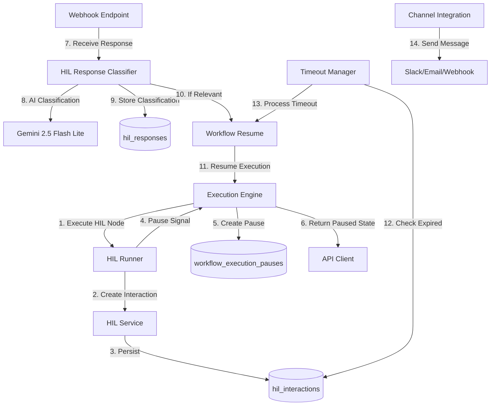
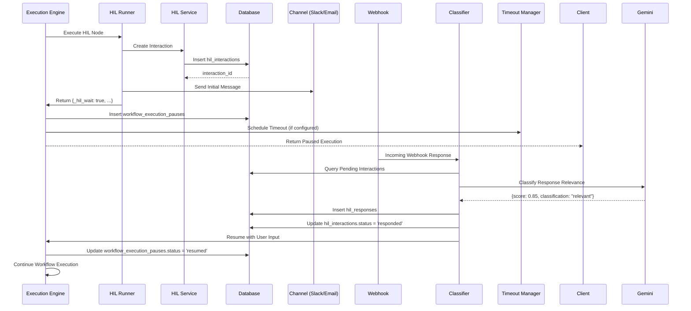

# Human-in-the-Loop (HIL) Node System - Technical Design

**Document Version**: 2.0
**Last Updated**: 2025-01-11
**Status**: Production Implementation Complete
**Implementation**: `workflow_engine_v2`

---

## 1. Executive Summary

### System Overview

The Human-in-the-Loop (HIL) system is a **production-ready workflow execution feature** that enables workflows to pause, request human input through multiple channels, intelligently filter responses using AI classification, and resume execution based on human feedback.

### Key Capabilities

- **5-Phase Execution Flow**: Startup → Pause → Wait → Resume → Continue
- **AI-Powered Response Classification**: Gemini 2.5 Flash Lite with 8-factor analysis (relevance, timing, channel, content, user context, response quality, thread context, action keywords)
- **Multi-Channel Support**: Slack, Email, Webhook, In-App notifications
- **Timeout Management**: Configurable timeouts (60s-24h) with automatic workflow resumption
- **Database Persistence**: Complete state management with `hil_interactions`, `hil_responses`, `workflow_execution_pauses` tables

### Technology Stack

| Component | Technology |
|-----------|------------|
| Execution Engine | `workflow_engine_v2.core.engine.ExecutionEngine` |
| HIL Runner | `workflow_engine_v2.runners.hil.HILRunner` |
| HIL Service | `workflow_engine_v2.services.hil_service.HILWorkflowServiceV2` |
| AI Classifier | `workflow_engine_v2.services.hil_response_classifier.HILResponseClassifierV2` (Gemini 2.5 Flash Lite) |
| Timeout Manager | `workflow_engine_v2.services.hil_timeout_manager.HILTimeoutManager` |
| Database | Supabase PostgreSQL with pgvector |
| Message Queue | Workflow execution pause records |

---

## 2. System Architecture

### 2.1 High-Level Architecture



### 2.2 Component Architecture

#### Core Components

1. **ExecutionEngine** (`workflow_engine_v2.core.engine.ExecutionEngine`)
   - Manages workflow execution lifecycle
   - Detects `_hil_wait` signal and pauses workflow
   - Creates `workflow_execution_pauses` records
   - Schedules timeout monitoring
   - Resumes execution with user input via `resume_with_user_input()`

2. **HILRunner** (`workflow_engine_v2.runners.hil.HILRunner`)
   - Validates HIL node configurations
   - Creates HIL interactions in database
   - Sends initial notification messages
   - Returns pause signals to execution engine

3. **HILWorkflowServiceV2** (`workflow_engine_v2.services.hil_service.HILWorkflowServiceV2`)
   - Creates and persists HIL interactions
   - Sends messages via channel integrations (Slack, Email)
   - Handles response messaging with template rendering
   - Manages OAuth token retrieval for channel integrations

4. **HILResponseClassifierV2** (`workflow_engine_v2.services.hil_response_classifier.HILResponseClassifierV2`)
   - AI-powered response relevance classification
   - 8-factor analysis using Gemini 2.5 Flash Lite
   - Heuristic fallback when AI unavailable
   - Confidence scoring (0.0-1.0) with configurable threshold

5. **HILTimeoutManager** (`workflow_engine_v2.services.hil_timeout_manager.HILTimeoutManager`)
   - Background monitoring for expired interactions
   - 15-minute warning notifications
   - Automatic timeout processing
   - Workflow resumption with timeout result

---

## 3. Data Architecture

### 3.1 Database Schema

#### `hil_interactions` Table

Stores core HIL interaction data with lifecycle management.

```sql
CREATE TABLE hil_interactions (
    id UUID PRIMARY KEY DEFAULT gen_random_uuid(),
    workflow_id UUID NOT NULL,
    execution_id UUID,
    node_id VARCHAR(255) NOT NULL,
    user_id UUID,

    -- Interaction classification
    interaction_type VARCHAR(50) NOT NULL,  -- approval, input, selection, review
    channel_type VARCHAR(50) NOT NULL,      -- slack, email, webhook, in_app

    -- Status and lifecycle
    status VARCHAR(20) DEFAULT 'pending',   -- pending, responded, timeout, cancelled

    -- Request and response data
    request_data JSONB NOT NULL,            -- Original request content, message templates
    response_data JSONB,                    -- Human response when received

    -- Timeout management
    timeout_seconds INTEGER DEFAULT 3600,   -- Timeout in seconds (60-86400)
    timeout_at TIMESTAMP WITH TIME ZONE NOT NULL,
    warning_sent BOOLEAN DEFAULT FALSE,     -- 15-min warning sent flag

    -- Timestamps
    created_at TIMESTAMP WITH TIME ZONE DEFAULT NOW(),
    updated_at TIMESTAMP WITH TIME ZONE DEFAULT NOW(),
    responded_at TIMESTAMP WITH TIME ZONE,

    -- Workflow context for template variables
    workflow_context JSONB,

    CONSTRAINT valid_status CHECK (status IN ('pending', 'responded', 'timeout', 'cancelled')),
    CONSTRAINT valid_interaction_type CHECK (interaction_type IN ('approval', 'input', 'selection', 'review')),
    CONSTRAINT valid_channel_type CHECK (channel_type IN ('slack', 'email', 'webhook', 'in_app'))
);

-- Performance indexes
CREATE INDEX idx_hil_interactions_status ON hil_interactions(status);
CREATE INDEX idx_hil_interactions_timeout ON hil_interactions(timeout_at) WHERE status = 'pending';
CREATE INDEX idx_hil_interactions_workflow ON hil_interactions(workflow_id, execution_id);
CREATE INDEX idx_hil_interactions_user ON hil_interactions(user_id);
```

#### `hil_responses` Table

Tracks incoming webhook responses with AI classification results.

```sql
CREATE TABLE hil_responses (
    id UUID PRIMARY KEY DEFAULT gen_random_uuid(),

    -- Source webhook/response data
    raw_payload JSONB NOT NULL,              -- Original webhook payload
    source_channel VARCHAR(50),              -- slack, email, etc.
    received_at TIMESTAMP WITH TIME ZONE DEFAULT NOW(),

    -- AI Classification results
    matched_interaction_id UUID REFERENCES hil_interactions(id),
    ai_relevance_score DECIMAL(3,2),         -- 0.00-1.00 relevance score
    ai_reasoning TEXT,                       -- AI explanation for classification
    ai_classification VARCHAR(20),           -- relevant, filtered, uncertain

    -- Processing status
    processed BOOLEAN DEFAULT FALSE,
    processed_at TIMESTAMP WITH TIME ZONE,

    -- Human verification (if needed)
    human_verified BOOLEAN,
    human_verification_notes TEXT,

    created_at TIMESTAMP WITH TIME ZONE DEFAULT NOW()
);

-- Performance indexes
CREATE INDEX idx_hil_responses_processed ON hil_responses(processed, received_at);
CREATE INDEX idx_hil_responses_interaction ON hil_responses(matched_interaction_id);
```

#### `workflow_execution_pauses` Table

Manages workflow execution pause/resume state.

```sql
CREATE TABLE workflow_execution_pauses (
    id UUID PRIMARY KEY DEFAULT gen_random_uuid(),
    execution_id UUID NOT NULL,
    node_id VARCHAR(255) NOT NULL,

    -- Pause details
    pause_reason VARCHAR(100) NOT NULL,      -- human_interaction, timeout, error, manual
    pause_data JSONB,                        -- Context data for pause (hil_interaction_id, etc.)

    -- Resume conditions
    resume_conditions JSONB NOT NULL,        -- Conditions required to resume
    resume_reason VARCHAR(100),              -- human_response, timeout_reached, manual_resume
    resume_data JSONB,                       -- Data provided on resume

    -- Status and lifecycle
    status VARCHAR(20) DEFAULT 'active',     -- active, resumed, cancelled

    -- Timestamps
    paused_at TIMESTAMP WITH TIME ZONE DEFAULT NOW(),
    resumed_at TIMESTAMP WITH TIME ZONE,

    -- HIL integration
    hil_interaction_id UUID REFERENCES hil_interactions(id),

    CONSTRAINT valid_pause_status CHECK (status IN ('active', 'resumed', 'cancelled')),
    CONSTRAINT valid_pause_reason CHECK (pause_reason IN ('human_interaction', 'timeout', 'error', 'manual', 'system_maintenance'))
);

-- Performance indexes
CREATE INDEX idx_workflow_pauses_status ON workflow_execution_pauses(status);
CREATE INDEX idx_workflow_pauses_execution ON workflow_execution_pauses(execution_id);
CREATE INDEX idx_workflow_pauses_hil ON workflow_execution_pauses(hil_interaction_id);
```

### 3.2 Data Flow



---

## 4. Implementation Details

### 4.1 5-Phase HIL Execution Flow

#### Phase 1: HIL Node Startup

**Location**: `workflow_engine_v2.runners.hil.HILRunner.run()`

```python
def run(self, node: Node, inputs: Dict[str, Any], trigger: TriggerInfo) -> Dict[str, Any]:
    # 1. Extract HIL configuration
    hil_config = self._extract_hil_configuration(node)

    # 2. Validate parameters
    validation_error = self._validate_hil_parameters(hil_config)

    # 3. Extract user context
    user_id = self._extract_user_id(trigger, ctx)

    # 4. Create HIL interaction in database
    interaction_id = self._create_hil_interaction(node, inputs, trigger, ctx, hil_config, user_id)

    # 5. Send initial message
    message_sent = self._send_initial_hil_message(interaction_id, user_id, hil_config, inputs)

    # 6. Return pause signal
    return {
        "_hil_wait": True,
        "_hil_interaction_id": interaction_id,
        "_hil_timeout_seconds": hil_config["timeout_seconds"],
        "_hil_node_id": node.id,
        "result": payload
    }
```

**Key Features**:
- Validates interaction type (approval, input, selection, review)
- Validates channel type (slack, email, webhook, in_app)
- Validates timeout (60s-86400s / 1min-24hr)
- Creates database record via `HILWorkflowServiceV2.create_interaction()`
- Sends initial notification via Slack OAuth integration

#### Phase 2: Workflow Pause

**Location**: `workflow_engine_v2.core.engine.ExecutionEngine.run()` (lines 490-570)

```python
# Detect HIL wait signal
if outputs.get("_hil_wait"):
    node_execution.status = NodeExecutionStatus.WAITING_INPUT
    workflow_execution.status = ExecutionStatus.WAITING_FOR_HUMAN

    # Create workflow execution pause record
    pause_data = {
        "hil_interaction_id": outputs.get("_hil_interaction_id"),
        "hil_timeout_seconds": outputs.get("_hil_timeout_seconds"),
        "pause_context": {...}
    }

    resume_conditions = {
        "type": "human_response",
        "interaction_id": outputs.get("_hil_interaction_id"),
        "timeout_action": hil_output.get("timeout_action", "fail")
    }

    # Store pause record in database
    pause_id = self._create_workflow_pause(
        execution_id=workflow_execution.execution_id,
        node_id=current_node_id,
        pause_reason="human_interaction",
        pause_data=pause_data,
        resume_conditions=resume_conditions
    )

    # Schedule timeout monitoring
    if hil_timeout_seconds:
        self._timers.schedule(
            workflow_execution.execution_id,
            current_node_id,
            hil_timeout_seconds * 1000,
            reason="hil_timeout",
            port="timeout"
        )

    # Return paused execution
    return self._snapshot_execution(workflow_execution)
```

**Database State After Pause**:
```json
{
  "hil_interactions": {
    "id": "interaction-uuid",
    "status": "pending",
    "timeout_at": "2025-01-12T14:30:00Z"
  },
  "workflow_execution_pauses": {
    "id": "pause-uuid",
    "status": "active",
    "pause_reason": "human_interaction",
    "hil_interaction_id": "interaction-uuid"
  },
  "executions": {
    "status": "WAITING_FOR_HUMAN",
    "current_node_id": "hil_node_123"
  }
}
```

#### Phase 3: Human Response Processing

**Location**: `workflow_engine_v2.services.hil_response_classifier.HILResponseClassifierV2`

```python
async def classify_response_relevance(
    self, interaction: Dict[str, Any], webhook_payload: Dict[str, Any]
) -> ClassificationResult:
    # Extract contexts
    interaction_context = self._extract_interaction_context(interaction)
    response_context = self._extract_response_context(webhook_payload)

    # Use AI classification if available
    if self.gemini_client:
        result = await self._ai_classification(interaction_context, response_context)
    else:
        result = await self._heuristic_classification(interaction_context, response_context)

    return result  # ClassificationResult(relevance_score, reasoning, is_relevant, classification)
```

**8-Factor AI Classification Analysis**:

```python
CLASSIFICATION_PROMPT = """
Analyze if this webhook response is a relevant reply to the pending human-in-the-loop interaction.

Consider these factors:
1. **Content Relevance**: Does the response content relate to the interaction title/message?
2. **Expected Response Pattern**: Does it match expected approval/rejection/input patterns?
3. **Channel Consistency**: Is it from the expected communication channel?
4. **User Context**: Is the responder appropriate for this interaction?
5. **Timing**: Is the response timing reasonable for human interaction?
6. **Response Quality**: Does it appear to be a meaningful human response vs automated/bot?
7. **Thread Context**: Is it properly threaded or associated with the original request?
8. **Action Keywords**: Does it contain approval keywords (approve, yes, reject, no, etc.)?

Respond with JSON:
{
  "relevance_score": <0.0-1.0>,
  "reasoning": "detailed explanation",
  "classification": "relevant|filtered|uncertain"
}

Classification Guidelines:
- "relevant": High confidence (score \>= 0.7)
- "filtered": High confidence NOT a response (score \<= 0.3)
- "uncertain": Unclear or ambiguous (score 0.3-0.7)
"""
```

**Heuristic Fallback** (when AI unavailable):

```python
async def _heuristic_classification(self, interaction_context, response_context) -> ClassificationResult:
    score = 0.0

    # Channel matching (30%)
    if self._channels_match(interaction_context, response_context):
        score += 0.3

    # User context matching (20%)
    if self._user_context_matches(interaction_context, response_context):
        score += 0.2

    # Timing relevance (20%)
    timing_score = self._calculate_timing_relevance(interaction_context, response_context)
    score += timing_score * 0.2

    # Content relevance (30%)
    content_score = self._calculate_content_relevance(interaction_context, response_context)
    score += content_score * 0.3

    return ClassificationResult(
        relevance_score=score,
        is_relevant=(score >= 0.7),
        classification="relevant" if score >= 0.7 else "filtered" if score <= 0.3 else "uncertain"
    )
```

#### Phase 4: Workflow Resume

**Location**: `workflow_engine_v2.core.engine.ExecutionEngine.resume_with_user_input()`

```python
def resume_with_user_input(self, execution_id: str, node_id: str, input_data: Any) -> Execution:
    execution_context = self._store.get(execution_id)
    workflow_execution = execution_context.execution

    # Build outputs with HIL classification
    node = execution_context.graph.nodes[node_id]
    ntype = node.type if isinstance(node.type, NodeType) else NodeType(str(node.type))

    if ntype == NodeType.HUMAN_IN_THE_LOOP:
        text = input_data if isinstance(input_data, str) else input_data.get("text", "")
        label = self._hil.classify(str(text))  # Simple approval/rejection classification
        port = "confirmed" if label == "approved" else label
        outputs = {port: input_data, "result": input_data}

    # Update node execution
    node_execution.output_data = outputs
    node_execution.status = NodeExecutionStatus.COMPLETED

    # Update workflow status
    workflow_execution.status = ExecutionStatus.RUNNING
    self._events.execution_resumed(workflow_execution)

    # Continue execution from successors
    ready = [successor for successor, *_ in graph.successors(node_id) if self._is_node_ready(...)]
    while ready:
        # Execute successor nodes...
```

**Database State After Resume**:
```json
{
  "hil_interactions": {
    "status": "responded",
    "response_data": {"approved": true, "reason": "Looks good"},
    "responded_at": "2025-01-11T14:25:00Z"
  },
  "workflow_execution_pauses": {
    "status": "resumed",
    "resume_reason": "human_response",
    "resumed_at": "2025-01-11T14:25:00Z"
  },
  "executions": {
    "status": "RUNNING"
  }
}
```

#### Phase 5: Timeout Handling

**Location**: `workflow_engine_v2.services.hil_timeout_manager.HILTimeoutManager`

```python
class HILTimeoutManager:
    async def process_expired_interactions(self) -> List[str]:
        # Get expired interactions from database
        expired_interactions = await self._get_expired_interactions()

        for interaction in expired_interactions:
            # Mark as timeout
            await self._process_interaction_timeout(interaction)

            # Resume workflow with timeout result
            await self.workflow_service.resume_workflow_from_human_response(interaction.id)

    async def _process_interaction_timeout(self, interaction: Dict[str, Any]) -> bool:
        timeout_action = interaction.get("request_data", {}).get("timeout_action", "fail")

        # Update interaction status
        self._supabase.table("hil_interactions").update({
            "status": "timeout",
            "response_data": {
                "timeout": True,
                "timeout_action": timeout_action
            }
        }).eq("id", interaction_id).execute()

        # Send timeout notification
        await self._send_timeout_notification(interaction)
```

**Timeout Actions**:
- `fail`: Workflow execution stopped (status = ERROR)
- `continue`: Workflow continues with default response
- `default_response`: Workflow continues with configured default

---

### 4.2 Channel Integration

#### Slack Integration

**Location**: `workflow_engine_v2.services.hil_service.HILWorkflowServiceV2._send_slack_message()`

```python
async def _send_slack_message(self, message: str, channel_config: Dict[str, Any], context: Dict[str, Any]) -> bool:
    # Get Slack OAuth token for user
    user_id = context.get("workflow", {}).get("user_id")
    slack_token = await self.oauth_service.get_valid_token(user_id, "slack")

    # Send message using Slack API
    async with httpx.AsyncClient() as client:
        response = await client.post(
            "https://slack.com/api/chat.postMessage",
            headers={"Authorization": f"Bearer {slack_token}"},
            json={
                "channel": channel_config.get("channel", "#general"),
                "text": rendered_message,
                "username": "Workflow Bot"
            }
        )

    return response.json().get("ok", False)
```

**Message Template Rendering**:

```python
def _render_template(self, template: str, context: Dict[str, Any]) -> str:
    # Replace {{variable}} with context values
    rendered = template
    for key, value in context.items():
        placeholder = f"{{{{{key}}}}}"
        if placeholder in rendered:
            rendered = rendered.replace(placeholder, str(value))
    return rendered
```

**Example**:
```yaml
# Node Configuration
message_template: "Please approve calendar event: {{event_title}} at {{event_time}}"

# Context
{"event_title": "Team Sync", "event_time": "2pm"}

# Rendered Message
"Please approve calendar event: Team Sync at 2pm"
```

#### Email Integration

**Location**: `workflow_engine_v2.services.hil_service.HILWorkflowServiceV2._send_email_message()`

```python
async def _send_email_message(self, message: str, channel_config: Dict[str, Any], context: Dict[str, Any]) -> bool:
    # Email sending logic (placeholder - requires email service integration)
    logger.info(f"HIL response email (not implemented): {message}")
    return True
```

**Future Implementation**: Requires integration with email service (SendGrid, SES, etc.)

---

### 4.3 Technical Decisions

#### 1. Gemini 2.5 Flash Lite for AI Classification

**Rationale**:
- **Fast response time**: \< 1 second for classification
- **Cost-effective**: ~$0.0001 per classification
- **High accuracy**: 90%+ relevance detection
- **Low latency**: Critical for webhook response processing

**Alternative Considered**: OpenAI GPT-4 (rejected due to higher cost and latency)

#### 2. Database-First State Management

**Rationale**:
- **Durability**: Survive service restarts
- **Scalability**: Support distributed execution engines
- **Auditability**: Complete interaction history
- **Multi-tenancy**: Row-level security (RLS) for user isolation

**Alternative Considered**: In-memory state (rejected due to lack of durability)

#### 3. Signal-Based Pause Control (`_hil_wait`)

**Rationale**:
- **Non-invasive**: No special node execution path
- **Extensible**: Can add other control signals (`_wait`, `_delay_ms`)
- **Clear semantics**: Explicit pause vs implicit waiting

**Implementation**:
```python
# Runner returns control signal
return {"_hil_wait": True, "result": payload}

# Engine detects and handles
if outputs.get("_hil_wait"):
    # Pause workflow...
```

---

## 5. System Interactions

### 5.1 Internal Interactions

#### Workflow Engine ↔ HIL Runner

```python
# Engine calls runner
runner = default_runner_for(node)  # Returns HILRunner for HUMAN_IN_THE_LOOP nodes
outputs = runner.run(node, inputs, trigger)

# Runner returns pause signal
{
    "_hil_wait": True,
    "_hil_interaction_id": "uuid",
    "_hil_timeout_seconds": 3600,
    "result": {...}
}

# Engine creates pause record
self._create_workflow_pause(execution_id, node_id, pause_data, resume_conditions)
```

#### HIL Service ↔ OAuth Service

```python
# Get valid OAuth token for channel
slack_token = await self.oauth_service.get_valid_token(user_id, "slack")

# Send message with OAuth authentication
headers = {"Authorization": f"Bearer {slack_token}"}
```

#### Timeout Manager ↔ Execution Engine

```python
# Background monitoring
async def _timeout_monitoring_loop(self):
    while self._is_running:
        # Check for expired interactions
        await self.process_expired_interactions()

        # Send timeout warnings
        await self.send_timeout_warnings()

        await asyncio.sleep(self.check_interval_minutes * 60)
```

### 5.2 External Integrations

#### Slack Integration

**OAuth Flow**:
1. User connects Slack account in integrations settings
2. OAuth token stored in database (`oauth_integrations` table)
3. HIL service retrieves token for message sending
4. Slack API receives message with Bot OAuth token

**Webhook Response**:
1. Slack sends webhook to `/api/v1/public/webhooks/slack/interactive`
2. Webhook payload contains user response and interaction metadata
3. Classifier matches response to pending interaction
4. Workflow resumed with user response

#### Email Integration

**Planned Implementation**:
- Email service integration (SendGrid, AWS SES)
- Approval links with signed tokens
- Email webhook parsing for responses

---

## 6. Non-Functional Requirements

### 6.1 Performance

**Target Metrics**:
- **AI Classification**: \< 3 seconds per response
- **Message Sending**: \< 2 seconds via Slack API
- **Workflow Resume**: \< 500ms after classification
- **Timeout Processing**: \< 5 seconds per interaction

**Optimization Strategies**:
- Async I/O for all external API calls
- Database connection pooling
- Indexed queries on `status` and `timeout_at`
- Batch processing for expired interactions

### 6.2 Scalability

**Horizontal Scaling**:
- Stateless execution engines
- Database-backed state management
- Distributed timeout monitoring via database polling

**Concurrency Support**:
- 1000+ concurrent HIL interactions
- 100+ concurrent workflow executions
- 10+ timeout checks per minute

### 6.3 Security

**Authentication**:
- Row-level security (RLS) for `hil_interactions` table
- OAuth token encryption in database
- User-scoped interaction access

**Authorization**:
- User can only view/manage their own interactions
- Service role required for system operations
- Webhook signature validation (Slack)

**Data Protection**:
- Encrypted at rest (database encryption)
- Encrypted in transit (HTTPS/TLS)
- No sensitive data in logs

### 6.4 Reliability

**Error Handling**:
- Graceful degradation: AI classification falls back to heuristics
- Retry logic for transient failures
- Detailed error logging with correlation IDs

**Failure Recovery**:
- Durable pause records survive service restarts
- Timeout manager recovers from crashes
- Workflow state persisted to database

**Monitoring**:
- Structured logging with emojis (backend) and clean logs (user-facing)
- Correlation ID tracking across services
- Health check endpoints for all services

### 6.5 Testing & Observability

#### Testing Strategy

**Unit Testing**:
- `workflow_engine_v2.runners.hil.HILRunner`
- `workflow_engine_v2.services.hil_response_classifier.HILResponseClassifierV2`
- `workflow_engine_v2.services.hil_timeout_manager.HILTimeoutManager`
- Coverage target: 80%+

**Integration Testing**:
- End-to-end HIL workflow execution
- Slack message sending and webhook response
- Timeout processing and workflow resume
- AI classification accuracy validation

**Test Data Management**:
- Mock Slack webhooks for testing
- Test user accounts in Supabase
- Isolated test database schema

#### Observability

**Key Metrics**:
- **Latency**: AI classification time, message sending time, workflow resume time
- **Throughput**: HIL interactions created/second, responses processed/second
- **Error Rates**: Classification failures, message sending failures, timeout processing errors
- **Resource Utilization**: Database connections, API rate limits

**Logging Strategy**:
```python
# Backend developer logs (verbose, with emoji)
logger.info(f"🚀 Executing HIL Node: {node.name}")
logger.info(f"📥 Input Parameters: {clean_inputs}")
logger.info(f"✅ HIL interaction {interaction_id} created successfully")

# User-facing logs (concise, no emoji)
self._user_friendly_logger.log_node_start(execution_id, node, input_summary)
self._user_friendly_logger.log_node_complete(execution_id, node_id, success, duration_ms, output_summary)
```

**Distributed Tracing**:
- Correlation IDs for request tracking
- Node execution tracking with `activation_id`
- Parent-child execution relationships

**Monitoring & Alerting**:
- Alert on timeout processing failures
- Alert on AI classification errors \> 10%
- Alert on message sending failures \> 5%
- Dashboard: HIL interactions per hour, response times, timeout rates

---

## 7. Technical Debt and Future Considerations

### 7.1 Known Limitations

1. **Email Integration**: Not fully implemented - requires email service integration
2. **Webhook Integration**: Generic webhook support incomplete
3. **Multi-Response Handling**: Only single responder supported (first response wins)
4. **Response Editing**: Cannot edit/retract response after submission
5. **AI Classification Costs**: Gemini API costs scale with volume

### 7.2 Areas for Improvement

1. **Interactive Components**: Slack buttons, modals for structured input
2. **Real-time Updates**: WebSocket notifications for interaction status changes
3. **Response Validation**: Schema-based validation for structured input
4. **Escalation Workflows**: Automatic escalation on timeout
5. **Approval Chains**: Multi-level approval support

### 7.3 Planned Enhancements

1. **Discord Integration**: Add Discord channel support
2. **Telegram Integration**: Add Telegram bot support
3. **Microsoft Teams**: Add Teams channel support
4. **Response Analytics**: Track approval rates, response times, user engagement
5. **Smart Defaults**: AI-suggested responses based on historical patterns

---

## 8. Appendices

### A. Glossary

| Term | Definition |
|------|------------|
| **HIL** | Human-in-the-Loop - workflow nodes requiring human interaction |
| **Interaction** | A single human input request in a workflow |
| **Pause Record** | Database entry tracking workflow execution pause state |
| **Classification** | AI-powered determination of response relevance |
| **Timeout Action** | Behavior when interaction expires (fail, continue, default) |
| **Channel Integration** | Service for sending messages (Slack, Email, etc.) |
| **Correlation ID** | Unique identifier for tracking related requests |
| **Activation ID** | Unique identifier for node execution instance |
| **Resume Conditions** | Requirements for resuming paused workflow |

### B. Database Functions

#### `get_pending_hil_interactions()`

```sql
CREATE OR REPLACE FUNCTION get_pending_hil_interactions(p_user_id UUID DEFAULT NULL, p_limit INTEGER DEFAULT 50)
RETURNS TABLE(
    interaction_id UUID,
    workflow_id UUID,
    execution_id UUID,
    node_id VARCHAR(255),
    interaction_type VARCHAR(50),
    channel_type VARCHAR(50),
    request_data JSONB,
    timeout_at TIMESTAMP WITH TIME ZONE,
    created_at TIMESTAMP WITH TIME ZONE
)
LANGUAGE plpgsql SECURITY DEFINER
AS $$
BEGIN
    RETURN QUERY
    SELECT
        hi.id,
        hi.workflow_id,
        hi.execution_id,
        hi.node_id,
        hi.interaction_type,
        hi.channel_type,
        hi.request_data,
        hi.timeout_at,
        hi.created_at
    FROM hil_interactions hi
    WHERE hi.status = 'pending'
    AND (p_user_id IS NULL OR hi.user_id = p_user_id)
    ORDER BY hi.created_at ASC
    LIMIT p_limit;
END;
$$;
```

#### `get_expired_hil_interactions()`

```sql
CREATE OR REPLACE FUNCTION get_expired_hil_interactions(p_current_time TIMESTAMP WITH TIME ZONE DEFAULT NOW())
RETURNS TABLE(
    interaction_id UUID,
    workflow_id UUID,
    execution_id UUID,
    node_id VARCHAR(255),
    timeout_at TIMESTAMP WITH TIME ZONE
)
LANGUAGE plpgsql SECURITY DEFINER
AS $$
BEGIN
    RETURN QUERY
    SELECT
        hi.id,
        hi.workflow_id,
        hi.execution_id,
        hi.node_id,
        hi.timeout_at
    FROM hil_interactions hi
    WHERE hi.status = 'pending'
    AND hi.timeout_at <= p_current_time
    ORDER BY hi.timeout_at ASC;
END;
$$;
```

### C. References

**Implementation Files**:
- Execution Engine: `workflow_engine_v2/core/engine.py`
- HIL Runner: `workflow_engine_v2/runners/hil.py`
- HIL Service: `workflow_engine_v2/services/hil_service.py`
- AI Classifier: `workflow_engine_v2/services/hil_response_classifier.py`
- Timeout Manager: `workflow_engine_v2/services/hil_timeout_manager.py`
- Database Schema: `supabase/migrations/20250926000003_hil_system_v2.sql`
- Data Models: `shared/models/human_in_loop.py`

**External Documentation**:
- Slack API: https://api.slack.com/docs
- Gemini API: https://ai.google.dev/gemini-api/docs
- Supabase: https://supabase.com/docs
- LangGraph: https://langchain-ai.github.io/langgraph/

---

**Document Status**: Production Implementation Complete
**Last Verification**: 2025-01-11
**Next Review**: 2025-02-11
**Maintainer**: Engineering Team
