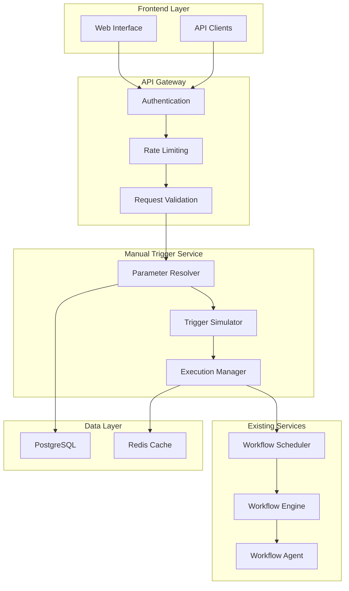

# Manual Trigger Invocation System - Technical Design

## 1. Overview & Business Goals

The Manual Trigger Invocation System allows users to manually start workflow executions for any trigger type (CRON, WEBHOOK, EMAIL, GITHUB, SLACK) with appropriate parameters. This provides testing capabilities, debugging support, and ad-hoc workflow execution for all configured triggers.

### Core Requirements

1. **Universal Trigger Support**: Ability to manually invoke any trigger type with proper parameter simulation
2. **Parameter Injection**: Support for custom input parameters that simulate real trigger events
3. **Validation & Safety**: Ensure manual invocations are valid and secure
4. **Execution Tracking**: Track manual invocations as normal workflow executions
5. **User Experience**: Intuitive interface for developers and end users

### Business Value

- **Development & Testing**: Test workflows without waiting for real trigger events
- **Debugging**: Reproduce issues by replaying trigger events manually
- **Emergency Operations**: Force workflow execution when automated triggers fail
- **User Empowerment**: Allow users to run workflows on-demand
- **Demo & Training**: Show workflow capabilities without complex setup

## 2. System Architecture



## 3. Core Components

### 3.1 Parameter Resolver

Resolves and validates trigger-specific parameters for manual invocation.

```python
class TriggerParameterResolver:
    """Resolves parameters for different trigger types"""

    async def resolve_parameters(
        self,
        trigger_type: TriggerType,
        trigger_config: dict,
        user_params: dict = None
    ) -> TriggerParameters:
        """
        Resolve parameters for manual trigger invocation

        Args:
            trigger_type: Type of trigger (CRON, WEBHOOK, etc.)
            trigger_config: Original trigger configuration from workflow
            user_params: User-provided override parameters

        Returns:
            TriggerParameters: Resolved parameters for execution
        """
        resolver = self._get_resolver(trigger_type)
        return await resolver.resolve(trigger_config, user_params)

    def _get_resolver(self, trigger_type: TriggerType) -> BaseParameterResolver:
        resolvers = {
            TriggerType.CRON: CronParameterResolver(),
            TriggerType.WEBHOOK: WebhookParameterResolver(),
            TriggerType.EMAIL: EmailParameterResolver(),
            TriggerType.GITHUB: GitHubParameterResolver(),
            TriggerType.SLACK: SlackParameterResolver(),
            TriggerType.MANUAL: ManualParameterResolver()
        }
        return resolvers[trigger_type]
```

### 3.2 Trigger-Specific Parameter Resolvers

Each trigger type has a specialized resolver that understands its parameter structure:

#### 3.2.1 CRON Trigger Parameters

```python
class CronParameterResolver(BaseParameterResolver):
    """Resolves parameters for CRON trigger manual invocation"""

    async def resolve(self, trigger_config: dict, user_params: dict = None) -> TriggerParameters:
        """
        CRON triggers typically execute with scheduled time context
        """
        # Default CRON execution parameters
        default_params = {
            "trigger_time": datetime.now().isoformat(),
            "scheduled_time": datetime.now().isoformat(),
            "execution_type": "manual_cron",
            "cron_expression": trigger_config.get("schedule", "* * * * *"),
            "timezone": trigger_config.get("timezone", "UTC")
        }

        # Merge with user overrides
        final_params = {**default_params, **(user_params or {})}

        return TriggerParameters(
            trigger_type="CRON",
            execution_context=final_params,
            input_data=self._extract_input_data(final_params),
            metadata={
                "manual_invocation": True,
                "invoked_at": datetime.now().isoformat(),
                "original_schedule": trigger_config.get("schedule")
            }
        )
```

#### 3.2.2 WEBHOOK Trigger Parameters

```python
class WebhookParameterResolver(BaseParameterResolver):
    """Resolves parameters for WEBHOOK trigger manual invocation"""

    async def resolve(self, trigger_config: dict, user_params: dict = None) -> TriggerParameters:
        """
        WEBHOOK triggers expect HTTP request-like data
        """
        # Default webhook parameters
        default_params = {
            "method": "POST",
            "headers": {
                "Content-Type": "application/json",
                "User-Agent": "Manual-Trigger-System/1.0",
                "X-Manual-Invocation": "true"
            },
            "body": {},
            "query_params": {},
            "source_ip": "127.0.0.1",
            "webhook_url": trigger_config.get("webhook_url", ""),
            "trigger_time": datetime.now().isoformat()
        }

        # Merge user-provided webhook data
        if user_params:
            if "headers" in user_params:
                default_params["headers"].update(user_params["headers"])
            if "body" in user_params:
                default_params["body"] = user_params["body"]
            if "query_params" in user_params:
                default_params["query_params"] = user_params["query_params"]
            # Other overrides
            for key in ["method", "source_ip"]:
                if key in user_params:
                    default_params[key] = user_params[key]

        return TriggerParameters(
            trigger_type="WEBHOOK",
            execution_context=default_params,
            input_data=default_params["body"],
            metadata={
                "manual_invocation": True,
                "simulated_request": True,
                "original_webhook_config": trigger_config
            }
        )
```

#### 3.2.3 EMAIL Trigger Parameters

```python
class EmailParameterResolver(BaseParameterResolver):
    """Resolves parameters for EMAIL trigger manual invocation"""

    async def resolve(self, trigger_config: dict, user_params: dict = None) -> TriggerParameters:
        """
        EMAIL triggers process email message data
        """
        # Default email parameters
        default_params = {
            "from": user_params.get("from", "test@example.com"),
            "to": trigger_config.get("email_address", ""),
            "subject": user_params.get("subject", "Manual Test Email"),
            "body": user_params.get("body", "This is a manually triggered email simulation"),
            "body_html": user_params.get("body_html"),
            "attachments": user_params.get("attachments", []),
            "received_at": datetime.now().isoformat(),
            "message_id": f"manual-{uuid.uuid4()}",
            "headers": {
                "Message-ID": f"<manual-{uuid.uuid4()}@manual-trigger.local>",
                "Date": datetime.now().strftime("%a, %d %b %Y %H:%M:%S %z"),
                "X-Manual-Trigger": "true"
            }
        }

        # Apply email filters from trigger config
        if self._matches_email_filters(default_params, trigger_config):
            return TriggerParameters(
                trigger_type="EMAIL",
                execution_context=default_params,
                input_data={
                    "email_content": default_params["body"],
                    "email_subject": default_params["subject"],
                    "sender": default_params["from"]
                },
                metadata={
                    "manual_invocation": True,
                    "filter_matched": True,
                    "trigger_config": trigger_config
                }
            )
        else:
            raise ValueError("Manual email parameters do not match trigger filters")
```

#### 3.2.4 GITHUB Trigger Parameters

```python
class GitHubParameterResolver(BaseParameterResolver):
    """Resolves parameters for GITHUB trigger manual invocation"""

    async def resolve(self, trigger_config: dict, user_params: dict = None) -> TriggerParameters:
        """
        GITHUB triggers process webhook events from GitHub
        """
        # Get event type from trigger config or user params
        event_type = user_params.get("event_type") or trigger_config.get("event_types", ["push"])[0]

        # Generate appropriate GitHub webhook payload
        payload = self._generate_github_payload(event_type, trigger_config, user_params)

        default_params = {
            "event_type": event_type,
            "delivery_id": str(uuid.uuid4()),
            "webhook_id": trigger_config.get("webhook_id"),
            "repository": {
                "full_name": user_params.get("repository", trigger_config.get("repository", "test/repo")),
                "private": False
            },
            "sender": {
                "login": user_params.get("sender", "manual-trigger-user"),
                "type": "User"
            },
            "payload": payload,
            "received_at": datetime.now().isoformat(),
            "headers": {
                "X-GitHub-Event": event_type,
                "X-GitHub-Delivery": str(uuid.uuid4()),
                "X-Hub-Signature-256": "manual-trigger",
                "User-Agent": "GitHub-Hookshot/manual"
            }
        }

        return TriggerParameters(
            trigger_type="GITHUB",
            execution_context=default_params,
            input_data=payload,
            metadata={
                "manual_invocation": True,
                "github_event": event_type,
                "installation_id": trigger_config.get("installation_id")
            }
        )

    def _generate_github_payload(self, event_type: str, trigger_config: dict, user_params: dict) -> dict:
        """Generate realistic GitHub webhook payload for different event types"""
        generators = {
            "push": self._generate_push_payload,
            "pull_request": self._generate_pr_payload,
            "issues": self._generate_issue_payload,
            "release": self._generate_release_payload
        }

        generator = generators.get(event_type, self._generate_generic_payload)
        return generator(trigger_config, user_params)
```

#### 3.2.5 SLACK Trigger Parameters

```python
class SlackParameterResolver(BaseParameterResolver):
    """Resolves parameters for SLACK trigger manual invocation"""

    async def resolve(self, trigger_config: dict, user_params: dict = None) -> TriggerParameters:
        """
        SLACK triggers process Slack events (messages, mentions, etc.)
        """
        event_type = user_params.get("event_type", "message")

        # Generate Slack event payload
        default_params = {
            "event": {
                "type": event_type,
                "channel": user_params.get("channel", trigger_config.get("channel_filter", "C1234567")),
                "user": user_params.get("user", "U1234567"),
                "text": user_params.get("text", "Hello from manual trigger"),
                "ts": str(time.time()),
                "thread_ts": user_params.get("thread_ts"),
                "bot_id": user_params.get("bot_id")
            },
            "team_id": trigger_config.get("workspace_id", "T1234567"),
            "api_app_id": "A1234567",
            "event_id": str(uuid.uuid4()),
            "event_time": int(time.time()),
            "type": "event_callback",
            "token": "verification_token",
            "headers": {
                "X-Slack-Request-Timestamp": str(int(time.time())),
                "X-Slack-Signature": "manual-trigger",
                "Content-Type": "application/json"
            }
        }

        # Apply mention detection if required
        if trigger_config.get("mention_required") and "@" not in default_params["event"]["text"]:
            default_params["event"]["text"] = f"<@U0000000> {default_params['event']['text']}"

        return TriggerParameters(
            trigger_type="SLACK",
            execution_context=default_params,
            input_data={
                "message": default_params["event"]["text"],
                "channel": default_params["event"]["channel"],
                "user": default_params["event"]["user"]
            },
            metadata={
                "manual_invocation": True,
                "slack_event": event_type,
                "workspace_id": trigger_config.get("workspace_id")
            }
        )
```

### 3.3 Trigger Simulator

Simulates trigger execution with resolved parameters:

```python
class TriggerSimulator:
    """Simulates trigger execution for manual invocation"""

    def __init__(self, workflow_scheduler_client):
        self.scheduler_client = workflow_scheduler_client

    async def simulate_trigger(
        self,
        workflow_id: str,
        trigger_id: str,
        trigger_params: TriggerParameters,
        user_id: str
    ) -> ExecutionResult:
        """
        Simulate trigger execution by calling workflow scheduler.

        Manual invocations are treated as normal workflow executions,
        with metadata indicating the manual invocation context.
        """
        try:
            # Call workflow scheduler with simulated trigger data
            execution_result = await self.scheduler_client.trigger_workflow_execution(
                workflow_id=workflow_id,
                trigger_id=trigger_id,
                trigger_data=trigger_params.execution_context,
                input_data=trigger_params.input_data,
                metadata={
                    **trigger_params.metadata,
                    "trigger_type": "MANUAL_INVOCATION",
                    "original_trigger_type": trigger_params.trigger_type,
                    "initiated_by": user_id,
                    "invocation_id": str(uuid.uuid4()),
                    "manual_invocation_timestamp": datetime.now().isoformat()
                }
            )

            return execution_result

        except Exception as e:
            # Re-raise the exception - let the calling system handle error logging
            raise
```

## 4. API Design

### 4.1 Core Endpoints

#### 4.1.1 Get Trigger Parameters Schema

```http
GET /api/v1/workflows/{workflow_id}/triggers/{trigger_id}/manual-invoke/schema
```

Returns the parameter schema for manual invocation of a specific trigger.

**Response:**
```json
{
  "trigger_type": "WEBHOOK",
  "trigger_config": {
    "webhook_url": "/webhook/abc123",
    "method": "POST",
    "expected_headers": ["Content-Type"]
  },
  "parameter_schema": {
    "type": "object",
    "properties": {
      "headers": {
        "type": "object",
        "properties": {
          "Content-Type": {"type": "string", "default": "application/json"}
        }
      },
      "body": {
        "type": "object",
        "description": "Webhook payload"
      },
      "query_params": {
        "type": "object",
        "description": "URL query parameters"
      }
    }
  },
  "examples": [
    {
      "name": "Simple webhook",
      "description": "Basic webhook invocation",
      "parameters": {
        "body": {"message": "Hello World"},
        "headers": {"Content-Type": "application/json"}
      }
    }
  ]
}
```

#### 4.1.2 Manual Trigger Invocation

```http
POST /api/v1/workflows/{workflow_id}/triggers/{trigger_id}/manual-invoke
```

Manually invoke a specific trigger with custom parameters.

**Request:**
```json
{
  "parameters": {
    "body": {
      "event_type": "deployment",
      "repository": "user/repo",
      "status": "success"
    },
    "headers": {
      "X-Custom-Header": "test-value"
    }
  },
  "description": "Testing deployment webhook"
}
```

**Response:**
```json
{
  "success": true,
  "execution_id": "exec_abc123",
  "message": "Workflow execution started successfully",
  "trigger_data": {
    "trigger_type": "WEBHOOK",
    "resolved_parameters": {
      "method": "POST",
      "headers": {
        "Content-Type": "application/json",
        "X-Custom-Header": "test-value",
        "X-Manual-Invocation": "true"
      },
      "body": {
        "event_type": "deployment",
        "repository": "user/repo",
        "status": "success"
      }
    }
  },
  "execution_url": "/api/v1/executions/exec_abc123"
}
```


## 5. Database Schema

### 5.1 No Additional Tables Required

Manual trigger invocations are treated as **normal workflow executions**, eliminating the need for separate audit tables. This approach provides several benefits:

✅ **Simplified Architecture**: No additional database schema required
✅ **Unified Tracking**: All executions tracked in existing `workflow_executions` table
✅ **Existing Tooling**: Leverage existing execution monitoring and logging systems
✅ **Cost Effective**: No duplicate storage or maintenance overhead

### 5.2 Execution Metadata for Manual Invocations

Manual invocations are distinguished from automatic triggers through metadata in the existing `workflow_executions` table:

```sql
-- Existing workflow_executions table with enhanced metadata
UPDATE workflow_executions
SET metadata = jsonb_build_object(
    'trigger_type', 'MANUAL_INVOCATION',
    'original_trigger_type', 'WEBHOOK',
    'invoked_by', 'user_123',
    'invocation_description', 'Testing webhook with new payload',
    'simulated_parameters', jsonb_build_object(
        'method', 'POST',
        'headers', jsonb_build_object('Content-Type', 'application/json'),
        'body', jsonb_build_object('test', true)
    ),
    'manual_invocation_timestamp', NOW()
)
WHERE execution_id = 'exec_abc123';
```

### 5.3 Parameter Templates from Node Specs

Parameter templates and examples are **code-defined** in the node specifications system rather than stored in database tables:

**Location**: `/apps/backend/shared/node_specs/definitions/trigger_nodes.py`

**Structure**:
```python
WEBHOOK_TRIGGER_SPEC = NodeSpec(
    # ... other configuration ...
    manual_invocation=ManualInvocationSpec(
        supported=True,
        description="Simulate webhook HTTP requests...",
        parameter_schema={
            "type": "object",
            "properties": {
                "method": {"type": "string", "enum": ["GET", "POST", "PUT"]},
                "headers": {"type": "object"},
                "body": {"type": "object"}
            }
        },
        parameter_examples=[
            {
                "name": "Simple API Webhook",
                "description": "Basic webhook with JSON payload",
                "parameters": {
                    "method": "POST",
                    "headers": {"Content-Type": "application/json"},
                    "body": {"event": "user.created", "user_id": 123}
                }
            }
        ],
        default_parameters={
            "method": "POST",
            "headers": {"Content-Type": "application/json"}
        }
    )
)
```

**Benefits of Code-Based Templates**:
- ✅ **Version Controlled**: Templates evolve with the codebase
- ✅ **Type Safe**: Validated alongside node specifications
- ✅ **No Database Maintenance**: No additional tables to backup/migrate
- ✅ **Developer Friendly**: Easy to add/modify in familiar development workflow
- ✅ **Single Source of Truth**: All trigger specifications in one location

## 6. Frontend Integration

### 6.1 Manual Trigger Interface

```typescript
// React component for manual trigger invocation
interface ManualTriggerPanelProps {
  workflowId: string;
  triggers: Trigger[];
}

const ManualTriggerPanel: React.FC<ManualTriggerPanelProps> = ({
  workflowId,
  triggers
}) => {
  const [selectedTrigger, setSelectedTrigger] = useState<Trigger | null>(null);
  const [parameters, setParameters] = useState<Record<string, any>>({});
  const [parameterSchema, setParameterSchema] = useState<JSONSchema | null>(null);
  const [isDryRun, setIsDryRun] = useState(true);

  // Load parameter schema when trigger is selected
  useEffect(() => {
    if (selectedTrigger) {
      loadParameterSchema(workflowId, selectedTrigger.id)
        .then(setParameterSchema);
    }
  }, [selectedTrigger]);

  const handleInvoke = async () => {
    const result = await invokeManualTrigger(
      workflowId,
      selectedTrigger!.id,
      {
        parameters,
        dry_run: isDryRun,
        description: `Manual test of ${selectedTrigger!.type} trigger`
      }
    );

    if (result.success) {
      // Show success feedback and execution link
      showSuccess(`Execution ${result.execution_id} started`);
    }
  };

  return (
    <div className="manual-trigger-panel">
      <TriggerSelector
        triggers={triggers}
        selected={selectedTrigger}
        onSelect={setSelectedTrigger}
      />

      {parameterSchema && (
        <ParameterForm
          schema={parameterSchema}
          values={parameters}
          onChange={setParameters}
        />
      )}

      <div className="invocation-options">
        <label>
          <input
            type="checkbox"
            checked={isDryRun}
            onChange={(e) => setIsDryRun(e.target.checked)}
          />
          Dry run (validate without executing)
        </label>
      </div>

      <button
        onClick={handleInvoke}
        disabled={!selectedTrigger || !isValidParameters(parameters, parameterSchema)}
        className="invoke-button"
      >
        {isDryRun ? 'Validate' : 'Invoke'} Trigger
      </button>
    </div>
  );
};
```

### 6.2 Parameter Form Generation

```typescript
// Dynamic form generation from JSON schema
interface ParameterFormProps {
  schema: JSONSchema;
  values: Record<string, any>;
  onChange: (values: Record<string, any>) => void;
}

const ParameterForm: React.FC<ParameterFormProps> = ({
  schema,
  values,
  onChange
}) => {
  const handleFieldChange = (fieldPath: string, value: any) => {
    const newValues = { ...values };
    setNestedValue(newValues, fieldPath, value);
    onChange(newValues);
  };

  return (
    <div className="parameter-form">
      <h3>Trigger Parameters</h3>

      {/* Render form fields based on schema */}
      {Object.entries(schema.properties || {}).map(([fieldName, fieldSchema]) => (
        <FormField
          key={fieldName}
          name={fieldName}
          schema={fieldSchema}
          value={values[fieldName]}
          onChange={(value) => handleFieldChange(fieldName, value)}
        />
      ))}

      {/* Show examples if available */}
      {schema.examples && (
        <ExampleSelector
          examples={schema.examples}
          onSelect={(example) => onChange(example.parameters)}
        />
      )}
    </div>
  );
};
```

## 7. Security & Validation

### 7.1 Authorization Model

```python
class ManualTriggerAuthorizer:
    """Authorization for manual trigger invocations"""

    async def authorize_invocation(
        self,
        user_id: str,
        workflow_id: str,
        trigger_id: str
    ) -> AuthorizationResult:
        """
        Check if user can manually invoke this trigger
        """
        # Check workflow ownership/permissions
        workflow_access = await self.check_workflow_access(user_id, workflow_id)
        if not workflow_access.can_execute:
            return AuthorizationResult(
                allowed=False,
                reason="Insufficient workflow permissions"
            )

        # Check trigger-specific permissions
        trigger_access = await self.check_trigger_access(user_id, workflow_id, trigger_id)
        if not trigger_access.can_invoke:
            return AuthorizationResult(
                allowed=False,
                reason="Trigger invocation not allowed"
            )

        # Check rate limits
        rate_limit_ok = await self.check_rate_limits(user_id, workflow_id)
        if not rate_limit_ok:
            return AuthorizationResult(
                allowed=False,
                reason="Rate limit exceeded"
            )

        return AuthorizationResult(allowed=True)
```

### 7.2 Parameter Validation

```python
class ParameterValidator:
    """Validates manual trigger parameters"""

    async def validate_parameters(
        self,
        trigger_type: TriggerType,
        trigger_config: dict,
        user_parameters: dict
    ) -> ValidationResult:
        """
        Validate user-provided parameters against trigger requirements
        """
        errors = []
        warnings = []

        # Type-specific validation
        validator = self._get_validator(trigger_type)
        type_result = await validator.validate(trigger_config, user_parameters)
        errors.extend(type_result.errors)
        warnings.extend(type_result.warnings)

        # Security validation
        security_result = await self._validate_security(user_parameters)
        errors.extend(security_result.errors)
        warnings.extend(security_result.warnings)

        # Size limits
        if self._exceeds_size_limits(user_parameters):
            errors.append("Parameter payload exceeds maximum size (1MB)")

        return ValidationResult(
            valid=len(errors) == 0,
            errors=errors,
            warnings=warnings
        )

    async def _validate_security(self, parameters: dict) -> ValidationResult:
        """Security validation for parameters"""
        errors = []

        # Check for potential injection attacks
        if self._contains_suspicious_content(parameters):
            errors.append("Parameters contain potentially malicious content")

        # Validate URLs and external references
        urls = self._extract_urls(parameters)
        for url in urls:
            if not self._is_safe_url(url):
                errors.append(f"Unsafe URL detected: {url}")

        return ValidationResult(valid=len(errors) == 0, errors=errors)
```

## 8. Monitoring & Observability

### 8.1 Metrics

```python
# Key metrics to track
MANUAL_TRIGGER_METRICS = {
    "manual_invocations_total": Counter(
        "manual_trigger_invocations_total",
        "Total number of manual trigger invocations",
        ["workflow_id", "trigger_type", "status"]
    ),

    "manual_invocation_duration": Histogram(
        "manual_trigger_invocation_duration_seconds",
        "Duration of manual trigger invocations",
        ["workflow_id", "trigger_type"]
    ),

    "parameter_validation_errors": Counter(
        "manual_trigger_validation_errors_total",
        "Number of parameter validation errors",
        ["trigger_type", "error_type"]
    ),

    "dry_run_requests": Counter(
        "manual_trigger_dry_runs_total",
        "Number of dry run requests",
        ["trigger_type"]
    )
}
```

### 8.2 Execution Tracking

Manual trigger invocations are tracked through the standard workflow execution system:

```python
# Manual invocations create normal workflow executions with enhanced metadata
execution_metadata = {
    "trigger_type": "MANUAL_INVOCATION",
    "original_trigger_type": "WEBHOOK",  # The trigger type being simulated
    "initiated_by": "user_123",
    "invocation_description": "Testing webhook with new payload",
    "simulated_parameters": {
        "method": "POST",
        "headers": {"Content-Type": "application/json"},
        "body": {"test": True}
    },
    "manual_invocation_timestamp": datetime.now().isoformat(),
    "invocation_id": str(uuid.uuid4())
}

# This metadata is stored in the standard workflow_executions table
# No separate audit table needed - leverage existing execution monitoring
```

**Benefits of Standard Execution Tracking:**
- ✅ **Unified Monitoring**: All executions tracked in one system
- ✅ **Existing Tooling**: Leverage current execution dashboards and alerts
- ✅ **Cost Effective**: No duplicate storage or monitoring infrastructure
- ✅ **Simplified Architecture**: Fewer systems to maintain

## 9. Implementation Plan

**Timeline: 4 Days (Aggressive schedule with sufficient team capacity)**

### Day 1: Core Infrastructure & Node Specs
**Backend Team (2-3 developers)**
- [ ] **Node Specs Extension** (4 hours)
  - Complete `ManualInvocationSpec` data structure in `base.py`
  - Update all trigger specs with manual invocation parameters and examples
  - Test node specs registry integration

- [ ] **API Gateway Endpoints** (4 hours)
  - Implement manual invocation schema endpoint
  - Implement manual trigger execution endpoint
  - Add parameter validation using JSON schema
  - Integration testing with workflow engine client

### Day 2: Workflow Engine & Scheduler Integration
**Backend Team (2-3 developers)**
- [ ] **Workflow Engine Updates** (4 hours)
  - Update execution metadata handling for manual invocations
  - Test trigger simulation with enhanced metadata
  - Verify execution tracking in standard tables

- [ ] **Workflow Scheduler Integration** (4 hours)
  - Ensure manual trigger calls create normal executions
  - Test execution metadata persistence
  - End-to-end backend integration testing

### Day 3: Frontend Implementation
**Frontend Team (2-3 developers)**
- [ ] **Schema Discovery & Form Generation** (6 hours)
  - API integration for schema discovery
  - Dynamic form generation from JSON schemas
  - Parameter validation and user input handling

- [ ] **UI Components** (2 hours)
  - Manual trigger panel component
  - Example selector and parameter templates
  - Integration with existing workflow UI

### Day 4: Testing & Documentation
**Full Team (All developers)**
- [ ] **Integration Testing** (4 hours)
  - End-to-end testing of all trigger types
  - Cross-browser frontend testing
  - Load testing for concurrent manual invocations

- [ ] **Documentation & Deployment** (4 hours)
  - API documentation updates
  - User guide and examples
  - Deployment to staging environment
  - Production deployment preparation

### Parallel Work Streams

**Throughout All Days:**
- [ ] **Security & Validation** (Backend Team)
  - Parameter sanitization and validation
  - Rate limiting implementation
  - Authorization checks for manual invocation

- [ ] **UX/UI Polish** (Frontend Team)
  - Error handling and user feedback
  - Loading states and progress indicators
  - Responsive design and accessibility

### Critical Path Dependencies

**Day 1 → Day 2:** Node specs must be complete before workflow engine integration
**Day 2 → Day 3:** Backend APIs must be functional before frontend development
**Day 3 → Day 4:** Core functionality must work before comprehensive testing

### Risk Mitigation

**Daily Standups:** Morning alignment on progress and blockers
**Continuous Integration:** Automated testing on all commits
**Fallback Plan:** If delays occur, prioritize WEBHOOK and MANUAL triggers first
**Team Communication:** Shared Slack channel for real-time coordination

## 10. Usage Examples

### 10.1 Developer Testing Scenario

```bash
# Get available triggers for a workflow
curl -X GET "/api/v1/workflows/wf_123/triggers" \
  -H "Authorization: Bearer $JWT_TOKEN"

# Get parameter schema for a webhook trigger
curl -X GET "/api/v1/workflows/wf_123/triggers/trig_webhook_1/manual-invoke/schema" \
  -H "Authorization: Bearer $JWT_TOKEN"

# Execute webhook trigger
curl -X POST "/api/v1/workflows/wf_123/triggers/trig_webhook_1/manual-invoke" \
  -H "Authorization: Bearer $JWT_TOKEN" \
  -H "Content-Type: application/json" \
  -d '{
    "parameters": {
      "body": {"test": true, "environment": "staging"},
      "headers": {"X-Source": "manual-test"}
    },
    "description": "Executing staging deployment workflow"
  }'
```

### 10.2 GitHub Event Simulation

```bash
# Simulate GitHub push event
curl -X POST "/api/v1/workflows/wf_123/triggers/trig_github_1/manual-invoke" \
  -H "Authorization: Bearer $JWT_TOKEN" \
  -H "Content-Type: application/json" \
  -d '{
    "parameters": {
      "event_type": "push",
      "repository": "myorg/myrepo",
      "ref": "refs/heads/main",
      "commits": [
        {
          "id": "abc123",
          "message": "Fix critical bug",
          "author": {"name": "Developer", "email": "dev@example.com"}
        }
      ]
    },
    "description": "Testing CI/CD pipeline with push event"
  }'
```

### 10.3 Email Trigger Testing

```bash
# Simulate email trigger
curl -X POST "/api/v1/workflows/wf_123/triggers/trig_email_1/manual-invoke" \
  -H "Authorization: Bearer $JWT_TOKEN" \
  -H "Content-Type: application/json" \
  -d '{
    "parameters": {
      "from": "customer@example.com",
      "subject": "Urgent Support Request",
      "body": "Please help with login issues",
      "attachments": ["support-screenshot.png"]
    },
    "description": "Testing customer support workflow"
  }'
```

## 11. Benefits & Impact

### 11.1 Development Benefits
- **Faster Testing**: Test workflows without waiting for real events
- **Easier Debugging**: Reproduce issues with exact parameter sets
- **Development Velocity**: Rapid iteration on workflow logic

### 11.2 Operational Benefits
- **Emergency Response**: Force execution when automated triggers fail
- **Troubleshooting**: Validate workflow behavior with known inputs
- **User Training**: Demonstrate workflows safely

### 11.3 Business Benefits
- **Reduced Time-to-Market**: Faster workflow development cycles
- **Improved Reliability**: Better testing leads to more stable workflows
- **User Empowerment**: Self-service execution capabilities

This comprehensive manual trigger invocation system provides the foundation for reliable, testable, and user-friendly workflow execution across all trigger types in the platform.
