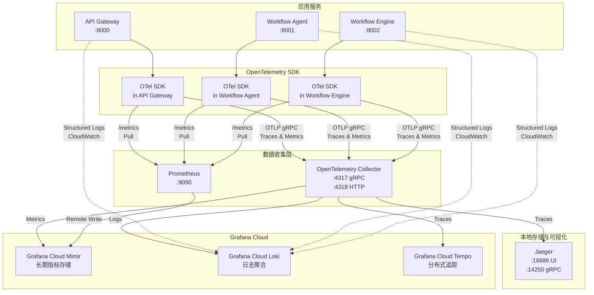

# 📚 AI Teams 分布式监控系统完整使用手册

## 🌟 核心概念介绍

### **1. OpenTelemetry (OTel)**
**是什么？** 
- 开源的可观测性框架，提供统一的 API 和 SDK
- 用于收集、处理和导出追踪(Traces)、指标(Metrics)和日志(Logs)数据
- 厂商中立，支持导出到任何监控后端

**在项目中的作用：**
- 自动收集所有 HTTP 请求的追踪数据
- 记录服务间调用链路
- 收集性能指标

### **2. Jaeger**
**是什么？**
- 开源的分布式追踪系统，由 Uber 开发
- 用于监控和故障排除微服务架构
- 提供可视化的请求链路图

**在项目中的作用：**
- 本地调试工具
- 查看请求在各个服务间的流转过程
- 分析性能瓶颈

### **3. Prometheus**
**是什么？**
- 开源的监控和告警系统
- 基于时间序列数据库
- 使用拉取(Pull)模式收集指标

**在项目中的作用：**
- 本地短期指标存储
- 收集服务的性能指标
- 提供查询接口

### **4. Grafana Cloud**
**是什么？**
- Grafana Labs 提供的托管监控服务
- 包含多个组件：Mimir（指标）、Loki（日志）、Tempo（追踪）

**Mimir：**
- 长期指标存储
- 兼容 Prometheus 查询语言(PromQL)
- 高可用和可扩展

**Loki：**
- 日志聚合系统
- 类似 Prometheus，但用于日志
- 支持标签查询和全文搜索

---

## 🏗️ 监控系统架构与数据流

### **整体架构图**



### **组件协作原理**

#### **1. 数据生成层 - 应用服务**

每个服务通过 `shared.telemetry` 模块初始化 OpenTelemetry SDK：

```python
# 在 apps/backend/api-gateway/app/main.py
from shared.telemetry import setup_telemetry, TrackingMiddleware, MetricsMiddleware

# 初始化遥测系统
setup_telemetry(
    app=app,
    service_name="api-gateway",
    service_version="1.0.0",
    otlp_endpoint="http://localhost:4317",  # OTel Collector 地址
    prometheus_port=8000
)
```

**数据类型生成：**
- **Traces（追踪）**: 自动记录每个 HTTP 请求的完整生命周期
- **Metrics（指标）**: 记录请求数、延迟、错误率等
- **Logs（日志）**: 结构化 JSON 日志，包含 trace_id 关联

#### **2. 数据收集层 - OpenTelemetry SDK**

SDK 在每个服务内部运行，负责：

```python
# shared/telemetry/complete_stack.py
def _setup_tracing(resource: Resource, otlp_endpoint: str):
    # 创建 TracerProvider
    tracer_provider = TracerProvider(resource=resource)
    trace.set_tracer_provider(tracer_provider)
    
    # 配置 OTLP 导出器 - 发送到 Collector
    otlp_exporter = OTLPSpanExporter(endpoint=otlp_endpoint, insecure=True)
    span_processor = BatchSpanProcessor(otlp_exporter)
    tracer_provider.add_span_processor(span_processor)
```

**关键功能：**
- **自动装配**: FastAPI、HTTP 客户端、数据库调用自动追踪
- **上下文传播**: 跨服务传递 trace_id 实现分布式追踪
- **批量导出**: 高效发送数据到 Collector

#### **3. 数据路由层 - OpenTelemetry Collector**

Collector 是中心化的数据处理器：

```yaml
# monitoring/otel-collector-config.yml
receivers:
  otlp:
    protocols:
      grpc:
        endpoint: 0.0.0.0:4317  # 接收来自 SDK 的数据
      http:
        endpoint: 0.0.0.0:4318

processors:
  batch:
    timeout: 1s
    send_batch_size: 1024
  
  attributes:
    actions:
      - key: environment
        value: ${ENVIRONMENT}
        action: insert

exporters:
  # 本地 Jaeger
  jaeger:
    endpoint: jaeger:14250
    tls: { insecure: true }
  
  # Grafana Cloud
  otlphttp/grafana-cloud-traces:
    endpoint: ${GRAFANA_CLOUD_TEMPO_URL}
    headers:
      authorization: Basic ${GRAFANA_CLOUD_API_KEY}
```

**数据流向：**
1. **接收**: 从所有服务接收 OTLP 格式数据
2. **处理**: 批量处理、添加标签、数据转换
3. **导出**: 同时发送到多个后端（Jaeger、Grafana Cloud）

#### **4. 存储与可视化层**

##### **Jaeger（本地追踪）**
- **用途**: 开发调试，查看请求链路
- **数据源**: 从 Collector 接收 traces
- **访问**: http://localhost:16686

##### **Prometheus（本地指标）**
- **用途**: 短期指标存储和查询
- **数据源**: 主动拉取各服务的 /metrics 端点
- **配置**:
```yaml
# monitoring/prometheus.yml
scrape_configs:
  - job_name: 'api-gateway'
    static_configs:
      - targets: ['api-gateway:8000']
    metrics_path: '/metrics'
```

##### **Grafana Cloud（生产监控）**
- **Mimir**: 长期指标存储，接收 Prometheus 远程写入
- **Loki**: 日志聚合，通过 CloudWatch 或直接推送
- **Tempo**: 分布式追踪存储，从 Collector 接收

### **具体代码实现**

#### **1. 追踪生成与传播**

```python
# shared/telemetry/middleware.py
class TrackingMiddleware(BaseHTTPMiddleware):
    async def dispatch(self, request: Request, call_next: Callable) -> Response:
        # 获取当前 OpenTelemetry span
        span = trace.get_current_span()
        
        if span.is_recording():
            # 提取 trace_id 作为 tracking_id
            span_context = span.get_span_context()
            tracking_id = format(span_context.trace_id, '032x')
            
            # 存储到请求状态，供业务代码使用
            request.state.tracking_id = tracking_id
            
            # 添加 span 属性
            span.set_attribute("tracking.id", tracking_id)
            span.set_attribute("http.method", request.method)
            span.set_attribute("http.url", str(request.url))
```

**跨服务传播：**
```python
# 在 API Gateway 调用其他服务时
async def call_workflow_agent(data: dict):
    # OpenTelemetry 自动注入追踪头部
    async with httpx.AsyncClient() as client:
        # TracePropagator 自动添加 traceparent 头部
        response = await client.post(
            "http://workflow-agent:8001/generate",
            json=data
        )
    return response.json()
```

#### **2. 指标收集与导出**

```python
# shared/telemetry/metrics.py
class MetricsCollector:
    def __init__(self, service_name: str):
        self.meter = metrics.get_meter(service_name)
        
        # 创建指标
        self.request_count = self.meter.create_counter(
            name="http_requests_total",
            description="Total HTTP requests",
            unit="1"
        )
        
        self.request_duration = self.meter.create_histogram(
            name="http_request_duration_seconds",
            description="HTTP request duration",
            unit="s"
        )
```

**指标记录：**
```python
# shared/telemetry/middleware.py
class MetricsMiddleware(BaseHTTPMiddleware):
    async def dispatch(self, request: Request, call_next: Callable) -> Response:
        start_time = time.time()
        
        try:
            response = await call_next(request)
            duration = time.time() - start_time
            
            # 记录指标
            self.metrics.request_count.add(1, {
                'service_name': self.service_name,
                'endpoint': request.url.path,
                'method': request.method,
                'status_code': str(response.status_code)
            })
            
            self.metrics.request_duration.record(duration, {
                'service_name': self.service_name,
                'endpoint': request.url.path
            })
```

#### **3. 日志关联**

```python
# shared/telemetry/formatter.py
class CloudWatchTracingFormatter(logging.Formatter):
    def format(self, record):
        # 获取当前 trace context
        span = trace.get_current_span()
        if span.is_recording():
            span_context = span.get_span_context()
            trace_id = format(span_context.trace_id, '032x')
            span_id = format(span_context.span_id, '016x')
        else:
            trace_id = "no-trace"
            span_id = "no-span"
        
        # 构建结构化日志
        log_record = {
            "@timestamp": self.formatTime(record, self.datefmt),
            "@level": record.levelname,
            "@message": record.getMessage(),
            "@logger": record.name,
            "@thread": record.thread,
            "service": self.service_name,
            "trace_id": trace_id,
            "span_id": span_id,
            "file": f"{record.filename}:{record.lineno}"
        }
        
        return json.dumps(log_record)
```

### **数据查询示例**

#### **1. 在 Jaeger 中追踪请求**
```
1. 访问 http://localhost:16686
2. 选择服务: api-gateway
3. 查找操作: POST /api/app/workflows
4. 查看完整调用链:
   - api-gateway (100ms)
   - → workflow-agent (500ms)
   - → workflow-engine (200ms)
```

#### **2. 在 Prometheus 查询指标**
```promql
# 服务请求速率
rate(http_requests_total{service_name="api-gateway"}[5m])

# P95 延迟
histogram_quantile(0.95, 
  sum(rate(http_request_duration_seconds_bucket[5m])) by (le)
)
```

#### **3. 在 Grafana Cloud 关联数据**
```
1. 使用 trace_id 关联所有数据:
   - Tempo: 查看分布式追踪
   - Loki: 查看相关日志
   - Mimir: 查看时间段内的指标

2. 创建统一仪表板展示:
   - 追踪数据面板
   - 日志流面板
   - 指标图表
```

### **关键集成点**

1. **服务初始化**: `setup_telemetry()` 一次性配置所有组件
2. **中间件注册**: 自动收集数据，无需修改业务代码
3. **上下文传播**: OpenTelemetry 自动处理跨服务追踪
4. **统一 trace_id**: 所有遥测数据通过 trace_id 关联

这个架构确保了完整的可观测性，从请求进入系统到响应返回，每一步都被记录和关联。

---

## 🔧 如何在代码中使用

### **1. 初始化遥测系统**

在每个服务的 `main.py` 中：

```python
# apps/backend/api-gateway/app/main.py
from shared.telemetry import setup_telemetry, TrackingMiddleware, MetricsMiddleware

# 初始化遥测系统
setup_telemetry(app, service_name="api-gateway", service_version="1.0.0")

# 添加中间件
app.add_middleware(TrackingMiddleware)  # 自动追踪请求
app.add_middleware(MetricsMiddleware, service_name="api-gateway")  # 收集指标
```

### **2. 使用追踪功能**

#### **自动追踪（已集成）**
```python
# 所有 HTTP 请求自动被追踪，无需额外代码
@app.get("/api/app/sessions")
async def get_sessions():
    # 这个端点的每次调用都会被自动追踪
    return {"sessions": [...]}
```

#### **手动添加追踪 Span**
```python
from opentelemetry import trace

tracer = trace.get_tracer(__name__)

async def process_workflow(workflow_id: str):
    # 创建一个新的 span
    with tracer.start_as_current_span("process_workflow") as span:
        # 添加属性
        span.set_attribute("workflow.id", workflow_id)
        span.set_attribute("workflow.type", "ai_generation")
        
        # 业务逻辑
        result = await generate_workflow(workflow_id)
        
        # 记录事件
        span.add_event("workflow_generated", {
            "nodes_count": len(result.nodes)
        })
        
        return result
```

### **3. 记录业务指标**

```python
from shared.telemetry.metrics import get_metrics_collector

metrics = get_metrics_collector()

# 计数器 - 统计工作流执行次数
metrics.workflow_executions.add(1, {
    "workflow_type": "data_processing",
    "status": "success"
})

# 直方图 - 记录执行时间
import time
start_time = time.time()
# ... 执行工作流 ...
duration = time.time() - start_time
metrics.workflow_duration.record(duration, {
    "workflow_type": "data_processing"
})

# 量表 - 记录当前值
metrics.active_sessions.set(42, {
    "service": "api-gateway"
})
```

### **4. 结构化日志**

```python
import logging

logger = logging.getLogger(__name__)

# 日志会自动包含 tracking_id
logger.info("Processing workflow", extra={
    "workflow_id": "wf-123",
    "user_id": "user-456",
    "operation": "generate"
})

# 错误日志会创建 Span Event
try:
    result = await risky_operation()
except Exception as e:
    logger.error(f"Operation failed: {str(e)}", extra={
        "error_type": type(e).__name__,
        "workflow_id": "wf-123"
    })
```

### **5. 跨服务追踪传播**

```python
# 在 API Gateway 调用 Workflow Agent
import httpx

async def call_workflow_agent(data: dict):
    # TrackingMiddleware 自动注入追踪头部
    async with httpx.AsyncClient() as client:
        response = await client.post(
            "http://workflow-agent:8001/generate",
            json=data,
            headers={
                # tracking_id 自动从当前请求传播
                "X-Tracking-ID": request.state.tracking_id
            }
        )
    return response.json()
```

---

## 📊 在哪里查看监控数据

### **1. 本地 Jaeger UI (追踪)**

**访问地址：** `http://localhost:16686`

**查看内容：**
- 请求链路图
- 服务间调用关系
- 每个操作的耗时
- 错误和异常

**使用示例：**
1. 打开 Jaeger UI
2. 选择服务（如 "api-gateway"）
3. 输入 tracking_id 或时间范围
4. 查看请求的完整链路

**Jaeger UI 功能说明：**
- **Service**: 选择要查看的服务
- **Operation**: 选择特定的操作（如 GET /api/app/sessions）
- **Tags**: 使用标签过滤（如 error=true, user.id=123）
- **Lookback**: 时间范围
- **Trace Timeline**: 展示请求在各服务间的时序关系
- **Span Details**: 查看每个操作的详细信息

### **2. 本地 Prometheus (指标)**

**访问地址：** `http://localhost:9090`

**查询示例：**
```promql
# 请求速率
rate(http_requests_total[5m])

# 平均响应时间
histogram_quantile(0.95, http_request_duration_seconds_bucket)

# 错误率
rate(http_requests_total{status=~"5.."}[5m])

# 服务可用性
(1 - (sum(rate(http_requests_total{status=~"5.."}[5m])) / sum(rate(http_requests_total[5m])))) * 100
```

### **3. Grafana Cloud Dashboard**

**访问步骤：**
1. 登录 [Grafana Cloud](https://grafana.com)
2. 进入你的实例
3. 访问预配置的仪表板

**仪表板示例：**

#### **服务概览仪表板**
```json
{
  "dashboard": {
    "title": "AI Teams 服务概览",
    "panels": [
      {
        "title": "请求速率",
        "targets": [{
          "expr": "sum(rate(http_requests_total[5m])) by (service)"
        }]
      },
      {
        "title": "错误率",
        "targets": [{
          "expr": "sum(rate(http_requests_total{status=~'5..'}[5m])) by (service)"
        }]
      },
      {
        "title": "P95 延迟",
        "targets": [{
          "expr": "histogram_quantile(0.95, http_request_duration_seconds_bucket)"
        }]
      }
    ]
  }
}
```

### **4. CloudWatch Logs Insights (AWS)**

**查询示例：**

```sql
-- 查找特定 tracking_id 的所有日志
fields @timestamp, service, @message
| filter tracking_id = "abc123def456"
| sort @timestamp desc

-- 查找所有错误
fields @timestamp, service, error.message, tracking_id
| filter @level = "ERROR"
| sort @timestamp desc
| limit 100

-- 分析请求性能
fields request.path, request.duration
| filter request.duration > 1.0
| stats avg(request.duration) by request.path

-- 查找慢查询
fields @timestamp, @message, tracking_id, request.duration
| filter request.duration > 2.0
| sort request.duration desc

-- 用户行为分析
fields user.id, request.path, @timestamp
| filter ispresent(user.id)
| stats count() by user.id, request.path
```

---

## 🚀 快速开始指南

### **1. 启动本地监控栈**

```bash
# 1. 启动监控服务
cd monitoring
docker-compose -f docker-compose.monitoring.yml up -d

# 2. 启动应用服务
cd ../apps/backend
docker-compose up -d

# 3. 验证服务
curl http://localhost:16686  # Jaeger UI
curl http://localhost:9090   # Prometheus
curl http://localhost:3100   # Loki (如果启用)

# 4. 查看服务日志
docker logs otel-collector
docker logs jaeger
docker logs prometheus
```

### **2. 配置 Grafana Cloud（可选）**

```bash
# 1. 创建 Grafana Cloud 免费账号
# https://grafana.com/auth/sign-up/create-user

# 2. 获取 API 密钥和租户 ID
# 在 Grafana Cloud 控制台 -> API Keys

# 3. 配置环境变量
export GRAFANA_CLOUD_API_KEY="your-api-key"
export GRAFANA_CLOUD_TENANT_ID="your-tenant-id"
export GRAFANA_CLOUD_PROMETHEUS_URL="https://prometheus-prod-xx.grafana.net/api/prom/push"
export GRAFANA_CLOUD_LOKI_URL="https://logs-prod-xx.grafana.net/loki/api/v1/push"

# 4. 重启 OTel Collector
docker-compose -f docker-compose.monitoring.yml restart otel-collector
```

### **3. 生成测试数据**

```python
# test_monitoring.py
import httpx
import asyncio
import random

async def generate_test_traffic():
    """生成测试流量以查看监控数据"""
    async with httpx.AsyncClient() as client:
        for i in range(100):
            # 创建会话
            response = await client.post(
                "http://localhost:8000/api/app/sessions",
                json={"name": f"Test Session {i}"}
            )
            
            # 随机产生一些错误
            if random.random() < 0.1:
                await client.get("http://localhost:8000/api/app/nonexistent")
            
            # 模拟不同的响应时间
            await asyncio.sleep(random.uniform(0.1, 0.5))

asyncio.run(generate_test_traffic())
```

---

## 📈 常用监控查询

### **1. Jaeger 查询**

```yaml
# 查找慢请求
Service: api-gateway
Operation: POST /api/app/chat/stream
Min Duration: 1s

# 查找错误
Service: workflow-agent
Tags: error=true

# 查找特定用户
Tags: user.id=user-123

# 跨服务追踪
Service: api-gateway AND workflow-agent
```

### **2. Prometheus/Grafana 查询**

```promql
# 服务可用性 (SLA)
(1 - (sum(rate(http_requests_total{status=~"5.."}[5m])) / sum(rate(http_requests_total[5m])))) * 100

# 每秒请求数 (RPS)
sum(rate(http_requests_total[1m])) by (service)

# 活跃用户数
sum(active_sessions) by (service)

# 工作流执行成功率
sum(rate(workflow_executions_total{status="success"}[5m])) / sum(rate(workflow_executions_total[5m]))

# P50/P95/P99 延迟
histogram_quantile(0.50, sum(rate(http_request_duration_seconds_bucket[5m])) by (le))
histogram_quantile(0.95, sum(rate(http_request_duration_seconds_bucket[5m])) by (le))
histogram_quantile(0.99, sum(rate(http_request_duration_seconds_bucket[5m])) by (le))

# AI Token 使用趋势
sum(rate(ai_tokens_used_total[5m])) by (model, service)

# 内存使用
process_resident_memory_bytes / 1024 / 1024  # MB
```

### **3. Loki 日志查询**

```logql
# 查找所有错误日志
{service="api-gateway"} |= "ERROR"

# 特定 tracking_id
{service=~"api-gateway|workflow-agent"} |= "tracking_id=\"abc123\""

# JSON 解析和过滤
{service="workflow-agent"} 
  | json 
  | workflow_id="wf-123" 
  | line_format "{{.timestamp}} {{.message}}"

# 统计错误类型
{service="api-gateway"} 
  | json 
  | __error__="" 
  | level="ERROR" 
  | pattern `<_> error_type="<error_type>"` 
  | count by (error_type)

# 查找慢请求日志
{service="api-gateway"} 
  | json 
  | request_duration > 1.0
```

---

## 🎯 实际使用场景

### **场景 1：调试慢请求**

1. **用户报告**: "创建工作流很慢"
2. **Jaeger 追踪**:
   ```
   Service: api-gateway
   Operation: POST /api/app/workflows
   Min Duration: 3s
   ```
3. **找到 tracking_id**: `abc123def456`
4. **查看请求链路**:
   - API Gateway (100ms) 
   - → Workflow Agent (2900ms) ⚠️
   - → Workflow Engine (50ms)
5. **深入 Workflow Agent**:
   - LLM 调用: 2500ms ⚠️
   - 数据库查询: 300ms
6. **查看相关日志**:
   ```logql
   {service="workflow-agent"} |= "tracking_id=\"abc123def456\""
   ```
7. **发现问题**: LLM 模型响应慢，考虑优化 prompt 或使用缓存

### **场景 2：监控服务健康**

1. **设置 Grafana 告警**:
   ```yaml
   alert: HighErrorRate
   expr: rate(http_requests_total{status=~"5.."}[5m]) > 0.01
   for: 5m
   labels:
     severity: warning
   annotations:
     summary: "服务 {{ $labels.service }} 错误率过高"
   ```

2. **收到告警通知**
3. **查看错误详情**:
   ```promql
   sum(rate(http_requests_total{status=~"5.."}[5m])) by (service, status, path)
   ```
4. **查找错误日志**:
   ```sql
   fields @timestamp, tracking_id, error.message
   | filter @level = "ERROR" and service = "api-gateway"
   | sort @timestamp desc
   | limit 50
   ```
5. **使用 tracking_id 在 Jaeger 中查看失败请求的完整链路**

### **场景 3：容量规划**

1. **查看历史趋势**:
   ```promql
   # 30天请求量趋势
   increase(http_requests_total[30d])
   
   # 峰值 QPS
   max_over_time(rate(http_requests_total[1m])[30d:1h])
   ```

2. **资源使用分析**:
   ```promql
   # CPU 使用率
   rate(process_cpu_seconds_total[5m]) * 100
   
   # 内存使用
   process_resident_memory_bytes / 1024 / 1024 / 1024  # GB
   ```

3. **预测未来增长**:
   - 当前: 100 QPS, 2GB 内存
   - 增长率: 20% / 月
   - 6个月后: 250 QPS, 5GB 内存
   - 建议: 提前扩容至 4 个实例

### **场景 4：分析用户行为**

```sql
-- CloudWatch Logs Insights
fields user.id, request.path, @timestamp
| filter ispresent(user.id)
| stats count() by user.id, bin(5m)
| sort count() desc

-- 用户路径分析
fields user.id, request.path, @timestamp
| filter user.id = "user-123"
| sort @timestamp asc
```

---

## 🛠️ 故障排查指南

### **问题：看不到追踪数据**

```bash
# 1. 检查 OTel Collector 状态
docker logs otel-collector

# 2. 验证服务配置
curl http://localhost:4318/v1/traces  # 应返回 405

# 3. 检查环境变量
docker exec api-gateway env | grep OTEL

# 4. 验证追踪头传播
curl -H "traceparent: 00-12345678901234567890123456789012-1234567890123456-01" \
     http://localhost:8000/api/public/health -v
```

### **问题：指标不更新**

```bash
# 1. 检查 Prometheus 抓取
curl http://localhost:9090/targets

# 2. 验证指标端点
curl http://localhost:8000/metrics

# 3. 查看导出器日志
docker logs otel-collector | grep prometheus

# 4. 手动查询指标
curl -G http://localhost:9090/api/v1/query \
     --data-urlencode 'query=up{job="api-gateway"}'
```

### **问题：日志未收集**

```python
# 验证日志格式化器
import logging
logger = logging.getLogger(__name__)
logger.info("Test log", extra={"test": "value"})

# 检查输出是否为 JSON 格式
# 应该看到: {"@timestamp":"2024-03-15T10:00:00Z","@level":"INFO",...}
```

### **问题：高延迟**

1. **使用 Jaeger 找到慢操作**
2. **查看火焰图** (Jaeger UI -> Trace -> Flamegraph)
3. **分析数据库查询**:
   ```python
   with tracer.start_as_current_span("database_query") as span:
       span.set_attribute("db.statement", query)
       result = await db.execute(query)
   ```

---

## 📚 进阶使用

### **自定义仪表板**

创建 `dashboards/workflow-monitoring.json`:

```json
{
  "dashboard": {
    "title": "工作流执行监控",
    "panels": [
      {
        "title": "工作流执行趋势",
        "gridPos": {"x": 0, "y": 0, "w": 12, "h": 8},
        "targets": [{
          "expr": "sum(rate(workflow_executions_total[5m])) by (workflow_type)",
          "legendFormat": "{{workflow_type}}"
        }]
      },
      {
        "title": "AI Token 使用",
        "gridPos": {"x": 12, "y": 0, "w": 12, "h": 8},
        "targets": [{
          "expr": "sum(rate(ai_tokens_used_total[5m])) by (model)",
          "legendFormat": "{{model}}"
        }]
      },
      {
        "title": "工作流成功率",
        "gridPos": {"x": 0, "y": 8, "w": 8, "h": 6},
        "targets": [{
          "expr": "sum(rate(workflow_executions_total{status=\"success\"}[5m])) / sum(rate(workflow_executions_total[5m])) * 100"
        }]
      },
      {
        "title": "平均执行时间",
        "gridPos": {"x": 8, "y": 8, "w": 8, "h": 6},
        "targets": [{
          "expr": "histogram_quantile(0.95, sum(rate(workflow_duration_seconds_bucket[5m])) by (le))"
        }]
      },
      {
        "title": "活跃工作流",
        "gridPos": {"x": 16, "y": 8, "w": 8, "h": 6},
        "targets": [{
          "expr": "sum(active_workflows) by (status)"
        }]
      }
    ]
  }
}
```

### **设置 SLO (服务级别目标)**

```yaml
# slo.yaml
apiVersion: sloth.slok.dev/v1
kind: PrometheusServiceLevel
metadata:
  name: api-gateway-slo
spec:
  service: "api-gateway"
  labels:
    team: "platform"
  slos:
    - name: "requests-availability"
      objective: 99.9  # 99.9% 可用性
      sli:
        events:
          error_query: sum(rate(http_requests_total{service="api-gateway",status=~"5.."}[5m]))
          total_query: sum(rate(http_requests_total{service="api-gateway"}[5m]))
      alerting:
        name: APIGatewayAvailability
        page_alert:
          labels:
            severity: critical
    
    - name: "requests-latency"
      objective: 95  # 95% 请求 < 1s
      sli:
        events:
          error_query: |
            sum(rate(http_request_duration_seconds_bucket{service="api-gateway",le="1.0"}[5m]))
          total_query: |
            sum(rate(http_request_duration_seconds_count{service="api-gateway"}[5m]))
```

### **自定义追踪 Span**

```python
from opentelemetry import trace
from opentelemetry.trace import Status, StatusCode

tracer = trace.get_tracer(__name__)

async def complex_operation():
    with tracer.start_as_current_span("complex_operation") as span:
        # 添加 span 属性
        span.set_attribute("operation.type", "data_processing")
        span.set_attribute("operation.complexity", "high")
        
        try:
            # 步骤 1: 数据验证
            with tracer.start_as_current_span("validate_data") as child_span:
                child_span.set_attribute("data.size", len(data))
                await validate_data(data)
            
            # 步骤 2: AI 处理
            with tracer.start_as_current_span("ai_processing") as child_span:
                child_span.set_attribute("model.name", "gpt-4")
                result = await process_with_ai(data)
                child_span.set_attribute("tokens.used", result.token_count)
            
            # 步骤 3: 存储结果
            with tracer.start_as_current_span("store_result") as child_span:
                child_span.set_attribute("storage.type", "postgresql")
                await store_result(result)
            
            # 成功
            span.set_status(Status(StatusCode.OK))
            span.add_event("operation_completed", {
                "result.size": len(result),
                "duration": time.time() - start_time
            })
            
        except Exception as e:
            # 记录错误
            span.record_exception(e)
            span.set_status(Status(StatusCode.ERROR, str(e)))
            raise
```

### **批量操作监控**

```python
from opentelemetry import trace, baggage
from opentelemetry.trace.propagation.tracecontext import TraceContextTextMapPropagator

tracer = trace.get_tracer(__name__)
propagator = TraceContextTextMapPropagator()

async def batch_process_workflows(workflow_ids: List[str]):
    with tracer.start_as_current_span("batch_process") as span:
        span.set_attribute("batch.size", len(workflow_ids))
        
        # 设置 baggage 用于跨服务传播
        baggage.set_baggage("batch.id", str(uuid.uuid4()))
        baggage.set_baggage("batch.total", str(len(workflow_ids)))
        
        results = []
        for i, workflow_id in enumerate(workflow_ids):
            with tracer.start_as_current_span(f"process_workflow_{i}") as child_span:
                child_span.set_attribute("workflow.id", workflow_id)
                child_span.set_attribute("batch.index", i)
                
                try:
                    result = await process_single_workflow(workflow_id)
                    results.append(result)
                    child_span.add_event("workflow_processed")
                except Exception as e:
                    child_span.record_exception(e)
                    child_span.set_status(Status(StatusCode.ERROR))
        
        span.set_attribute("batch.success_count", len(results))
        return results
```

---

## 🔒 安全和最佳实践

### **1. 敏感数据处理**

```python
# 不要在追踪中包含敏感信息
span.set_attribute("user.id", user_id)  # ✅
span.set_attribute("user.email", email)  # ❌ 避免 PII

# 日志脱敏
logger.info("User login", extra={
    "user_id": user_id,  # ✅
    "ip": mask_ip(request.client.host),  # ✅ 脱敏
    # "password": password  # ❌ 绝不记录
})
```

### **2. 采样策略**

```python
# apps/backend/shared/telemetry/complete_stack.py
from opentelemetry.sdk.trace.sampling import TraceIdRatioBased

# 生产环境采样 10%
sampler = TraceIdRatioBased(0.1)

# 或使用自定义采样器
class CustomSampler:
    def should_sample(self, context, trace_id, name, kind, attributes, links):
        # 错误总是采样
        if attributes.get("error"):
            return SamplingResult(Decision.RECORD_AND_SAMPLE)
        
        # VIP 用户总是采样
        if attributes.get("user.vip"):
            return SamplingResult(Decision.RECORD_AND_SAMPLE)
        
        # 其他请求 1% 采样
        return TraceIdRatioBased(0.01).should_sample(...)
```

### **3. 性能优化**

```python
# 批量导出
batch_span_processor = BatchSpanProcessor(
    span_exporter,
    max_queue_size=2048,
    max_export_batch_size=512,
    schedule_delay_millis=5000,
)

# 异步日志
import asyncio
from concurrent.futures import ThreadPoolExecutor

class AsyncLogger:
    def __init__(self):
        self.executor = ThreadPoolExecutor(max_workers=2)
    
    def log(self, level, message, **kwargs):
        self.executor.submit(logger.log, level, message, **kwargs)
```

---

## 📖 参考资源

### **官方文档**
- [OpenTelemetry Python](https://opentelemetry.io/docs/instrumentation/python/)
- [Jaeger Documentation](https://www.jaegertracing.io/docs/)
- [Prometheus Docs](https://prometheus.io/docs/)
- [Grafana Cloud Docs](https://grafana.com/docs/grafana-cloud/)

### **查询语言**
- [PromQL Tutorial](https://prometheus.io/docs/prometheus/latest/querying/basics/)
- [LogQL Documentation](https://grafana.com/docs/loki/latest/logql/)

### **最佳实践**
- [Distributed Tracing Best Practices](https://www.jaegertracing.io/docs/1.21/best-practices/)
- [Monitoring Microservices](https://sre.google/sre-book/monitoring-distributed-systems/)

这份手册涵盖了从基础概念到实际操作的完整内容。通过这个监控系统，你可以全面了解 AI Teams 系统的运行状况，快速定位问题，并持续优化性能！ 🚀