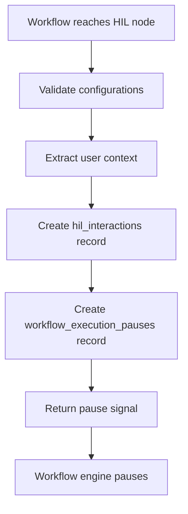
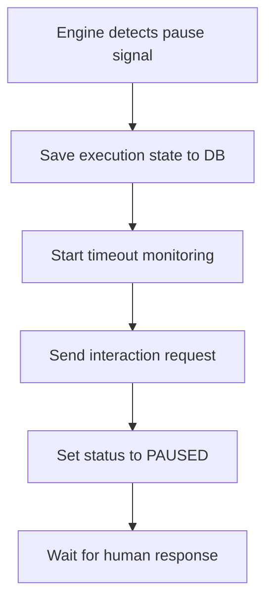
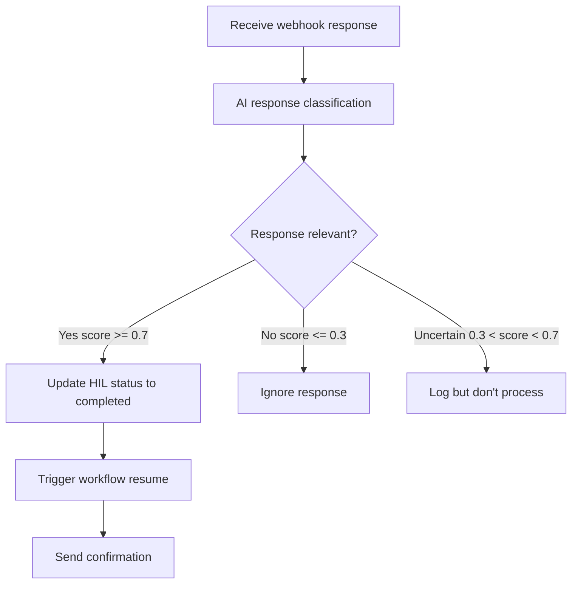
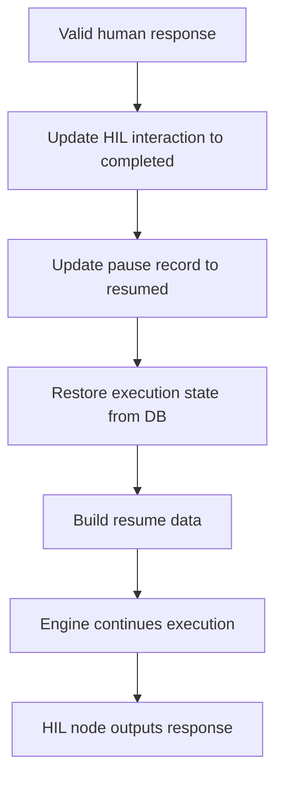
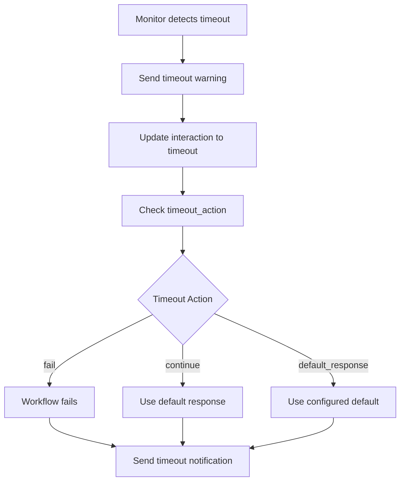

# Workflow Specification System Technical Design

## Executive Summary

This document defines the comprehensive technical specification for the 24/7 AI Teams workflow system, a node-based workflow automation platform that enables complex multi-step processes with AI integration, human-in-the-loop interactions, and external service integrations.

**Key Architectural Decisions:**
- **Node-Based Architecture**: Workflows are directed acyclic graphs (DAGs) of typed, configurable nodes
- **8 Core Node Types**: Specialized categories (TRIGGER, AI_AGENT, ACTION, EXTERNAL_ACTION, FLOW, HUMAN_IN_THE_LOOP, TOOL, MEMORY)
- **Dynamic Node Specification System**: BaseNodeSpec-based specifications with automatic validation and type safety
- **Attached Nodes Pattern**: AI_AGENT nodes can attach TOOL and MEMORY nodes for enhanced capabilities
- **Execution State Persistence**: Complete execution tracking with node-level granularity and pause/resume support

**Technology Stack:**
- **Backend**: Python 3.11+ with FastAPI, Pydantic, SQLAlchemy
- **Database**: PostgreSQL (Supabase) with Row Level Security
- **AI Providers**: OpenAI, Anthropic Claude, Google Gemini
- **Execution Engine**: Custom async execution engine with WebSocket real-time updates
- **Node Specifications**: Centralized type-safe specification system in `shared/node_specs/`

---

## 1. System Architecture

### 1.1 High-Level Architecture

```
┌─────────────────┐     ┌──────────────────┐     ┌──────────────────┐
│   API Gateway   │────▶│ Workflow Agent   │────▶│ Workflow Engine  │
│   (FastAPI)     │     │ (LangGraph/AI)   │     │ (Execution)      │
└─────────────────┘     └──────────────────┘     └──────────────────┘
        │                                                    │
        └────────────────── Supabase ─────────────────────────
                    (Auth, State, Vector Store)
```

**Component Responsibilities:**

- **API Gateway (Port 8000)**: Client-facing three-layer API (Public/App/MCP), authentication, request routing
- **Workflow Agent (Port 8001)**: AI-powered workflow generation using LangGraph, RAG-based node recommendations
- **Workflow Engine (Port 8002)**: Node-based workflow execution, state management, real-time updates
- **Workflow Scheduler (Port 8003)**: Trigger management, cron scheduling, OAuth callbacks
- **Supabase**: PostgreSQL database with pgvector, user authentication, RLS policies

### 1.2 Component Architecture

**Node Specification System** (`shared/node_specs/`):
```
shared/node_specs/
├── base.py                    # BaseNodeSpec, ParameterDef, ParameterType
├── registry.py                # NODE_SPECS_REGISTRY, get_node_spec()
├── __init__.py                # Central registry initialization
├── TRIGGER/                   # Trigger node specifications
│   ├── MANUAL.py
│   ├── WEBHOOK.py
│   ├── CRON.py
│   ├── EMAIL.py
│   ├── GITHUB.py
│   └── SLACK.py
├── AI_AGENT/                  # AI agent specifications
│   ├── OPENAI_CHATGPT.py
│   ├── ANTHROPIC_CLAUDE.py
│   └── GOOGLE_GEMINI.py
├── EXTERNAL_ACTION/           # External service integrations
│   ├── SLACK.py
│   ├── GITHUB.py
│   ├── NOTION.py
│   ├── GOOGLE_CALENDAR.py
│   └── FIRECRAWL.py
├── ACTION/                    # System actions
│   ├── HTTP_REQUEST.py
│   └── DATA_TRANSFORMATION.py
├── FLOW/                      # Flow control nodes
│   ├── IF.py
│   ├── LOOP.py
│   ├── MERGE.py
│   └── WAIT.py
├── HUMAN_IN_THE_LOOP/         # HIL interaction nodes
│   ├── SLACK_INTERACTION.py
│   ├── GMAIL_INTERACTION.py
│   └── MANUAL_REVIEW.py
├── TOOL/                      # MCP tool nodes
│   ├── NOTION_MCP_TOOL.py
│   ├── SLACK_MCP_TOOL.py
│   └── GOOGLE_CALENDAR_MCP_TOOL.py
└── MEMORY/                    # Memory/context nodes
    ├── CONVERSATION_BUFFER.py
    ├── VECTOR_DATABASE.py
    └── KEY_VALUE_STORE.py
```

**Data Flow Architecture**:
- Nodes connected via `Connection` objects with `output_key` routing
- Default output key: `"result"` (all nodes)
- Conditional output keys: `"true"`, `"false"` (IF nodes), `"confirmed"`, `"rejected"`, `"timeout"` (HIL nodes)
- Optional `conversion_function` for data transformation between nodes

---

## 2. Data Architecture

### 2.1 Core Data Models

#### Node Type Enumeration

**File**: `shared/models/node_enums.py`

```python
class NodeType(str, Enum):
    """8 fundamental node categories"""
    TRIGGER = "TRIGGER"                       # Workflow entry points
    AI_AGENT = "AI_AGENT"                     # AI model integrations
    EXTERNAL_ACTION = "EXTERNAL_ACTION"       # Third-party service calls
    ACTION = "ACTION"                         # System/internal operations
    FLOW = "FLOW"                             # Control flow logic
    HUMAN_IN_THE_LOOP = "HUMAN_IN_THE_LOOP"  # Human interaction points
    TOOL = "TOOL"                             # Attachable tools for AI agents
    MEMORY = "MEMORY"                         # Attachable memory for AI agents
```

**Node Subtype Enumerations** (excerpt):

```python
class TriggerSubtype(str, Enum):
    MANUAL = "MANUAL"
    WEBHOOK = "WEBHOOK"
    CRON = "CRON"
    EMAIL = "EMAIL"
    GITHUB = "GITHUB"
    SLACK = "SLACK"

class AIAgentSubtype(str, Enum):
    OPENAI_CHATGPT = "OPENAI_CHATGPT"
    ANTHROPIC_CLAUDE = "ANTHROPIC_CLAUDE"
    GOOGLE_GEMINI = "GOOGLE_GEMINI"

class FlowSubtype(str, Enum):
    IF = "IF"
    LOOP = "LOOP"
    FOR_EACH = "FOR_EACH"
    MERGE = "MERGE"
    WAIT = "WAIT"
    DELAY = "DELAY"

class HumanLoopSubtype(str, Enum):
    SLACK_INTERACTION = "SLACK_INTERACTION"
    GMAIL_INTERACTION = "GMAIL_INTERACTION"
    IN_APP_APPROVAL = "IN_APP_APPROVAL"
    MANUAL_REVIEW = "MANUAL_REVIEW"
```

#### Connection Model

**File**: `shared/models/workflow.py`

```python
class Connection(BaseModel):
    """Directed connection between nodes with optional data transformation"""

    id: str = Field(..., description="Connection unique identifier")
    from_node: str = Field(..., description="Source node ID")
    to_node: str = Field(..., description="Target node ID")
    output_key: str = Field(
        default="result",
        description="Output port from source node ('result', 'true', 'false', etc.)"
    )
    conversion_function: Optional[str] = Field(
        default=None,
        description="Python function string for data transformation"
    )
```

**Conversion Function Format**:
```python
def convert(input_data: Dict[str, Any]) -> Dict[str, Any]:
    # Transform input_data from source node to target node's expected format
    return {"transformed_key": input_data.get("original_key")}
```

#### Node Model

**File**: `shared/models/workflow.py`

```python
class Node(BaseModel):
    """Complete node definition with configuration and runtime parameters"""

    id: str = Field(..., description="Node unique identifier (UUID)")
    name: str = Field(..., description="Node name (no spaces allowed)")
    description: str = Field(..., description="Node description")
    type: str = Field(..., description="Node type (TRIGGER, AI_AGENT, etc.)")
    subtype: str = Field(..., description="Node subtype (MANUAL, OPENAI_CHATGPT, etc.)")

    # Configuration and parameters
    configurations: Dict[str, Any] = Field(
        default_factory=dict,
        description="Node-specific configuration (model, api_key, timeout, etc.)"
    )
    input_params: Dict[str, Any] = Field(
        default_factory=dict,
        description="Runtime input parameters (populated during execution)"
    )
    output_params: Dict[str, Any] = Field(
        default_factory=dict,
        description="Runtime output parameters (populated after execution)"
    )

    # UI metadata
    position: Optional[Dict[str, float]] = Field(
        default=None,
        description="Canvas position {x: float, y: float}"
    )

    # AI_AGENT specific feature
    attached_nodes: Optional[List[str]] = Field(
        default=None,
        description="List of TOOL/MEMORY node IDs (AI_AGENT only)"
    )

    @field_validator("name")
    @classmethod
    def validate_name(cls, v):
        if " " in v:
            raise ValueError("Node name cannot contain spaces")
        return v
```

### 2.2 Node Specification System

**Base Specification Class** (`shared/node_specs/base.py`):

```python
class BaseNodeSpec(BaseModel):
    """Base class for all node specifications with type-safe configuration"""

    # Core identification
    type: NodeType = Field(..., description="Node type (TRIGGER, AI_AGENT, etc.)")
    subtype: str = Field(..., description="Node subtype (MANUAL, OPENAI_CHATGPT, etc.)")

    # Metadata
    name: str = Field(..., description="Display name (no spaces)")
    description: str = Field(..., description="Node description")
    version: str = Field(default="1.0", description="Specification version")
    tags: List[str] = Field(default_factory=list, description="Categorization tags")

    # Configuration schema (preferred format)
    configurations: Dict[str, Any] = Field(
        default_factory=dict,
        description="Configuration parameter schemas with type, default, required, etc."
    )

    # Parameter schemas (input/output definitions)
    input_params: Dict[str, Any] = Field(
        default_factory=dict,
        description="Input parameter schemas"
    )
    output_params: Dict[str, Any] = Field(
        default_factory=dict,
        description="Output parameter schemas"
    )

    # Legacy compatibility
    default_input_params: Dict[str, Any] = Field(
        default_factory=dict,
        description="Legacy default input params"
    )
    default_output_params: Dict[str, Any] = Field(
        default_factory=dict,
        description="Legacy default output params"
    )

    # AI_AGENT specific
    attached_nodes: Optional[List[str]] = Field(
        default=None,
        description="Default attached node IDs for AI_AGENT"
    )

    # AI guidance for workflow generation
    system_prompt_appendix: Optional[str] = Field(
        default=None,
        description="AI-readable guidance appended to upstream AI_AGENT prompts"
    )

    # Documentation
    examples: Optional[List[Dict[str, Any]]] = Field(
        default=None,
        description="Usage examples"
    )

    def create_node_instance(
        self,
        node_id: str,
        position: Optional[Dict[str, float]] = None,
        attached_nodes: Optional[List[str]] = None,
    ) -> Node:
        """Create a Node instance from this specification"""
        # Implementation derives runtime parameters from schemas
        # Returns fully configured Node object
```

**Configuration Parameter Schema Format**:
```python
configurations = {
    "model": {
        "type": "string",                    # Parameter type
        "default": "claude-sonnet-4-20250514",  # Default value
        "description": "AI model version",   # Human-readable description
        "required": True,                    # Validation requirement
        "options": ["model1", "model2"],     # Enum options (optional)
    },
    "temperature": {
        "type": "number",
        "default": 0.7,
        "min": 0.0,
        "max": 1.0,
        "description": "Temperature parameter",
        "required": False,
    }
}
```

### 2.3 Workflow Metadata and Statistics

```python
class WorkflowStatistics(BaseModel):
    """Workflow performance and usage statistics"""
    total_runs: int = Field(default=0, description="Total execution count")
    average_duration_ms: int = Field(default=0, description="Average execution time")
    total_credits: int = Field(default=0, description="Total credits consumed")
    last_success_time: Optional[int] = Field(default=None, description="Last success timestamp")

class WorkflowMetadata(BaseModel):
    """Workflow metadata and configuration"""
    id: str = Field(..., description="Workflow UUID")
    name: str = Field(..., description="Workflow name")
    icon_url: Optional[str] = Field(default=None, description="Workflow icon URL")
    description: Optional[str] = Field(default=None, description="Workflow description")

    # Status tracking
    deployment_status: WorkflowDeploymentStatus = Field(
        default=WorkflowDeploymentStatus.UNDEPLOYED,
        description="Deployment status (UNDEPLOYED, DEPLOYING, DEPLOYED, DEPLOYMENT_FAILED)"
    )
    last_execution_status: Optional[ExecutionStatus] = Field(
        default=None,
        description="Last execution status"
    )
    last_execution_time: Optional[int] = Field(
        default=None,
        description="Last execution timestamp (ms)"
    )

    # Organization
    tags: List[str] = Field(default_factory=list, description="Categorization tags")
    created_time: int = Field(..., description="Creation timestamp (ms)")
    parent_workflow: Optional[str] = Field(
        default=None,
        description="Template source workflow ID"
    )

    # Metrics
    statistics: WorkflowStatistics = Field(
        default_factory=WorkflowStatistics,
        description="Performance statistics"
    )

    # Versioning and ownership
    version: str = Field(default="1.0", description="Workflow version")
    created_by: str = Field(..., description="Creator user ID")
    updated_by: Optional[str] = Field(default=None, description="Last updater user ID")
    session_id: Optional[str] = Field(
        default=None,
        description="Associated chat session ID"
    )

class Workflow(BaseModel):
    """Complete workflow definition"""
    metadata: WorkflowMetadata = Field(..., description="Workflow metadata")
    nodes: List[Node] = Field(..., description="Node list")
    connections: List[Connection] = Field(
        default_factory=list,
        description="Connection list"
    )
    triggers: List[str] = Field(
        default_factory=list,
        description="Trigger node IDs"
    )

    @field_validator("nodes")
    @classmethod
    def validate_nodes(cls, v):
        if not v:
            raise ValueError("Workflow must contain at least one node")
        node_ids = [node.id for node in v]
        if len(node_ids) != len(set(node_ids)):
            raise ValueError("Node IDs must be unique")
        return v

    @field_validator("connections")
    @classmethod
    def validate_connections(cls, v, info):
        """Validate connection node references"""
        if 'nodes' in info.data:
            node_ids = {node.id for node in info.data['nodes']}
            for conn in v:
                if conn.from_node not in node_ids:
                    raise ValueError(f"Source node '{conn.from_node}' not found")
                if conn.to_node not in node_ids:
                    raise ValueError(f"Target node '{conn.to_node}' not found")
        return v
```

---

## 3. Execution Architecture

### 3.1 Execution Status Enumerations

**File**: `shared/models/execution_new.py`

```python
class ExecutionStatus(str, Enum):
    """Workflow-level execution states"""
    IDLE = "IDLE"                           # Never executed
    NEW = "NEW"                             # Created, not started
    PENDING = "PENDING"                     # Queued for execution
    RUNNING = "RUNNING"                     # Active execution
    PAUSED = "PAUSED"                       # Temporarily halted (HIL)
    SUCCESS = "SUCCESS"                     # Completed successfully
    ERROR = "ERROR"                         # Execution failed
    CANCELED = "CANCELED"                   # User-canceled
    WAITING = "WAITING"                     # Waiting for external event
    TIMEOUT = "TIMEOUT"                     # Execution timed out
    WAITING_FOR_HUMAN = "WAITING_FOR_HUMAN" # Awaiting HIL response

class NodeExecutionStatus(str, Enum):
    """Node-level execution states"""
    PENDING = "pending"                     # Queued for execution
    RUNNING = "running"                     # Currently executing
    WAITING_INPUT = "waiting_input"         # Awaiting user input (HIL)
    COMPLETED = "completed"                 # Successfully completed
    FAILED = "failed"                       # Execution failed
    SKIPPED = "skipped"                     # Bypassed (conditional flow)
    RETRYING = "retrying"                   # Retry attempt in progress
```

### 3.2 Execution Data Structures

```python
class TriggerInfo(BaseModel):
    """Workflow trigger information"""
    trigger_type: str = Field(..., description="Trigger type (manual, webhook, cron, etc.)")
    trigger_data: Dict[str, Any] = Field(
        default_factory=dict,
        description="Trigger payload"
    )
    user_id: Optional[str] = Field(default=None, description="Triggering user ID")
    external_request_id: Optional[str] = Field(
        default=None,
        description="External request ID"
    )
    timestamp: int = Field(..., description="Trigger timestamp (epoch ms)")

class TokenUsage(BaseModel):
    """AI model token consumption"""
    input_tokens: int = Field(default=0, description="Input token count")
    output_tokens: int = Field(default=0, description="Output token count")
    total_tokens: int = Field(default=0, description="Total token count")

class NodeExecutionDetails(BaseModel):
    """Type-specific execution details"""

    # AI_AGENT specific
    ai_model: Optional[str] = Field(default=None, description="Model version used")
    prompt_tokens: Optional[int] = Field(default=None, description="Prompt tokens")
    completion_tokens: Optional[int] = Field(default=None, description="Completion tokens")
    model_response: Optional[str] = Field(default=None, description="Raw model response")

    # EXTERNAL_ACTION specific
    api_endpoint: Optional[str] = Field(default=None, description="API endpoint called")
    http_method: Optional[str] = Field(default=None, description="HTTP method")
    request_headers: Optional[Dict[str, str]] = Field(
        default=None,
        description="Request headers"
    )
    response_status: Optional[int] = Field(default=None, description="HTTP status code")
    response_headers: Optional[Dict[str, str]] = Field(
        default=None,
        description="Response headers"
    )

    # TOOL specific
    tool_name: Optional[str] = Field(default=None, description="Tool name")
    tool_parameters: Optional[Dict[str, Any]] = Field(
        default=None,
        description="Tool parameters"
    )
    tool_result: Optional[Any] = Field(default=None, description="Tool execution result")

    # HUMAN_IN_THE_LOOP specific
    user_prompt: Optional[str] = Field(default=None, description="User-facing prompt")
    user_response: Optional[Any] = Field(default=None, description="User response")
    waiting_since: Optional[int] = Field(
        default=None,
        description="Wait start timestamp"
    )

    # FLOW specific
    condition_result: Optional[bool] = Field(
        default=None,
        description="Condition evaluation result"
    )
    branch_taken: Optional[str] = Field(default=None, description="Selected branch")

    # Common
    logs: List[LogEntry] = Field(default_factory=list, description="Execution logs")
    metrics: Optional[Dict[str, Any]] = Field(
        default=None,
        description="Custom metrics"
    )

class NodeExecution(BaseModel):
    """Individual node execution tracking"""

    # Node identification
    node_id: str = Field(..., description="Node ID")
    node_name: str = Field(..., description="Node name")
    node_type: str = Field(..., description="Node type")
    node_subtype: str = Field(..., description="Node subtype")

    # Execution state
    status: NodeExecutionStatus = Field(..., description="Execution status")
    start_time: Optional[int] = Field(default=None, description="Start timestamp (ms)")
    end_time: Optional[int] = Field(default=None, description="End timestamp (ms)")
    duration_ms: Optional[int] = Field(default=None, description="Execution duration")

    # Data flow
    input_data: Dict[str, Any] = Field(default_factory=dict, description="Input data")
    output_data: Dict[str, Any] = Field(default_factory=dict, description="Output data")

    # Execution details
    execution_details: NodeExecutionDetails = Field(
        default_factory=NodeExecutionDetails,
        description="Type-specific execution details"
    )

    # Error handling
    error: Optional[NodeError] = Field(default=None, description="Node error information")
    retry_count: int = Field(default=0, description="Current retry count")
    max_retries: int = Field(default=3, description="Maximum retry attempts")

    # Resource tracking
    credits_consumed: int = Field(default=0, description="Credits consumed")

    # Attached node executions (AI_AGENT only)
    attached_executions: Optional[Dict[str, "NodeExecution"]] = Field(
        default=None,
        description="TOOL/MEMORY node execution details"
    )

class WorkflowExecution(BaseModel):
    """Complete workflow execution state"""

    # Identification
    execution_id: str = Field(..., description="Execution unique ID")
    workflow_id: str = Field(..., description="Workflow ID")
    workflow_version: str = Field(default="1.0", description="Workflow version")

    # Execution status
    status: ExecutionStatus = Field(..., description="Overall execution status")
    start_time: Optional[int] = Field(default=None, description="Start timestamp (ms)")
    end_time: Optional[int] = Field(default=None, description="End timestamp (ms)")
    duration_ms: Optional[int] = Field(default=None, description="Total duration")

    # Trigger context
    trigger_info: TriggerInfo = Field(..., description="Trigger information")

    # Node execution tracking
    node_executions: Dict[str, NodeExecution] = Field(
        default_factory=dict,
        description="Node execution details (key: node_id)"
    )
    execution_sequence: List[str] = Field(
        default_factory=list,
        description="Ordered list of executed node IDs"
    )

    # Current state
    current_node_id: Optional[str] = Field(
        default=None,
        description="Currently executing node"
    )
    next_nodes: List[str] = Field(
        default_factory=list,
        description="Pending node IDs"
    )

    # Error tracking
    error: Optional[ExecutionError] = Field(
        default=None,
        description="Workflow-level error"
    )

    # Resource consumption
    credits_consumed: int = Field(default=0, description="Total credits consumed")
    tokens_used: Optional[TokenUsage] = Field(
        default=None,
        description="Total token usage"
    )

    # Metadata
    metadata: Optional[Dict[str, Any]] = Field(
        default=None,
        description="Execution metadata"
    )
    created_at: Optional[str] = Field(default=None, description="Creation timestamp (ISO)")
    updated_at: Optional[str] = Field(default=None, description="Last update timestamp (ISO)")
```

### 3.3 Real-Time Execution Events

**File**: `shared/models/execution_new.py`

```python
class ExecutionEventType(str, Enum):
    """WebSocket event types for real-time updates"""
    EXECUTION_STARTED = "execution_started"
    NODE_STARTED = "node_started"
    NODE_COMPLETED = "node_completed"
    NODE_FAILED = "node_failed"
    NODE_OUTPUT_UPDATE = "node_output_update"    # Streaming output
    EXECUTION_PAUSED = "execution_paused"
    EXECUTION_RESUMED = "execution_resumed"
    EXECUTION_COMPLETED = "execution_completed"
    EXECUTION_FAILED = "execution_failed"
    USER_INPUT_REQUIRED = "user_input_required"

class ExecutionUpdateData(BaseModel):
    """Event payload data"""
    node_id: Optional[str] = Field(default=None, description="Node ID")
    node_execution: Optional[NodeExecution] = Field(
        default=None,
        description="Node execution details"
    )
    partial_output: Optional[Dict[str, Any]] = Field(
        default=None,
        description="Streaming output chunk"
    )
    execution_status: Optional[ExecutionStatus] = Field(
        default=None,
        description="Workflow status"
    )
    error: Optional[Union[ExecutionError, NodeError]] = Field(
        default=None,
        description="Error information"
    )
    user_input_request: Optional[Dict[str, Any]] = Field(
        default=None,
        description="HIL input request"
    )

class ExecutionUpdateEvent(BaseModel):
    """WebSocket event message"""
    event_type: ExecutionEventType = Field(..., description="Event type")
    execution_id: str = Field(..., description="Execution ID")
    timestamp: int = Field(..., description="Event timestamp (epoch ms)")
    data: ExecutionUpdateData = Field(..., description="Event payload")
```

---

## 4. Implementation Details

### 4.1 Node Type Specifications

#### 4.1.1 TRIGGER Nodes

**Purpose**: Workflow entry points that initiate execution based on events or schedules.

**Subtypes**:
- `MANUAL`: User-initiated execution
- `WEBHOOK`: HTTP webhook endpoint
- `CRON`: Scheduled execution (cron expressions)
- `EMAIL`: Email-triggered workflows
- `GITHUB`: GitHub event webhooks
- `SLACK`: Slack event subscriptions

**Example - MANUAL Trigger** (`shared/node_specs/TRIGGER/MANUAL.py`):

```python
class ManualTriggerSpec(BaseNodeSpec):
    def __init__(self):
        super().__init__(
            type=NodeType.TRIGGER,
            subtype=TriggerSubtype.MANUAL,
            name="Manual_Trigger",
            description="Manually triggered workflow execution",
            configurations={
                "input_schema": {
                    "type": "object",
                    "default": {},
                    "description": "Expected input data schema (JSON Schema)",
                    "required": False,
                },
                "require_confirmation": {
                    "type": "boolean",
                    "default": False,
                    "description": "Require user confirmation before execution",
                    "required": False,
                }
            },
            input_params={},  # No inputs for trigger
            output_params={
                "trigger_data": {
                    "type": "object",
                    "default": {},
                    "description": "User-provided trigger data",
                    "required": True,
                }
            }
        )
```

**Key Design Decisions**:
- Triggers have no input parameters (workflow entry points)
- Output always includes `trigger_data` with payload
- Manual triggers support runtime parameter validation via `input_schema`

#### 4.1.2 AI_AGENT Nodes

**Purpose**: AI model integrations for text generation, analysis, reasoning, and multi-modal processing.

**Subtypes**:
- `OPENAI_CHATGPT`: OpenAI GPT models (GPT-5, GPT-4.1, GPT-5-mini, GPT-5-nano)
- `ANTHROPIC_CLAUDE`: Anthropic Claude models (Claude Sonnet 4, Claude Haiku 3.5)
- `GOOGLE_GEMINI`: Google Gemini models (Gemini 2.5 Pro, Flash, Flash-Lite)

**Example - ANTHROPIC_CLAUDE** (`shared/node_specs/AI_AGENT/ANTHROPIC_CLAUDE.py`):

```python
class AnthropicClaudeSpec(BaseNodeSpec):
    def __init__(self):
        super().__init__(
            type=NodeType.AI_AGENT,
            subtype=AIAgentSubtype.ANTHROPIC_CLAUDE,
            name="Anthropic_Claude",
            description="Anthropic Claude AI agent for advanced reasoning and analysis",
            configurations={
                "model": {
                    "type": "string",
                    "default": AnthropicModel.CLAUDE_SONNET_4.value,
                    "description": "Claude model version",
                    "required": True,
                    "options": [model.value for model in AnthropicModel],
                },
                "system_prompt": {
                    "type": "string",
                    "default": "",
                    "description": "System prompt for model behavior",
                    "required": False,
                    "multiline": True,
                },
                "max_tokens": {
                    "type": "integer",
                    "default": 8192,
                    "description": "Maximum output tokens",
                    "required": False,
                },
                "temperature": {
                    "type": "number",
                    "default": 0.7,
                    "min": 0.0,
                    "max": 1.0,
                    "description": "Sampling temperature",
                    "required": False,
                }
            },
            input_params={
                "user_prompt": {
                    "type": "string",
                    "default": "",
                    "description": "User input or prompt",
                    "required": True,
                }
            },
            output_params={
                "content": {
                    "type": "object",
                    "default": "",
                    "description": "AI model response content",
                    "required": True,
                },
                "token_usage": {
                    "type": "object",
                    "default": {},
                    "description": "Token usage statistics",
                    "required": True,
                }
            }
        )
```

**Attached Nodes Pattern**:

AI_AGENT nodes can attach TOOL and MEMORY nodes for enhanced capabilities:

1. **Pre-execution**:
   - Load memory context from MEMORY nodes
   - Discover and register tools from TOOL nodes (MCP integration)
   - Enhance AI prompt with context and available tools

2. **Execution**:
   - AI model generates response with tool-calling capability
   - Tools invoked internally by AI provider

3. **Post-execution**:
   - Store conversation (user message + AI response) to MEMORY nodes
   - Persist tool invocation results

**Example Usage**:
```json
{
  "id": "chat_ai",
  "type": "AI_AGENT",
  "subtype": "ANTHROPIC_CLAUDE",
  "configurations": {
    "model": "claude-sonnet-4-20250514",
    "system_prompt": "You are a helpful assistant with memory."
  },
  "attached_nodes": ["conversation_memory", "mcp_tools"]
}
```

**Key Points**:
- Attached nodes DO NOT appear in workflow execution sequence
- No separate NodeExecution records for attached nodes
- Results stored in `attached_executions` field of AI_AGENT NodeExecution

#### 4.1.3 FLOW Nodes

**Purpose**: Control flow logic for conditional branching, loops, and data manipulation.

**Subtypes**:
- `IF`: Conditional branching (true/false paths)
- `LOOP`: Iteration over collections
- `FOR_EACH`: Individual item processing
- `MERGE`: Combine multiple data streams
- `WAIT`: Pause execution for duration
- `DELAY`: Delayed execution

**Example - IF Flow** (`shared/node_specs/FLOW/IF.py`):

```python
class IfFlowSpec(BaseNodeSpec):
    def __init__(self):
        super().__init__(
            type=NodeType.FLOW,
            subtype=FlowSubtype.IF,
            name="If_Condition",
            description="Conditional flow control with branching",
            configurations={
                "condition_expression": {
                    "type": "string",
                    "default": "",
                    "description": "JavaScript-style condition expression",
                    "required": True,
                    "multiline": True,
                }
            },
            input_params={
                "data": {
                    "type": "object",
                    "default": {},
                    "description": "Input data for condition evaluation",
                    "required": True,
                }
            },
            output_params={
                "data": {
                    "type": "object",
                    "default": {},
                    "description": "Pass-through data",
                    "required": True,
                },
                "condition_result": {
                    "type": "boolean",
                    "default": False,
                    "description": "Condition evaluation result",
                    "required": False,
                }
            }
        )
```

**Output Key Routing**:
- IF nodes have two output keys: `"true"` and `"false"`
- Connections specify which output to use via `output_key` field
- Example:
  ```json
  {
    "id": "conn1",
    "from_node": "if_node",
    "to_node": "success_node",
    "output_key": "true"
  }
  ```

#### 4.1.4 HUMAN_IN_THE_LOOP Nodes

**Purpose**: Pause workflow for human input, approval, or review with built-in AI response analysis.

**Subtypes**:
- `SLACK_INTERACTION`: Slack message interaction
- `GMAIL_INTERACTION`: Email-based interaction
- `IN_APP_APPROVAL`: In-application approval
- `MANUAL_REVIEW`: Manual review interface

**Example - SLACK_INTERACTION** (`shared/node_specs/HUMAN_IN_THE_LOOP/SLACK_INTERACTION.py`):

```python
class SlackInteractionSpec(BaseNodeSpec):
    def __init__(self):
        super().__init__(
            type=NodeType.HUMAN_IN_THE_LOOP,
            subtype=HumanLoopSubtype.SLACK_INTERACTION,
            name="Slack_Interaction",
            description="Slack HIL with built-in AI response analysis",
            configurations={
                "channel": {
                    "type": "string",
                    "default": "{{$placeholder}}",
                    "description": "Slack channel or user (#channel, @user)",
                    "required": True,
                },
                "clarification_question_template": {
                    "type": "string",
                    "default": "Please review: {{content}}\\n\\nRespond 'yes' or 'no'.",
                    "description": "Message template with variable substitution",
                    "required": True,
                    "multiline": True,
                },
                "timeout_minutes": {
                    "type": "integer",
                    "default": 60,
                    "min": 1,
                    "max": 1440,
                    "description": "Response timeout (minutes)",
                    "required": False,
                },
                "ai_analysis_model": {
                    "type": "string",
                    "default": OpenAIModel.GPT_5_MINI.value,
                    "description": "AI model for response classification",
                    "required": False,
                }
            },
            input_params={
                "content": {
                    "type": "object",
                    "default": "",
                    "description": "Content requiring review",
                    "required": False,
                }
            },
            output_params={
                "content": {
                    "type": "object",
                    "default": {},
                    "description": "Pass-through content (unchanged)",
                    "required": False,
                },
                "ai_classification": {
                    "type": "string",
                    "default": "",
                    "description": "AI classification result",
                    "required": False,
                    "options": ["confirmed", "rejected", "unrelated", "timeout"],
                },
                "user_response": {
                    "type": "string",
                    "default": "",
                    "description": "Raw user response text",
                    "required": False,
                }
            }
        )
```

**Built-in AI Response Analysis**:
- HIL nodes include integrated AI-powered response classification
- Eliminates need for separate IF or AI_AGENT nodes for response handling
- Multiple output keys: `"confirmed"`, `"rejected"`, `"unrelated"`, `"timeout"`

**Key Features**:
- Workflow pauses at HIL node, state persisted to database
- AI classification uses 8-factor analysis (Gemini-powered)
- Timeout management with configurable actions
- Automatic response messaging based on classification

#### 4.1.5 TOOL Nodes

**Purpose**: Attachable tools for AI_AGENT nodes via Model Context Protocol (MCP).

**Subtypes**:
- `NOTION_MCP_TOOL`: Notion API operations
- `SLACK_MCP_TOOL`: Slack API operations
- `GOOGLE_CALENDAR_MCP_TOOL`: Google Calendar operations
- `FIRECRAWL_MCP_TOOL`: Web scraping operations
- `DISCORD_MCP_TOOL`: Discord API operations

**Usage**:
- TOOL nodes are NOT standalone workflow steps
- Attached to AI_AGENT nodes via `attached_nodes` field
- Tools discovered and registered with AI provider before execution
- AI model decides when to invoke tools internally

**Example**:
```json
{
  "id": "slack_tool",
  "type": "TOOL",
  "subtype": "SLACK_MCP_TOOL",
  "configurations": {
    "bot_token": "xoxb-...",
    "use_oauth": true
  }
}
```

#### 4.1.6 MEMORY Nodes

**Purpose**: Attachable memory/context storage for AI_AGENT nodes.

**Subtypes**:
- `CONVERSATION_BUFFER`: Store conversation history
- `VECTOR_DATABASE`: Semantic search with pgvector
- `KEY_VALUE_STORE`: Simple key-value storage
- `DOCUMENT_STORE`: Document storage and retrieval

**Usage**:
- MEMORY nodes attached to AI_AGENT nodes via `attached_nodes` field
- Pre-execution: Load context to enhance AI prompt
- Post-execution: Store conversation for future context

**Example**:
```json
{
  "id": "conversation_memory",
  "type": "MEMORY",
  "subtype": "CONVERSATION_BUFFER",
  "configurations": {
    "max_messages": 20,
    "session_id": "user_123"
  }
}
```

### 4.2 Node Specification Registry

**File**: `shared/node_specs/__init__.py`

The centralized registry provides:
- Type-safe node specification lookup
- Automatic validation of node type/subtype combinations
- Dynamic node instance creation
- AI workflow generation support

```python
# Registry structure
NODE_SPECS_REGISTRY = {
    "TRIGGER.MANUAL": MANUAL_TRIGGER_SPEC,
    "TRIGGER.WEBHOOK": WEBHOOK_TRIGGER_SPEC,
    "AI_AGENT.OPENAI_CHATGPT": OPENAI_CHATGPT_SPEC,
    "AI_AGENT.ANTHROPIC_CLAUDE": ANTHROPIC_CLAUDE_SPEC,
    "FLOW.IF": IF_FLOW_SPEC,
    "HUMAN_IN_THE_LOOP.SLACK_INTERACTION": SLACK_INTERACTION_SPEC,
    # ... all node specifications
}

# Utility functions
def get_node_spec(node_type: str, node_subtype: str) -> Optional[BaseNodeSpec]:
    """Get node specification by type and subtype"""
    key = f"{node_type}.{node_subtype}"
    return NODE_SPECS_REGISTRY.get(key)

def list_available_specs() -> List[str]:
    """List all registered node specifications"""
    return list(NODE_SPECS_REGISTRY.keys())
```

**Validation**:
```python
# Node type/subtype validation
VALID_SUBTYPES: Dict[NodeType, Set[str]] = {
    NodeType.TRIGGER: {s.value for s in TriggerSubtype},
    NodeType.AI_AGENT: {s.value for s in AIAgentSubtype},
    NodeType.FLOW: {s.value for s in FlowSubtype},
    # ... all node types
}

def is_valid_node_subtype_combination(node_type: str, subtype: str) -> bool:
    """Validate if node_type/subtype combination is valid"""
    try:
        node_type_enum = NodeType(node_type)
        return subtype in VALID_SUBTYPES[node_type_enum]
    except ValueError:
        return False
```

### 4.3 Workflow Execution Engine

**Execution Flow**:

1. **Initialization**:
   - Create `WorkflowExecution` record in database
   - Initialize execution state with trigger information
   - Validate workflow structure (DAG validation)

2. **Node Execution Loop**:
   ```python
   while has_pending_nodes():
       # Get next executable nodes (parallel execution support)
       next_nodes = get_executable_nodes()

       for node in next_nodes:
           # Create NodeExecution record
           node_execution = create_node_execution(node)

           # Update execution state
           update_execution_state(
               status=ExecutionStatus.RUNNING,
               current_node_id=node.id
           )

           # Execute node
           result = execute_node(node, input_data)

           # Update node execution
           update_node_execution(node_execution, result)

           # Send WebSocket event
           send_execution_event(
               event_type=ExecutionEventType.NODE_COMPLETED,
               node_id=node.id,
               node_execution=node_execution
           )

           # Handle errors
           if result.status == ExecutionStatus.ERROR:
               handle_node_error(node, result)

           # Handle pause (HIL nodes)
           if result.has_pause_signal():
               pause_workflow_execution()
               return  # Exit execution loop

       # Route output to connected nodes
       route_outputs_to_next_nodes()

   # Finalize execution
   finalize_execution(status=ExecutionStatus.SUCCESS)
   ```

3. **Output Routing**:
   ```python
   def route_outputs_to_next_nodes(node_id: str, outputs: Dict[str, Any]):
       """Route node outputs to connected nodes based on output_key"""
       connections = get_outgoing_connections(node_id)

       for conn in connections:
           # Get output data for specific output key
           output_data = outputs.get(conn.output_key, outputs.get("result"))

           # Apply conversion function if specified
           if conn.conversion_function:
               output_data = execute_conversion_function(
                   conn.conversion_function,
                   output_data
               )

           # Set as input for target node
           set_node_input(conn.to_node, output_data)
   ```

4. **State Persistence**:
   - All execution state saved to PostgreSQL (Supabase)
   - Enables pause/resume for HIL workflows
   - Supports execution replay and debugging

5. **Real-Time Updates**:
   - WebSocket events sent for all state changes
   - Clients subscribe to execution_id channels
   - Event types: node_started, node_completed, execution_paused, etc.

---

## 5. Human-in-the-Loop (HIL) Execution Pattern

### 5.1 HIL Execution Flow (5 Phases)

#### Phase 1: HIL Node Startup



**Implementation**:
1. Validate HIL node configurations (interaction_type, channel_type, timeout)
2. Extract user ID from trigger or execution context
3. Create database records:
   ```sql
   INSERT INTO hil_interactions (
       workflow_id, execution_id, node_id, user_id,
       interaction_type, channel_type, status,
       request_data, timeout_at, created_at
   ) VALUES (...)

   INSERT INTO workflow_execution_pauses (
       execution_id, node_id, pause_reason,
       resume_conditions, pause_context, status
   ) VALUES (...)
   ```
4. Return special pause signal:
   ```json
   {
       "_hil_wait": true,
       "_hil_interaction_id": "uuid",
       "_hil_timeout_seconds": 3600,
       "_hil_node_id": "approval_node",
       "main": {
           "status": "waiting_for_human",
           "interaction_id": "uuid",
           "timeout_at": "2025-01-26T15:00:00Z"
       }
   }
   ```

#### Phase 2: Workflow Pause



**State Persistence**:
- Complete execution context saved to database
- Node execution states, input/output data
- Execution sequence and next nodes
- Temporary variables and context

**Timeout Monitoring**:
```python
async def _timeout_monitoring_loop(self):
    while self._is_running:
        await self.process_expired_interactions()
        await self.send_timeout_warnings()
        await asyncio.sleep(self.check_interval_minutes * 60)
```

#### Phase 3: Human Response Processing



**AI Classification** (8-factor analysis using Gemini):
```python
classification_factors = """
1. Content relevance: Does response relate to interaction title/message?
2. Expected response pattern: Matches approval/rejection/input pattern?
3. Channel consistency: From expected communication channel?
4. User context: Is responder appropriate for this interaction?
5. Time reasonableness: Response timing makes sense?
6. Response quality: Meaningful human response vs noise?
7. Thread context: Correctly associated with original request?
8. Action keywords: Contains approval keywords (approve, yes, reject, no)?
"""
```

**Classification Results**:
- `relevant` (score \>= 0.7): Process response, resume workflow
- `filtered` (score \<= 0.3): Ignore response
- `uncertain` (0.3 \< score \< 0.7): Log for review, don't auto-process

#### Phase 4: Workflow Resume



**State Restoration**:
```sql
UPDATE hil_interactions
SET status = 'completed', response_data = ?, updated_at = NOW()
WHERE id = ?;

UPDATE workflow_execution_pauses
SET status = 'resumed', resume_reason = 'human_response', resumed_at = NOW()
WHERE execution_id = ? AND node_id = ?;
```

**HIL Node Output**:
```json
{
    "main": {
        "status": "completed",
        "response_type": "approval",
        "response_data": {
            "action": "approve",
            "user_id": "user123",
            "timestamp": "2025-01-26T14:30:00Z",
            "notes": "Approved for office supplies"
        }
    }
}
```

#### Phase 5: Timeout Handling



**Timeout Configuration**:
```json
{
    "timeout_seconds": 3600,
    "timeout_action": "fail|continue|default_response",
    "default_response": {
        "action": "approved",
        "notes": "Auto-approved due to timeout"
    }
}
```

### 5.2 HIL Database Schema

```sql
-- HIL interactions table
CREATE TABLE hil_interactions (
    id UUID PRIMARY KEY DEFAULT gen_random_uuid(),
    workflow_id UUID NOT NULL,
    execution_id UUID NOT NULL,
    node_id TEXT NOT NULL,
    user_id UUID NOT NULL,
    interaction_type hil_interaction_type NOT NULL,
    channel_type hil_channel_type NOT NULL,
    status hil_interaction_status DEFAULT 'pending',
    priority INTEGER DEFAULT 1,
    request_data JSONB NOT NULL,
    response_data JSONB,
    timeout_at TIMESTAMPTZ NOT NULL,
    warning_sent BOOLEAN DEFAULT FALSE,
    created_at TIMESTAMPTZ DEFAULT NOW(),
    updated_at TIMESTAMPTZ DEFAULT NOW()
);

-- Workflow execution pauses table
CREATE TABLE workflow_execution_pauses (
    id UUID PRIMARY KEY DEFAULT gen_random_uuid(),
    execution_id UUID NOT NULL,
    node_id TEXT NOT NULL,
    pause_reason TEXT NOT NULL,
    resume_conditions JSONB,
    pause_context JSONB,
    status TEXT DEFAULT 'active',
    paused_at TIMESTAMPTZ DEFAULT NOW(),
    resumed_at TIMESTAMPTZ,
    resume_reason TEXT,
    resume_data JSONB
);
```

---

## 6. System Interactions

### 6.1 Internal Service Communication

**Service Mesh**:
```
API Gateway (8000) <--HTTP--> Workflow Agent (8001)
API Gateway (8000) <--HTTP--> Workflow Engine (8002)
API Gateway (8000) <--HTTP--> Workflow Scheduler (8003)
All Services <--PostgreSQL--> Supabase Database
All Services <--Redis--> Redis Cache
```

**API Gateway → Workflow Agent**:
- Endpoint: `POST /generate-workflow`
- Purpose: AI-powered workflow generation
- Request: User requirements, session context
- Response: Complete workflow specification (Workflow object)

**API Gateway → Workflow Engine**:
- Endpoint: `POST /execute`
- Purpose: Execute workflow
- Request: Workflow ID, execution parameters
- Response: Execution ID, status

**Workflow Engine → Workflow Scheduler**:
- Endpoint: `POST /triggers/register`
- Purpose: Register trigger subscriptions
- Request: Trigger configuration (cron, webhook, etc.)
- Response: Subscription ID

### 6.2 External Integrations

**OAuth Flow**:
1. Generate install link via API Gateway: `/api/v1/app/integrations/install-links`
2. User authorizes via OAuth provider (Slack, GitHub, Notion, etc.)
3. Callback handled by Workflow Scheduler: `/auth/{provider}/callback`
4. OAuth tokens stored in database with user association
5. Nodes access tokens via integration lookup

**Third-Party Services**:
- **Slack**: Message sending, event subscriptions, OAuth
- **GitHub**: Webhook events, repository operations
- **Notion**: Page/database CRUD via OAuth
- **Google Calendar**: Event management via OAuth
- **Firecrawl**: Web scraping and data extraction

---

## 7. Non-Functional Requirements

### 7.1 Performance

**Targets**:
- Workflow execution latency: \< 2 seconds for simple workflows (≤5 nodes)
- Node execution latency: \< 500ms for system actions, \< 5s for AI agents
- WebSocket event delivery: \< 100ms
- Database query response: \< 200ms (95th percentile)

**Optimization Strategies**:
- Async/await for all I/O operations
- Connection pooling for database (SQLAlchemy async pool)
- Redis caching for node specifications and workflow definitions
- Parallel node execution where possible (DAG parallelization)

**Caching Strategy**:
- Node specifications: Cached indefinitely (code-defined)
- Workflow definitions: Cached per session, invalidated on update
- Execution state: Not cached (always fresh from database)

### 7.2 Scalability

**Horizontal Scaling**:
- Stateless service design (all state in database/Redis)
- AWS ECS Fargate with auto-scaling based on CPU/memory
- Database connection pooling with max_overflow
- Redis pub/sub for WebSocket message distribution

**Resource Considerations**:
- Memory: ~512MB per service instance (base)
- CPU: 0.5 vCPU per service instance (base)
- Database: 2GB Supabase instance (development), scalable to dedicated
- Redis: 256MB cache (development), scalable to cluster

### 7.3 Security

**Authentication**:
- Supabase JWT authentication for App API (`/api/v1/app/*`)
- API Key authentication for MCP API (`/api/v1/mcp/*`)
- Public endpoints rate-limited (`/api/v1/public/*`)

**Authorization**:
- Row Level Security (RLS) policies in Supabase
- User-scoped workflows, executions, and integrations
- Service role keys for internal service-to-service communication

**Data Encryption**:
- TLS 1.3 for all HTTP traffic
- Database encryption at rest (Supabase managed)
- Sensitive credentials stored in AWS SSM Parameter Store
- OAuth tokens encrypted in database

**API Security**:
- Rate limiting via Redis (token bucket algorithm)
- CORS configuration for web clients
- Input validation via Pydantic models
- SQL injection prevention via SQLAlchemy ORM

### 7.4 Reliability

**Error Handling**:
- Structured error responses with error codes
- Retry logic for transient failures (exponential backoff)
- Circuit breaker pattern for external service calls
- Graceful degradation (partial workflow execution on non-critical failures)

**Failure Recovery**:
- Database transaction rollback on errors
- Workflow execution state preserved for resume
- Dead letter queue for failed webhook deliveries
- Manual retry support for failed nodes

**Monitoring Strategy**:
- CloudWatch Logs for all services
- Custom metrics for execution counts, durations, errors
- Health check endpoints (`/health`) for service availability
- Database connection pool monitoring

**Logging Approach**:
- Structured JSON logging (timestamp, level, service, context)
- Log levels: DEBUG (development), INFO (production), WARN, ERROR
- Correlation IDs for request tracing
- Sensitive data redaction (API keys, tokens)

### 7.5 Testing & Observability

#### Testing Strategy

**Unit Testing**:
- Target coverage: 80% for core business logic
- Framework: pytest with async support
- Mocking: unittest.mock for external dependencies
- Fixtures: Reusable test data and database states

**Integration Testing**:
- Service-to-service communication tests
- Database integration tests with test database
- OAuth flow end-to-end tests
- WebSocket connection and event delivery tests

**End-to-End Testing**:
- Complete workflow execution scenarios
- Multi-node workflows with all node types
- Error handling and retry scenarios
- HIL workflow pause/resume flows

**Test Automation**:
- GitHub Actions CI/CD pipeline
- Automated test runs on pull requests
- Coverage reporting with pytest-cov
- Integration with deployment pipeline

**Test Data Management**:
- Supabase test database for integration tests
- Seed data scripts for consistent test states
- Test user accounts with known credentials
- Cleanup scripts for test isolation

#### Observability

**Key Metrics**:
- **Latency**: p50, p95, p99 response times for all endpoints
- **Throughput**: Requests per second, workflow executions per hour
- **Error Rates**: 4xx/5xx error ratios, node failure rates
- **Resource Utilization**: CPU, memory, database connections, Redis memory

**Logging Strategy**:
```python
# Structured logging format
{
    "timestamp": "2025-01-26T14:30:00Z",
    "level": "INFO",
    "service": "workflow_engine",
    "correlation_id": "uuid",
    "execution_id": "uuid",
    "node_id": "node_123",
    "message": "Node execution completed",
    "duration_ms": 245,
    "context": {"node_type": "AI_AGENT", "model": "claude-sonnet-4"}
}
```

**Distributed Tracing**:
- Correlation IDs propagated across service boundaries
- OpenTelemetry instrumentation for FastAPI
- Trace spans for node executions, database queries, API calls

**Application Performance Monitoring (APM)**:
- CloudWatch Application Insights
- Custom dashboards for workflow metrics
- Alerting on error rate spikes and latency degradation

**Business Metrics & KPIs**:
- Daily active workflows
- Workflow execution success rate
- Average workflow duration by type
- AI model token consumption and costs
- HIL response times and timeout rates

#### Monitoring & Alerting

**Dashboard Design**:
- Service health dashboard (uptime, error rates, latency)
- Workflow execution dashboard (counts, durations, status breakdown)
- Node performance dashboard (execution times by type/subtype)
- Cost tracking dashboard (AI model usage, credits consumed)

**Alert Thresholds**:
- Error rate \> 5% for 5 minutes → Page on-call
- p95 latency \> 10s for 10 minutes → Warning notification
- Database connection pool exhaustion → Critical alert
- HIL timeout rate \> 20% → Warning notification

**SLIs & SLOs**:
- **Availability SLI**: Percentage of successful health check responses
  - SLO: 99.5% uptime
- **Latency SLI**: p95 workflow execution latency
  - SLO: \< 30 seconds for workflows ≤10 nodes
- **Error Rate SLI**: Percentage of failed executions
  - SLO: \< 2% error rate

**Incident Response**:
1. Alert triggers notification (PagerDuty/Slack)
2. On-call engineer investigates via dashboards and logs
3. Runbook guidance for common issues (database connection, AI API rate limits)
4. Escalation to engineering team if unresolved in 30 minutes
5. Post-incident review and documentation

---

## 8. Technical Debt and Future Considerations

### 8.1 Known Limitations

**Current Constraints**:
- No support for cyclic workflows (DAG only)
- Limited parallel execution (per-level parallelization only)
- HIL AI classification uses single model (Gemini) without fallback
- No workflow versioning for in-flight executions (new version affects running workflows)

**Performance Bottlenecks**:
- Large workflows (>50 nodes) may experience slow execution due to serial processing
- Vector search performance degrades with >100K embeddings (pgvector index optimization needed)
- WebSocket connection scaling limited to single instance (needs Redis pub/sub for multi-instance)

**Data Model Gaps**:
- No audit trail for configuration changes
- Limited workflow execution analytics (no aggregation tables)
- No support for workflow execution branching/forking

### 8.2 Areas for Improvement

**Node System Enhancements**:
- Dynamic node type registration at runtime
- User-defined custom node types via plugin system
- Node execution sandboxing for security
- Node output schema validation

**Execution Engine Optimizations**:
- DAG-level parallelization (execute independent branches concurrently)
- Execution priority queues for time-sensitive workflows
- Execution rollback and compensation logic
- Workflow execution templates (save/reuse execution configurations)

**HIL System Improvements**:
- Multi-channel HIL (send to Slack AND Email simultaneously)
- HIL escalation chains (auto-escalate if no response)
- Custom AI classification models per organization
- In-app HIL UI component library

**Developer Experience**:
- Visual workflow editor (drag-and-drop node composition)
- Workflow testing framework (unit test workflows)
- Local development environment (Docker Compose with all services)
- OpenAPI client SDKs for multiple languages

### 8.3 Planned Enhancements

**Q2 2025**:
- Workflow versioning with execution isolation
- Enhanced parallel execution (DAG-level parallelization)
- Workflow execution analytics dashboard

**Q3 2025**:
- User-defined custom nodes (plugin system)
- Visual workflow editor (web-based)
- Advanced error handling (compensation transactions)

**Q4 2025**:
- Multi-region deployment support
- Workflow marketplace (share/discover workflows)
- Advanced observability (OpenTelemetry full integration)

### 8.4 Migration Paths

**From Legacy Workflow System**:
1. Export legacy workflows to JSON
2. Convert to new node specification format
3. Migrate node configurations (map legacy fields to new schema)
4. Test execution equivalence
5. Gradual rollout with feature flags

**Database Schema Evolution**:
- Use Alembic migrations for schema changes
- Backward-compatible migrations (add columns, never remove)
- Data backfill scripts for new columns
- Version migration tracking in metadata table

---

## 9. Appendices

### A. Glossary

- **DAG**: Directed Acyclic Graph - workflow structure without cycles
- **HIL**: Human-in-the-Loop - workflow pause for human interaction
- **MCP**: Model Context Protocol - standard for AI tool integration
- **Node**: Executable unit in workflow (trigger, action, AI agent, etc.)
- **Connection**: Directed link between nodes defining data flow
- **Execution**: Single instance of workflow run with complete state tracking
- **RLS**: Row Level Security - PostgreSQL feature for multi-tenant data isolation
- **Attached Nodes**: TOOL/MEMORY nodes associated with AI_AGENT nodes
- **Output Key**: Named output port from node ("result", "true", "false", etc.)
- **Conversion Function**: Python function transforming data between nodes
- **Node Specification**: Type-safe definition of node capabilities and parameters
- **Workflow Agent**: AI service generating workflows from user requirements
- **Workflow Engine**: Service executing workflows and managing state
- **Supabase**: PostgreSQL database platform with authentication and pgvector

### B. References

**Internal Documentation**:
- `/apps/backend/CLAUDE.md` - Backend development guide
- `/apps/backend/api-gateway/docs/` - API Gateway documentation
- `/apps/backend/workflow_agent/CLAUDE.md` - Workflow Agent architecture
- `/apps/backend/workflow_engine/CLAUDE.md` - Workflow Engine implementation
- `/CLAUDE.md` - Repository-level development guidelines

**External Resources**:
- Pydantic Documentation: https://docs.pydantic.dev/
- FastAPI Documentation: https://fastapi.tiangolo.com/
- Supabase Documentation: https://supabase.com/docs
- Model Context Protocol: https://modelcontextprotocol.io/
- LangGraph Documentation: https://langchain-ai.github.io/langgraph/

**Architecture Decision Records**:
- Node-based architecture rationale (2024-Q4)
- Attached nodes pattern for AI agents (2025-Q1)
- HIL built-in AI classification design (2025-Q1)
- Migration from gRPC to HTTP/REST (2025-Q1)

### C. Version History

**v2.0** (January 2025):
- Complete rewrite with BaseNodeSpec system
- Attached nodes pattern for AI_AGENT
- HIL built-in AI response analysis
- Comprehensive execution tracking

**v1.5** (December 2024):
- Node specification registry
- Enhanced execution models
- WebSocket real-time updates

**v1.0** (November 2024):
- Initial workflow system
- Basic node types
- Manual execution support
