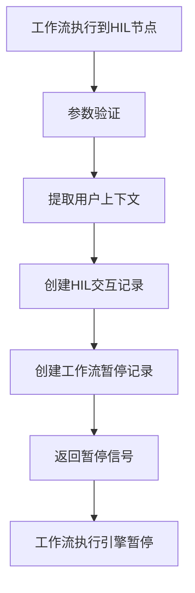
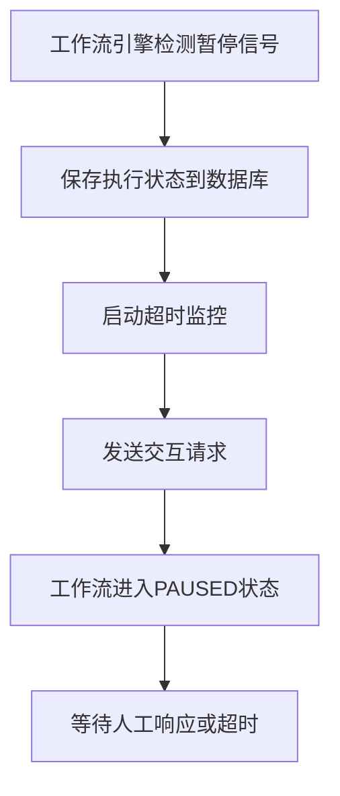
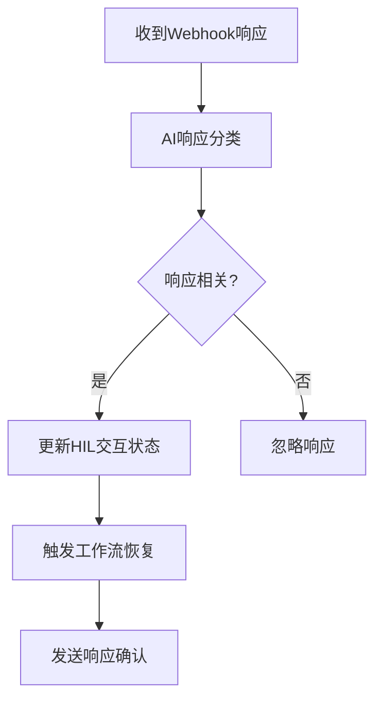
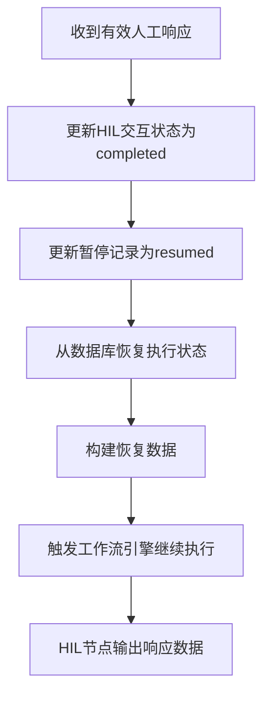
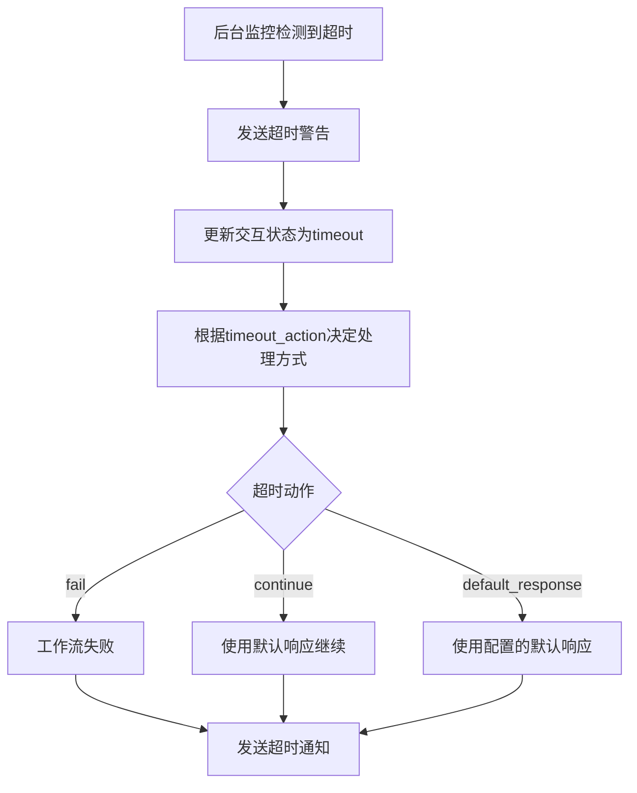

# 术语定义

Workflow: 是一个由节点组成的有向图，定义了触发条件，数据处理逻辑和执行顺序，用来执行自动化任务和集成不同服务的工作流

Node:
Node 定义一个可执行的一个操作。参数包含：

    - id: 节点的唯一标识符
    - name：节点名称(不可以包含空格)
    - description：节点的一句话简介
    - type：大类，包含 Trigger, AI_Agent, Action, External_Action, Flow, Tool, Memory, Human_in_the_loop
    - subtype: 细分种类，每个Type都有不同的Subtype实现
    - configurations: Node本身的参数，用于定义这个Node的行为
    - input_params: 在运行的时候，输入到Node的入参
    - output_params：在运行的时候，输出的出参
    - attached_nodes: （Optional）只适用于AI_AGENT Node，可以在同一个执行节点调用TOOL Node和MEMORY Node

Connection:
Connection 定义一个 Node 和 Node 的有向连接，以及数据转化的 function。参数包含：

    - id：连接的ID
    - from_node：源Node的ID
    - to_node: 目标Node的ID
    - output_key: 从源节点的哪个输出获取数据（例如：'result', 'true', 'false'），默认为'result'
    - conversion_function: 定义数据如何处理，转换成to_node可接受的数据

Metadata:
定义 Workflow 本身的配置

    - id: UUID 来唯一标识一个Workflow
    - name: Workflow的名称
    - icon_url: 这个Workflow的图标链接
    - description: 描述这个Workflow主要实现的目标和能力
    - deployment_status: 部署状态
    - last_execution_status: 上次运行的状态
    - last_execution_time: 上次运行时间 timestamp in miliseconds
    - tags: 便于搜索和分类
    - created_time: 生成workflow的时间  timestamp in miliseconds
    - parent_workflow: 作为template的原始workflow ID（optional）
    - statistics: 考虑存储累计执行次数、平均耗时等指标，便于运维监控。
        - total_runs: 总运行次数
        - average_duration_ms: 平均耗时
        - total_credits: 总消耗的credits

# Enums 定义

## WorkflowDeploymentStatus

参考现有 `shared.models.db_models.DeploymentStatusEnum`:

```python
class WorkflowDeploymentStatus(str, Enum):
    """工作流部署状态"""
    PENDING = "pending"       # 等待部署
    DEPLOYED = "deployed"     # 已部署
    FAILED = "failed"         # 部署失败
    UNDEPLOYED = "undeployed" # 已取消部署
```

## WorkflowExecutionStatus

参考现有 `shared.models.execution.ExecutionStatus` 和 `shared.models.db_models.WorkflowStatusEnum`:

```python
class WorkflowExecutionStatus(str, Enum):
    """工作流执行状态"""
    NEW = "NEW"                       # 新建状态
    RUNNING = "RUNNING"               # 正在执行
    SUCCESS = "SUCCESS"               # 执行成功
    ERROR = "ERROR"                   # 执行失败
    CANCELED = "CANCELED"             # 执行取消
    WAITING = "WAITING"               # 等待中
    PAUSED = "PAUSED"                 # 已暂停
    WAITING_FOR_HUMAN = "WAITING_FOR_HUMAN"  # 等待人工响应（HIL节点）
```

## NodeType

参考现有 `shared.models.node_enums.NodeType`:

```python
class NodeType(str, Enum):
    """节点类型 - 8个核心节点类别"""
    TRIGGER = "TRIGGER"                   # 触发器节点
    AI_AGENT = "AI_AGENT"                 # AI代理节点
    EXTERNAL_ACTION = "EXTERNAL_ACTION"   # 外部操作节点
    ACTION = "ACTION"                     # 系统操作节点
    FLOW = "FLOW"                         # 流程控制节点
    HUMAN_IN_THE_LOOP = "HUMAN_IN_THE_LOOP"  # 人工干预节点
    TOOL = "TOOL"                         # 工具节点
    MEMORY = "MEMORY"                     # 内存节点
```

## TriggerSubtype

参考现有 `shared.models.node_enums.TriggerSubtype`:

```python
class TriggerSubtype(str, Enum):
    """触发器节点子类型"""
    MANUAL = "MANUAL"         # 手动触发
    WEBHOOK = "WEBHOOK"       # Webhook触发
    CRON = "CRON"            # 定时触发
    EMAIL = "EMAIL"          # 邮件触发
    GITHUB = "GITHUB"        # GitHub事件触发
    SLACK = "SLACK"          # Slack事件触发
```

## AIAgentSubtype

参考现有 `shared.models.node_enums.AIAgentSubtype`:

```python
class AIAgentSubtype(str, Enum):
    """AI代理节点子类型"""
    OPENAI_CHATGPT = "OPENAI_CHATGPT"         # OpenAI ChatGPT
    ANTHROPIC_CLAUDE = "ANTHROPIC_CLAUDE"     # Anthropic Claude
    GOOGLE_GEMINI = "GOOGLE_GEMINI"           # Google Gemini
```

## ExternalActionSubtype

参考现有 `shared.models.node_enums.ExternalActionSubtype`:

```python
class ExternalActionSubtype(str, Enum):
    """外部操作节点子类型"""
    # 通用操作
    API_CALL = "API_CALL"
    WEBHOOK = "WEBHOOK"
    NOTIFICATION = "NOTIFICATION"

    # 通信平台
    SLACK = "SLACK"
    DISCORD_ACTION = "DISCORD_ACTION"
    TELEGRAM_ACTION = "TELEGRAM_ACTION"
    EMAIL = "EMAIL"

    # 开发工具
    GITHUB = "GITHUB"
    GITLAB_ACTION = "GITLAB_ACTION"
    JIRA_ACTION = "JIRA_ACTION"

    # 生产力工具
    GOOGLE_CALENDAR = "GOOGLE_CALENDAR"
    TRELLO = "TRELLO"
    NOTION = "NOTION"

    # 云服务
    AWS_ACTION = "AWS_ACTION"
    GCP_ACTION = "GCP_ACTION"
    AZURE_ACTION = "AZURE_ACTION"
```

## ActionSubtype

参考现有 `shared.models.node_enums.ActionSubtype`:

```python
class ActionSubtype(str, Enum):
    """系统操作节点子类型"""
    # 代码执行
    RUN_CODE = "RUN_CODE"
    EXECUTE_SCRIPT = "EXECUTE_SCRIPT"

    # 数据操作
    DATA_TRANSFORMATION = "DATA_TRANSFORMATION"
    DATA_VALIDATION = "DATA_VALIDATION"
    DATA_FORMATTING = "DATA_FORMATTING"

    # 文件操作
    FILE_OPERATION = "FILE_OPERATION"
    FILE_UPLOAD = "FILE_UPLOAD"
    FILE_DOWNLOAD = "FILE_DOWNLOAD"

    # HTTP操作
    HTTP_REQUEST = "HTTP_REQUEST"
    WEBHOOK_CALL = "WEBHOOK_CALL"

    # 数据库操作
    DATABASE_QUERY = "DATABASE_QUERY"
    DATABASE_OPERATION = "DATABASE_OPERATION"

    WEB_SEARCH = "WEB_SEARCH"
```

## FlowSubtype

参考现有 `shared.models.node_enums.FlowSubtype`:

```python
class FlowSubtype(str, Enum):
    """流程控制节点子类型"""
    # 条件逻辑
    IF = "IF"

    # 循环
    LOOP = "LOOP"
    FOR_EACH = "FOR_EACH"
    WHILE = "WHILE"

    # 数据流
    MERGE = "MERGE"
    SPLIT = "SPLIT"
    FILTER = "FILTER"
    SORT = "SORT"

    # 时序控制
    WAIT = "WAIT"
    DELAY = "DELAY"
    TIMEOUT = "TIMEOUT"
```

## HumanLoopSubtype

参考现有 `shared.models.node_enums.HumanLoopSubtype`:

```python
class HumanLoopSubtype(str, Enum):
    """人工干预节点子类型 - 内置AI响应分析能力"""
    # 邮件交互
    GMAIL_INTERACTION = "GMAIL_INTERACTION"
    OUTLOOK_INTERACTION = "OUTLOOK_INTERACTION"

    # 聊天交互
    SLACK_INTERACTION = "SLACK_INTERACTION"
    DISCORD_INTERACTION = "DISCORD_INTERACTION"
    TELEGRAM_INTERACTION = "TELEGRAM_INTERACTION"
    TEAMS_INTERACTION = "TEAMS_INTERACTION"

    # 应用交互
    IN_APP_APPROVAL = "IN_APP_APPROVAL"
    FORM_SUBMISSION = "FORM_SUBMISSION"
    MANUAL_REVIEW = "MANUAL_REVIEW"
```

## ToolSubtype

参考现有 `shared.models.node_enums.ToolSubtype`:

```python
class ToolSubtype(str, Enum):
    """工具节点子类型"""
    # MCP工具
    MCP_TOOL = "MCP_TOOL"

    # 日历工具
    GOOGLE_CALENDAR = "GOOGLE_CALENDAR_TOOL"
    OUTLOOK_CALENDAR = "OUTLOOK_CALENDAR_TOOL"
    CALENDAR_GENERIC = "CALENDAR_GENERIC_TOOL"

    # 邮件工具
    EMAIL_TOOL = "EMAIL_TOOL"
    GMAIL_TOOL = "GMAIL_TOOL"

    # HTTP工具
    HTTP_CLIENT = "HTTP_CLIENT"

    # 文件工具
    FILE_PROCESSOR = "FILE_PROCESSOR"
    IMAGE_PROCESSOR = "IMAGE_PROCESSOR"

    CODE_TOOL = "CODE_TOOL"
```

## MemorySubtype

参考现有 `shared.models.node_enums.MemorySubtype`:

```python
class MemorySubtype(str, Enum):
    """内存节点子类型"""
    # 对话内存类型
    CONVERSATION_BUFFER = "CONVERSATION_BUFFER"
    CONVERSATION_SUMMARY = "CONVERSATION_SUMMARY"

    # 向量数据库内存
    VECTOR_DATABASE = "VECTOR_DATABASE"

    # 键值内存
    KEY_VALUE_STORE = "KEY_VALUE_STORE"

    # 文档内存
    DOCUMENT_STORE = "DOCUMENT_STORE"

    # 高级内存类型
    ENTITY_MEMORY = "ENTITY_MEMORY"
    EPISODIC_MEMORY = "EPISODIC_MEMORY"
    KNOWLEDGE_BASE = "KNOWLEDGE_BASE"
    GRAPH_MEMORY = "GRAPH_MEMORY"
    WORKING_MEMORY = "WORKING_MEMORY"
```

# 数据结构定义

## Connection

```python
class Connection(BaseModel):
    """连接定义"""
    id: str = Field(..., description="连接的唯一标识符")
    from_node: str = Field(..., description="源节点的ID")
    to_node: str = Field(..., description="目标节点的ID")
    output_key: str = Field(default="result", description="从源节点的哪个输出获取数据（如 'result', 'true', 'false'）")
    conversion_function: Optional[str] = Field(default=None, description="数据转换函数")
```

## Node

```python
class Node(BaseModel):
    """节点定义"""
    id: str = Field(..., description="节点的唯一标识符")
    name: str = Field(..., description="节点名称，不可包含空格")
    description: str = Field(..., description="节点的一句话简介")
    type: NodeType = Field(..., description="节点大类")
    subtype: str = Field(..., description="节点细分种类")
    configurations: Dict[str, Any] = Field(default_factory=dict, description="节点配置参数")
    input_params: Dict[str, Any] = Field(default_factory=dict, description="运行时输入参数")
    output_params: Dict[str, Any] = Field(default_factory=dict, description="运行时输出参数")
    attached_nodes: Optional[List[str]] = Field(default=None, description="附加节点ID列表(仅AI_AGENT使用)")
    position: Optional[Dict[str, float]] = Field(default=None, description="节点在画布上的位置")

    @field_validator("name")
    @classmethod
    def validate_name(cls, v):
        if " " in v:
            raise ValueError("节点名称不可包含空格")
        return v
```

## WorkflowStatistics

```python
class WorkflowStatistics(BaseModel):
    """工作流统计信息"""
    total_runs: int = Field(default=0, description="总运行次数")
    average_duration_ms: int = Field(default=0, description="平均耗时（毫秒）")
    total_credits: int = Field(default=0, description="总消耗的credits")
    last_success_time: Optional[int] = Field(default=None, description="最后成功时间戳")
```

## WorkflowMetadata

```python
class WorkflowMetadata(BaseModel):
    """工作流元数据"""
    id: str = Field(..., description="UUID唯一标识符")
    name: str = Field(..., description="工作流名称")
    icon_url: Optional[str] = Field(default=None, description="工作流图标链接")
    description: Optional[str] = Field(default=None, description="工作流描述")
    deployment_status: WorkflowDeploymentStatus = Field(default=WorkflowDeploymentStatus.DRAFT, description="部署状态")
    last_execution_status: Optional[WorkflowExecutionStatus] = Field(default=None, description="上次运行状态")
    last_execution_time: Optional[int] = Field(default=None, description="上次运行时间戳（毫秒）")
    tags: List[str] = Field(default_factory=list, description="标签列表")
    created_time: int = Field(..., description="创建时间戳（毫秒）")
    parent_workflow: Optional[str] = Field(default=None, description="模板原始工作流ID")
    statistics: WorkflowStatistics = Field(default_factory=WorkflowStatistics, description="统计信息")
    version: str = Field(default="1.0", description="版本号")
    created_by: str = Field(..., description="创建用户ID")
    updated_by: Optional[str] = Field(default=None, description="最后更新用户ID")
```

## Workflow

```python
class Workflow(BaseModel):
    """完整工作流定义"""
    metadata: WorkflowMetadata = Field(..., description="工作流元数据")
    nodes: List[Node] = Field(..., description="节点列表")
    connections: List[Connection] = Field(default_factory=list, description="连接列表")
    triggers: List[str] = Field(default_factory=list, description="触发器节点ID列表")

    @field_validator("nodes")
    @classmethod
    def validate_nodes(cls, v):
        if not v:
            raise ValueError("工作流必须包含至少一个节点")
        node_ids = [node.id for node in v]
        if len(node_ids) != len(set(node_ids)):
            raise ValueError("节点ID必须唯一")
        return v

    @field_validator("connections")
    @classmethod
    def validate_connections(cls, v, info):
        """验证连接的有效性"""
        if 'nodes' in info.data:
            node_ids = {node.id for node in info.data['nodes']}
            for conn in v:
                if conn.from_node not in node_ids:
                    raise ValueError(f"连接中的源节点 '{conn.from_node}' 不存在")
                if conn.to_node not in node_ids:
                    raise ValueError(f"连接中的目标节点 '{conn.to_node}' 不存在")
        return v
```

# Workflow Execution

## 执行状态相关枚举

### ExecutionStatus

参考现有 `shared.models.execution.ExecutionStatus` 并扩展:

```python
class ExecutionStatus(str, Enum):
    """工作流执行状态"""
    NEW = "NEW"                           # 新建状态
    PENDING = "PENDING"                   # 等待开始
    RUNNING = "RUNNING"                   # 正在执行
    PAUSED = "PAUSED"                     # 暂停 (Human-in-the-loop)
    SUCCESS = "SUCCESS"                   # 成功完成
    ERROR = "ERROR"                       # 执行失败
    CANCELED = "CANCELED"                 # 用户取消
    WAITING = "WAITING"                   # 等待中
    TIMEOUT = "TIMEOUT"                   # 执行超时
    WAITING_FOR_HUMAN = "WAITING_FOR_HUMAN"  # 等待人工响应
```

### NodeExecutionStatus

```python
class NodeExecutionStatus(str, Enum):
    """节点执行状态"""
    PENDING = "pending"                   # 等待执行
    RUNNING = "running"                   # 正在执行
    WAITING_INPUT = "waiting_input"       # 等待用户输入 (Human-in-the-loop)
    COMPLETED = "completed"               # 执行完成
    FAILED = "failed"                     # 执行失败
    SKIPPED = "skipped"                   # 被跳过
    RETRYING = "retrying"                 # 正在重试
```

### ExecutionEventType

```python
class ExecutionEventType(str, Enum):
    """执行事件类型 - 用于WebSocket实时推送"""
    EXECUTION_STARTED = "execution_started"
    NODE_STARTED = "node_started"
    NODE_COMPLETED = "node_completed"
    NODE_FAILED = "node_failed"
    NODE_OUTPUT_UPDATE = "node_output_update"    # 节点输出更新（流式输出）
    EXECUTION_PAUSED = "execution_paused"
    EXECUTION_RESUMED = "execution_resumed"
    EXECUTION_COMPLETED = "execution_completed"
    EXECUTION_FAILED = "execution_failed"
    USER_INPUT_REQUIRED = "user_input_required"
```

### LogLevel

```python
class LogLevel(str, Enum):
    """日志级别"""
    DEBUG = "DEBUG"
    INFO = "INFO"
    WARN = "WARN"
    ERROR = "ERROR"
```

## 执行数据结构定义

### TriggerInfo

```python
class TriggerInfo(BaseModel):
    """触发信息"""
    trigger_type: str = Field(..., description="触发类型")
    trigger_data: Dict[str, Any] = Field(default_factory=dict, description="触发数据")
    user_id: Optional[str] = Field(default=None, description="触发用户")
    external_request_id: Optional[str] = Field(default=None, description="外部请求ID")
    timestamp: int = Field(..., description="触发时间戳")
```

### TokenUsage

```python
class TokenUsage(BaseModel):
    """Token使用情况"""
    input_tokens: int = Field(default=0, description="输入token数")
    output_tokens: int = Field(default=0, description="输出token数")
    total_tokens: int = Field(default=0, description="总token数")
```

### LogEntry

```python
class LogEntry(BaseModel):
    """日志条目"""
    timestamp: int = Field(..., description="日志时间戳")
    level: LogLevel = Field(..., description="日志级别")
    message: str = Field(..., description="日志消息")
    node_id: Optional[str] = Field(default=None, description="关联的节点ID")
    context: Optional[Dict[str, Any]] = Field(default=None, description="上下文信息")
```

### ExecutionError

```python
class ExecutionError(BaseModel):
    """执行错误信息"""
    error_code: str = Field(..., description="错误代码")
    error_message: str = Field(..., description="错误消息")
    error_node_id: Optional[str] = Field(default=None, description="出错的节点ID")
    stack_trace: Optional[str] = Field(default=None, description="堆栈跟踪")
    timestamp: int = Field(..., description="错误发生时间")
    is_retryable: bool = Field(default=False, description="是否可重试")
```

### NodeError

```python
class NodeError(BaseModel):
    """节点错误信息"""
    error_code: str = Field(..., description="错误代码")
    error_message: str = Field(..., description="错误消息")
    error_details: Optional[Dict[str, Any]] = Field(default=None, description="错误详情")
    is_retryable: bool = Field(..., description="是否可重试")
    timestamp: int = Field(..., description="错误发生时间")
```

### NodeExecutionDetails

```python
class NodeExecutionDetails(BaseModel):
    """节点执行详情 - 根据节点类型的不同而不同"""

    # AI_Agent 特有
    ai_model: Optional[str] = Field(default=None, description="使用的AI模型")
    prompt_tokens: Optional[int] = Field(default=None, description="Prompt token数")
    completion_tokens: Optional[int] = Field(default=None, description="完成token数")
    model_response: Optional[str] = Field(default=None, description="AI模型响应")

    # External_Action 特有
    api_endpoint: Optional[str] = Field(default=None, description="API端点")
    http_method: Optional[str] = Field(default=None, description="HTTP方法")
    request_headers: Optional[Dict[str, str]] = Field(default=None, description="请求头")
    response_status: Optional[int] = Field(default=None, description="响应状态码")
    response_headers: Optional[Dict[str, str]] = Field(default=None, description="响应头")

    # Tool 特有
    tool_name: Optional[str] = Field(default=None, description="工具名称")
    tool_parameters: Optional[Dict[str, Any]] = Field(default=None, description="工具参数")
    tool_result: Optional[Any] = Field(default=None, description="工具执行结果")

    # Human_in_the_loop 特有
    user_prompt: Optional[str] = Field(default=None, description="给用户的提示")
    user_response: Optional[Any] = Field(default=None, description="用户的响应")
    waiting_since: Optional[int] = Field(default=None, description="开始等待的时间")

    # Flow 特有 (条件判断等)
    condition_result: Optional[bool] = Field(default=None, description="条件判断结果")
    branch_taken: Optional[str] = Field(default=None, description="选择的分支")

    # 通用
    logs: List[LogEntry] = Field(default_factory=list, description="执行日志")
    metrics: Optional[Dict[str, Any]] = Field(default=None, description="自定义指标")
```

### NodeExecution

```python
class NodeExecution(BaseModel):
    """单个节点执行详情"""
    node_id: str = Field(..., description="节点ID")
    node_name: str = Field(..., description="节点名称")
    node_type: str = Field(..., description="节点类型")
    node_subtype: str = Field(..., description="节点子类型")

    # 执行状态
    status: NodeExecutionStatus = Field(..., description="节点执行状态")
    start_time: Optional[int] = Field(default=None, description="开始执行时间")
    end_time: Optional[int] = Field(default=None, description="结束时间")
    duration_ms: Optional[int] = Field(default=None, description="执行耗时")

    # 输入输出
    input_data: Dict[str, Any] = Field(default_factory=dict, description="输入数据")
    output_data: Dict[str, Any] = Field(default_factory=dict, description="输出数据")

    # 执行详情
    execution_details: NodeExecutionDetails = Field(default_factory=NodeExecutionDetails, description="节点特定的执行详情")

    # 错误信息
    error: Optional[NodeError] = Field(default=None, description="节点执行错误")

    # 重试信息
    retry_count: int = Field(default=0, description="重试次数")
    max_retries: int = Field(default=3, description="最大重试次数")

    # 资源消耗
    credits_consumed: int = Field(default=0, description="该节点消耗的credits")

    # 附加节点执行情况 (AI_AGENT 专用)
    attached_executions: Optional[Dict[str, "NodeExecution"]] = Field(default=None, description="附加的Tool/Memory节点执行情况")
```

### WorkflowExecution

参考现有 `shared.models.execution.Execution` 并大幅扩展:

```python
class WorkflowExecution(BaseModel):
    """工作流执行整体状态"""

    # 基础信息
    execution_id: str = Field(..., description="执行实例的唯一标识")
    workflow_id: str = Field(..., description="对应的Workflow ID")
    workflow_version: str = Field(default="1.0", description="Workflow版本号")

    # 执行状态
    status: ExecutionStatus = Field(..., description="整体执行状态")
    start_time: Optional[int] = Field(default=None, description="开始执行时间")
    end_time: Optional[int] = Field(default=None, description="结束时间")
    duration_ms: Optional[int] = Field(default=None, description="总耗时")

    # 触发信息
    trigger_info: TriggerInfo = Field(..., description="触发相关信息")

    # 节点执行详情
    node_executions: Dict[str, NodeExecution] = Field(default_factory=dict, description="节点执行详情，Key: node_id")
    execution_sequence: List[str] = Field(default_factory=list, description="按执行顺序排列的node_id数组")

    # 当前状态
    current_node_id: Optional[str] = Field(default=None, description="当前正在执行的节点")
    next_nodes: List[str] = Field(default_factory=list, description="下一步将要执行的节点列表")

    # 错误信息
    error: Optional[ExecutionError] = Field(default=None, description="执行错误信息")

    # 资源消耗
    credits_consumed: int = Field(default=0, description="消耗的credits")
    tokens_used: Optional[TokenUsage] = Field(default=None, description="Token使用情况")

    # 元数据
    metadata: Optional[Dict[str, Any]] = Field(default=None, description="执行元数据")
    created_at: Optional[str] = Field(default=None, description="创建时间")
    updated_at: Optional[str] = Field(default=None, description="更新时间")
```

## AI_AGENT 节点的 attached_nodes 执行流程

attached_nodes 是 AI_AGENT 节点的特殊功能，用于在同一执行上下文中集成 MEMORY 和 TOOL 节点。这些节点**不作为独立的工作流步骤执行**，而是作为支持性功能为 AI 代理提供增强能力。

### 执行流程说明

当 AI_AGENT 节点执行时，按以下顺序处理 attached_nodes：

1. **内存上下文加载**（执行前）

   - 检测 attached_nodes 中的 MEMORY 节点
   - 从 MEMORY 节点加载相关的对话历史和上下文信息
   - 将内存上下文添加到 AI 提示中，增强对话连续性

2. **工具发现**（执行前）

   - 检测 attached_nodes 中的 TOOL 节点
   - 发现可用的 MCP (Model Context Protocol) 工具函数
   - 将可用工具注册到 AI 提供商，使 AI 能够调用这些工具

3. **AI 响应生成**

   - 使用增强的提示（包含内存上下文）生成响应
   - AI 可以调用已注册的工具函数
   - 生成完整的 AI 响应

4. **对话存储**（执行后）
   - 将用户消息和 AI 响应作为完整的对话交换
   - 存储到 attached_nodes 中的 MEMORY 节点中
   - 确保对话历史的持久化

### 重要说明

- **MEMORY 节点**：提供**上下文增强**和**对话持久化**功能，不需要独立执行
- **TOOL 节点**：提供**工具发现和注册**功能，工具调用由 AI 提供商内部处理
- **执行顺序**：attached_nodes 的处理完全在 AI_AGENT 节点内部完成，不影响工作流的整体执行顺序
- **数据流**：attached_nodes 不参与工作流的数据流连接（Connection），它们的输入输出由 AI_AGENT 节点管理

### 配置示例

```json
{
  "id": "chat_ai",
  "type": "AI_AGENT",
  "subtype": "ANTHROPIC_CLAUDE",
  "configurations": {
    "model": "claude-3-5-haiku-20241022",
    "prompt": "You are a helpful assistant with memory."
  },
  "attached_nodes": ["conversation_memory", "mcp_tools"]
}
```

## 实时更新事件结构

### ExecutionUpdateData

```python
class ExecutionUpdateData(BaseModel):
    """执行更新数据"""
    node_id: Optional[str] = Field(default=None, description="节点ID")
    node_execution: Optional[NodeExecution] = Field(default=None, description="节点执行信息")
    partial_output: Optional[Dict[str, Any]] = Field(default=None, description="流式输出的部分数据")
    execution_status: Optional[ExecutionStatus] = Field(default=None, description="执行状态")
    error: Optional[Union[ExecutionError, NodeError]] = Field(default=None, description="错误信息")
    user_input_request: Optional[Dict[str, Any]] = Field(default=None, description="用户输入请求")
```

### ExecutionUpdateEvent

```python
class ExecutionUpdateEvent(BaseModel):
    """实时更新事件 - 用于WebSocket推送"""
    event_type: ExecutionEventType = Field(..., description="事件类型")
    execution_id: str = Field(..., description="执行ID")
    timestamp: int = Field(..., description="事件时间戳")
    data: ExecutionUpdateData = Field(..., description="更新数据")
```

## API 接口定义

### WorkflowExecutionSummary

```python
class WorkflowExecutionSummary(BaseModel):
    """工作流执行摘要 - 用于列表显示"""
    execution_id: str = Field(..., description="执行ID")
    workflow_id: str = Field(..., description="工作流ID")
    workflow_name: str = Field(..., description="工作流名称")
    status: ExecutionStatus = Field(..., description="执行状态")
    start_time: Optional[int] = Field(default=None, description="开始时间")
    end_time: Optional[int] = Field(default=None, description="结束时间")
    duration_ms: Optional[int] = Field(default=None, description="执行耗时")
    trigger_type: str = Field(..., description="触发类型")
    credits_consumed: int = Field(default=0, description="消耗的credits")
    error_summary: Optional[str] = Field(default=None, description="错误摘要")
```

### GetExecutionResponse

```python
class GetExecutionResponse(BaseModel):
    """获取执行详情响应"""
    execution: WorkflowExecution = Field(..., description="执行详情")
    workflow_definition: Optional[Workflow] = Field(default=None, description="工作流定义")
```

### GetExecutionsResponse

```python
class GetExecutionsResponse(BaseModel):
    """获取执行列表响应"""
    executions: List[WorkflowExecutionSummary] = Field(..., description="执行列表")
    total_count: int = Field(..., description="总数量")
    page: int = Field(default=1, description="当前页")
    page_size: int = Field(default=20, description="每页大小")
```

### SubscriptionResponse

```python
class SubscriptionResponse(BaseModel):
    """WebSocket订阅响应"""
    subscription_id: str = Field(..., description="订阅ID")
    execution_id: str = Field(..., description="执行ID")
    status: str = Field(..., description="订阅状态")
    message: Optional[str] = Field(default=None, description="消息")
```

### ExecutionActionRequest

```python
class ExecutionActionRequest(BaseModel):
    """用户操作请求"""
    action: str = Field(..., description="操作类型: pause, resume, cancel, retry_node")
    node_id: Optional[str] = Field(default=None, description="节点ID，retry_node时需要")
```

### UserInputRequest

```python
class UserInputRequest(BaseModel):
    """用户输入请求"""
    execution_id: str = Field(..., description="执行ID")
    node_id: str = Field(..., description="节点ID")
    input_data: Any = Field(..., description="输入数据")
```

### ExecutionActionResponse

```python
class ExecutionActionResponse(BaseModel):
    """执行操作响应"""
    success: bool = Field(..., description="操作是否成功")
    message: str = Field(..., description="响应消息")
    execution_status: Optional[ExecutionStatus] = Field(default=None, description="执行状态")
```

## 数据结构特点说明

### 实时状态追踪

- `current_node_id` 和 `next_nodes` 让 UI 能清楚显示当前执行位置
- `NodeExecutionStatus` 详细区分节点的各种状态
- `ExecutionUpdateEvent` 支持 WebSocket 实时推送更新

### 详细的输入输出记录

- `input_data` 和 `output_data` 使用 Dict 结构存储节点的输入输出数据
- 支持流式输出的部分数据更新 (`partial_output`)
- 完整记录数据转换过程

### 丰富的执行上下文

- `execution_sequence` 记录执行顺序，便于 UI 显示执行路径
- `NodeExecutionDetails` 根据不同节点类型提供特定信息
- `logs` 和 `metrics` 支持调试和监控

### 错误处理和重试机制

- 详细的错误信息结构
- 重试计数和状态跟踪
- 区分可重试和不可重试的错误

### 用户交互支持

- Human-in-the-loop 节点的特殊状态处理
- 用户输入请求的结构化定义
- 支持暂停和恢复执行

### UI 友好的设计

- 分离数据模型和 UI 状态
- 支持过滤、搜索和多种视图模式
- 实时连接状态监控

# Human-in-the-Loop (HIL) 节点执行流程

## HIL 节点概述

Human-in-the-Loop (HIL) 节点是工作流系统中的一个特殊节点类型，用于在自动化流程中集成人工决策和输入。HIL 节点具有以下核心特性：

- **工作流暂停**: 当执行到 HIL 节点时，工作流会暂停并等待人工响应
- **状态持久化**: 工作流的执行状态会完整保存到数据库中
- **多渠道交互**: 支持 Slack、Email、Webhook、In-App 等多种交互方式
- **AI 响应分类**: 内置 AI 能力自动判断人工响应是否相关
- **超时管理**: 支持响应超时和自动处理机制

## HIL 节点配置参数

### 基础配置

```json
{
  "interaction_type": "approval", // 交互类型: approval, input, selection, review
  "channel_type": "slack", // 通信渠道: slack, email, webhook, in_app
  "timeout_seconds": 3600, // 超时时间 (60秒-24小时)
  "title": "Workflow Approval Required",
  "description": "Please approve this workflow execution",
  "timeout_action": "fail" // 超时行为: fail, continue, default_response
}
```

### 交互类型特定配置

```json
// 审批类型 (approval)
{
  "approval_options": ["approve", "reject", "需要修改"]
}

// 输入类型 (input)
{
  "input_fields": [
    {"name": "budget", "type": "number", "required": true},
    {"name": "notes", "type": "text", "required": false}
  ]
}

// 选择类型 (selection)
{
  "selection_options": ["Option A", "Option B", "Option C"],
  "allow_multiple": false
}

// 审核类型 (review)
{
  "review_criteria": ["质量检查", "合规性审核", "安全评估"]
}
```

## HIL 执行流程详解

### 1. HIL 节点启动阶段



**流程详情:**

1. **参数验证**: 验证 HIL 节点配置的完整性和有效性

   - 检查必需参数 (interaction_type, channel_type, timeout_seconds)
   - 验证超时时间范围 (60 秒-24 小时)
   - 验证交互类型特定配置 (如 input 类型需要 input_fields)

2. **用户上下文提取**: 从触发信息和执行上下文中提取用户 ID

   - 优先从触发器信息获取用户 ID
   - 回退到执行上下文中的用户信息
   - 如果无法获取用户 ID，返回错误

3. **HIL 交互记录创建**: 在数据库中创建 hil_interactions 记录

   ```sql
   INSERT INTO hil_interactions (
     workflow_id, execution_id, node_id, user_id,
     interaction_type, channel_type, status,
     request_data, timeout_at, created_at
   ) VALUES (...)
   ```

4. **工作流暂停记录**: 创建 workflow_execution_pauses 记录

   ```sql
   INSERT INTO workflow_execution_pauses (
     execution_id, node_id, pause_reason,
     resume_conditions, pause_context, status
   ) VALUES (...)
   ```

5. **暂停信号返回**: HIL 节点返回特殊的暂停信号
   ```json
   {
     "_hil_wait": true,
     "_hil_interaction_id": "uuid",
     "_hil_timeout_seconds": 3600,
     "_hil_node_id": "approval_node",
     "main": {
       "status": "waiting_for_human",
       "interaction_id": "uuid",
       "timeout_at": "2025-01-26T15:00:00Z"
     }
   }
   ```

### 2. 工作流暂停阶段



**关键实现:**

1. **执行状态持久化**: 工作流引擎保存完整的执行上下文

   - 当前节点执行状态
   - 输入输出数据快照
   - 执行序列和下一步节点信息
   - 临时变量和上下文数据

2. **超时监控启动**: 后台服务开始监控超时

   ```python
   # HIL Timeout Manager 后台监控
   async def _timeout_monitoring_loop(self):
       while self._is_running:
           await self.process_expired_interactions()
           await self.send_timeout_warnings()
           await asyncio.sleep(self.check_interval_minutes * 60)
   ```

3. **交互请求发送**: 通过配置的渠道发送交互请求
   - Slack: 发送消息到指定频道或用户
   - Email: 发送邮件通知
   - Webhook: 调用外部 Webhook
   - In-App: 创建应用内通知

### 3. 人工响应处理阶段



**AI 响应分类流程:**

1. **响应接收**: 系统接收来自各渠道的响应数据

2. **AI 分类分析**: 使用 Google Gemini 进行智能分类

   ```python
   # 8因子分析提示词
   classification_prompt = f"""
   分析因子:
   1. 内容相关性: 响应内容是否与交互标题/消息相关
   2. 期望响应模式: 是否匹配预期的批准/拒绝/输入模式
   3. 渠道一致性: 是否来自预期的通信渠道
   4. 用户上下文: 响应者是否适合此交互
   5. 时间合理性: 响应时间是否合理
   6. 响应质量: 是否为有意义的人工响应
   7. 线程上下文: 是否正确关联到原始请求
   8. 动作关键词: 是否包含批准关键词 (approve, yes, reject, no 等)
   """
   ```

3. **分类结果处理**:
   - `relevant` (相关, score >= 0.7): 处理响应并恢复工作流
   - `filtered` (无关, score <= 0.3): 忽略响应
   - `uncertain` (不确定, 0.3 < score < 0.7): 记录但不自动处理

### 4. 工作流恢复阶段



**恢复流程实现:**

1. **状态更新**: 更新数据库记录状态

   ```sql
   UPDATE hil_interactions
   SET status = 'completed', response_data = ?, updated_at = NOW()
   WHERE id = ?;

   UPDATE workflow_execution_pauses
   SET status = 'resumed', resume_reason = 'human_response', resumed_at = NOW()
   WHERE execution_id = ? AND node_id = ?;
   ```

2. **执行状态恢复**: 工作流引擎恢复执行上下文

   - 恢复节点执行状态
   - 重建输入输出数据
   - 恢复临时变量和上下文

3. **HIL 节点输出**: 构建包含人工响应的输出数据
   ```json
   {
     "main": {
       "status": "completed",
       "response_type": "approval",
       "response_data": {
         "action": "approve",
         "user_id": "user123",
         "timestamp": "2025-01-26T14:30:00Z",
         "notes": "项目看起来不错，批准执行"
       }
     }
   }
   ```

### 5. 超时处理机制



**超时处理策略:**

1. **警告通知**: 超时前 15 分钟发送警告

   ```python
   warning_data = {
       "interaction_id": interaction_id,
       "workflow_name": "审批工作流",
       "minutes_remaining": 15,
       "timeout_at": "2025-01-26T15:00:00Z"
   }
   ```

2. **超时动作选择**:

   - `fail`: 工作流执行失败，需要人工干预
   - `continue`: 工作流继续，使用系统默认响应
   - `default_response`: 使用节点配置中的默认响应

3. **工作流恢复**: 根据超时动作恢复或终止工作流

## HIL 数据库表结构

### hil_interactions 表

```sql
CREATE TABLE hil_interactions (
    id UUID PRIMARY KEY DEFAULT gen_random_uuid(),
    workflow_id UUID NOT NULL,
    execution_id UUID NOT NULL,
    node_id TEXT NOT NULL,
    user_id UUID NOT NULL,
    interaction_type hil_interaction_type NOT NULL,
    channel_type hil_channel_type NOT NULL,
    status hil_interaction_status DEFAULT 'pending',
    priority INTEGER DEFAULT 1,
    request_data JSONB NOT NULL,
    response_data JSONB,
    timeout_at TIMESTAMPTZ NOT NULL,
    warning_sent BOOLEAN DEFAULT FALSE,
    created_at TIMESTAMPTZ DEFAULT NOW(),
    updated_at TIMESTAMPTZ DEFAULT NOW()
);
```

### workflow_execution_pauses 表

```sql
CREATE TABLE workflow_execution_pauses (
    id UUID PRIMARY KEY DEFAULT gen_random_uuid(),
    execution_id UUID NOT NULL,
    node_id TEXT NOT NULL,
    pause_reason TEXT NOT NULL,
    resume_conditions JSONB,
    pause_context JSONB,
    status TEXT DEFAULT 'active',
    paused_at TIMESTAMPTZ DEFAULT NOW(),
    resumed_at TIMESTAMPTZ,
    resume_reason TEXT,
    resume_data JSONB
);
```

## HIL 节点在工作流执行状态中的体现

### ExecutionStatus 扩展

```python
class ExecutionStatus(str, Enum):
    WAITING_FOR_HUMAN = "WAITING_FOR_HUMAN"  # HIL 专用状态
    PAUSED = "PAUSED"                        # 工作流暂停状态
```

### NodeExecutionStatus 扩展

```python
class NodeExecutionStatus(str, Enum):
    WAITING_INPUT = "waiting_input"          # HIL 节点等待输入
```

### HIL 特有的执行详情

```python
class NodeExecutionDetails(BaseModel):
    # Human_in_the_loop 特有字段
    user_prompt: Optional[str] = None        # 给用户的提示
    user_response: Optional[Any] = None      # 用户的响应
    waiting_since: Optional[int] = None      # 开始等待的时间
    interaction_type: Optional[str] = None   # 交互类型
    channel_type: Optional[str] = None       # 通信渠道
    timeout_at: Optional[int] = None         # 超时时间
```

## 前端交互支持

### WebSocket 事件类型

```python
class ExecutionEventType(str, Enum):
    USER_INPUT_REQUIRED = "user_input_required"  # 需要用户输入
    EXECUTION_PAUSED = "execution_paused"        # 执行暂停
    EXECUTION_RESUMED = "execution_resumed"      # 执行恢复
```

### 用户输入 API

```python
class UserInputRequest(BaseModel):
    execution_id: str
    node_id: str
    input_data: Any  # 用户提供的输入数据
```

## HIL 最佳实践

### 1. 配置建议

- 设置合理的超时时间 (建议 1-4 小时)
- 为关键决策点使用 `approval` 类型
- 为需要详细信息的场景使用 `input` 类型
- 配置适当的超时处理策略

### 2. 错误处理

- 始终验证 HIL 配置参数
- 提供清晰的错误消息和解决方案
- 支持重试机制

### 3. 用户体验

- 提供清晰的交互提示
- 支持多语言本地化
- 实现实时状态更新

这个 HIL 系统为工作流提供了强大的人机协作能力，确保在需要人工判断的关键环节能够无缝集成人工智慧，同时保持工作流的自动化特性。
