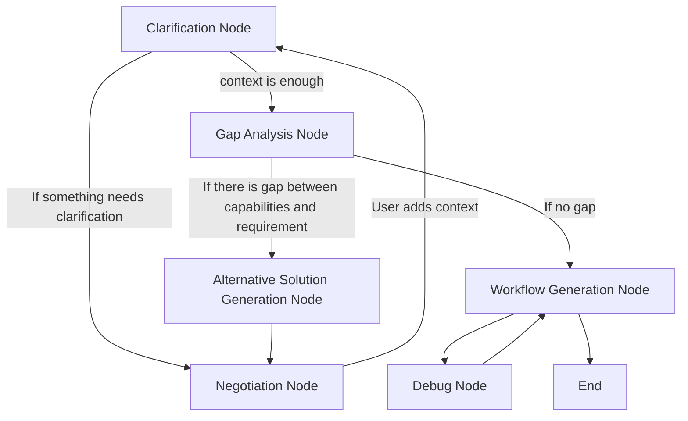
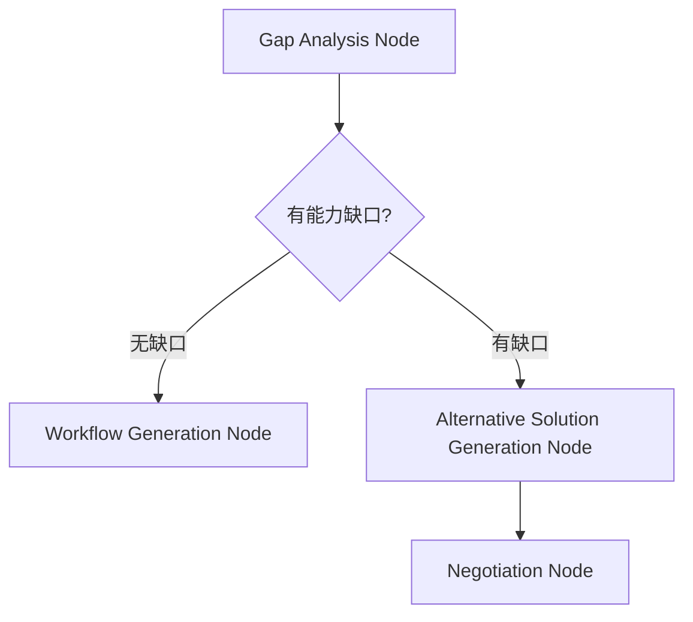
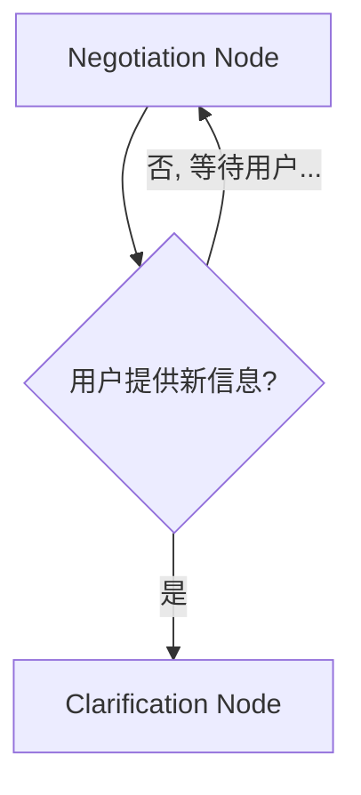
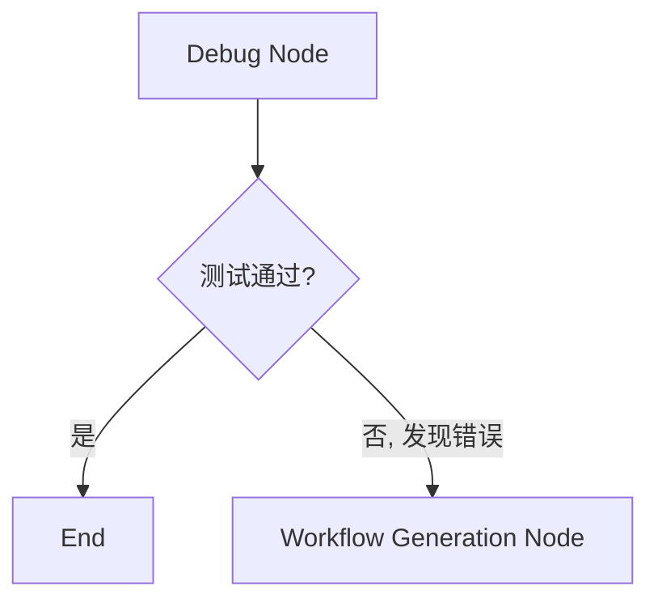
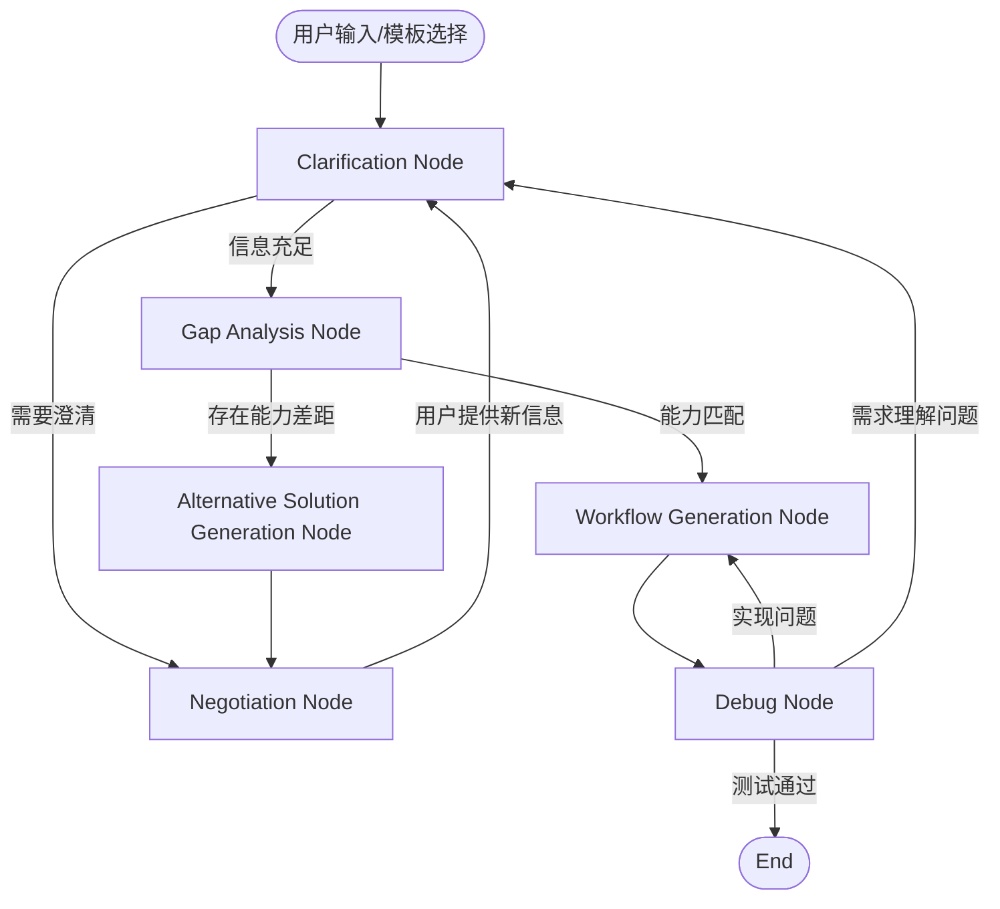
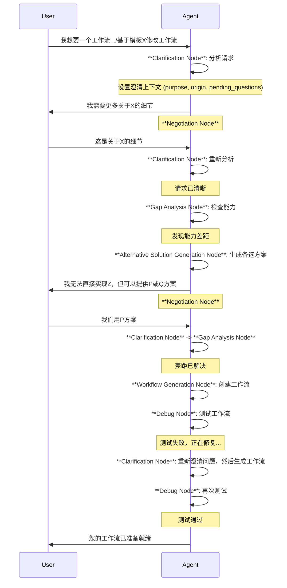
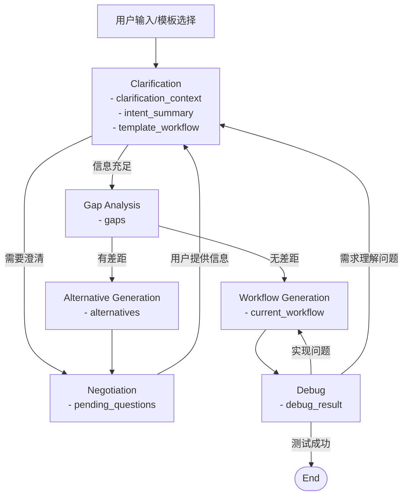

# Workflow Agent 技术架构设计

Workflow Agent 是基于 LangGraph 构建的智能工作流生成服务，将用户的描述转换为可执行的工作流, 自动调试并完成部署。

## 核心设计理念

咨询顾问式交互 + 前置能力检测 + 智能协商机制
需求捕获 → 能力边界检测 → 协商调整 → 设计实现 → 测试部署 → 持续优化

## 整体流程设计



## 🔄 核心创新：前置协商流程

### 我们的创新流程

```
用户需求 → 能力扫描 → 发现约束 → 协商调整 → 确认方案 → 精准设计
```

## 📊 节点分类与状态管理

### 主要节点类型

#### 1. 咨询类节点 (Consultant Nodes)
- **Clarification Node** - 解析和澄清用户意图，支持多种澄清目的（初始意图、模板选择、模板修改、能力差距解决、调试问题）。
- **Negotiation Node** - 与用户协商，获取额外信息或在备选方案中选择。
- **Gap Analysis Node** - 分析需求与现有能力之间的差距。
- **Alternative Solution Generation Node** - 当存在能力差距时，生成替代解决方案。

#### 2. 设计与执行类节点 (Design & Execution Nodes)
- **Workflow Generation Node** - 根据确定的需求生成工作流。
- **Debug Node** - 测试生成的工作流，发现并尝试修复错误。

## 🌊 状态流转设计

### 核心状态数据结构

```typescript
interface Conversation {
  role: string;
  text: string;
}

interface WorkflowState {
  // 元数据
  metadata: {
    session_id: string;
    user_id: string;
    created_at: Date;
    updated_at: Date;
  };

  // 当前阶段
  stage: 'clarification' | 'negotiation' | 'gap_analysis' | 'generation' | 'debugging';

  // 澄清阶段上下文
  clarification_context?: {
    purpose:
      | 'initial_intent'        // 澄清用户的初始目标或需求
      | 'template_selection'    // 确认/选择模板
      | 'template_modification' // 澄清如何修改模板
      | 'gap_resolution'        // 澄清如何解决能力差距
      | 'debug_issue';          // 澄清调试中遇到的问题

    origin: 'new_workflow' | 'from_template';
    pending_questions: string[];   // 当前 Clarification 阶段待确认的问题
  };

  conversations: Conversation[]; // 用户和AI Agent的全部对话
  intent_summary: string; // AI根据对话总结的用户意图
  gaps: string[]; // 能力差距分析结果
  alternatives: string[]; // 提供的替代方案

  // 模板工作流支持
  template_workflow?: {
    id: string;                     // 模板 ID
    original_workflow: object;      // 模板的原始内容
  };

  current_workflow: object; // 当前生成的workflow
  debug_result: string; // 调试结果
  debug_loop_count: number;
}
```

## 🔀 节点流转逻辑

### 关键决策点设计

#### 决策点 1：能力缺口分析


#### 决策点 2：用户协商反馈


#### 决策点 3：测试错误处理


## 节点流转图



## 详细交互流程



## 状态数据流 流转过程


