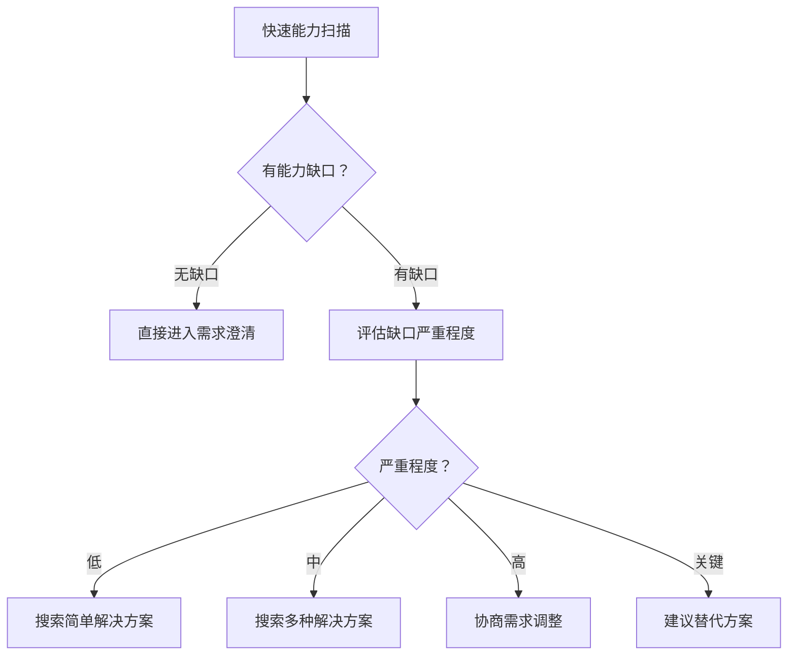
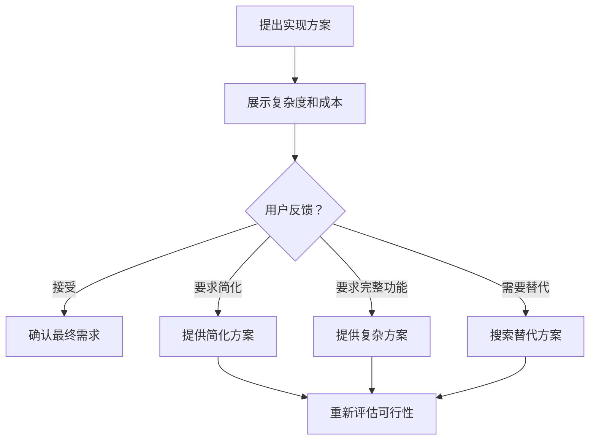
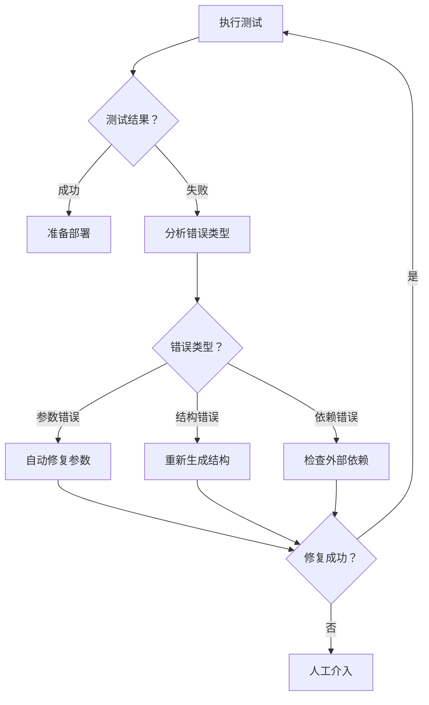
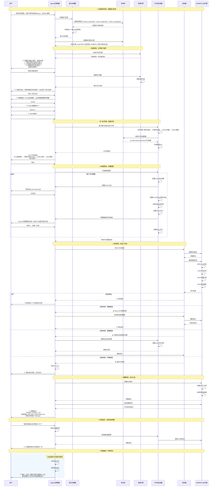

# Workflow Agent 技术架构设计

Workflow Agent 是基于 LangGraph 构建的智能工作流生成服务，将用户的描述转换为可执行的工作流, 自动调试并完成部署。

## 核心设计理念

咨询顾问式交互 + 前置能力检测 + 智能协商机制
需求捕获 → 能力边界检测 → 协商调整 → 设计实现 → 测试部署 → 持续优化

## 整体流程设计

### 阶段一：智能咨询阶段 (Consultant Phase)

> **目标：在设计之前就解决可行性问题**

1. **初始需求捕获** (Initial Requirement Capture)

   - 接收用户原始需求
   - 基础意图解析
   - 识别关键实体（邮箱、数据库、通知渠道等）

2. **快速能力扫描** (Quick Capability Scan)

   - 基于关键词快速匹配所需能力
   - 对比 WORKFLOW 原生节点能力
   - 识别潜在能力缺口
   - 相似案例匹配（从历史成功案例中学习）
   - 能力组合可行性评估

3. **潜在阻塞点识别** (Potential Blockers Identification)

   - 评估缺口严重程度（低/中/高/关键）
   - 预估解决复杂度
   - 标记高风险点
   - 成本估算（时间成本、维护成本）
   - 失败概率预测

4. **解决方案搜索** (Solution Research)
   - 为每个缺口搜索可行方案
   - 社区插件、Code 节点、API 集成
   - 评估方案复杂度和用户成本

### 阶段二：需求协商阶段 (Requirement Negotiation)

> **目标：在明确约束条件下优化需求，达成共识**

5. **约束感知的需求澄清** (Constraint-Aware Clarification)

   - 生成带有能力边界信息的澄清问题
   - 例：❌ "用什么邮箱？" ✅ "用 Gmail（原生支持）还是企业邮箱（需要额外配置）？"
   - 提供选项的优劣对比，智能推荐最佳实践

6. **权衡选择展示** (Tradeoff Presentation)

   - 展示不同选择的复杂度对比
   - 实现难度 vs 功能完整性
   - 配置时间 vs 长期维护成本

7. **引导式需求调整** (Guided Requirement Adjustment)

   - 基于技术约束引导用户调整需求
   - 提供替代方案
   - 协商功能边界

8. **实现方案确认** (Implementation Plan Confirmation)
   - 提出 2-3 个具体实现方案
   - 明确每个方案的成本和收益
   - 用户确认最终方案

### 阶段三：精准设计阶段 (Precision Design)

> **目标：基于确认的需求和方案进行设计**

9. **任务分解** (Task Decomposition)

   - 基于确认的需求分解任务
   - 每个任务都已确认有对应的实现方案
   - 任务依赖关系分析，并行化机会识别

10. **架构设计** (Architecture Design)

    - 生成工作流整体架构
    - 节点选型已确定
    - 数据流向清晰
    - 容错机制设计

11. **粗调 DSL 生成** (Rough DSL Generation)
    - 生成基础工作流结构
    - 节点和连接定义

### 阶段四：精调配置阶段 (Fine-tuning Configuration)

> **目标：完善每个节点的详细配置**

12. **逐节点配置** (Node-by-Node Configuration)
13. **参数验证** (Parameter Validation)
14. **缺失信息补充** (Missing Info Collection)

### 阶段五：测试部署阶段 (Testing & Deployment)

> **目标：确保工作流正常运行**

15. **自动化测试** (Automated Testing)
    - 测试用例自动生成
    - 边界条件测试
16. **错误修复** (Error Fixing)
    - 智能错误诊断
    - 自动修复
17. **部署上线** (Deployment)

## 🔄 核心创新：前置协商流程

### 我们的创新流程

```
用户需求 → 能力扫描 → 发现约束 → 协商调整 → 确认方案 → 精准设计
```

## 📊 节点分类与状态管理

### 主要节点类型

#### 1. 咨询类节点 (Consultant Nodes)

- **初始分析节点** - 解析用户意图
- **能力扫描节点** - 快速检测技术可行性
- **方案搜索节点** - 查找解决方案
- **协商引导节点** - 引导用户做权衡选择

#### 2. 设计类节点 (Design Nodes)

- **任务分解节点** - 将需求分解为可执行任务
- **架构设计节点** - 设计整体工作流架构
- **DSL 生成节点** - 生成 WORKFLOW 工作流代码

#### 3. 配置类节点 (Configuration Nodes)

- **节点配置节点** - 配置具体参数
- **验证检查节点** - 验证配置正确性
- **信息收集节点** - 收集缺失信息

#### 4. 执行类节点 (Execution Nodes)

- **测试执行节点** - 运行测试
- **错误分析节点** - 分析错误类型
- **修复处理节点** - 自动修复问题
- **部署节点** - 部署到工作流引擎

#### 5. 决策类节点 (Decision Nodes)

- **可行性判断** - 判断需求是否可行
- **复杂度评估** - 评估实现复杂度
- **用户确认** - 等待用户确认
- **错误类型判断** - 判断错误类型选择修复策略

## 🌊 状态流转设计

### 核心状态数据结构

```typescript
interface WorkflowState {
  // 元数据
  metadata: {
    session_id: string;
    user_id: string;
    created_at: Date;
    updated_at: Date;
    version: string;
    interaction_count: number;
  };

  // 当前阶段
  stage: WorkflowStage;

  // 咨询阶段状态
  requirement_negotiation: {
    original_requirements: string;
    parsed_intent: {
      primary_goal: string;
      secondary_goals: string[];
      constraints: string[];
      success_criteria: string[];
    };
    capability_analysis: CapabilityAnalysis;
    identified_constraints: Constraint[];
    proposed_solutions: Solution[];
    user_decisions: Decision[];
    negotiation_history: NegotiationStep[];
    final_requirements: string;
    confidence_score: number;
  };

  // 设计阶段状态
  design_state: {
    task_tree: TaskTree;
    architecture: WorkflowArchitecture;
    workflow_dsl: WorkflowDSL;
    optimization_suggestions: Optimization[];
    design_patterns_used: string[];
    estimated_performance: PerformanceEstimate;
  };

  // 配置阶段状态
  configuration_state: {
    current_node_index: number;
    node_configurations: NodeConfig[];
    missing_parameters: Parameter[];
    validation_results: ValidationResult[];
    configuration_templates: Template[];
    auto_filled_params: AutoFillRecord[];
  };

  // 执行状态
  execution_state: {
    test_results: TestResult[];
    test_coverage: TestCoverage;
    errors: ErrorRecord[];
    performance_metrics: PerformanceMetrics;
    deployment_status: DeploymentStatus;
    rollback_points: RollbackPoint[];
  };

  // 监控状态
  monitoring_state: {
    runtime_metrics: RuntimeMetrics;
    optimization_opportunities: OptimizationOpportunity[];
    alert_configurations: AlertConfig[];
    health_status: HealthStatus;
  };

  // 学习状态
  learning_state: {
    execution_patterns: Pattern[];
    failure_patterns: Pattern[];
    optimization_history: OptimizationHistory[];
    user_feedback: Feedback[];
  };
}

interface WorkflowState {
  // 当前阶段
  stage: WorkflowStage;

  // 咨询阶段状态
  requirement_negotiation: {
    original_requirements: string;
    capability_analysis: CapabilityAnalysis;
    identified_constraints: Constraint[];
    proposed_solutions: Solution[];
    user_decisions: Decision[];
    final_requirements: string;
  };

  // 设计阶段状态
  design_state: {
    task_tree: TaskTree;
    architecture: WorkflowArchitecture;
    workflow_dsl: WorkflowDSL;
    optimization_suggestions: Optimization[];
  };

  // 配置阶段状态
  configuration_state: {
    current_node_index: number;
    node_configurations: NodeConfig[];
    missing_parameters: Parameter[];
    validation_results: ValidationResult[];
  };

  // 执行状态
  execution_state: {
    test_results: TestResult[];
    errors: Error[];
    deployment_status: DeploymentStatus;
  };
}

interface CapabilityAnalysis {
  required_capabilities: string[]; // ["email_monitoring", "notion_integration"]
  available_capabilities: string[]; // WORKFLOW Engine原生支持的能力
  capability_gaps: string[]; // 缺失的能力
  gap_severity: { [gap: string]: "low" | "medium" | "high" | "critical" };
  potential_solutions: { [gap: string]: Solution[] };
  complexity_scores: { [capability: string]: number }; // 1-10复杂度评分
}

interface Solution {
  type: "native" | "code_node" | "api_integration" | "external_service";
  complexity: number; // 1-10
  setup_time: string; // "30分钟", "2-4小时"
  requires_user_action: string; // "需要API密钥", "需要代码编写"
  reliability: "low" | "medium" | "high";
  description: string;
}
```

## 🎭 核心交互场景

### 场景 1：简单需求（无能力缺口）

```
用户: "每天定时检查GitHub仓库有没有新Issues，有的话发Slack通知"
↓
快速扫描: GitHub✅ + Slack✅ + 定时触发✅ = 无缺口
节点映射: TRIGGER_CRON → EXTERNAL_GITHUB → EXTERNAL_SLACK
↓
简单澄清: "每天几点检查？" "监控哪个仓库？" "发到哪个Slack频道？"
↓
直接生成工作流:
  - TRIGGER_CRON (每日9点)
  - EXTERNAL_GITHUB (获取新Issues)
  - EXTERNAL_SLACK (发送通知)
```

### 场景 2：中等复杂需求（有原生 AI 能力支持）

```
用户: "监控多个项目的GitHub Issues，用AI分析优先级并创建报告存到Notion"
↓
快速扫描: GitHub✅ + AI分析✅ + Notion报告✅ = 无缺口
节点映射: TRIGGER_CRON → EXTERNAL_GITHUB → AI_DATA_INTEGRATOR → AI_REPORT_GENERATOR → TOOL_NOTION_MCP
↓
简单澄清: "监控哪些仓库？" "报告格式偏好？" "存到哪个Notion数据库？"
↓
直接生成工作流:
  - TRIGGER_CRON (每周一次)
  - EXTERNAL_GITHUB (获取多个仓库Issues)
  - AI_DATA_INTEGRATOR (整合Issues数据)
  - AI_REPORT_GENERATOR (生成优先级报告)
  - TOOL_NOTION_MCP (保存到Notion)
```

### 场景 3：复杂需求（需要人工协作和替代方案）

```
用户: "监控客服邮件，AI智能回复，复杂问题转人工处理"
↓
快速扫描: 邮件监控✅ + AI回复✅ + 人工转接✅ = 无技术缺口，但需要协商边界
节点映射: TRIGGER_EMAIL → AI_TASK_ANALYZER → FLOW_IF → [AI_AGENT_NODE|HUMAN_GMAIL]
↓
协商边界: "如何判断复杂程度？按关键词、情感分析还是AI信心度？"
↓
用户选择: AI信心度 < 0.7 转人工
↓
引导配置: "客服邮箱账号？" "人工处理团队邮箱？" "AI回复的语调风格？"
↓
生成智能客服工作流:
  - TRIGGER_EMAIL (监控客服邮箱)
  - AI_TASK_ANALYZER (分析邮件复杂度和意图)
  - FLOW_IF (判断AI信心度)
  - AI_AGENT_NODE (自动回复简单问题)
  - HUMAN_GMAIL (转发复杂问题给人工)
  - MEMORY_KNOWLEDGE (存储处理历史供学习)
```

### 场景 4：高复杂需求（需要妥协和替代方案）

```
用户: "微信群消息自动回复，结合企业知识库智能问答"
↓
快速扫描: 微信集成❌ + 知识库✅ = 有关键缺口
替代方案搜索: 微信 → [企业微信API, Webhook转发, 第三方服务]
↓
协商替代: "微信个人号难以直接集成，我们可以：
1. 使用企业微信API (需要企业账号)
2. 通过Webhook转发到Slack/Discord (需要中间服务)
3. 改为邮件/Slack智能问答 (完全原生支持)
您更倾向哪种？"
↓
用户选择: Slack智能问答
↓
重新设计:
  - TRIGGER_SLACK (监听@机器人消息)
  - AI_TASK_ANALYZER (理解用户问题)
  - MEMORY_VECTOR_STORE (搜索企业知识库)
  - AI_DATA_INTEGRATOR (整合搜索结果)
  - AI_AGENT_NODE (生成智能回答)
  - EXTERNAL_SLACK (回复消息)
```

### 场景 5：跨系统集成需求（需要多工具协同）

```
用户: "当Jira有新任务时，自动创建GitHub Issue，更新Notion看板，并通知团队Slack"
↓
快速扫描: Jira✅ + GitHub✅ + Notion✅ + Slack✅ = 技术可行
复杂度评估: 跨系统数据映射中等复杂度
↓
智能映射建议:
"Jira和GitHub的字段映射：
- Jira Summary → GitHub Title ✅
- Jira Description → GitHub Body (需要格式转换)
- Jira Priority → GitHub Labels (需要映射规则)
您希望如何处理优先级映射？"
↓
用户选择: "Critical→紧急, High→重要, 其他→普通"
↓
协同设计:
"检测到需要处理4个系统的认证，建议：
1. 使用OAuth2统一认证管理
2. 配置重试机制防止临时失败
3. 添加错误通知确保可靠性"
↓
生成企业级集成工作流:
  - TRIGGER_JIRA (Webhook监听新任务)
  - TRANSFORM_DATA (字段映射和格式转换)
  - EXTERNAL_GITHUB (创建Issue，带重试)
  - EXTERNAL_NOTION (更新看板状态)
  - FLOW_IF (检查是否都成功)
  - EXTERNAL_SLACK (发送格式化通知)
  - FLOW_ERROR (失败时发送告警)
```

### 场景 6：AI 驱动的内容处理

```
用户: "监控行业新闻，AI总结要点，生成周报发给管理层"
↓
快速扫描: 新闻源✅ + AI分析✅ + 报告生成✅ + 邮件发送✅
AI能力评估: 可利用多个AI节点协同工作
↓
智能方案设计:
"发现您需要高质量的行业洞察，建议采用三层AI处理：
1. AI筛选器：过滤相关新闻（相关度>0.8）
2. AI分析器：提取关键信息和趋势
3. AI报告生成器：生成专业格式周报
这样可以确保报告质量，是否采用？"
↓
用户确认: "太好了，就这样"
↓
深度配置:
"请配置AI偏好：
- 分析风格：[技术导向/商业导向/平衡型]？
- 报告长度：[精简1页/标准3页/详细5页]？
- 重点关注：[竞争对手/技术趋势/市场机会]？"
↓
生成智能分析工作流:
  - TRIGGER_CRON (每周五下午)
  - TOOL_HTTP (抓取多个新闻源)
  - AI_TASK_ANALYZER (相关性筛选，阈值0.8)
  - MEMORY_VECTOR_STORE (存储和去重)
  - AI_DATA_INTEGRATOR (整合多源信息)
  - AI_REPORT_GENERATOR (生成结构化周报)
  - TRANSFORM_DATA (转换为邮件格式)
  - EXTERNAL_GMAIL (发送给管理层)
  - MEMORY_KNOWLEDGE (存档供后续学习)
```

## 🔀 节点流转逻辑

### 关键决策点设计

#### 决策点 1：能力缺口严重程度



#### 决策点 2：用户协商反馈



#### 决策点 3：测试错误处理



## 🎯 关键创新点

### 1. **预防式设计**

- 在设计阶段之前就发现和解决问题
- 避免后期返工和用户失望

### 2. **透明的复杂度管理**

- 用户明确知道每个选择的成本
- 基于约束的理性决策

### 3. **渐进式引导**

- 从简单选择开始，逐步细化
- 每一步都有明确的技术背景

### 4. **智能协商机制**

- 不是简单的"能做"或"不能做"
- 提供"怎么做"和"替代方案"

### 5. **上下文感知的交互**

- 问题带有技术背景信息
- 帮助用户理解选择的影响

## 📈 实现优先级

### Phase 1: 核心咨询流程

- 能力扫描引擎
- 基础协商机制
- 简单工作流生成

### Phase 2: 智能解决方案搜索

- 社区方案集成
- 复杂度自动评估
- 多方案对比

### Phase 3: 高级测试和修复

- 自动化测试框架
- 智能错误修复
- 部署验证

这个设计的核心思想是**让 AI 成为真正的咨询顾问**，而不仅仅是一个代码生成器。通过前置的能力检测和协商，我们可以大大提高最终工作流的成功率和用户满意度。

## 节点流转图

```mermaid
graph TD
    %% 监听阶段
    START([用户输入]) --> LISTEN[🎧 监听节点]
    LISTEN --> CAPTURE[📋 需求捕获]

    %% 咨询顾问阶段 - 前置能力检测
    CAPTURE --> SCAN[⚡ 快速能力扫描]
    SCAN --> CHECK_GAPS{有能力缺口？}

    %% 无缺口路径
    CHECK_GAPS -->|无缺口| SIMPLE_CLARIFY[❓ 简单澄清]
    SIMPLE_CLARIFY --> EXTRACT_TASKS[🌳 提取任务]

    %% 有缺口路径
    CHECK_GAPS -->|有缺口| ASSESS_SEVERITY[🚧 评估严重程度]
    ASSESS_SEVERITY --> SEVERITY_CHECK{严重程度？}

    %% 不同严重程度的处理
    SEVERITY_CHECK -->|低| SEARCH_SIMPLE[🔍 搜索简单方案]
    SEVERITY_CHECK -->|中| SEARCH_MULTIPLE[🔍 搜索多种方案]
    SEVERITY_CHECK -->|高| NEGOTIATE_REQ[🤝 协商需求调整]
    SEVERITY_CHECK -->|关键| SUGGEST_ALT[💡 建议替代方案]

    %% 方案搜索和协商
    SEARCH_SIMPLE --> PRESENT_OPTIONS[📋 展示实现选项]
    SEARCH_MULTIPLE --> PRESENT_OPTIONS
    NEGOTIATE_REQ --> ADJUST_REQ[📝 引导需求调整]
    SUGGEST_ALT --> ADJUST_REQ

    ADJUST_REQ --> VALIDATE_ADJ{调整可行？}
    VALIDATE_ADJ -->|是| PRESENT_OPTIONS
    VALIDATE_ADJ -->|否| ESCALATE[🆘 人工介入]

    %% 用户选择和确认
    PRESENT_OPTIONS --> USER_CHOICE{用户选择？}
    USER_CHOICE -->|接受方案| CONFIRM_REQ[✅ 确认最终需求]
    USER_CHOICE -->|要求简化| SIMPLIFY[📉 简化方案]
    USER_CHOICE -->|要求完整| COMPLEX[📈 复杂方案]
    USER_CHOICE -->|需要替代| SEARCH_ALT[🔄 搜索替代]

    SIMPLIFY --> VALIDATE_ADJ
    COMPLEX --> VALIDATE_ADJ
    SEARCH_ALT --> VALIDATE_ADJ

    %% 详细澄清阶段
    CONFIRM_REQ --> GUIDED_CLARIFY[❓ 引导式澄清]
    GUIDED_CLARIFY --> MORE_QUESTIONS{还有问题？}
    MORE_QUESTIONS -->|是| ASK_NEXT[❓ 下一个问题]
    ASK_NEXT --> WAIT_RESPONSE[⏳ 等待用户回答]
    WAIT_RESPONSE --> VALIDATE_RESPONSE[✅ 验证回答]
    VALIDATE_RESPONSE --> UPDATE_CONTEXT[📝 更新上下文]
    UPDATE_CONTEXT --> MORE_QUESTIONS

    %% 进入设计阶段
    MORE_QUESTIONS -->|否| EXTRACT_TASKS

    %% 任务分解和设计阶段
    EXTRACT_TASKS --> MAP_CAPABILITIES[🗺️ 映射任务到能力]
    MAP_CAPABILITIES --> CREATE_PLAN[📋 创建实现计划]
    CREATE_PLAN --> VALIDATE_PLAN{计划可行？}
    VALIDATE_PLAN -->|否| ADJUST_PLAN[🔧 调整计划]
    ADJUST_PLAN --> CREATE_PLAN
    VALIDATE_PLAN -->|是| GEN_ARCHITECTURE[🏗️ 生成架构]

    %% 工作流架构设计
    GEN_ARCHITECTURE --> DESIGN_NODES[📦 设计节点结构]
    DESIGN_NODES --> DEFINE_FLOW[🔗 定义数据流]
    DEFINE_FLOW --> CREATE_DSL[📄 创建粗调DSL]
    CREATE_DSL --> REVIEW_STRUCTURE[👀 用户审查结构]

    REVIEW_STRUCTURE --> STRUCTURE_OK{结构确认？}
    STRUCTURE_OK -->|否| ADJUST_STRUCTURE[🔧 调整结构]
    ADJUST_STRUCTURE --> DESIGN_NODES
    STRUCTURE_OK -->|是| START_CONFIG[⚙️ 开始节点配置]

    %% 精调配置阶段
    START_CONFIG --> SELECT_NODE[🎯 选择当前节点]
    SELECT_NODE --> CONFIG_PARAMS[⚙️ 配置参数]
    CONFIG_PARAMS --> VALIDATE_CONFIG{配置有效？}
    VALIDATE_CONFIG -->|否| REQUEST_INFO[❓ 请求缺失信息]
    REQUEST_INFO --> WAIT_INFO[⏳ 等待用户提供]
    WAIT_INFO --> UPDATE_CONFIG[📝 更新配置]
    UPDATE_CONFIG --> VALIDATE_CONFIG

    VALIDATE_CONFIG -->|是| MORE_NODES{还有节点？}
    MORE_NODES -->|是| NEXT_NODE[➡️ 下一个节点]
    NEXT_NODE --> SELECT_NODE
    MORE_NODES -->|否| PREP_TEST[🧪 准备测试]

    %% 测试阶段
    PREP_TEST --> EXEC_TEST[🧪 执行测试]
    EXEC_TEST --> ANALYZE_RESULTS[📊 分析结果]
    ANALYZE_RESULTS --> TEST_SUCCESS{测试成功？}

    %% 测试失败处理
    TEST_SUCCESS -->|否| ERROR_TYPE{错误类型？}
    ERROR_TYPE -->|参数错误| FIX_PARAMS[🔧 修复参数]
    ERROR_TYPE -->|结构错误| FIX_STRUCTURE[🏗️ 修复结构]
    ERROR_TYPE -->|依赖错误| CHECK_DEPS[🔍 检查依赖]

    FIX_PARAMS --> RETRY_COUNT{重试次数？}
    FIX_STRUCTURE --> RETRY_COUNT
    CHECK_DEPS --> RETRY_COUNT

    RETRY_COUNT -->|<3次| EXEC_TEST
    RETRY_COUNT -->|≥3次| MANUAL_DEBUG[🛠️ 人工调试]

    %% 测试成功路径
    TEST_SUCCESS -->|是| PREP_DEPLOY[🚀 准备部署]
    PREP_DEPLOY --> DEPLOY[🚀 部署到工作流引擎]
    DEPLOY --> VERIFY_DEPLOY[✅ 验证部署]
    VERIFY_DEPLOY --> DEPLOY_SUCCESS{部署成功？}

    DEPLOY_SUCCESS -->|是| NOTIFY_SUCCESS[🎉 通知成功]
    DEPLOY_SUCCESS -->|否| ROLLBACK[🔄 回滚]
    ROLLBACK --> MANUAL_DEBUG

    %% 结束状态
    NOTIFY_SUCCESS --> RETURN_LISTEN[🔄 返回监听]
    RETURN_LISTEN --> LISTEN

    %% 异常处理
    ESCALATE --> MANUAL_REVIEW[👨‍💻 人工审查]
    MANUAL_DEBUG --> MANUAL_REVIEW
    MANUAL_REVIEW --> NOTIFY_LIMITATION[⚠️ 通知限制]
    NOTIFY_LIMITATION --> RETURN_LISTEN

    %% 样式定义
    classDef consultantPhase fill:#e1f5fe
    classDef designPhase fill:#f3e5f5
    classDef configPhase fill:#e8f5e8
    classDef testPhase fill:#fff3e0
    classDef deployPhase fill:#fce4ec
    classDef errorPhase fill:#ffebee
    classDef decisionNode fill:#f0f4c3

    %% 应用样式
    class CAPTURE,SCAN,ASSESS_SEVERITY,SEARCH_SIMPLE,SEARCH_MULTIPLE,NEGOTIATE_REQ,SUGGEST_ALT,PRESENT_OPTIONS,ADJUST_REQ,CONFIRM_REQ,GUIDED_CLARIFY,ASK_NEXT,WAIT_RESPONSE,VALIDATE_RESPONSE,UPDATE_CONTEXT consultantPhase

    class EXTRACT_TASKS,MAP_CAPABILITIES,CREATE_PLAN,GEN_ARCHITECTURE,DESIGN_NODES,DEFINE_FLOW,CREATE_DSL,REVIEW_STRUCTURE,ADJUST_STRUCTURE designPhase

    class START_CONFIG,SELECT_NODE,CONFIG_PARAMS,REQUEST_INFO,WAIT_INFO,UPDATE_CONFIG,NEXT_NODE configPhase

    class PREP_TEST,EXEC_TEST,ANALYZE_RESULTS,FIX_PARAMS,FIX_STRUCTURE,CHECK_DEPS testPhase

    class PREP_DEPLOY,DEPLOY,VERIFY_DEPLOY,NOTIFY_SUCCESS,RETURN_LISTEN deployPhase

    class ESCALATE,MANUAL_DEBUG,MANUAL_REVIEW,NOTIFY_LIMITATION,ROLLBACK errorPhase

    class CHECK_GAPS,SEVERITY_CHECK,VALIDATE_ADJ,USER_CHOICE,MORE_QUESTIONS,VALIDATE_PLAN,STRUCTURE_OK,VALIDATE_CONFIG,MORE_NODES,TEST_SUCCESS,ERROR_TYPE,RETRY_COUNT,DEPLOY_SUCCESS decisionNode

```



## 详细交互流程



## 状态数据流 流转过程

```mermaid
graph TD
    %% 主要数据流 - 垂直布局
    INPUT_DATA["📥 用户输入阶段<br/>• raw_requirements: string<br/>• user_context: object<br/>• conversation_history: array"]

    INPUT_DATA --> CAPABILITY_DATA["🔍 能力分析阶段<br/>• required_capabilities: array<br/>• available_capabilities: array<br/>• capability_gaps: array<br/>• gap_severity: object<br/>• potential_solutions: object<br/>• complexity_scores: object"]

    CAPABILITY_DATA --> NEGOTIATION_DATA["🤝 协商阶段数据<br/>• identified_constraints: array<br/>• proposed_adjustments: array<br/>• user_decisions: object<br/>• agreed_tradeoffs: array<br/>• guided_questions: array<br/>• user_responses: object"]

    NEGOTIATION_DATA --> CONFIRMED_DATA["✅ 确认需求数据<br/>• final_requirements: string<br/>• implementation_option: object<br/>• technical_constraints: array<br/>• user_preferences: object<br/>• feasibility_confirmed: boolean"]

    CONFIRMED_DATA --> DESIGN_DATA["🏗️ 设计阶段数据<br/>• task_tree: object<br/>• workflow_architecture: object<br/>• node_mappings: array<br/>• data_flow_definition: object<br/>• rough_dsl: object"]

    DESIGN_DATA --> CONFIG_DATA["⚙️ 配置阶段数据<br/>• workflow_nodes: array<br/>• node_configurations: object<br/>• parameter_mappings: object<br/>• authentication_configs: object<br/>• validation_results: object"]

    CONFIG_DATA --> TEST_DATA["🧪 测试阶段数据<br/>• test_environment: object<br/>• execution_results: array<br/>• error_analysis: object<br/>• performance_metrics: object<br/>• retry_history: array"]

    TEST_DATA --> DEPLOY_DATA["🚀 部署阶段数据<br/>• deployment_config: object<br/>• workflow_id: string<br/>• deployment_status: string<br/>• monitoring_urls: array<br/>• success_metrics: object"]

    %% 反馈回路 - 垂直排列
    NEGOTIATION_DATA -.->|需求调整反馈| FEEDBACK_1["🔄 反馈点1<br/>协商过程中发现需求需要调整<br/>触发重新能力分析"]
    FEEDBACK_1 -.-> CAPABILITY_DATA

    DESIGN_DATA -.->|设计调整反馈| FEEDBACK_2["🔄 反馈点2<br/>设计过程中发现需求理解有误<br/>触发重新确认需求"]
    FEEDBACK_2 -.-> CONFIRMED_DATA

    TEST_DATA -.->|配置错误反馈| FEEDBACK_3["🔄 反馈点3<br/>测试失败，参数配置问题<br/>触发重新配置"]
    FEEDBACK_3 -.-> CONFIG_DATA

    TEST_DATA -.->|结构错误反馈| FEEDBACK_4["🔄 反馈点4<br/>测试失败，工作流结构问题<br/>触发重新设计"]
    FEEDBACK_4 -.-> DESIGN_DATA

    %% 状态转换详细示例 - 垂直展开
    DEPLOY_DATA --> STATE_EVOLUTION["🔄 状态演化完整示例"]

    STATE_EVOLUTION --> STEP_1["第1步：输入阶段<br/>用户输入: 每天检查邮件,有客户邮件存Notion<br/>解析结果: 邮件监控 + 客户识别 + 数据存储需求"]

    STEP_1 --> STEP_2["第2步：能力分析<br/>required: [email_monitoring, notion_integration, customer_detection]<br/>available: [email_monitoring, notion_integration]<br/>gaps: [customer_detection] (严重程度: medium)"]

    STEP_2 --> STEP_3["第3步：协商过程<br/>提供解决方案: [关键词过滤, 正则匹配, AI分析]<br/>用户选择: keyword_filtering<br/>用户提供: keywords: [客户, 订单, 合作]"]

    STEP_3 --> STEP_4["第4步：需求确认<br/>最终需求: Gmail定时检查 → 关键词过滤 → Notion存储<br/>实现方案: 使用Code节点进行关键词过滤<br/>技术约束: 需要Gmail OAuth + Notion API密钥"]

    STEP_4 --> STEP_5["第5步：设计阶段<br/>工作流架构: [Gmail Trigger] → [Code Filter] → [Notion Create]<br/>数据流: email_data → filtered_data → notion_record<br/>节点依赖: 线性执行，无并行分支"]

    STEP_5 --> STEP_6["第6步：配置阶段<br/>Gmail配置: OAuth已认证，轮询间隔3600秒<br/>Code配置: 关键词过滤逻辑已实现<br/>Notion配置: 数据库映射完成，字段验证通过"]

    STEP_6 --> STEP_7["第7步：测试阶段<br/>执行测试: 4个节点全部成功<br/>性能指标: 平均响应时间800ms<br/>错误检查: 无critical错误，1个warning"]

    STEP_7 --> STEP_8["第8步：部署成功<br/>工作流ID: wf_12345<br/>部署状态: active<br/>监控地址: http://n8n.com/workflow/12345"]

    %% 关键数据结构详解 - 垂直展开
    STEP_8 --> STRUCTURE_SECTION["📊 关键数据结构详解"]

    STRUCTURE_SECTION --> CAPABILITY_STRUCTURE["CapabilityAnalysis 数据结构<br/>required_capabilities: [email_monitoring, data_filtering, notion_integration]<br/>capability_gaps: [customer_detection]<br/>gap_severity: {customer_detection: medium}<br/>potential_solutions: {customer_detection: [keyword_filter, ai_analysis]}<br/>complexity_scores: {keyword_filter: 3, ai_analysis: 7}"]

    CAPABILITY_STRUCTURE --> WORKFLOW_STRUCTURE["WorkflowDSL 数据结构<br/>nodes: [gmail_trigger, customer_filter, notion_create]<br/>connections: [gmail_trigger → customer_filter → notion_create]<br/>parameters: 完整的节点参数配置<br/>authentication: OAuth2 + API密钥配置<br/>position: 节点位置信息"]

    WORKFLOW_STRUCTURE --> TEST_STRUCTURE["TestResult 数据结构<br/>execution_id: test_123<br/>success: true<br/>nodes_executed: 3/3<br/>execution_time: 1.2秒<br/>performance_metrics: {avg_response_time: 800ms}<br/>test_data: {input_emails: 5, filtered_emails: 2}"]

    %% 数据验证检查点 - 垂直展开
    TEST_STRUCTURE --> VALIDATION_SECTION["✅ 数据验证检查点"]

    VALIDATION_SECTION --> VALIDATION_1["🔍 能力分析验证<br/>✓ 所有required_capabilities都有对应解决方案<br/>✓ gap_severity评估合理 (1-10范围)<br/>✓ complexity_scores在可接受范围<br/>✓ potential_solutions至少提供2个选项"]

    VALIDATION_1 --> VALIDATION_2["🤝 协商结果验证<br/>✓ user_decisions覆盖所有critical和high级别gaps<br/>✓ agreed_tradeoffs明确记录用户妥协点<br/>✓ final_requirements技术上可行<br/>✓ guided_questions得到完整回答"]

    VALIDATION_2 --> VALIDATION_3["🏗️ 设计方案验证<br/>✓ task_tree中所有tasks都有对应的workflow_nodes<br/>✓ data_flow_definition无循环依赖<br/>✓ node_mappings完整且类型匹配<br/>✓ workflow_architecture符合n8n规范"]

    VALIDATION_3 --> VALIDATION_4["⚙️ 配置完整性验证<br/>✓ 所有required parameters已正确配置<br/>✓ authentication_configs包含有效认证信息<br/>✓ parameter_mappings数据类型匹配<br/>✓ validation_results显示全部通过"]

    VALIDATION_4 --> VALIDATION_5["🧪 测试结果验证<br/>✓ execution_results显示所有节点成功执行<br/>✓ performance_metrics在可接受范围内<br/>✓ error_analysis显示无critical错误<br/>✓ 实际输出与预期输出匹配"]

    VALIDATION_5 --> VALIDATION_6["🚀 部署状态验证<br/>✓ deployment_config包含完整配置<br/>✓ workflow_id已生成且有效<br/>✓ deployment_status为active<br/>✓ monitoring_urls可正常访问"]

    %% 持续监控和优化
    VALIDATION_6 --> MONITORING["📊 持续监控<br/>实时监控工作流执行状态<br/>性能指标收集和分析<br/>错误日志记录和告警"]

    MONITORING --> OPTIMIZATION["🔧 持续优化<br/>基于执行数据优化参数<br/>识别性能瓶颈并改进<br/>用户反馈收集和处理"]

    OPTIMIZATION --> FEEDBACK_LOOP["🔄 反馈循环<br/>将优化建议反馈给用户<br/>支持工作流的迭代改进<br/>学习用户使用模式"]

    %% 样式定义
    classDef inputStyle fill:#e3f2fd,stroke:#1976d2,stroke-width:2px
    classDef processStyle fill:#f3e5f5,stroke:#7b1fa2,stroke-width:2px
    classDef outputStyle fill:#e8f5e8,stroke:#388e3c,stroke-width:2px
    classDef structureStyle fill:#fff3e0,stroke:#f57c00,stroke-width:2px
    classDef validationStyle fill:#fce4ec,stroke:#c2185b,stroke-width:2px
    classDef feedbackStyle fill:#f1f8e9,stroke:#558b2f,stroke-width:2px
    classDef evolutionStyle fill:#e8eaf6,stroke:#3f51b5,stroke-width:2px
    classDef monitoringStyle fill:#e0f2f1,stroke:#00695c,stroke-width:2px

    %% 应用样式
    class INPUT_DATA inputStyle
    class CAPABILITY_DATA,NEGOTIATION_DATA,DESIGN_DATA,CONFIG_DATA,TEST_DATA processStyle
    class CONFIRMED_DATA,DEPLOY_DATA outputStyle
    class CAPABILITY_STRUCTURE,WORKFLOW_STRUCTURE,TEST_STRUCTURE,STRUCTURE_SECTION structureStyle
    class VALIDATION_SECTION,VALIDATION_1,VALIDATION_2,VALIDATION_3,VALIDATION_4,VALIDATION_5,VALIDATION_6 validationStyle
    class FEEDBACK_1,FEEDBACK_2,FEEDBACK_3,FEEDBACK_4,FEEDBACK_LOOP feedbackStyle
    class STATE_EVOLUTION,STEP_1,STEP_2,STEP_3,STEP_4,STEP_5,STEP_6,STEP_7,STEP_8 evolutionStyle
    class MONITORING,OPTIMIZATION monitoringStyle

```


