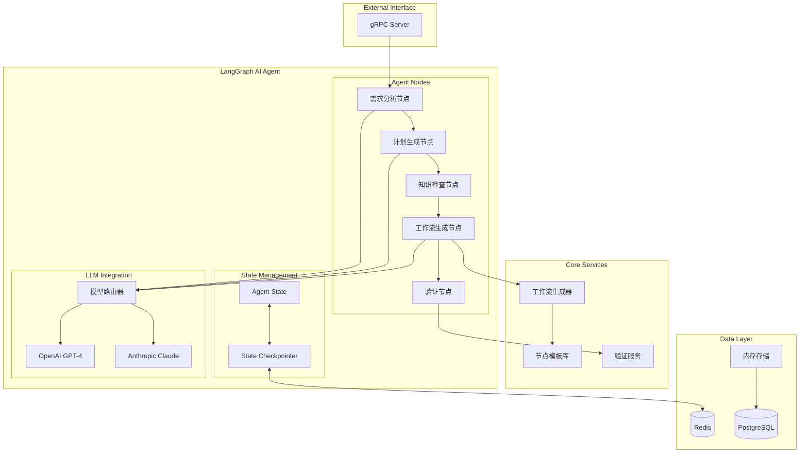

# Workflow Agent 技术架构设计

## 概述

Workflow Agent 是基于 LangGraph 构建的智能工作流生成服务，通过自然语言理解技术，将用户的描述转换为可执行的工作流配置。采用 gRPC 协议提供高性能的内部服务接口。

## 架构图



## LangGraph 架构详解

### 1. Agent 状态管理

**文件位置**: `apps/backend/workflow_agent/agents/state.py`

**状态结构**:
```python
class AgentState(TypedDict):
    # 用户输入和上下文
    user_input: str
    description: str
    context: Dict[str, Any]
    user_preferences: Dict[str, Any]

    # 分析结果
    requirements: Dict[str, Any]
    parsed_intent: Dict[str, Any]
    current_plan: Optional[Dict[str, Any]]

    # 信息收集
    collected_info: Dict[str, Any]
    missing_info: List[str]

    # 工作流生成
    workflow: Optional[Dict[str, Any]]
    workflow_suggestions: List[str]
    workflow_errors: List[str]

    # 流程控制
    current_step: str
    iteration_count: int
    should_continue: bool
```

### 2. 节点执行流程

**文件位置**: `apps/backend/workflow_agent/agents/nodes.py`

#### 需求分析节点
```python
async def analyze_requirement(self, state: AgentState) -> AgentState:
    """分析用户需求并提取关键信息"""
    system_prompt = """你是工作流程分析专家。分析用户描述，提取：
    1. 触发条件（何时执行）
    2. 主要操作（做什么）
    3. 数据流（数据传递）
    4. 集成需求（外部服务）
    5. 人工干预点（确认点）"""

    # 调用 LLM 进行分析
    response = await self.llm.ainvoke([
        SystemMessage(content=system_prompt),
        HumanMessage(content=f"用户描述：{state['description']}")
    ])

    # 解析结果并更新状态
    analysis = json.loads(response.content)
    state["requirements"] = analysis
    state["current_step"] = "plan_generation"

    return state
```

#### 计划生成节点
```python
async def generate_plan(self, state: AgentState) -> AgentState:
    """生成详细的工作流执行计划"""
    requirements = state.get("requirements", {})

    plan = {
        "nodes": [
            {"type": "trigger", "subtype": "manual", "name": "Start"},
            {"type": "action", "subtype": "data_processing", "name": "Process"},
            {"type": "external_action", "subtype": "notification", "name": "Notify"}
        ],
        "connections": [
            {"from": "Start", "to": "Process"},
            {"from": "Process", "to": "Notify"}
        ],
        "error_handling": "stop_on_error"
    }

    state["current_plan"] = plan
    state["current_step"] = "check_knowledge"

    return state
```

### 3. 图执行配置

**文件位置**: `apps/backend/workflow_agent/agents/workflow_agent.py`

```python
def _setup_graph(self):
    """设置 LangGraph 工作流"""
    workflow = StateGraph(AgentState)

    # 添加节点
    workflow.add_node("analyze_requirement", self.nodes.analyze_requirement)
    workflow.add_node("generate_plan", self.nodes.generate_plan)
    workflow.add_node("check_knowledge", self.nodes.check_knowledge)
    workflow.add_node("generate_workflow", self.nodes.generate_workflow)
    workflow.add_node("validate_workflow", self.nodes.validate_workflow)

    # 设置入口点
    workflow.set_entry_point("analyze_requirement")

    # 添加边
    workflow.add_edge("analyze_requirement", "generate_plan")
    workflow.add_edge("generate_plan", "check_knowledge")

    # 条件边
    workflow.add_conditional_edges(
        "check_knowledge",
        self.nodes.should_continue,
        {
            "ask_questions": END,
            "generate_workflow": "generate_workflow",
            "complete": END
        }
    )

    # 编译图
    self.graph = workflow.compile(checkpointer=self.checkpointer)
```

## 核心组件设计

### 1. 节点模板系统

**节点类型定义**:
```python
class NodeType(str, Enum):
    TRIGGER_NODE = "trigger"           # 触发器节点
    AI_AGENT_NODE = "ai_agent"         # AI代理节点
    EXTERNAL_ACTION_NODE = "external_action"  # 外部动作节点
    ACTION_NODE = "action"             # 动作节点
    FLOW_NODE = "flow"                 # 流程控制节点
    HUMAN_IN_THE_LOOP_NODE = "human_in_the_loop"  # 人机交互节点
    TOOL_NODE = "tool"                 # 工具节点
    MEMORY_NODE = "memory"             # 记忆节点
```

**节点模板库**:
```python
def _load_node_templates(self) -> Dict[str, Any]:
    return {
        "trigger": {
            "slack_trigger": {
                "parameters": {
                    "channel": "#general",
                    "triggerPhrase": "",
                    "autoReply": True
                }
            },
            "cron_trigger": {
                "parameters": {
                    "cron_expression": "0 9 * * MON",
                    "timezone": "UTC"
                }
            }
        },
        "ai_agent": {
            "router_agent": {
                "parameters": {
                    "agent_type": "router",
                    "model_provider": "openai",
                    "model_name": "gpt-4"
                }
            }
        }
    }
```

### 2. 工作流生成引擎

**生成流程**:
```python
async def generate_workflow(self, state: AgentState) -> AgentState:
    """生成完整的工作流 JSON"""
    plan = state.get("current_plan", {})

    # 生成工作流 ID 和元数据
    workflow_id = f"workflow-{uuid.uuid4().hex[:8]}"
    current_time = int(time.time())

    # 生成节点
    nodes = []
    for i, node_def in enumerate(plan.get("nodes", [])):
        node = Node(
            id=f"node-{i+1}",
            name=node_def.get("name", f"Node {i+1}"),
            type=NodeType(node_def.get("type", "action")),
            position=Position(x=100 + i*200, y=100),
            parameters=self._get_node_parameters(node_def, context)
        )
        nodes.append(node)

    # 生成连接
    connections = self._generate_connections(plan, nodes)

    # 创建完整工作流
    workflow = Workflow(
        id=workflow_id,
        name=f"Generated Workflow - {state['description'][:50]}",
        nodes=nodes,
        connections=connections,
        created_at=current_time,
        updated_at=current_time
    )

    state["workflow"] = workflow.model_dump()
    return state
```

### 3. 模型集成策略

**多模型支持**:
```python
def _setup_llm(self):
    """根据配置设置语言模型"""
    if settings.DEFAULT_MODEL_PROVIDER == "openai":
        return ChatOpenAI(
            model=settings.DEFAULT_MODEL_NAME,
            api_key=settings.OPENAI_API_KEY,
            temperature=0.1
        )
    elif settings.DEFAULT_MODEL_PROVIDER == "anthropic":
        return ChatAnthropic(
            model=settings.DEFAULT_MODEL_NAME,
            api_key=settings.ANTHROPIC_API_KEY,
            temperature=0.1
        )
```

## gRPC 服务接口

### 1. 服务定义

**Protobuf 定义**:
```protobuf
service WorkflowAgent {
  rpc GenerateWorkflow(WorkflowGenerationRequest) returns (WorkflowGenerationResponse);
  rpc RefineWorkflow(WorkflowRefinementRequest) returns (WorkflowRefinementResponse);
  rpc ValidateWorkflow(WorkflowValidationRequest) returns (WorkflowValidationResponse);
}
```

### 2. 服务实现

**文件位置**: `apps/backend/workflow_agent/services/grpc_server.py`

```python
class WorkflowAgentServicer(workflow_agent_pb2_grpc.WorkflowAgentServicer):
    def __init__(self):
        self.workflow_agent = WorkflowAgent()

    async def GenerateWorkflow(self, request, context):
        """生成工作流从自然语言描述"""
        try:
            result = await self.workflow_agent.generate_workflow(
                description=request.description,
                context=dict(request.context),
                user_preferences=dict(request.user_preferences)
            )

            # 转换为 protobuf 响应
            workflow_data = self._dict_to_workflow_data(result["workflow"])

            return workflow_agent_pb2.WorkflowGenerationResponse(
                success=result["success"],
                workflow=workflow_data,
                suggestions=result["suggestions"],
                missing_info=result["missing_info"],
                errors=result["errors"]
            )
        except Exception as e:
            context.set_code(grpc.StatusCode.INTERNAL)
            context.set_details(f"Failed to generate workflow: {str(e)}")
            return workflow_agent_pb2.WorkflowGenerationResponse(
                success=False,
                errors=[f"Internal error: {str(e)}"]
            )
```

## 状态持久化设计

### 1. Redis Checkpointer

```python
def _setup_checkpointer(self):
    """设置状态检查点存储"""
    if settings.LANGGRAPH_CHECKPOINT_BACKEND == "redis":
        try:
            redis_client = RedisAsyncClient.from_url(settings.REDIS_URL)
            self.checkpointer = RedisSaver(redis_client)
        except Exception as e:
            logger.warning("Redis 连接失败，使用内存存储", error=str(e))
            self.checkpointer = MemorySaver()
    else:
        self.checkpointer = MemorySaver()
```

### 2. 会话管理

```python
async def generate_workflow(
    self,
    description: str,
    context: Dict[str, Any] = None,
    thread_id: str = None
) -> Dict[str, Any]:
    """生成工作流，支持会话恢复"""
    config = {"configurable": {"thread_id": thread_id or "default"}}
    final_state = await self.graph.ainvoke(initial_state, config=config)
    return final_state
```

## 性能优化策略

### 1. 并发处理

```python
async def start(self):
    """启动 gRPC 服务器"""
    self.server = grpc.aio.server(
        futures.ThreadPoolExecutor(max_workers=settings.MAX_WORKERS)
    )

    # 添加服务
    workflow_agent_pb2_grpc.add_WorkflowAgentServicer_to_server(
        self.servicer, self.server
    )
```

### 2. 缓存策略

- **模板缓存**: 预加载节点模板，减少重复计算
- **模型响应缓存**: 缓存相似请求的 LLM 响应
- **状态快照**: 定期保存状态快照，支持快速恢复

### 3. 资源管理

```python
# 内存管理
state["iteration_count"] = iteration_count + 1
if iteration_count >= settings.MAX_ITERATIONS:
    state["current_step"] = "complete"

# 超时控制
timeout = settings.DEFAULT_TIMEOUT
async with asyncio.timeout(timeout):
    result = await self.llm.ainvoke(messages)
```

## 错误处理和恢复

### 1. 分层错误处理

```python
try:
    # LLM 调用
    response = await self.llm.ainvoke(messages)
except Exception as e:
    logger.error("LLM 调用失败", error=str(e))
    state["workflow_errors"].append(f"AI 模型调用失败: {str(e)}")
    state["current_step"] = "error"
    return state
```

### 2. 状态回滚机制

```python
def should_continue(self, state: AgentState) -> str:
    """确定下一步执行"""
    if state.get("workflow_errors"):
        return "error_recovery"

    iteration_count = state.get("iteration_count", 0)
    if iteration_count >= state.get("max_iterations", 10):
        return "complete"

    return state.get("current_step", "analyze_requirement")
```

## 扩展性设计

### 1. 插件化节点系统

```python
class NodePlugin:
    """节点插件基类"""

    def get_template(self) -> Dict[str, Any]:
        """返回节点模板"""
        raise NotImplementedError

    def validate_parameters(self, params: Dict[str, Any]) -> List[str]:
        """验证节点参数"""
        raise NotImplementedError

# 注册插件
node_registry.register("custom_node", CustomNodePlugin())
```

### 2. 多模型支持

```python
class ModelProvider:
    """模型提供商基类"""

    async def generate(self, messages: List[Message]) -> str:
        raise NotImplementedError

# 支持新的模型提供商
model_registry.register("custom_llm", CustomModelProvider())
```

### 3. 动态配置

```python
# 运行时配置更新
async def update_config(self, new_config: Dict[str, Any]):
    """动态更新配置"""
    for key, value in new_config.items():
        if hasattr(settings, key):
            setattr(settings, key, value)

    # 重新初始化相关组件
    await self._reinitialize_components()
```

## 监控和调试

### 1. 执行跟踪

```python
# 节点执行日志
logger.info("Node execution started",
           node_name="analyze_requirement",
           state_id=state.get("id"),
           iteration=state.get("iteration_count"))
```

### 2. 性能指标

- **执行时间**: 每个节点的执行耗时
- **模型调用次数**: LLM API 调用统计
- **成功率**: 工作流生成成功率
- **内存使用**: 状态对象内存占用

### 3. 调试工具

```python
# 状态检查器
def debug_state(self, state: AgentState) -> Dict[str, Any]:
    """调试状态信息"""
    return {
        "current_step": state.get("current_step"),
        "iteration_count": state.get("iteration_count"),
        "errors": state.get("workflow_errors", []),
        "workflow_size": len(state.get("workflow", {}).get("nodes", []))
    }
```

## 最佳实践

### 1. 提示工程

```python
SYSTEM_PROMPTS = {
    "requirement_analysis": """
    你是专业的工作流分析师。请分析用户需求并提取：
    1. 业务目标和预期结果
    2. 触发条件和执行时机
    3. 所需的外部集成服务
    4. 数据处理和转换需求
    5. 人工干预和决策点

    请以 JSON 格式返回分析结果。
    """,

    "workflow_generation": """
    基于需求分析，生成详细的工作流配置。
    确保：
    - 节点类型选择合适
    - 连接关系正确
    - 参数配置完整
    - 错误处理覆盖
    """
}
```

### 2. 测试策略

```python
@pytest.mark.asyncio
async def test_workflow_generation():
    """测试工作流生成"""
    agent = WorkflowAgent()

    result = await agent.generate_workflow(
        description="创建定时发送报告的工作流",
        context={"email": "test@example.com"}
    )

    assert result["success"] is True
    assert len(result["workflow"]["nodes"]) > 0
    assert "cron" in str(result["workflow"]).lower()
```

### 3. 部署配置

```python
# 生产环境优化
PRODUCTION_SETTINGS = {
    "MAX_WORKERS": 20,
    "DEFAULT_TIMEOUT": 60,
    "MAX_ITERATIONS": 5,
    "REDIS_POOL_SIZE": 50,
    "LOG_LEVEL": "INFO"
}
```

## 故障排除指南

### 常见问题

1. **LLM 调用超时**
   - 检查 API 密钥配置
   - 调整超时设置
   - 启用重试机制

2. **Redis 连接失败**
   - 验证 Redis 服务状态
   - 检查网络连接
   - 降级到内存存储

3. **状态恢复失败**
   - 检查 checkpointer 配置
   - 验证序列化兼容性
   - 清理损坏的状态数据

### 调试技巧

```python
# 启用详细日志
logger.setLevel("DEBUG")

# 状态快照
async def save_debug_snapshot(state: AgentState):
    """保存调试快照"""
    snapshot = {
        "timestamp": time.time(),
        "state": state,
        "memory_usage": psutil.Process().memory_info().rss
    }
    with open(f"debug_snapshot_{time.time()}.json", "w") as f:
        json.dump(snapshot, f, indent=2, default=str)
```
