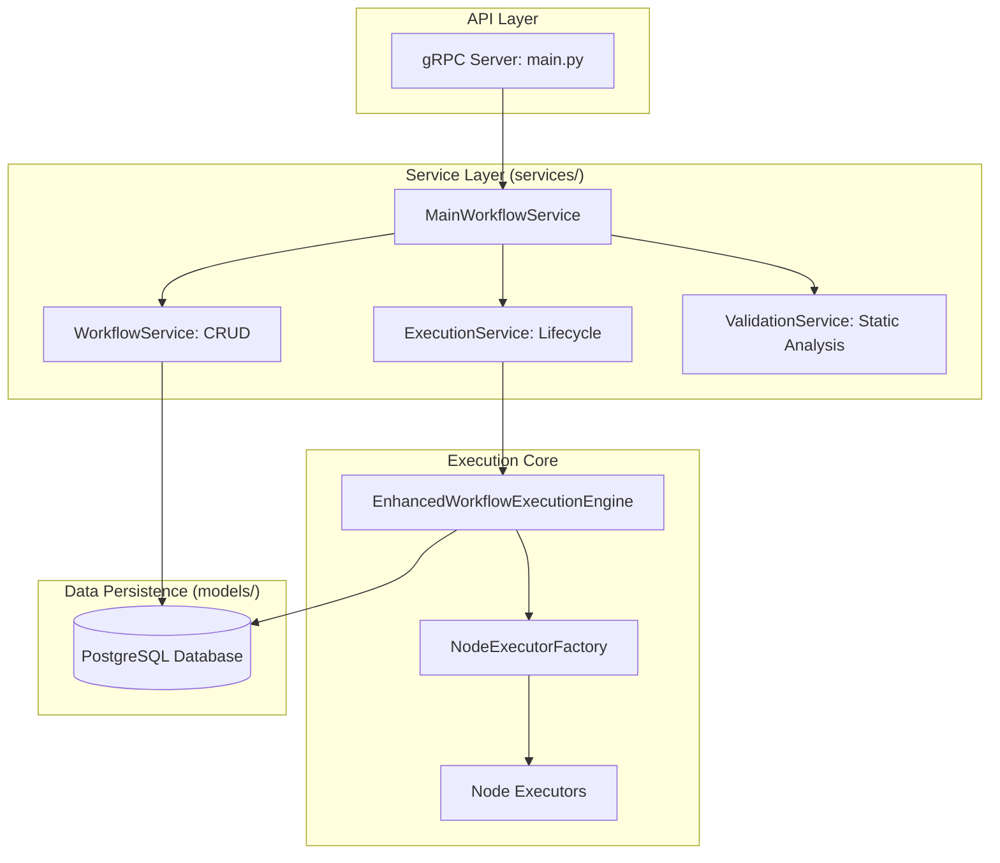
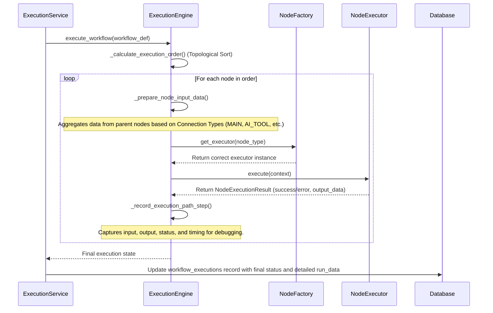

# Workflow Engine: Architecture & Execution Flow

## 1. Overview & Business Purpose

The **Workflow Engine** is the core execution component of the platform, designed to run automated workflows defined via a structured, Protobuf-based format. Its primary business purpose is to provide a **reliable, scalable, and observable environment** for executing complex processes, with a special emphasis on supporting AI-driven tasks.

Unlike traditional workflow systems, it is built to handle the intricate data flows required by modern AI Agents, such as providing specific "tools" or "memory" contexts to a node. Furthermore, it captures extremely detailed execution telemetry, enabling advanced features like **AI-powered automatic debugging and process optimization**.

## 2. High-Level Architecture

The engine is built on a modular, service-oriented architecture. A gRPC server exposes all functionality, which is internally delegated to specialized services that manage the lifecycle and execution of workflows.



## 3. The Lifecycle of a Workflow: From Creation to Execution

To understand the system, it's best to follow the journey of a single workflow.

### 3.1. Workflow Creation & Persistence

A workflow's life begins when a client sends a `CreateWorkflow` request to the gRPC server.

1.  **Delegation**: The `MainWorkflowService` receives the request and delegates it to the `WorkflowService`.
2.  **Data Modeling**: The `WorkflowService` is responsible for persistence. A key design decision is how workflows are stored: the entire Protobuf `Workflow` message, including all its nodes and connections, is serialized into a single JSON object.
3.  **Storage**: This JSON object is then saved into the `workflows` table in a `JSONB` column named `workflow_data`. This provides flexibility, as new node types or parameters can be added without requiring database schema migrations.

```python
// In services/workflow_service.py
class WorkflowService:
    def create_workflow(...):
        # ...
        # Convert protobuf to JSON for JSONB storage
        from google.protobuf.json_format import MessageToDict
        workflow_json = MessageToDict(workflow)

        db_workflow = WorkflowModel(
            id=workflow.id,
            # ...
            workflow_data=workflow_json,  // Store protobuf as JSONB
            tags=list(workflow.tags)      // Store tags as native array
        )
        db.add(db_workflow)
        db.commit()
        # ...
```

### 3.2. Triggering an Execution

When a client calls `ExecuteWorkflow`:

1.  **Delegation**: The request is passed from `MainWorkflowService` to `ExecutionService`.
2.  **Record Creation**: The `ExecutionService` immediately creates a new record in the `workflow_executions` table with a status of `NEW`. This provides an immutable log of every execution attempt.
3.  **Engine Invocation**: The `ExecutionService` then invokes the `EnhancedWorkflowExecutionEngine`, passing it the workflow definition and initial input data.

### 3.3. The Execution Engine in Action

This is the core of the system, orchestrated by `EnhancedWorkflowExecutionEngine`. The process is deterministic and observable.



**Execution Steps:**

1.  **Planning (`_calculate_execution_order`)**: The engine first performs a **topological sort** on the workflow's `ConnectionsMap` to determine the precise, dependency-aware order in which to execute the nodes.
2.  **Iterative Execution**: The engine loops through the sorted list of nodes. For each node:
    a.  **Data Aggregation (`_prepare_node_input_data_with_tracking`)**: This is a critical step. The engine inspects the `ConnectionsMap` to find all parent nodes connecting to the current node. It intelligently aggregates their outputs based on the **connection type**. For example, data from a `MAIN` connection is merged directly into the input, while data from an `AI_TOOL` connection is nested under an `ai_tool` key. This allows nodes (especially AI Agents) to receive complex, structured inputs from multiple sources.
    b.  **Node Dispatch**: It uses the `NodeExecutorFactory` to instantiate the correct executor class for the node's type (e.g., `AIAgentNodeExecutor`).
    c.  **Execution**: It calls the executor's `execute()` method, passing a `NodeExecutionContext` object that contains the aggregated input data, credentials, and other metadata.
    d.  **Telemetry Capture**: After the node returns a result, the engine captures a comprehensive snapshot of the operation—including the inputs, outputs, status, and performance metrics—and appends it to the `execution_path`.
3.  **Completion**: Once all nodes have run (or if a node fails and the error policy is to stop), the engine returns the final state to the `ExecutionService`.
4.  **Persistence**: The `ExecutionService` updates the corresponding `workflow_executions` record in the database, setting the final status and saving the entire detailed execution trace into the `run_data` JSONB column.

## 4. Core Component Deep Dive

### 4.1. The Pluggable Node System

The engine's functionality is defined by its library of nodes. The system is designed to be easily extended with new nodes.

-   **`BaseNodeExecutor` (`base.py`)**: This abstract class defines the contract for all nodes, requiring them to implement an `execute()` and `validate()` method. This ensures all nodes behave predictably.
-   **`NodeExecutorFactory` (`factory.py`)**: This factory holds a registry of all available node types. On startup, it's populated with the default executors. To add a new node, a developer simply creates a new executor class and registers it with the factory.

```python
// In nodes/action_node.py - A simplified example
class ActionNodeExecutor(BaseNodeExecutor):
    def get_supported_subtypes(self) -> List[str]:
        return ["HTTP_REQUEST", "RUN_CODE"]

    def execute(self, context: NodeExecutionContext) -> NodeExecutionResult:
        if context.node.subtype == "HTTP_REQUEST":
            # ... logic to make an HTTP call ...
            return self._create_success_result(output_data={"status_code": 200})
        # ...
```

### 4.2. The `ConnectionsMap`: A System for AI Data Flows

A standout feature is the `ConnectionsMap`, which goes beyond simple linear connections. It supports **13 distinct connection types**, allowing a workflow to model sophisticated data flows.

-   **Purpose**: Different connection types allow a node to understand the *semantic meaning* of its inputs. An AI Agent node, for example, can distinguish between its main data input (`MAIN`), a tool it can use (`AI_TOOL`), and a memory source it can query (`AI_MEMORY`).
-   **Implementation**: The `_prepare_node_input_data_with_tracking` method in the execution engine is responsible for interpreting these types and structuring the input data accordingly.

```json
// Example of a ConnectionsMap for an AI Agent
"Secretary AI Agent": {
  "connection_types": {
    "ai_tool": {
      "connections": [{"node": "Google Calendar Tool", "type": "AI_TOOL"}]
    },
    "ai_memory": {
      "connections": [{"node": "User Preferences Memory", "type": "AI_MEMORY"}]
    },
    "main": {
      "connections": [{"node": "Send Notification", "type": "MAIN"}]
    }
  }
}
```

## 5. Extensibility

Adding new capabilities to the engine is straightforward:

1.  **Create a New Node Executor**: Write a new Python class in the `nodes/` directory that inherits from `BaseNodeExecutor`.
2.  **Implement the Logic**: Implement the `execute()` and `validate()` methods.
3.  **Register the Executor**: Add the new executor to the `register_default_executors()` function in `nodes/factory.py`.

The engine will now automatically recognize and be able to execute this new node type.
