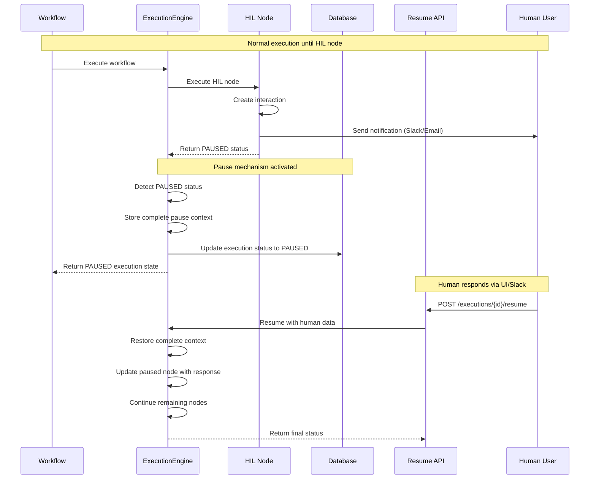

# Workflow Engine: Architecture & Execution Flow

## 1. Overview & Business Purpose

The **Workflow Engine** is the core execution component of the platform, designed to run automated workflows defined via a structured, Protobuf-based format. Its primary business purpose is to provide a **reliable, scalable, and observable environment** for executing complex processes, with a special emphasis on supporting AI-driven tasks.

Unlike traditional workflow systems, it is built to handle the intricate data flows required by modern AI Agents, such as providing specific "tools" or "memory" contexts to a node. Furthermore, it captures extremely detailed execution telemetry, enabling advanced features like **AI-powered automatic debugging and process optimization**.

## 2. High-Level Architecture

The engine is built on a modular, service-oriented architecture. A gRPC server exposes all functionality, which is internally delegated to specialized services that manage the lifecycle and execution of workflows.

```mermaid
graph TD
    subgraph "API Layer"
        GRPC_SERVER[gRPC Server: main.py]
        REST_API[FastAPI Endpoints]
        RESUME_API[Resume API: /executions/{id}/resume]
    end

    subgraph "Service Layer (services/)"
        MAIN_SERVICE[MainWorkflowService]
        WORKFLOW_SERVICE[WorkflowService: CRUD]
        EXECUTION_SERVICE[ExecutionService: Lifecycle]
        VALIDATION_SERVICE[ValidationService: Static Analysis]
        HIL_SERVICE[HIL Service: Human Interactions]
    end

    subgraph "Execution Core"
        EXECUTION_ENGINE[EnhancedWorkflowExecutionEngine]
        PAUSE_MANAGER[Pause/Resume Manager]
        NODE_FACTORY[NodeExecutorFactory]
        NODE_EXECUTORS[Node Executors]
        HIL_NODE[HIL Node Executor]
    end

    subgraph "External Integrations"
        SLACK_API[Slack Notifications]
        EMAIL_SERVICE[Email Service]
        WEB_DASHBOARD[Web Dashboard]
    end

    subgraph "Data Persistence (models/)"
        POSTGRES[(PostgreSQL Database)]
        PAUSE_CONTEXT[(Pause Context Storage)]
        HIL_INTERACTIONS[(HIL Interactions Table)]
    end

    %% API Layer Connections
    GRPC_SERVER --> MAIN_SERVICE
    REST_API --> EXECUTION_SERVICE
    RESUME_API --> EXECUTION_SERVICE

    %% Service Layer Connections
    MAIN_SERVICE --> WORKFLOW_SERVICE
    MAIN_SERVICE --> EXECUTION_SERVICE
    MAIN_SERVICE --> VALIDATION_SERVICE
    EXECUTION_SERVICE --> HIL_SERVICE

    %% Execution Core Connections
    EXECUTION_SERVICE --> EXECUTION_ENGINE
    EXECUTION_ENGINE --> PAUSE_MANAGER
    EXECUTION_ENGINE --> NODE_FACTORY
    NODE_FACTORY --> NODE_EXECUTORS
    NODE_FACTORY --> HIL_NODE
    HIL_NODE --> HIL_SERVICE

    %% External Integration Connections
    HIL_SERVICE --> SLACK_API
    HIL_SERVICE --> EMAIL_SERVICE
    HIL_SERVICE --> WEB_DASHBOARD

    %% Database Connections
    EXECUTION_ENGINE --> POSTGRES
    PAUSE_MANAGER --> PAUSE_CONTEXT
    HIL_SERVICE --> HIL_INTERACTIONS
    WORKFLOW_SERVICE --> POSTGRES

    %% HIL Flow (dotted lines for pause/resume)
    HIL_NODE -.-> PAUSE_MANAGER
    PAUSE_MANAGER -.-> POSTGRES
    RESUME_API -.-> PAUSE_MANAGER
```

## 3. The Lifecycle of a Workflow: From Creation to Execution

To understand the system, it's best to follow the journey of a single workflow.

### 3.1. Workflow Creation & Persistence

A workflow's life begins when a client sends a `CreateWorkflow` request to the gRPC server.

1.  **Delegation**: The `MainWorkflowService` receives the request and delegates it to the `WorkflowService`.
2.  **Data Modeling**: The `WorkflowService` is responsible for persistence. A key design decision is how workflows are stored: the entire Protobuf `Workflow` message, including all its nodes and connections, is serialized into a single JSON object.
3.  **Storage**: This JSON object is then saved into the `workflows` table in a `JSONB` column named `workflow_data`. This provides flexibility, as new node types or parameters can be added without requiring database schema migrations.

```python
// In services/workflow_service.py
class WorkflowService:
    def create_workflow(...):
        # ...
        # Convert protobuf to JSON for JSONB storage
        from google.protobuf.json_format import MessageToDict
        workflow_json = MessageToDict(workflow)

        db_workflow = WorkflowModel(
            id=workflow.id,
            # ...
            workflow_data=workflow_json,  // Store protobuf as JSONB
            tags=list(workflow.tags)      // Store tags as native array
        )
        db.add(db_workflow)
        db.commit()
        # ...
```

### 3.2. Triggering an Execution

When a client calls `ExecuteWorkflow`:

1.  **Delegation**: The request is passed from `MainWorkflowService` to `ExecutionService`.
2.  **Record Creation**: The `ExecutionService` immediately creates a new record in the `workflow_executions` table with a status of `NEW`. This provides an immutable log of every execution attempt.
3.  **Engine Invocation**: The `ExecutionService` then invokes the `EnhancedWorkflowExecutionEngine`, passing it the workflow definition and initial input data.

### 3.3. The Execution Engine in Action

This is the core of the system, orchestrated by `EnhancedWorkflowExecutionEngine`. The process is deterministic and observable.


**Execution Steps:**

1.  **Planning (`_calculate_execution_order`)**: The engine first performs a **topological sort** on the workflow's `ConnectionsMap` to determine the precise, dependency-aware order in which to execute the nodes.
2.  **Iterative Execution**: The engine loops through the sorted list of nodes. For each node:
    a.  **Data Aggregation (`_prepare_node_input_data_with_tracking`)**: This is a critical step. The engine inspects the `ConnectionsMap` to find all parent nodes connecting to the current node. It intelligently aggregates their outputs based on the **connection type**. For example, data from a `MAIN` connection is merged directly into the input, while data from an `AI_TOOL` connection is nested under an `ai_tool` key. This allows nodes (especially AI Agents) to receive complex, structured inputs from multiple sources.
    b.  **Node Dispatch**: It uses the `NodeExecutorFactory` to instantiate the correct executor class for the node's type (e.g., `AIAgentNodeExecutor`).
    c.  **Execution**: It calls the executor's `execute()` method, passing a `NodeExecutionContext` object that contains the aggregated input data, credentials, and other metadata.
    d.  **Telemetry Capture**: After the node returns a result, the engine captures a comprehensive snapshot of the operation—including the inputs, outputs, status, and performance metrics—and appends it to the `execution_path`.
3.  **Completion**: Once all nodes have run (or if a node fails and the error policy is to stop), the engine returns the final state to the `ExecutionService`.
4.  **Persistence**: The `ExecutionService` updates the corresponding `workflow_executions` record in the database, setting the final status and saving the entire detailed execution trace into the `run_data` JSONB column.

## 4. Core Component Deep Dive

### 4.1. The Pluggable Node System

The engine's functionality is defined by its library of nodes. The system is designed to be easily extended with new nodes.

-   **`BaseNodeExecutor` (`base.py`)**: This abstract class defines the contract for all nodes, requiring them to implement an `execute()` and `validate()` method. This ensures all nodes behave predictably.
-   **`NodeExecutorFactory` (`factory.py`)**: This factory holds a registry of all available node types. On startup, it's populated with the default executors. To add a new node, a developer simply creates a new executor class and registers it with the factory.

```python
// In nodes/action_node.py - A simplified example
class ActionNodeExecutor(BaseNodeExecutor):
    def get_supported_subtypes(self) -> List[str]:
        return ["HTTP_REQUEST", "RUN_CODE"]

    def execute(self, context: NodeExecutionContext) -> NodeExecutionResult:
        if context.node.subtype == "HTTP_REQUEST":
            # ... logic to make an HTTP call ...
            return self._create_success_result(output_data={"status_code": 200})
        # ...
```

### 4.2. The AI Agent Architecture Revolution

The workflow engine has undergone a fundamental transformation in how it handles AI Agent nodes, moving from hardcoded roles to a flexible, provider-based architecture.

#### Legacy Approach (Before v2.0) ❌
Previously, AI agents were defined by rigid, hardcoded subtypes:
- `AI_ROUTER_AGENT` - Limited to routing decisions
- `AI_TASK_ANALYZER` - Only capable of task analysis
- `AI_DATA_INTEGRATOR` - Fixed data integration logic
- `AI_REPORT_GENERATOR` - Restricted to report generation

This approach required new code for each AI role and limited customization capabilities.

#### Provider-Based Architecture (v2.0+) ✅
The new architecture introduces three universal AI agent providers where **functionality is entirely defined by system prompts**:

```python
// In nodes/ai_agent_node.py - New implementation
class AIAgentNodeExecutor(BaseNodeExecutor):
    def get_supported_subtypes(self) -> List[str]:
        return [
            "GEMINI_NODE",      # Google Gemini provider
            "OPENAI_NODE",      # OpenAI GPT provider
            "CLAUDE_NODE"       # Anthropic Claude provider
        ]

    def execute(self, context: NodeExecutionContext) -> NodeExecutionResult:
        subtype = context.node.subtype

        if subtype == "GEMINI_NODE":
            return self._execute_gemini_agent(context, logs, start_time)
        elif subtype == "OPENAI_NODE":
            return self._execute_openai_agent(context, logs, start_time)
        elif subtype == "CLAUDE_NODE":
            return self._execute_claude_agent(context, logs, start_time)
```

**Key Benefits:**
- **Unlimited Functionality**: Any AI task can be achieved through system prompts
- **Easy Customization**: Simply modify the system prompt parameter
- **Provider Optimization**: Leverage unique capabilities of each AI provider
- **Simplified Codebase**: Three providers instead of dozens of hardcoded roles
- **Rapid Experimentation**: Test new AI behaviors instantly

#### System Prompt Examples

**Data Analysis Agent (Gemini)**:
```json
{
  "type": "AI_AGENT_NODE",
  "subtype": "GEMINI_NODE",
  "parameters": {
    "system_prompt": "You are a senior data analyst. Analyze datasets and provide statistical insights, trend analysis, and business recommendations in structured JSON format.",
    "model_version": "gemini-pro",
    "temperature": 0.3
  }
}
```

**Customer Service Router (OpenAI)**:
```json
{
  "type": "AI_AGENT_NODE",
  "subtype": "OPENAI_NODE",
  "parameters": {
    "system_prompt": "You are an intelligent customer service routing system. Analyze inquiries and route to appropriate departments (billing/technical/sales/general) with confidence scoring.",
    "model_version": "gpt-4",
    "temperature": 0.1
  }
}
```

### 4.3. The `ConnectionsMap`: A System for AI Data Flows

A standout feature is the `ConnectionsMap`, which goes beyond simple linear connections. It supports **13 distinct connection types**, allowing a workflow to model sophisticated data flows.

-   **Purpose**: Different connection types allow a node to understand the *semantic meaning* of its inputs. An AI Agent node, for example, can distinguish between its main data input (`MAIN`), a tool it can use (`AI_TOOL`), and a memory source it can query (`AI_MEMORY`).
-   **Implementation**: The `_prepare_node_input_data_with_tracking` method in the execution engine is responsible for interpreting these types and structuring the input data accordingly.

```json
// Example of a ConnectionsMap for a Provider-Based AI Agent
"Customer Analysis Agent": {
  "connection_types": {
    "ai_tool": {
      "connections": [{"node": "Customer Database Tool", "type": "AI_TOOL"}]
    },
    "ai_memory": {
      "connections": [{"node": "Customer Interaction History", "type": "AI_MEMORY"}]
    },
    "main": {
      "connections": [{"node": "Data Ingestion", "type": "MAIN"}]
    }
  }
}
```

## 5. Extensibility

### 5.1. Traditional Node Extension
Adding new non-AI capabilities to the engine follows the established pattern:

1.  **Create a New Node Executor**: Write a new Python class in the `nodes/` directory that inherits from `BaseNodeExecutor`.
2.  **Implement the Logic**: Implement the `execute()` and `validate()` methods.
3.  **Register the Executor**: Add the new executor to the `register_default_executors()` function in `nodes/factory.py`.

### 5.2. AI Agent Extension (Revolutionary Approach)
With the provider-based architecture, adding new AI capabilities is dramatically simpler:

**No Code Required**: Simply create a new workflow with a different `system_prompt`:
```json
{
  "type": "AI_AGENT_NODE",
  "subtype": "CLAUDE_NODE",
  "parameters": {
    "system_prompt": "You are a cybersecurity analyst. Review code for vulnerabilities, classify risks by CVSS scoring, and provide detailed remediation steps with secure code examples.",
    "model_version": "claude-3-opus",
    "temperature": 0.2
  }
}
```

**Adding New AI Providers**: To add support for new AI providers (e.g., `LLAMA_NODE`):
1. Add the new subtype to `get_supported_subtypes()` in `AIAgentNodeExecutor`
2. Implement a new `_execute_llama_agent()` method
3. Update the protobuf schema and regenerate

This approach has **revolutionized development velocity** - new AI functionalities can be created in minutes rather than hours or days.

## 6. Human-in-the-Loop (HIL) & Workflow Pause/Resume Architecture

### 6.1. Overview of HIL System

The workflow engine includes a sophisticated **Human-in-the-Loop (HIL)** system that enables workflows to pause execution and await human interaction before continuing. This is essential for workflows requiring approvals, confirmations, data input, or human decision-making.

**Key Capabilities:**
- ✅ **Seamless Workflow Pause**: HIL nodes pause execution at precise points
- ✅ **Complete Context Preservation**: All execution state is preserved during pause
- ✅ **Multiple Pause Support**: Workflows can pause multiple times
- ✅ **Re-trigger Prevention**: Paused workflows block new triggers
- ✅ **Resume API**: REST endpoints for continuing paused workflows
- ✅ **Multi-channel Support**: Slack, email, and web-based interactions

### 6.2. HIL Node Architecture

The `HUMAN_IN_THE_LOOP_NODE` is a specialized node executor that implements sophisticated pause/resume functionality:

```python
// In nodes/human_loop_node.py
class HumanLoopNodeExecutor(BaseNodeExecutor):
    def get_supported_subtypes(self) -> List[str]:
        return [
            "HIL_CONFIRMATION",    # Simple approval/rejection
            "HIL_DATA_INPUT",      # Collect data from human
            "HIL_DECISION",        # Multiple choice decisions
            "HIL_REVIEW"           # Document/content review
        ]

    def execute(self, context: NodeExecutionContext) -> NodeExecutionResult:
        # Create interaction request
        interaction = await self._create_hil_interaction(context)

        # Send notification (Slack, email, etc.)
        await self._send_interaction_notification(interaction)

        # Return PAUSED status to halt workflow execution
        return self._create_pause_result(interaction, logs, execution_time)
```

**HIL Node Parameters:**
- `question`: The question or prompt for the human
- `timeout_minutes`: How long to wait for human response
- `channel_type`: Notification method (slack, email, web)
- `required_approvers`: List of users who can respond
- `approval_threshold`: Number of approvals needed

### 6.3. Workflow Pause/Resume Execution Flow



### 6.4. Complete Context Preservation

When a workflow pauses, the engine stores a **comprehensive pause context** that enables seamless resume:

```python
pause_context = {
    "execution_id": "exec_12345",
    "workflow_id": "wf_67890",
    "paused_at": "2024-01-15T10:30:00Z",
    "paused_node_id": "hil_confirmation",
    "remaining_nodes": ["node_3", "node_4", "node_5"],

    # Complete execution state snapshot
    "execution_state_snapshot": {
        "status": "PAUSED",
        "start_time": "2024-01-15T10:25:00Z",
        "node_results": {
            "node_1": {"status": "SUCCESS", "output_data": {...}},
            "node_2": {"status": "PAUSED", "interaction_id": "hil_123"}
        },
        "execution_order": ["node_1", "node_2", "node_3", "node_4"],
        "execution_context": {"initial_data": {...}},
        "performance_metrics": {"total_time": 15000},
        "execution_path": [...],
        "data_flow": {...}
    },

    # Complete workflow context for resume
    "workflow_context": {
        "workflow_definition": {...},  # Full workflow JSON
        "initial_data": {...},         # Original trigger data
        "credentials": {...},          # Encrypted credentials
        "user_id": "user_456"
    },

    # Resume metadata
    "resume_metadata": {
        "pause_reason": "human_interaction",
        "interaction_id": "hil_123",
        "timeout_at": "2024-01-15T11:30:00Z",
        "resume_ready": true
    }
}
```

### 6.5. Re-trigger Prevention System

The trigger system includes intelligent **pause detection** to prevent concurrent executions:

```python
// In triggers/base.py - Enhanced trigger logic
async def _trigger_workflow(self, trigger_data):
    # Check for existing paused executions
    paused_check = await self._check_for_paused_executions()
    if paused_check["has_paused"]:
        logger.warning(f"Workflow {self.workflow_id} has {paused_check['count']} paused execution(s)")
        return ExecutionResult(
            status="skipped",
            message="Workflow has paused execution(s) - new triggers blocked"
        )

    # Proceed with normal execution
    return await self._execute_workflow(execution_id, trigger_data)
```

**Prevention Logic:**
- 🚫 **Block New Triggers**: Workflows with `PAUSED` executions cannot be triggered again
- 📊 **Multi-Execution Support**: Handles multiple concurrent paused executions
- 🛡️ **Fail-Safe Behavior**: Falls back gracefully if pause check fails
- ⚡ **Performance Optimized**: Quick database queries to check status

### 6.6. Resume API & Human Response Handling

The workflow engine exposes REST endpoints for resuming paused workflows:

```bash
POST /v1/executions/{execution_id}/resume
```

**Request Examples:**

```json
// Simple approval/rejection
{
  "approved": true,
  "resume_data": {
    "comment": "Approved by manager",
    "timestamp": "2024-01-15T10:45:00Z"
  }
}

// Custom data input
{
  "resume_data": {
    "budget_amount": 50000,
    "project_priority": "high",
    "assigned_team": "engineering"
  },
  "output_port": "approved"
}

// Multi-option decision
{
  "resume_data": {
    "selected_option": "escalate_to_senior",
    "reasoning": "Requires director approval"
  },
  "output_port": "escalate"
}
```

**Response Format:**
```json
{
  "execution_id": "exec_12345",
  "status": "completed",        // or "paused" if paused again
  "message": "Workflow resumed and completed successfully",
  "completed": true,
  "paused_again": false,
  "remaining_nodes": []
}
```

### 6.7. Multi-Channel HIL Notifications

The HIL system supports multiple notification channels:

#### Slack Integration
```python
// Slack notification with interactive buttons
await slack_client.send_message(
    channel=hil_config.slack_channel,
    blocks=[
        SlackBlockBuilder.header("🤖 Approval Required"),
        SlackBlockBuilder.section(f"**Question:** {question}"),
        SlackBlockBuilder.actions([
            {"text": "✅ Approve", "value": "approve"},
            {"text": "❌ Reject", "value": "reject"}
        ])
    ]
)
```

#### Email Notifications
```python
// Email with approval links
email_content = {
    "subject": f"Workflow Approval Required: {workflow_name}",
    "html_body": generate_approval_email_template(
        question=question,
        approve_link=f"{base_url}/approve/{interaction_id}",
        reject_link=f"{base_url}/reject/{interaction_id}"
    )
}
```

#### Web Dashboard
- Real-time pending approvals list
- Embedded approval forms
- Workflow execution timeline
- Mobile-responsive interface

### 6.8. Advanced HIL Features

#### Timeout Handling
```python
// Automatic workflow continuation on timeout
if datetime.now() > interaction.timeout_at:
    if hil_config.timeout_action == "auto_approve":
        resume_data = {"approved": True, "timeout": True}
    elif hil_config.timeout_action == "auto_reject":
        resume_data = {"approved": False, "timeout": True}
    else:  # fail
        resume_data = {"error": "Human interaction timeout"}

    await self.resume_workflow_execution(execution_id, resume_data)
```

#### Multi-Approver Support
```python
// Require multiple approvals
hil_config = {
    "required_approvers": ["manager@company.com", "director@company.com"],
    "approval_threshold": 2,  # Both must approve
    "rejection_threshold": 1   # Any can reject
}
```

#### Conditional HIL Nodes
```python
// Only pause for high-value transactions
hil_config = {
    "condition": "{{transaction_amount}} > 10000",
    "question": "Approve transaction of ${{transaction_amount}}?",
    "auto_approve_below": 1000
}
```

### 6.9. Database Schema for HIL

The HIL system extends the existing database schema:

```sql
-- Enhanced workflow_executions table
ALTER TABLE workflow_executions
ADD COLUMN pause_data JSONB,
ADD COLUMN paused_at TIMESTAMP,
ADD COLUMN resume_count INTEGER DEFAULT 0;

-- HIL interactions table
CREATE TABLE hil_interactions (
    id UUID PRIMARY KEY DEFAULT gen_random_uuid(),
    execution_id VARCHAR(255) NOT NULL,
    workflow_id UUID NOT NULL,
    node_id VARCHAR(255) NOT NULL,
    question TEXT NOT NULL,
    channel_type VARCHAR(50) NOT NULL,
    status VARCHAR(50) DEFAULT 'pending',
    timeout_at TIMESTAMP NOT NULL,
    created_at TIMESTAMP DEFAULT NOW(),
    responded_at TIMESTAMP,
    response_data JSONB,
    approver_id VARCHAR(255)
);
```

### 6.10. HIL System Benefits

**For Business Operations:**
- ✅ **Compliance**: Audit trails for all human decisions
- ✅ **Risk Management**: Human oversight for critical operations
- ✅ **Flexibility**: Workflows adapt to business rules and thresholds
- ✅ **Accountability**: Clear tracking of who approved what and when

**For Technical Implementation:**
- ✅ **Reliability**: Workflows never lose state during pause
- ✅ **Scalability**: Supports thousands of concurrent paused workflows
- ✅ **Observability**: Detailed logging and metrics for HIL interactions
- ✅ **Integration**: Works seamlessly with existing workflow patterns

**For User Experience:**
- ✅ **Multi-Channel**: Users receive notifications where they work
- ✅ **Context Rich**: Full workflow context provided with requests
- ✅ **Mobile Friendly**: Approve requests from any device
- ✅ **Real-time**: Instant workflow continuation after approval

This HIL architecture transforms the workflow engine from a purely automated system into a **hybrid human-AI collaboration platform**, enabling sophisticated business processes that require the best of both human judgment and automated efficiency.
