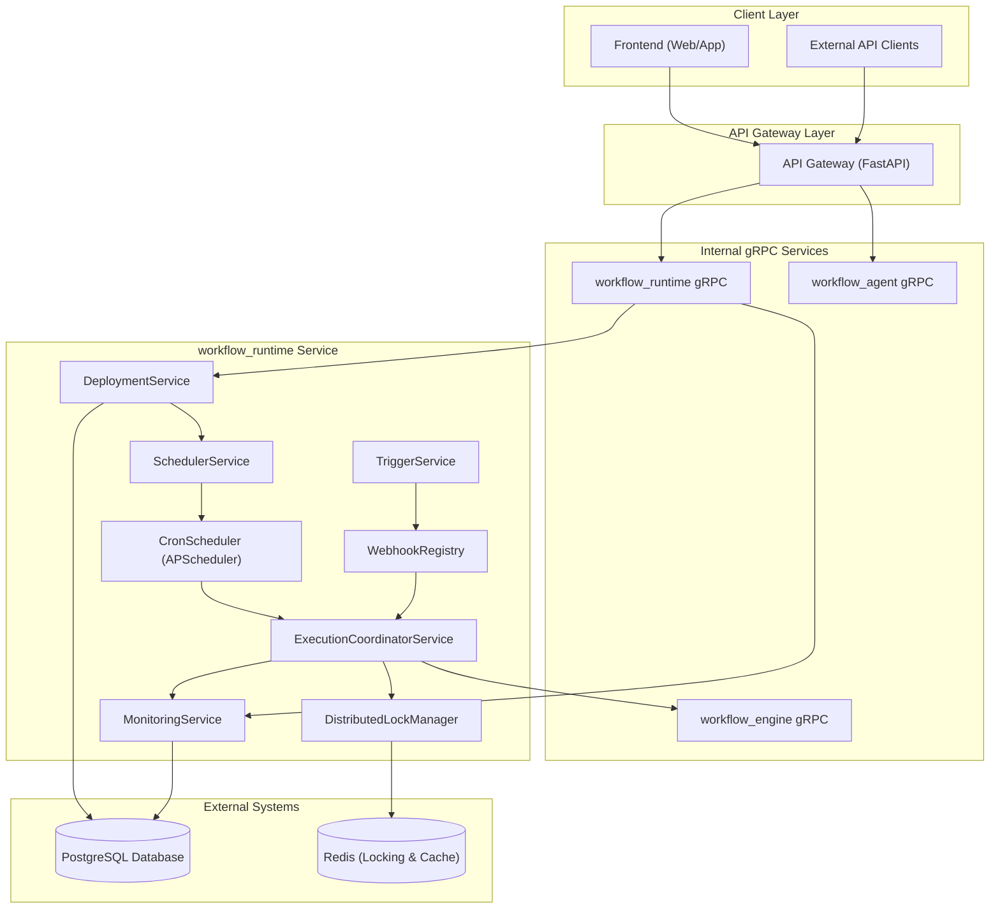
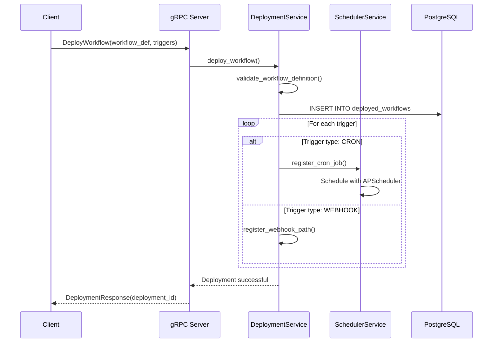
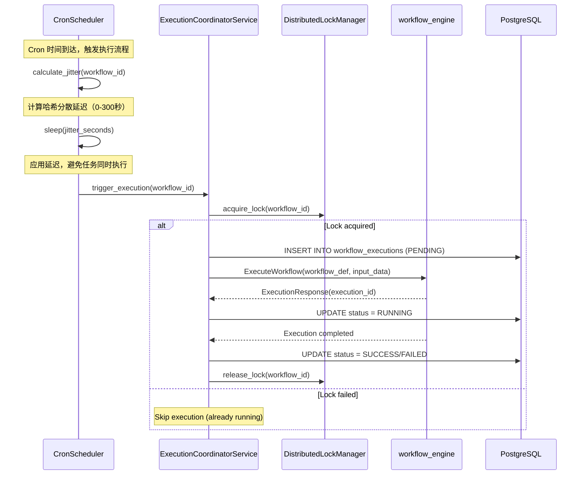
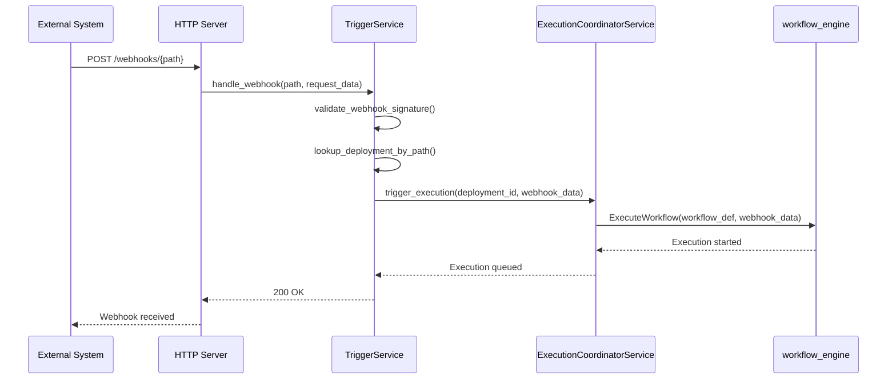

# Workflow Runtime 技术架构设计

## 1. 概述与业务目标

**workflow_runtime** 是 Workflow 系统的调度与运行时管理核心，负责将用户生成的 Workflow 部署为长期运行的云端服务，支持定时触发、Webhook 触发等触发器。

### 主要职责：

1. **部署管理**：通过内部 gRPC 接口管理 Workflow 部署
2. **调度触发**：支持 Cron、Webhook 等多种触发器
3. **执行协调**：调用 workflow_engine 执行任务
4. **状态监控**：记录执行历史、处理失败重试
5. **并发控制**：在分布式环境下避免重复执行

**注意**：所有外部 API 请求将通过 `apps/backend/api-gateway` 统一处理，workflow_runtime 仅提供内部 gRPC 接口。

## 2. High-level Architecture



## 3. 核心组件详解

### 3.1. Internal gRPC Interface

#### workflow_runtime gRPC Service

- **仅供内部使用**：通过 API Gateway 调用，不直接对外暴露
- 提供 Workflow 部署、更新、删除接口
- 支持查询已部署 Workflow 状态和执行历史
- 基于 Protobuf 定义，保证类型安全

#### Webhook 处理机制

- **集成到 API Gateway**：Webhook 端点通过 API Gateway 统一管理
- API Gateway 接收 Webhook 请求后调用 workflow_runtime gRPC 接口
- 支持自定义 HTTP 方法和请求体验证
- 为每个部署的 Workflow 生成唯一的 Webhook URL

### 3.2. Service Layer

#### DeploymentService

- **职责**：管理 Workflow 的部署生命周期
- **功能**：
  - 验证 Workflow 定义的有效性
  - 创建/更新/删除部署记录
  - 配置触发器（Cron 表达式、Webhook 路径）
  - 与 SchedulerService 协调，注册/注销定时任务

#### SchedulerService

- **职责**：管理所有定时任务的调度
- **功能**：
  - 基于 APScheduler 实现 Cron 调度
  - 支持分布式部署下的任务去重
  - 智能调度，避免任务堆积在同一时刻
  - 处理调度失败和重试逻辑

#### TriggerService

- **职责**：处理各种触发事件
- **功能**：
  - 管理 Webhook 注册表
  - 解析 Webhook 请求，提取触发数据
  - 验证触发权限和参数
  - 将触发事件转发给 ExecutionCoordinatorService

#### ExecutionCoordinatorService

- **职责**：协调 Workflow 的实际执行
- **功能**：
  - 生成唯一的 execution_id
  - 通过 gRPC 调用 workflow_engine
  - 实现分布式锁，防止并发执行同一 Workflow
  - 处理执行超时和异常情况
  - 记录执行状态和结果

#### MonitoringService

- **职责**：提供执行监控和历史查询
- **功能**：
  - 实时跟踪 Workflow 执行状态
  - 提供丰富的查询 API（按时间、状态、Workflow ID 过滤）
  - 支持执行失败告警
  - 生成执行统计报表

### 3.3. Scheduler Core

#### CronScheduler (APScheduler)

- 基于 Python APScheduler 实现的高性能定时任务调度器
- 支持多种调度策略：interval、cron、date
- 持久化任务状态到 PostgreSQL，支持服务重启恢复
- **哈希分散机制**：基于 workflow_id 计算确定性延迟，避免任务同时执行

##### 哈希分散策略：

**实现原理**：
- 基于 workflow_id 的 MD5 哈希计算确定性延迟
- 确保同一 workflow 的延迟始终固定
- 将任务均匀分散在5分钟时间窗口内

```python
def calculate_jitter(workflow_id: str, time_window: int = 300) -> int:
    """
    计算基于 workflow_id 的固定延迟
    time_window: 分散窗口，默认300秒（5分钟）
    """
    import hashlib
    hash_value = hashlib.md5(workflow_id.encode()).hexdigest()
    jitter_seconds = int(hash_value[:8], 16) % time_window
    return jitter_seconds

# 调度时应用延迟
async def execute_with_jitter(workflow_id: str):
    jitter = calculate_jitter(workflow_id)
    if jitter > 0:
        await asyncio.sleep(jitter)
    await execute_workflow(workflow_id)
```

**优势**：
- **简单可靠**：实现简单，无复杂依赖
- **确定性**：相同 workflow 延迟固定，便于调试
- **分散效果**：有效避免任务堆积
- **零配置**：无需额外的监控和协调机制

#### WebhookRegistry

- 维护 Webhook URL 到 Workflow 的映射关系
- 支持 URL 路径参数和查询参数提取
- 实现 Webhook 的安全验证（签名校验、IP 白名单）

#### DistributedLockManager

- 基于 Redis 实现分布式锁
- 确保在多实例部署下，同一 Workflow 不会被并发触发
- 支持锁超时和死锁检测

## 4. 数据模型

### 4.1. 复用现有数据库表

workflow_runtime 将复用现有的数据库表结构，避免数据重复和同步问题：

#### 核心表复用：

**workflows 表**

- 存储 Workflow 基本信息和定义
- workflow_runtime 将增加字段来标记部署状态

**workflow_triggers 表**

- 已存在，完美适用于 workflow_runtime 的触发器管理
- 支持多种 trigger_type 和 trigger_config

**workflow_executions 表**

- 已存在，用于记录执行历史
- 支持不同的 mode：MANUAL, TRIGGER, WEBHOOK
- 包含完整的执行状态和结果数据

### 4.2. workflow_runtime 需要的新增字段

为了支持部署功能，需要扩展现有表：

```sql
-- 扩展 workflows 表，增加部署相关字段
ALTER TABLE workflows ADD COLUMN IF NOT EXISTS deployment_status VARCHAR(50) DEFAULT 'DRAFT';
ALTER TABLE workflows ADD COLUMN IF NOT EXISTS deployed_at TIMESTAMP WITH TIME ZONE;
ALTER TABLE workflows ADD COLUMN IF NOT EXISTS deployment_config JSONB DEFAULT '{}';

-- deployment_status 可选值：DRAFT, DEPLOYED, PAUSED, ARCHIVED
-- deployment_config 存储部署相关配置，如资源限制、环境变量等

-- 为部署状态添加约束
ALTER TABLE workflows ADD CONSTRAINT valid_deployment_status CHECK (
    deployment_status IN ('DRAFT', 'DEPLOYED', 'PAUSED', 'ARCHIVED')
);

-- 增加索引
CREATE INDEX IF NOT EXISTS idx_workflows_deployment_status ON workflows(deployment_status);
CREATE INDEX IF NOT EXISTS idx_workflows_deployed_at ON workflows(deployed_at);
```

### 4.3. 表使用映射

| workflow_runtime 概念 | 对应数据库表                          | 说明                               |
| --------------------- | ------------------------------------- | ---------------------------------- |
| 部署的 Workflow       | workflows                             | 通过 deployment_status 字段区分    |
| 触发器配置            | workflow_triggers                     | 直接使用现有结构                   |
| 执行历史              | workflow_executions                   | 直接使用，mode 字段区分触发方式    |
| Webhook 路径          | workflow_triggers                     | trigger_config 中存储 webhook 配置 |
| 执行状态监控          | workflow_executions + node_executions | 组合使用获取详细状态               |

### 4.4. Redis 数据结构

```
-- 分布式锁（防止并发执行）
workflow_runtime:locks:workflow_{workflow_id} = {execution_id, locked_at, ttl}

-- Webhook 路径映射缓存
workflow_runtime:webhooks:{webhook_path} = {workflow_id, trigger_id}

-- 活跃执行状态缓存（用于快速查询）
workflow_runtime:executions:active = {
    execution_id_1: {workflow_id, status, started_at},
    execution_id_2: {workflow_id, status, started_at}
}

-- Cron 作业调度状态（Hash）
workflow_runtime:cron_jobs = {
    job_id_1: {workflow_id, next_run_time, is_running},
    job_id_2: {workflow_id, next_run_time, is_running}
}

-- 系统健康状态（Hash）
workflow_runtime:health = {
    last_heartbeat: timestamp,
    active_instances: [instance_id_1, instance_id_2],
    pending_executions_count: number
}
```

### 4.5. 数据访问模式

#### 部署 Workflow 的数据流：

1. 更新 `workflows.deployment_status = 'DEPLOYED'`
2. 创建或更新 `workflow_triggers` 记录
3. 更新 Redis 缓存（webhook 路径映射、cron 作业）

#### 执行 Workflow 的数据流：

1. 检查 Redis 分布式锁
2. 创建 `workflow_executions` 记录（status = 'NEW'）
3. 调用 workflow_engine gRPC 接口
4. 更新执行状态到数据库和 Redis 缓存

#### 查询执行状态的数据流：

1. 优先从 Redis 活跃执行缓存获取
2. 如缓存未命中，从 `workflow_executions` 表查询
3. 详细信息从 `node_executions` 表获取

### 4.6. 数据一致性保证

#### 分布式锁机制：

- 使用 Redis 分布式锁防止同一 Workflow 并发执行
- 锁的 TTL 设置为执行超时时间 + 缓冲时间
- 支持锁续期，防止长时间执行的任务被误判超时

#### 事务处理：

- 部署操作使用数据库事务确保数据一致性
- Redis 操作使用 Pipeline 提高性能
- 异常情况下的回滚机制

#### 数据同步策略：

- 数据库作为唯一数据源（Single Source of Truth）
- Redis 作为性能优化的缓存层
- 定期同步任务确保缓存数据一致性

## 5. 关键执行流程

### 5.1. Workflow 部署流程



### 5.2. Cron 哈希分散执行流程



### 5.3. Webhook 触发执行流程



## 6. 部署架构

### 6.1. 单实例部署

- 适用于开发和小规模生产环境
- 所有组件运行在单个 Python 进程中
- 使用本地文件系统锁替代 Redis 分布式锁

### 6.2. 分布式部署

- 多个 workflow_runtime 实例负载均衡
- 通过 Redis 实现分布式锁和状态共享
- PostgreSQL 作为共享数据存储
- workflow_engine 通过 AWS ECS 独立部署和伸缩

### 6.3. 高可用配置

- PostgreSQL 主从复制
- Redis Cluster 或 Redis Sentinel
- workflow_runtime 无状态设计，支持水平扩展
- 健康检查和故障自动恢复

## 7. 安全考虑

### 7.1. Webhook 安全

- HMAC-SHA256 签名验证
- IP 白名单限制
- 请求频率限制
- 支持自定义 HTTP 头验证

### 7.2. gRPC 安全

- TLS 加密传输
- 客户端证书认证
- 基于 JWT 的访问控制
- 细粒度权限管理

### 7.3. 执行安全

- workflow_engine 运行在隔离容器中
- 敏感数据加密存储
- 执行日志脱敏处理
- 审计日志记录

## 8. 监控与可观测性

### 8.1. 指标监控

- 部署的 Workflow 数量和状态分布
- 执行成功率和失败率
- 平均执行时间和延迟分布
- 系统资源使用情况（CPU、内存、数据库连接）

#### 哈希分散监控指标：

- **分散效果**：
  - 每分钟执行任务数量分布
  - 哈希延迟分布均匀性
  - 任务堆积情况监控

- **调度性能**：
  - 延迟计算时间
  - 实际执行时间分布
  - 系统整体负载平滑度

### 8.2. 日志记录

- 结构化日志输出（JSON 格式）
- 请求链路追踪（Trace ID）
- 错误详情和堆栈信息
- 执行生命周期事件

### 8.3. 告警策略

- 执行失败率超过阈值
- 执行时间异常延长
- 系统资源不足
- 依赖服务不可用（workflow_engine、数据库）

## 9. 扩展性设计

### 9.1. 新触发器类型

- 抽象的 TriggerHandler 接口
- 插件化触发器注册机制
- 支持数据库事件、消息队列等触发器

### 9.2. 执行策略扩展

- 支持并行执行多个 Workflow
- 条件执行和依赖管理
- 执行优先级和资源配额

### 9.3. 多租户支持

- 基于命名空间的资源隔离
- 租户级别的配额管理
- 细粒度的访问控制
