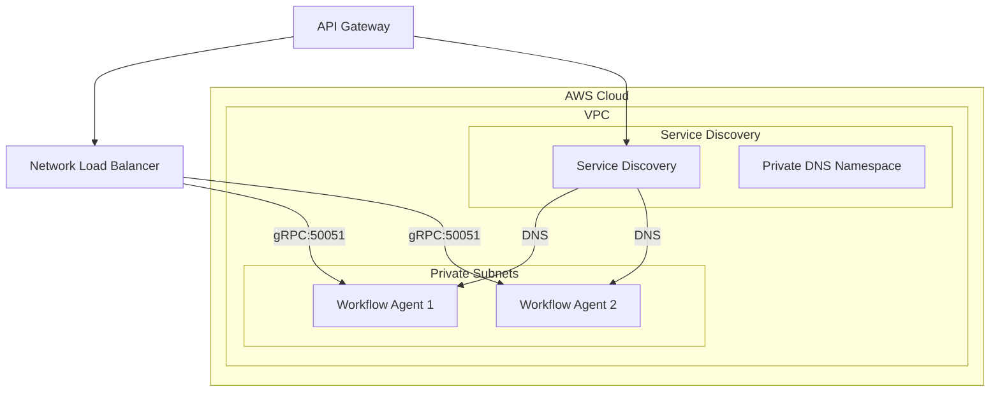

# gRPC Service Discovery on AWS ECS

This document describes the gRPC service discovery architecture implemented for the Agent Team monorepo on AWS ECS.

## Architecture Overview



### Components

1. **AWS Cloud Map**: Service discovery namespace for DNS-based discovery
2. **Network Load Balancer (NLB)**: Internal load balancer for gRPC traffic
3. **ECS Services**: Auto-registered with service discovery
4. **Enhanced gRPC Client**: Multi-strategy service discovery client

## Service Discovery Strategies

The enhanced gRPC client implements multiple discovery strategies in priority order:

1. **Environment Variables**: Direct host/port configuration
2. **Load Balancer**: Internal NLB endpoint
3. **DNS Discovery**: AWS Cloud Map DNS resolution

## Infrastructure Components

### Service Discovery
- **Namespace**: `{project-name}-{environment}.local`
- **Services**: `workflow-agent`, `api-gateway`, `workflow-engine`
- **DNS Records**: A records with 10s TTL, MULTIVALUE routing

### Load Balancers
- **ALB**: Public-facing for HTTP/HTTPS traffic (API Gateway)
- **NLB**: Internal for gRPC traffic (Workflow Agent)

### Security Groups
- **ALB SG**: HTTP/HTTPS from internet
- **gRPC NLB SG**: gRPC from VPC CIDR
- **ECS Tasks SG**: HTTP from ALB, gRPC from NLB, inter-service gRPC

### Health Checks
- **gRPC Health Check**: Using `grpc_health_probe`
- **TCP Health Check**: NLB target group health check

## Environment Variables

### API Gateway Environment Variables
```bash
# Service Discovery Configuration
WORKFLOW_SERVICE_DNS_NAME=workflow-agent.agent-team-production.local
WORKFLOW_SERVICE_LB_ENDPOINT=internal-agent-team-production-grpc-nlb-123456789.elb.us-east-1.amazonaws.com:50051
AWS_REGION=us-east-1

# Redis Configuration
REDIS_URL=redis://redis-cluster.cache.amazonaws.com:6379/0
```

### Workflow Agent Environment Variables
```bash
# gRPC Server Configuration
GRPC_HOST=0.0.0.0
GRPC_PORT=50051
DEBUG=false

# Redis Configuration
REDIS_URL=redis://redis-cluster.cache.amazonaws.com:6379/0
```

## Deployment

### Prerequisites
1. AWS CLI configured with appropriate permissions
2. Terraform >= 1.0
3. Docker
4. jq (for JSON parsing in deployment script)

### Step 1: Configure Variables
Copy and customize the Terraform variables:
```bash
cd infra
cp terraform.tfvars.example terraform.tfvars
```

Edit `terraform.tfvars` with your values:
```hcl
# AWS Configuration
aws_region = "us-east-1"
environment = "production"
project_name = "agent-team"

# ECS Configuration
workflow_agent_cpu = 512
workflow_agent_memory = 1024
desired_count = 2

# Secrets (use secure methods in production)
supabase_url = "https://your-project.supabase.co"
supabase_secret_key = "your-secret-key"
supabase_service_key = "your-service-key"
openai_api_key = "your-openai-api-key"
anthropic_api_key = "your-anthropic-api-key"
```

### Step 2: Deploy Infrastructure
```bash
# Plan deployment
./deploy.sh plan

# Deploy infrastructure and services
./deploy.sh deploy

# Destroy infrastructure (if needed)
./deploy.sh destroy
```

### Step 3: Verify Deployment
Check service status:
```bash
# Get cluster name
CLUSTER_NAME=$(terraform output -raw ecs_cluster_name)

# Check service health
aws ecs describe-services --cluster $CLUSTER_NAME --services workflow-agent-service

# Check task health
aws ecs list-tasks --cluster $CLUSTER_NAME --service-name workflow-agent-service
```

Test gRPC connectivity:
```bash
# Get gRPC endpoint
GRPC_ENDPOINT=$(terraform output -raw grpc_load_balancer_endpoint)

# Test with grpc_health_probe (if available)
grpc_health_probe -addr=$GRPC_ENDPOINT
```

## Enhanced gRPC Client Usage

The enhanced gRPC client automatically handles service discovery and fault tolerance:

```python
from app.services.enhanced_grpc_client import get_workflow_client

async def example_usage():
    # Get client (automatically discovers services)
    client = await get_workflow_client()
    
    # Create request
    request = workflow_agent_pb2.ProcessConversationRequest(
        conversation_id="test-123",
        message="Hello, workflow!"
    )
    
    # Process conversation (with automatic retries and failover)
    try:
        async for response in client.process_conversation(request):
            print(f"Response: {response.message}")
    except Exception as e:
        print(f"Error: {e}")
```

## Monitoring and Logging

### CloudWatch Logs
- **Log Groups**: `/ecs/{project-name}-{environment}`
- **Log Streams**: `{service-name}/{task-id}`

### Metrics
- **ECS Service Metrics**: CPU, Memory, Task count
- **Load Balancer Metrics**: Request count, latency, errors
- **Custom Metrics**: gRPC request metrics (if implemented)

### Health Checks
- **ECS Health Checks**: Container-level health using `grpc_health_probe`
- **Load Balancer Health Checks**: TCP-level connectivity
- **Service Discovery Health**: Custom health check for service registration

## Troubleshooting

### Common Issues

1. **Service Discovery Not Working**
   ```bash
   # Check service registration
   aws servicediscovery list-services --filters Name=NAMESPACE_ID,Values=$(terraform output -raw service_discovery_namespace_id)
   
   # Check DNS resolution
   nslookup workflow-agent.agent-team-production.local
   ```

2. **gRPC Connection Failures**
   ```bash
   # Check security groups
   aws ec2 describe-security-groups --group-ids $(terraform output -raw security_group_ids)
   
   # Check NLB target health
   aws elbv2 describe-target-health --target-group-arn $(terraform output -raw workflow_agent_target_group_arn)
   ```

3. **Container Health Check Failures**
   ```bash
   # Check container logs
   aws logs get-log-events --log-group-name "/ecs/agent-team-production" --log-stream-name "workflow-agent/task-id"
   
   # Check grpc_health_probe availability
   docker exec -it <container-id> grpc_health_probe -addr=localhost:50051
   ```

### Debug Commands

```bash
# Check service discovery
aws servicediscovery discover-instances --namespace-name "agent-team-production.local" --service-name "workflow-agent"

# Check ECS service events
aws ecs describe-services --cluster $CLUSTER_NAME --services workflow-agent-service --query 'services[0].events'

# Check task definition
aws ecs describe-task-definition --task-definition agent-team-production-workflow-agent
```

## Security Considerations

1. **Network Security**: Services run in private subnets with restricted security groups
2. **IAM Permissions**: Least privilege access for ECS tasks
3. **Secrets Management**: Sensitive data stored in SSM Parameter Store
4. **TLS/SSL**: HTTPS for public ALB, consider TLS for internal gRPC (future enhancement)

## Cost Optimization

1. **Instance Sizing**: Right-size CPU/memory based on actual usage
2. **Auto Scaling**: Implement ECS auto scaling based on metrics
3. **Reserved Instances**: Use RIs for predictable workloads
4. **Log Retention**: Set appropriate CloudWatch log retention periods

## Future Enhancements

1. **TLS for gRPC**: Implement TLS encryption for gRPC communication
2. **Circuit Breaker**: Add circuit breaker pattern to gRPC client
3. **Metrics**: Implement detailed gRPC metrics and dashboards
4. **Multi-Region**: Expand to multi-region deployment
5. **Service Mesh**: Consider AWS App Mesh for advanced traffic management 